# 脉冲核心模型

<cite>
**本文档引用的文件**
- [pulse.clj](file://src/metabase/pulse/models/pulse.clj)
- [pulse_channel.clj](file://src/metabase/pulse/models/pulse-channel.clj)
- [cron.clj](file://src/metabase/util/cron.clj)
- [send_pulses.clj](file://src/metabase/pulse/task/send_pulses.clj)
- [send.clj](file://src/metabase/pulse/send.clj)
- [dashboard_subscription.clj](file://src/metabase/pulse/events/dashboard_subscription.clj)
- [api.clj](file://src/metabase/pulse/api.clj)
</cite>

## 目录
1. [简介](#简介)
2. [项目结构](#项目结构)
3. [核心数据结构](#核心数据结构)
4. [架构概览](#架构概览)
5. [详细组件分析](#详细组件分析)
6. [调度配置与cron表达式](#调度配置与cron表达式)
7. [权限控制策略](#权限控制策略)
8. [生命周期钩子](#生命周期钩子)
9. [通知类型区分](#通知类型区分)
10. [实体关系图](#实体关系图)
11. [状态流转示例](#状态流转示例)
12. [性能考虑](#性能考虑)
13. [故障排除指南](#故障排除指南)
14. [结论](#结论)

## 简介

Pulse是Metabase中的通知系统，用于定期向用户发送查询结果或在特定条件下触发警报。该系统支持两种主要类型：**仪表板订阅（Pulses）**和**警报（Alerts）**，通过灵活的调度机制和多种传输渠道实现数据驱动的通知功能。

## 项目结构

Pulse系统的核心文件组织结构如下：

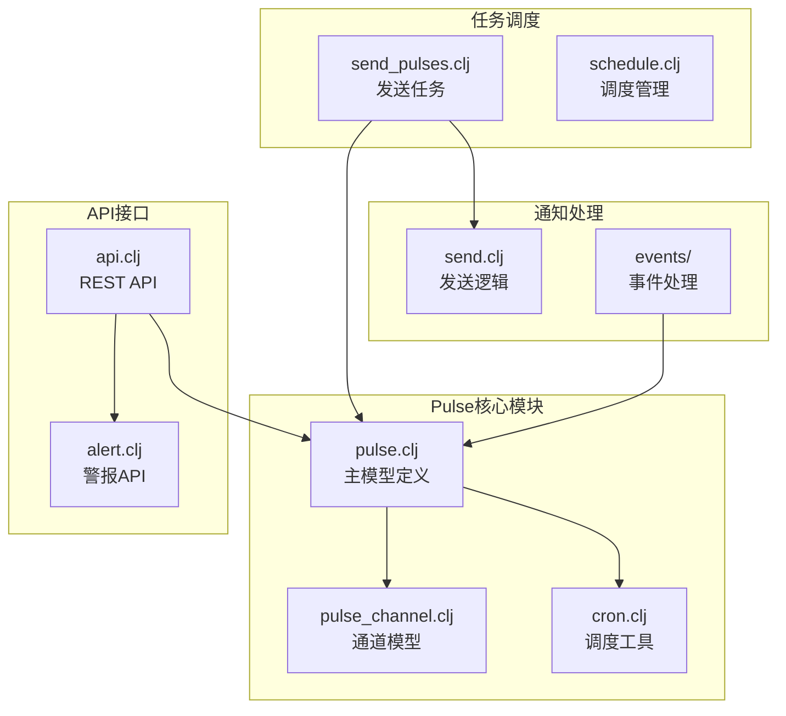

**图表来源**
- [pulse.clj](file://src/metabase/pulse/models/pulse.clj#L1-L50)
- [pulse_channel.clj](file://src/metabase/pulse/models/pulse-channel.clj#L1-L30)
- [send_pulses.clj](file://src/metabase/pulse/task/send_pulses.clj#L1-L40)

## 核心数据结构

### Pulse模型核心字段

Pulse模型包含以下核心数据结构：

| 字段名 | 类型 | 描述 | 必填 | 默认值 |
|--------|------|------|------|--------|
| `id` | 正整数 | 唯一标识符 | 是 | 自动生成 |
| `name` | 非空字符串 | 通知名称 | 否 | null |
| `creator_id` | 正整数 | 创建者ID | 是 | - |
| `dashboard_id` | 可选正整数 | 关联仪表板ID | 否 | null |
| `collection_id` | 可选正整数 | 所属集合ID | 否 | null |
| `archived` | 布尔值 | 是否归档 | 否 | false |
| `skip_if_empty` | 布尔值 | 空结果时跳过 | 否 | false |
| `parameters` | 参数数组 | 查询参数列表 | 否 | [] |
| `alert_condition` | 枚举 | 警报条件 | 否 | null |
| `alert_above_goal` | 布尔值 | 是否高于目标 | 否 | false |
| `alert_first_only` | 布尔值 | 仅首次发送 | 否 | false |

### PulseChannel通道模型

| 字段名 | 类型 | 描述 | 必填 | 默认值 |
|--------|------|------|------|--------|
| `id` | 正整数 | 唯一标识符 | 是 | 自动生成 |
| `pulse_id` | 正整数 | 关联Pulse ID | 是 | - |
| `channel_type` | 枚举 | 通道类型 | 是 | - |
| `channel_id` | 可选正整数 | 渠道ID | 否 | null |
| `enabled` | 布尔值 | 是否启用 | 否 | true |
| `schedule_type` | 枚举 | 调度类型 | 是 | - |
| `schedule_hour` | 可选整数 | 小时调度 | 否 | null |
| `schedule_day` | 可选枚举 | 星期调度 | 否 | null |
| `schedule_frame` | 可选枚举 | 月份框架 | 否 | null |
| `details` | JSON对象 | 详细配置 | 否 | {} |

**章节来源**
- [pulse.clj](file://src/metabase/pulse/models/pulse.clj#L48-L76)
- [pulse_channel.clj](file://src/metabase/pulse/models/pulse-channel.clj#L150-L200)

## 架构概览

Pulse系统采用分层架构设计，确保通知功能的可靠性和可扩展性：

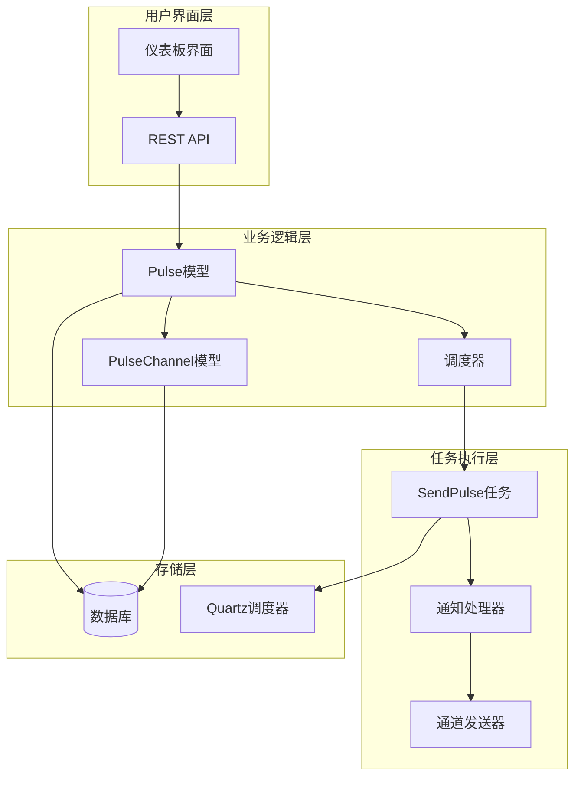

**图表来源**
- [pulse.clj](file://src/metabase/pulse/models/pulse.clj#L25-L45)
- [send_pulses.clj](file://src/metabase/pulse/task/send_pulses.clj#L20-L50)

## 详细组件分析

### Pulse模型核心类图

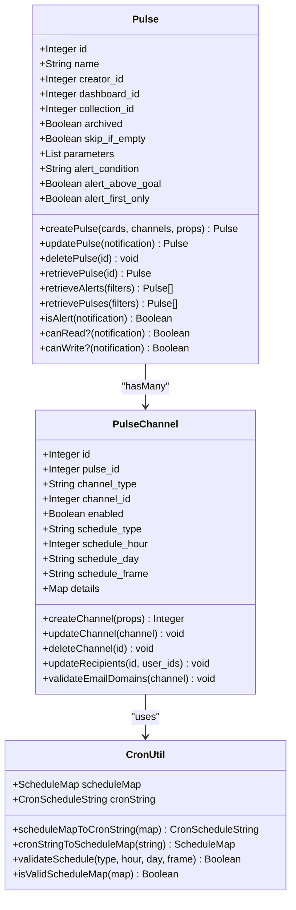

**图表来源**
- [pulse.clj](file://src/metabase/pulse/models/pulse.clj#L25-L45)
- [pulse_channel.clj](file://src/metabase/pulse/models/pulse-channel.clj#L150-L200)
- [cron.clj](file://src/metabase/util/cron.clj#L40-L80)

### 通知发送流程

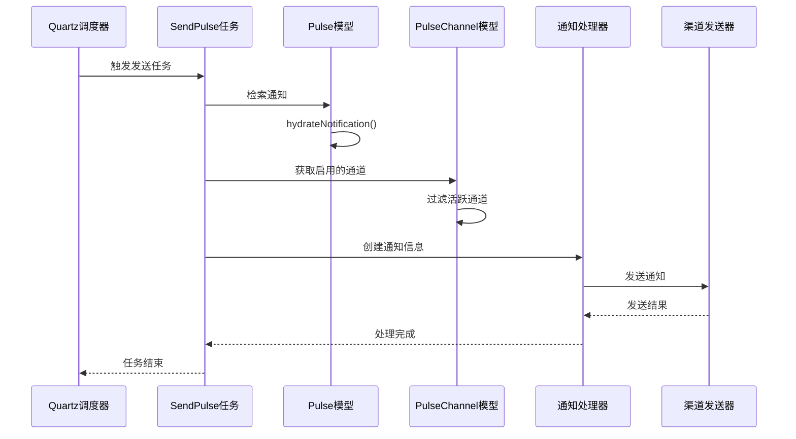

**图表来源**
- [send_pulses.clj](file://src/metabase/pulse/task/send_pulses.clj#L50-L100)
- [send.clj](file://src/metabase/pulse/send.clj#L80-L130)

**章节来源**
- [pulse.clj](file://src/metabase/pulse/models/pulse.clj#L259-L312)
- [send_pulses.clj](file://src/metabase/pulse/task/send_pulses.clj#L50-L100)

## 调度配置与cron表达式

### 调度类型与配置

Pulse系统支持四种调度类型，每种都有特定的时间配置要求：

| 调度类型 | 小时配置 | 星期配置 | 月份框架 | 示例cron |
|----------|----------|----------|----------|----------|
| `:hourly` | 任意值 | 不适用 | 不适用 | `0 * * * * ?` |
| `:daily` | 必需（0-23） | 不适用 | 不适用 | `0 0 * * * ?` |
| `:weekly` | 必需（0-23） | 必需（sun-sat） | 不适用 | `0 0 ? * MON` |
| `:monthly` | 必需（0-23） | 可选（sun-sat） | 必需（first,mid,last） | `0 0 1 15,L * ?` |

### Cron表达式转换机制

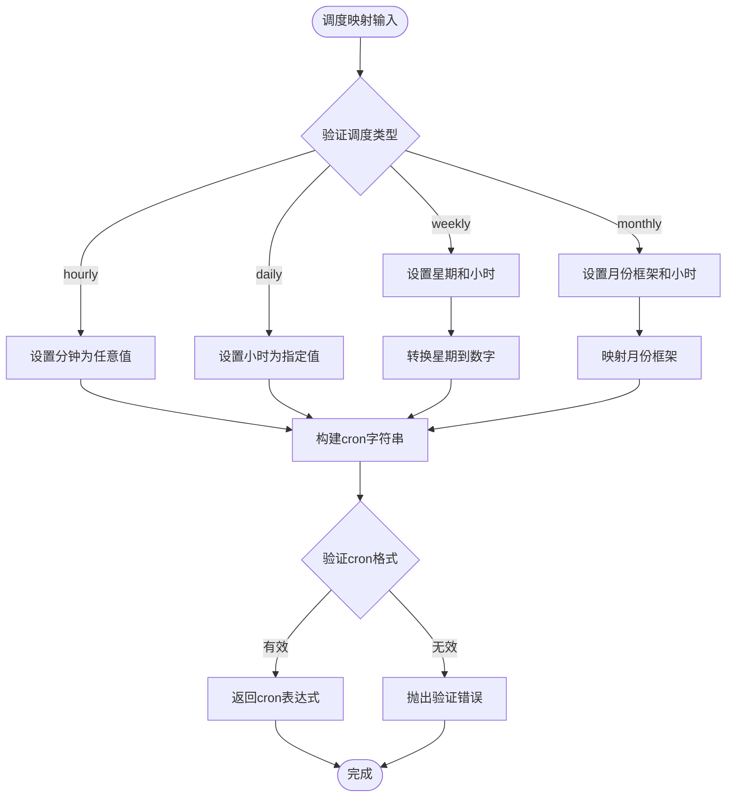

**图表来源**
- [cron.clj](file://src/metabase/util/cron.clj#L80-L120)

### 调度验证规则

系统对调度配置进行严格验证，确保时间参数的有效性：

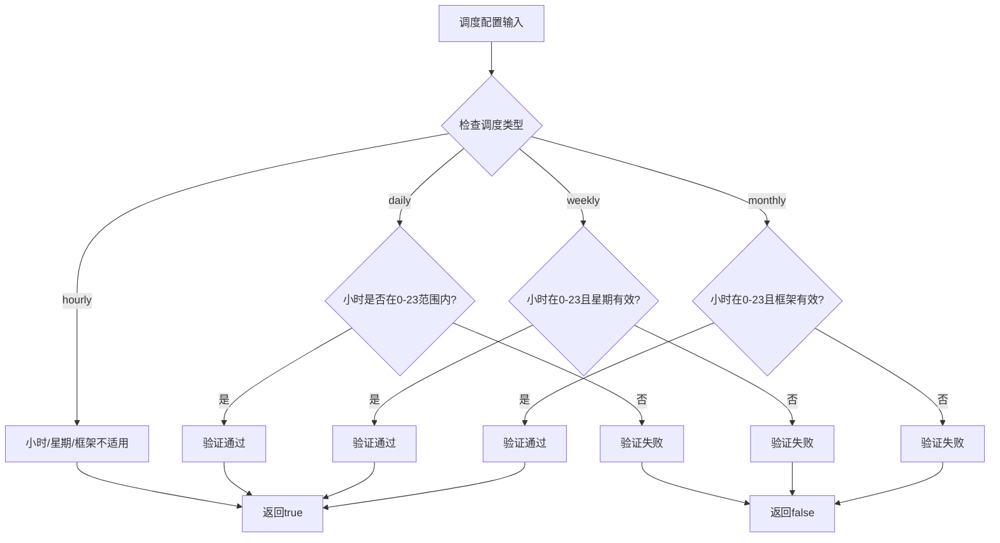

**图表来源**
- [pulse_channel.clj](file://src/metabase/pulse/models/pulse-channel.clj#L60-L90)

**章节来源**
- [cron.clj](file://src/metabase/util/cron.clj#L40-L160)
- [pulse_channel.clj](file://src/metabase/pulse/models/pulse-channel.clj#L60-L90)

## 权限控制策略

### 权限模型设计

Pulse系统实现了细粒度的权限控制，区分仪表板订阅和警报的不同访问策略：

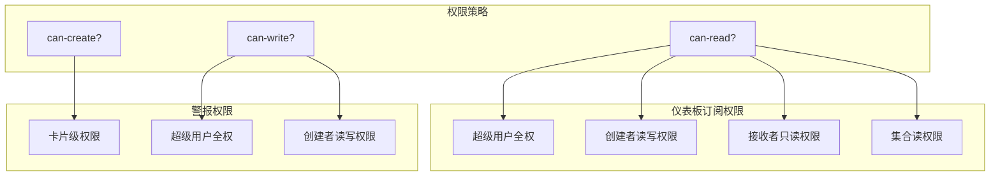

**图表来源**
- [pulse.clj](file://src/metabase/pulse/models/pulse.clj#L130-L180)

### 权限检查流程

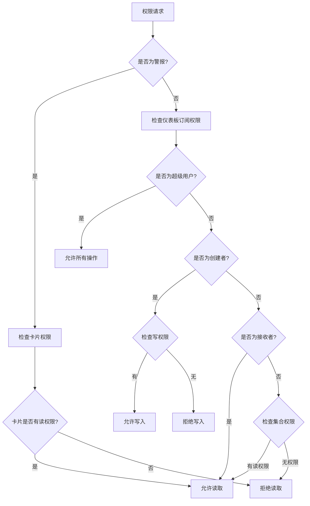

**图表来源**
- [pulse.clj](file://src/metabase/pulse/models/pulse.clj#L130-L180)

### 参数校验机制

系统对Pulse参数进行严格验证，确保数据完整性：

| 验证项 | 规则 | 错误处理 |
|--------|------|----------|
| 参数格式 | 序列化Map数组，每个Map包含:id键 | 抛出异常，显示具体错误 |
| 参数内容 | :id必须为非空字符串 | 显示验证失败详情 |
| 参数类型 | 支持任意关键字值 | 自动类型转换 |
| 参数数量 | 最多支持序列长度限制 | 截断或拒绝超出部分 |

**章节来源**
- [pulse.clj](file://src/metabase/pulse/models/pulse.clj#L48-L76)
- [pulse.clj](file://src/metabase/pulse/models/pulse.clj#L130-L180)

## 生命周期钩子

### 数据库操作钩子

Pulse模型定义了完整的生命周期钩子，确保数据一致性和业务逻辑正确执行：

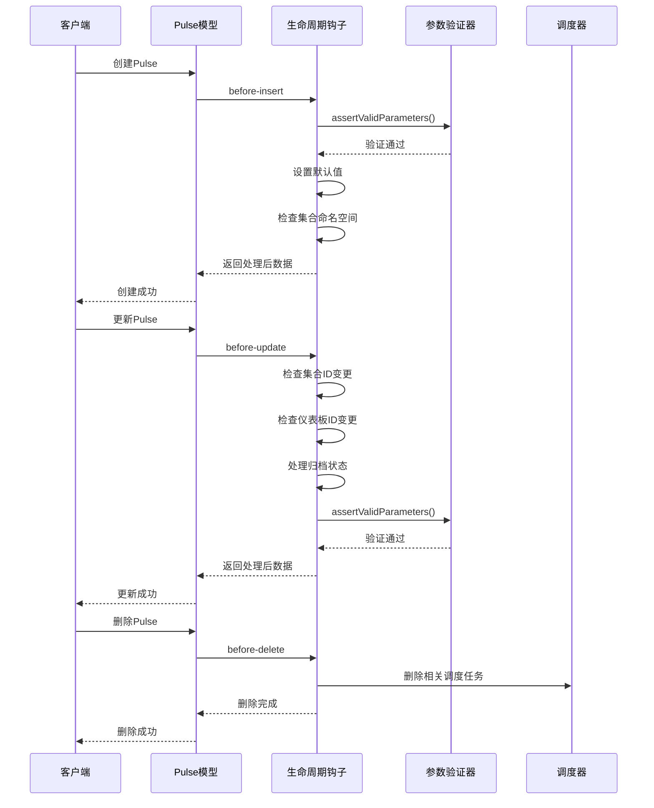

**图表来源**
- [pulse.clj](file://src/metabase/pulse/models/pulse.clj#L60-L120)

### 钩子执行顺序

| 钩子类型 | 执行时机 | 主要功能 | 异常处理 |
|----------|----------|----------|----------|
| `before-insert` | 创建前 | 参数验证、默认值设置、集合检查 | 抛出验证异常 |
| `before-update` | 更新前 | ID变更检查、状态同步、权限验证 | 抛出约束异常 |
| `before-delete` | 删除前 | 清理关联数据、调度任务删除 | 确保数据完整性 |

**章节来源**
- [pulse.clj](file://src/metabase/pulse/models/pulse.clj#L60-L120)

## 通知类型区分

### Pulse与Alert的区别

系统通过`alert_condition`字段区分不同类型的通知：

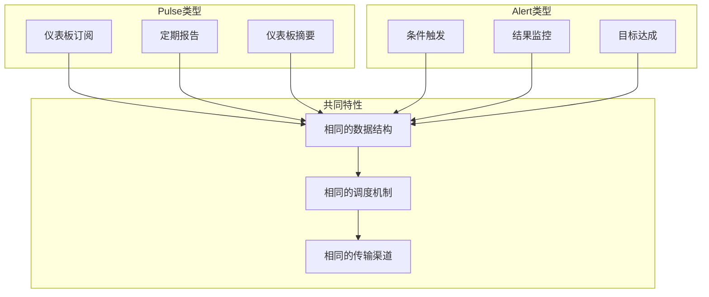

**图表来源**
- [pulse.clj](file://src/metabase/pulse/models/pulse.clj#L110-L130)

### 类型判断逻辑

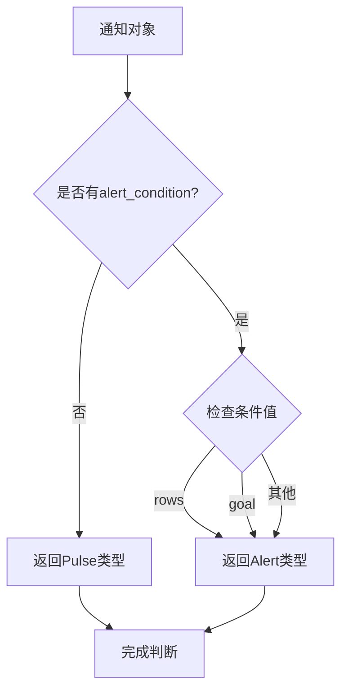

**图表来源**
- [pulse.clj](file://src/metabase/pulse/models/pulse.clj#L110-L130)

### 类型转换机制

系统提供了灵活的类型转换功能，支持Pulse和Alert之间的互转：

| 转换方向 | 方法 | 用途 | 注意事项 |
|----------|------|------|----------|
| Pulse → Alert | `notification->alert` | 提取第一个卡片 | 移除多卡片关联 |
| Alert → Pulse | `notification->pulse` | 标准化格式 | 添加跳过空结果标志 |
| Alert → Notification | `alert->notification` | 转换回通用格式 | 保留卡片引用 |

**章节来源**
- [pulse.clj](file://src/metabase/pulse/models/pulse.clj#L287-L312)
- [pulse.clj](file://src/metabase/pulse/models/pulse.clj#L600-L615)

## 实体关系图

### 核心实体关系

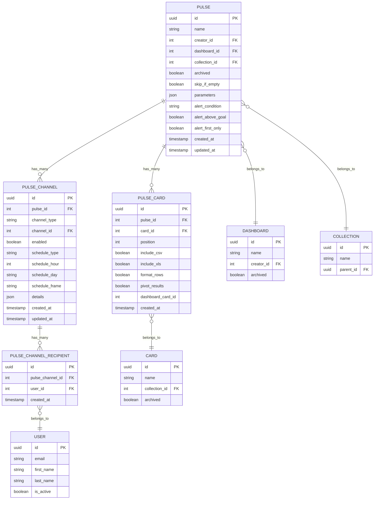

**图表来源**
- [pulse.clj](file://src/metabase/pulse/models/pulse.clj#L25-L45)
- [pulse_channel.clj](file://src/metabase/pulse/models/pulse-channel.clj#L150-L200)

## 状态流转示例

### Pulse创建流程

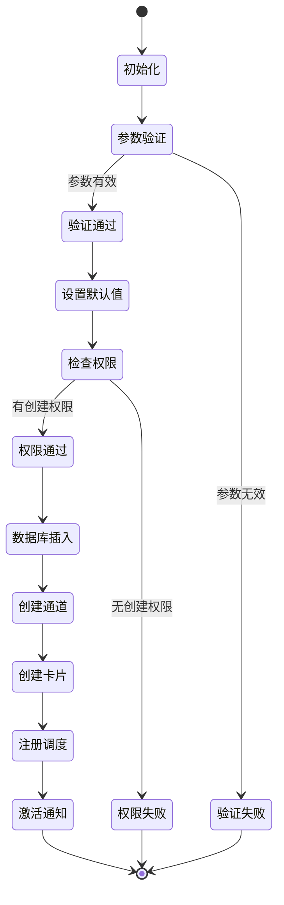

### 警报状态管理

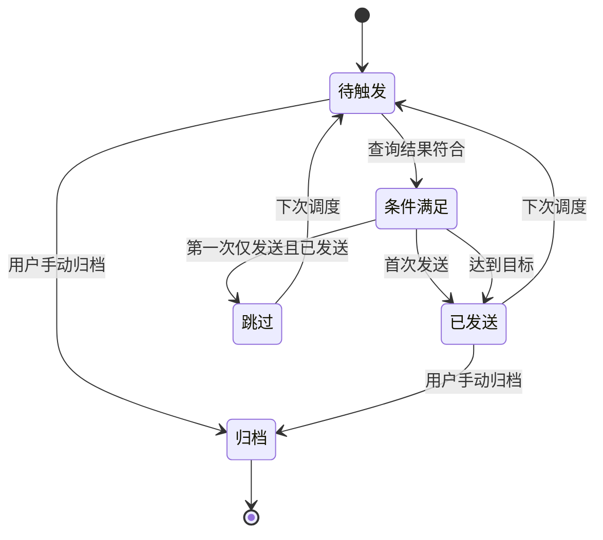

**章节来源**
- [pulse.clj](file://src/metabase/pulse/models/pulse.clj#L520-L570)
- [send_pulses.clj](file://src/metabase/pulse/task/send_pulses.clj#L50-L100)

## 性能考虑

### 查询优化策略

1. **批量加载**: 使用`t2/hydrate`进行批量数据加载，减少数据库查询次数
2. **延迟加载**: 仅在需要时加载关联数据，避免不必要的数据传输
3. **索引优化**: 在常用查询字段上建立适当索引
4. **缓存机制**: 对频繁访问的数据实施缓存策略

### 内存管理

1. **流式处理**: 对大量数据使用流式处理，避免内存溢出
2. **垃圾回收**: 及时释放不再使用的资源
3. **连接池**: 使用数据库连接池管理数据库连接

### 并发控制

1. **任务隔离**: 确保不同Pulse任务间的独立性
2. **锁机制**: 在关键操作中使用适当的锁机制
3. **重试策略**: 实现智能重试机制处理临时失败

## 故障排除指南

### 常见问题诊断

| 问题类型 | 症状 | 可能原因 | 解决方案 |
|----------|------|----------|----------|
| 调度失败 | 通知未按时发送 | cron表达式错误 | 检查调度配置 |
| 权限错误 | 无法访问通知 | 用户权限不足 | 验证用户权限设置 |
| 参数验证失败 | 创建/更新失败 | 参数格式错误 | 检查参数格式 |
| 邮件发送失败 | 邮件未送达 | 邮箱域名限制 | 检查邮件配置 |

### 调试工具

1. **日志记录**: 详细记录操作日志便于问题追踪
2. **状态检查**: 提供状态检查API监控系统健康
3. **性能监控**: 监控关键指标识别性能瓶颈
4. **错误报告**: 收集和分析错误信息

**章节来源**
- [send_pulses.clj](file://src/metabase/pulse/task/send_pulses.clj#L50-L100)
- [pulse_channel.clj](file://src/metabase/pulse/models/pulse-channel.clj#L200-L250)

## 结论

Pulse核心模型为Metabase提供了强大而灵活的通知系统，通过精心设计的数据结构、严格的权限控制、可靠的调度机制和完善的生命周期管理，确保了系统的稳定性和可扩展性。

### 主要优势

1. **灵活性**: 支持多种调度类型和传输渠道
2. **可靠性**: 完善的错误处理和重试机制
3. **安全性**: 细粒度的权限控制和数据验证
4. **可扩展性**: 模块化设计便于功能扩展

### 最佳实践建议

1. **合理规划调度**: 根据业务需求选择合适的调度频率
2. **权限管理**: 定期审查和调整用户权限设置
3. **监控告警**: 建立完善的监控和告警机制
4. **定期维护**: 定期清理和优化历史数据

通过遵循这些原则和最佳实践，可以充分发挥Pulse系统的潜力，为企业提供高效、可靠的数据通知服务。