# 自动化报表模型

<cite>
**本文档中引用的文件**
- [pulse.clj](file://src/metabase/pulse/models/pulse.clj)
- [pulse_channel.clj](file://src/metabase/pulse/models/pulse_channel.clj)
- [pulse_card.clj](file://src/metabase/pulse/models/pulse_card.clj)
- [channel.clj](file://src/metabase/channel/models/channel.clj)
- [send_pulses.clj](file://src/metabase/pulse/task/send_pulses.clj)
- [send.clj](file://src/metabase/pulse/send.clj)
- [models.clj](file://src/metabase/notification/models.clj)
- [send.clj](file://src/metabase/notification/send.clj)
</cite>

## 目录
1. [简介](#简介)
2. [项目结构概览](#项目结构概览)
3. [核心数据模型](#核心数据模型)
4. [调度配置与触发机制](#调度配置与触发机制)
5. [通知渠道管理](#通知渠道管理)
6. [脉冲执行流程](#脉冲执行流程)
7. [失败重试策略](#失败重试策略)
8. [状态流转与监控](#状态流转与监控)
9. [扩展性设计](#扩展性设计)
10. [故障排除指南](#故障排除指南)
11. [总结](#总结)

## 简介

Metabase的Pulse（自动化报表）系统是一个强大的通知机制，允许用户定期自动发送查询结果到指定的接收者。该系统支持多种通知渠道（邮件、Slack、Webhook），提供了灵活的调度配置，并具备完善的错误处理和重试机制。

Pulse系统的设计遵循了模块化原则，将通知的创建、调度、执行和监控分离到不同的组件中，确保了系统的可维护性和扩展性。

## 项目结构概览

Pulse系统的文件组织结构体现了清晰的职责分离：

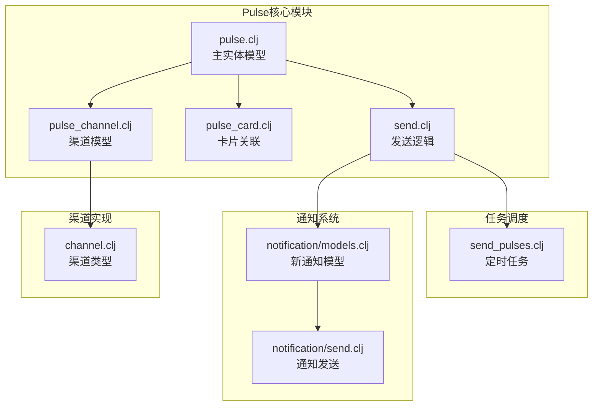

**图表来源**
- [pulse.clj](file://src/metabase/pulse/models/pulse.clj#L1-L50)
- [pulse_channel.clj](file://src/metabase/pulse/models/pulse_channel.clj#L1-L50)
- [send_pulses.clj](file://src/metabase/pulse/task/send_pulses.clj#L1-L50)

## 核心数据模型

### Pulse实体模型

Pulse实体是整个系统的核心，它代表了一个完整的自动化报表配置：

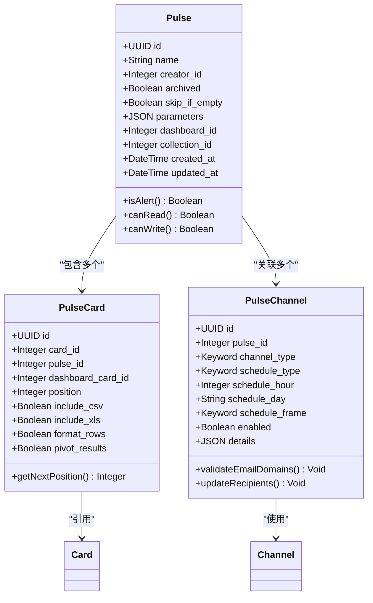

**图表来源**
- [pulse.clj](file://src/metabase/pulse/models/pulse.clj#L30-L80)
- [pulse_card.clj](file://src/metabase/pulse/models/pulse_card.clj#L10-L30)
- [pulse_channel.clj](file://src/metabase/pulse/models/pulse_channel.clj#L100-L150)

### 关键属性说明

| 属性名 | 类型 | 描述 | 默认值 |
|--------|------|------|--------|
| `name` | String | 报表名称，用于标识和显示 | 必填 |
| `skip_if_empty` | Boolean | 是否在结果为空时跳过发送 | false |
| `archived` | Boolean | 是否归档，归档后不再执行 | false |
| `parameters` | JSON | 查询参数配置 | [] |
| `dashboard_id` | Integer | 关联的仪表板ID（可选） | null |
| `collection_id` | Integer | 所属集合ID | 基于dashboard_id自动生成 |

**章节来源**
- [pulse.clj](file://src/metabase/pulse/models/pulse.clj#L40-L120)

## 调度配置与触发机制

### Cron表达式配置

Pulse系统支持灵活的调度配置，通过`PulseChannel`模型定义不同的调度类型：

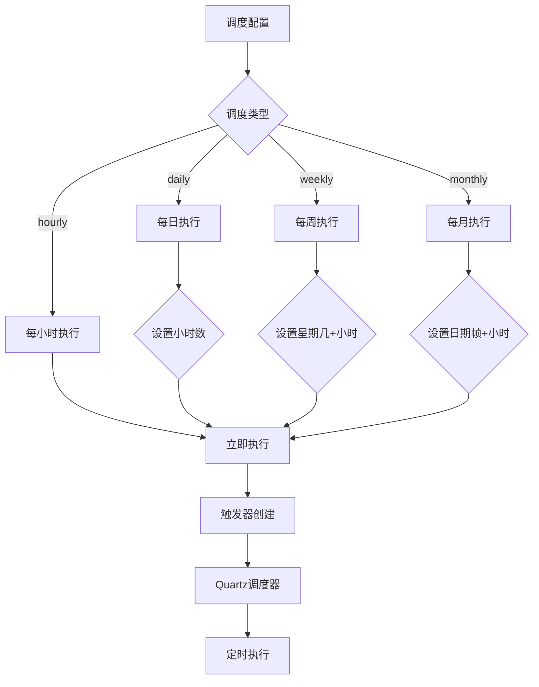

**图表来源**
- [pulse_channel.clj](file://src/metabase/pulse/models/pulse_channel.clj#L50-L80)
- [send_pulses.clj](file://src/metabase/pulse/task/send_pulses.clj#L70-L100)

### 调度验证规则

系统实现了严格的调度验证机制：

| 调度类型 | 必需参数 | 验证规则 |
|----------|----------|----------|
| `hourly` | 无 | 无需额外验证 |
| `daily` | `schedule_hour` | 0-23之间的整数 |
| `weekly` | `schedule_hour`, `schedule_day` | 小时数有效，星期几有效 |
| `monthly` | `schedule_hour`, `schedule_frame` | 小时数有效，日期帧有效 |

**章节来源**
- [pulse_channel.clj](file://src/metabase/pulse/models/pulse_channel.clj#L60-L90)

### 触发器管理

系统使用Quartz调度器进行任务调度，每个PulseChannel对应一个或多个触发器：

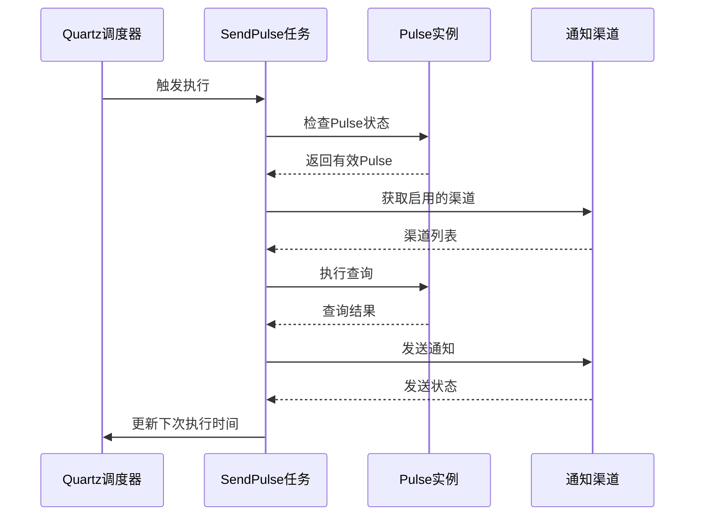

**图表来源**
- [send_pulses.clj](file://src/metabase/pulse/task/send_pulses.clj#L40-L80)

**章节来源**
- [send_pulses.clj](file://src/metabase/pulse/task/send_pulses.clj#L200-L270)

## 通知渠道管理

### 渠道类型定义

Pulse系统支持三种主要的通知渠道类型：

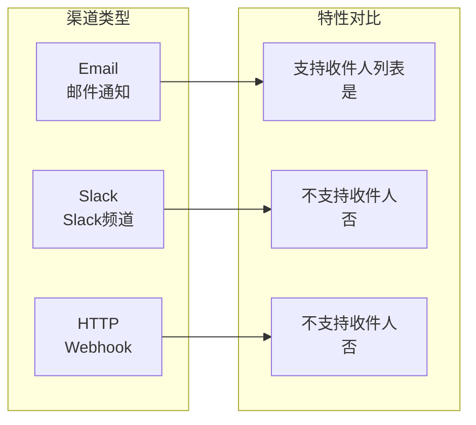

**图表来源**
- [pulse_channel.clj](file://src/metabase/pulse/models/pulse_channel.clj#L74-L105)

### 邮件渠道配置

邮件渠道是最常用的配置方式，支持多种附件格式：

| 配置项 | 类型 | 描述 | 示例值 |
|--------|------|------|--------|
| `recipients` | Array | 接收者列表 | `[{"id": 1}, {"email": "user@example.com"}]` |
| `include_csv` | Boolean | 是否包含CSV附件 | true |
| `include_xls` | Boolean | 是否包含Excel附件 | false |
| `format_rows` | Boolean | 是否格式化行数据 | true |
| `pivot_results` | Boolean | 是否透视结果 | false |

### Slack渠道配置

Slack渠道需要配置目标频道：

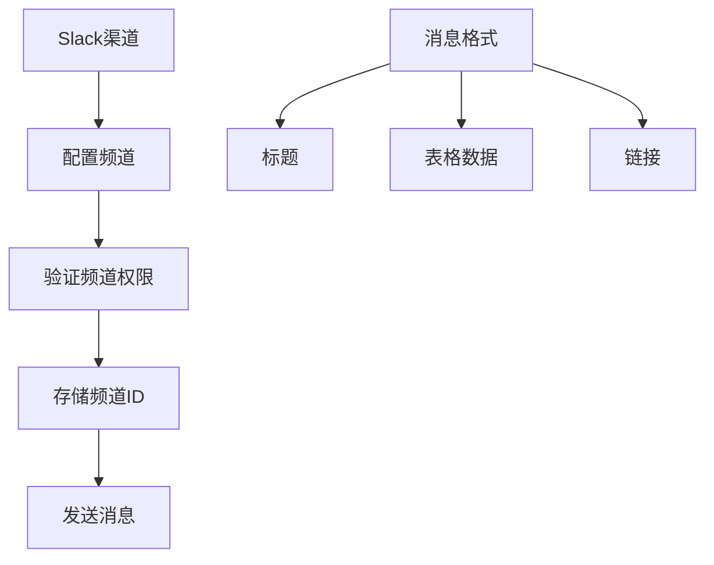

**图表来源**
- [pulse_channel.clj](file://src/metabase/pulse/models/pulse_channel.clj#L80-L110)

### Webhook渠道配置

Webhook渠道支持自定义HTTP请求：

| 参数 | 类型 | 描述 |
|------|------|------|
| `channel_id` | Integer | 关联的Channel ID |
| `details` | JSON | 请求详情配置 |

**章节来源**
- [pulse_channel.clj](file://src/metabase/pulse/models/pulse_channel.clj#L74-L120)

## 脉冲执行流程

### 执行生命周期

脉冲的完整执行流程包括多个阶段：

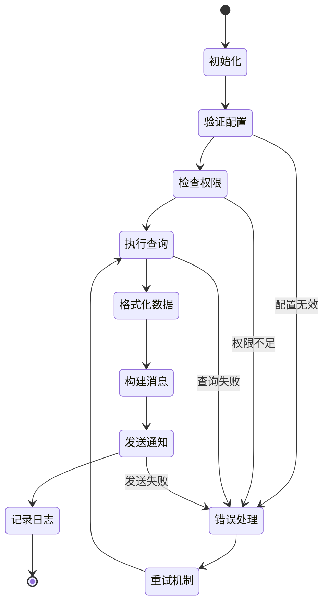

**图表来源**
- [send.clj](file://src/metabase/pulse/send.clj#L80-L130)

### 数据处理流程

查询结果的处理遵循以下步骤：

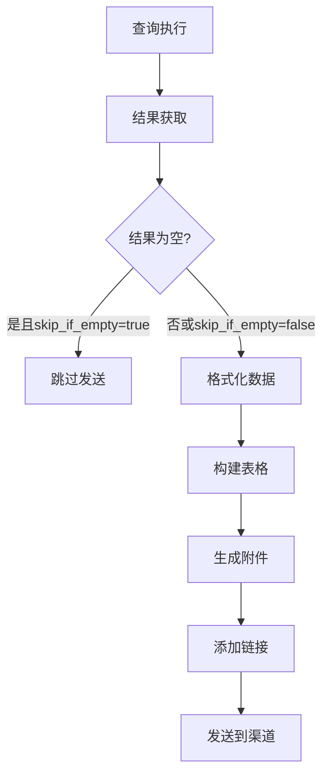

**图表来源**
- [send.clj](file://src/metabase/pulse/send.clj#L50-L90)

**章节来源**
- [send.clj](file://src/metabase/pulse/send.clj#L1-L131)

## 失败重试策略

### 重试机制设计

Pulse系统实现了基于指数退避的重试机制：

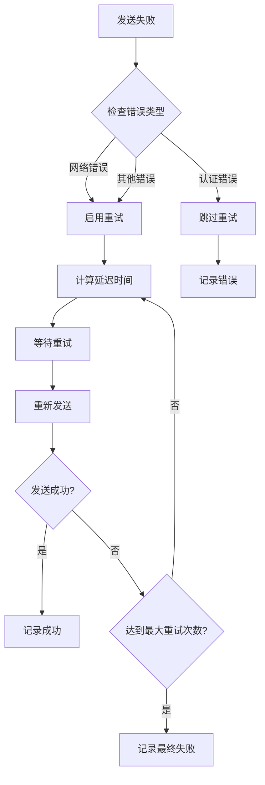

**图表来源**
- [send.clj](file://src/metabase/notification/send.clj#L60-L100)

### 重试配置参数

| 参数 | 默认值 | 描述 |
|------|--------|------|
| `max_attempts` | 3 | 最大重试次数 |
| `initial_interval_millis` | 1000 | 初始间隔时间（毫秒） |
| `multiplier` | 2.0 | 退避倍数 |
| `max_interval_millis` | 30000 | 最大间隔时间 |
| `randomization_factor` | 0.5 | 随机化因子 |

**章节来源**
- [send.clj](file://src/metabase/notification/send.clj#L66-L100)

## 状态流转与监控

### 状态管理

Pulse系统维护详细的状态信息用于监控和调试：

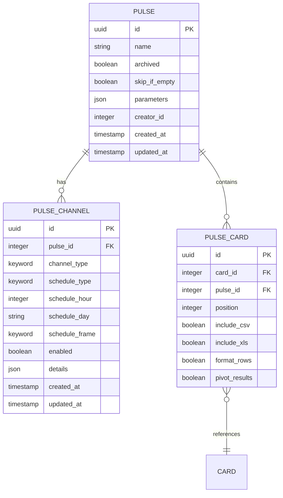

**图表来源**
- [pulse.clj](file://src/metabase/pulse/models/pulse.clj#L30-L80)
- [pulse_channel.clj](file://src/metabase/pulse/models/pulse_channel.clj#L100-L150)
- [pulse_card.clj](file://src/metabase/pulse/models/pulse_card.clj#L10-L30)

### 监控指标

系统提供以下监控指标：

| 指标类别 | 具体指标 | 描述 |
|----------|----------|------|
| 执行状态 | 成功/失败计数 | 统计每次执行的结果 |
| 性能指标 | 执行时间 | 查询和发送的耗时 |
| 错误统计 | 错误类型分布 | 不同错误类型的频率 |
| 资源使用 | 内存占用 | 系统资源消耗情况 |

**章节来源**
- [send_pulses.clj](file://src/metabase/pulse/task/send_pulses.clj#L40-L80)

## 扩展性设计

### 渠道类型扩展

系统设计支持新的渠道类型的添加：

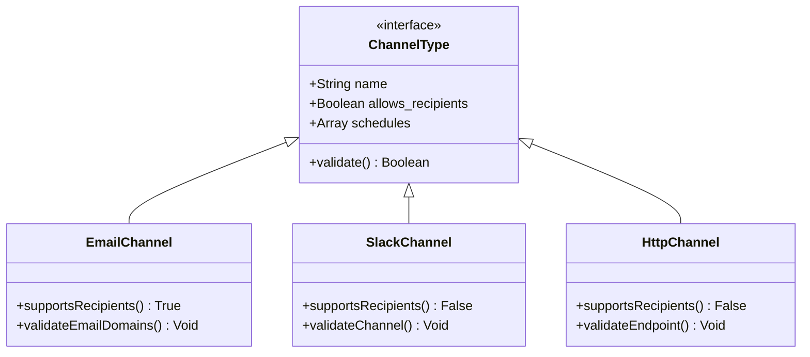

**图表来源**
- [channel.clj](file://src/metabase/channel/models/channel.clj#L20-L50)
- [pulse_channel.clj](file://src/metabase/pulse/models/pulse_channel.clj#L74-L105)

### 新通知系统迁移

系统正在从传统的Pulse向新的通知系统迁移：

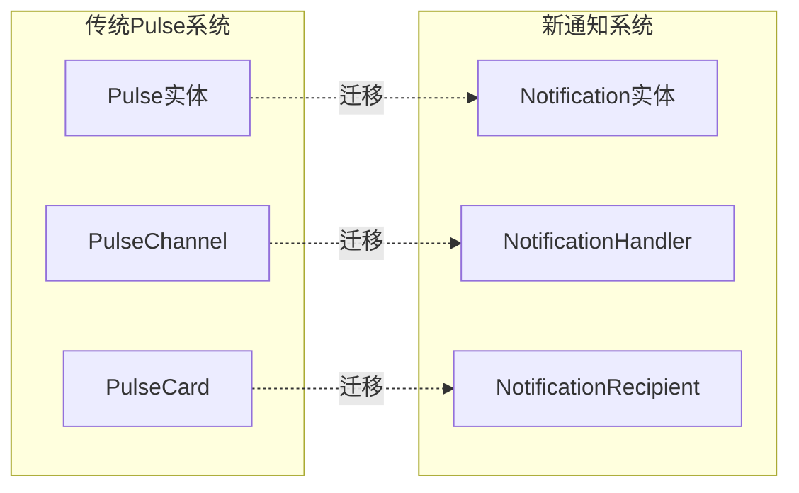

**图表来源**
- [models.clj](file://src/metabase/notification/models.clj#L15-L50)

**章节来源**
- [channel.clj](file://src/metabase/channel/models/channel.clj#L1-L130)

## 故障排除指南

### 常见问题诊断

| 问题类型 | 症状 | 可能原因 | 解决方案 |
|----------|------|----------|----------|
| 无法发送 | 任务执行但无通知 | 渠道配置错误 | 检查渠道设置和权限 |
| 定时失效 | 任务未按计划执行 | 调度器异常 | 重启调度器服务 |
| 权限错误 | 认证失败 | 用户权限不足 | 验证用户和渠道权限 |
| 查询超时 | 执行时间过长 | 查询复杂度过高 | 优化查询或增加超时时间 |

### 日志分析

系统提供详细的日志记录用于问题诊断：

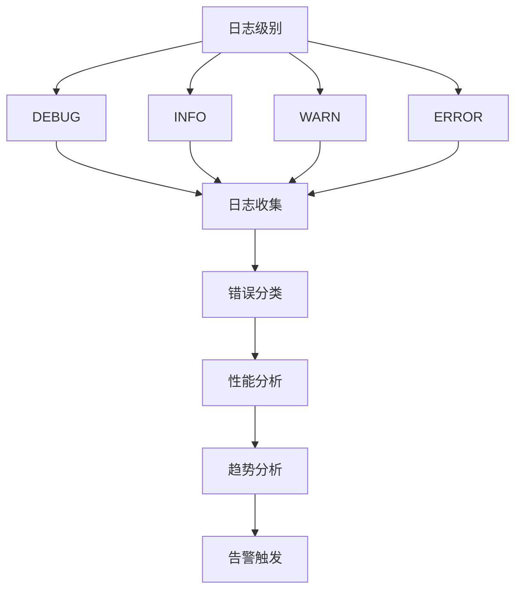

**章节来源**
- [send_pulses.clj](file://src/metabase/pulse/task/send_pulses.clj#L50-L90)

## 总结

Metabase的Pulse自动化报表系统是一个设计精良的企业级通知平台，具有以下核心优势：

1. **模块化架构**：清晰的职责分离使得系统易于维护和扩展
2. **灵活调度**：支持多种调度模式和复杂的定时配置
3. **多渠道支持**：统一的渠道抽象支持邮件、Slack、Webhook等多种通知方式
4. **健壮性设计**：完善的错误处理和重试机制确保通知的可靠性
5. **监控能力**：全面的状态跟踪和性能监控支持运维管理

随着新通知系统的逐步推广，Pulse系统将继续演进，为用户提供更加丰富和可靠的通知服务。系统的扩展性设计也为未来的新功能开发奠定了良好的基础。