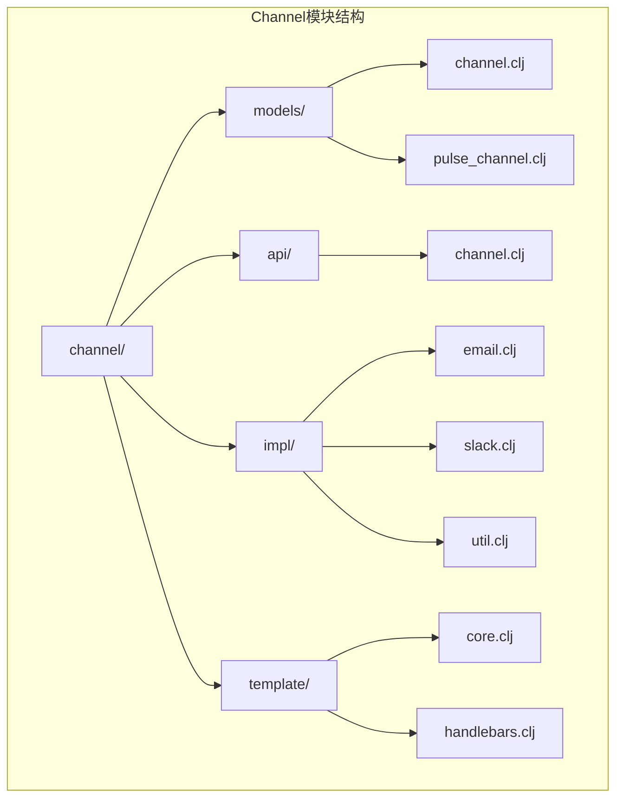
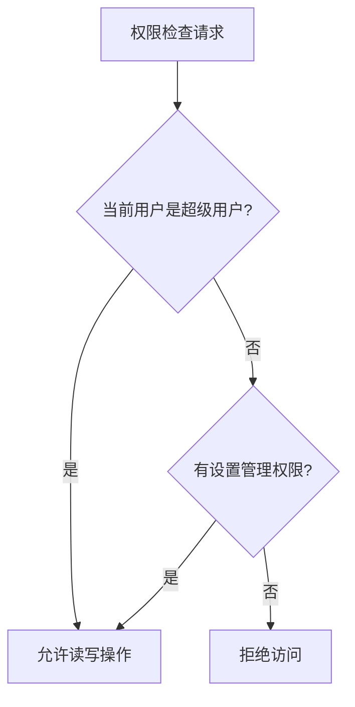
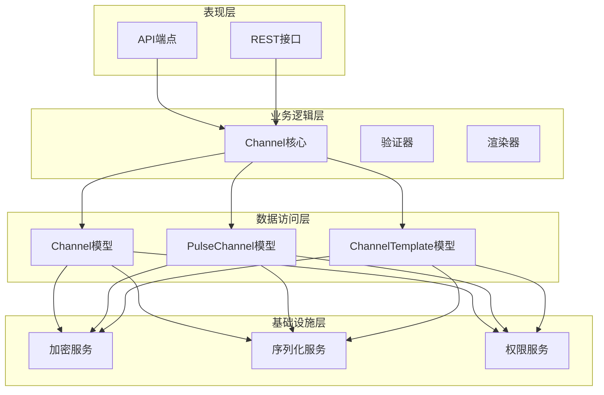
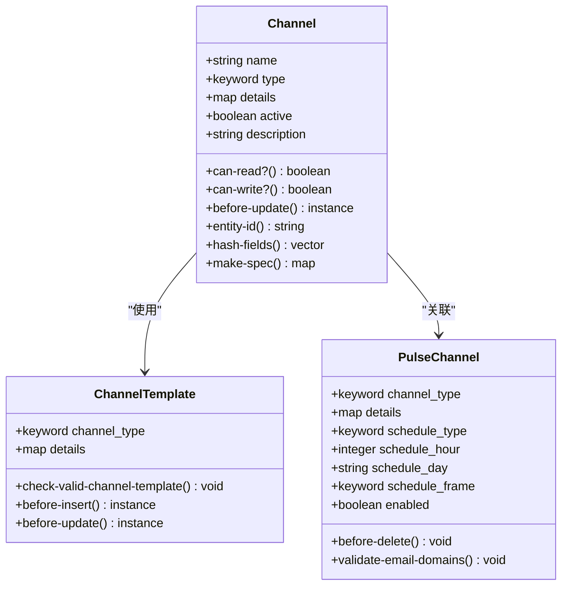
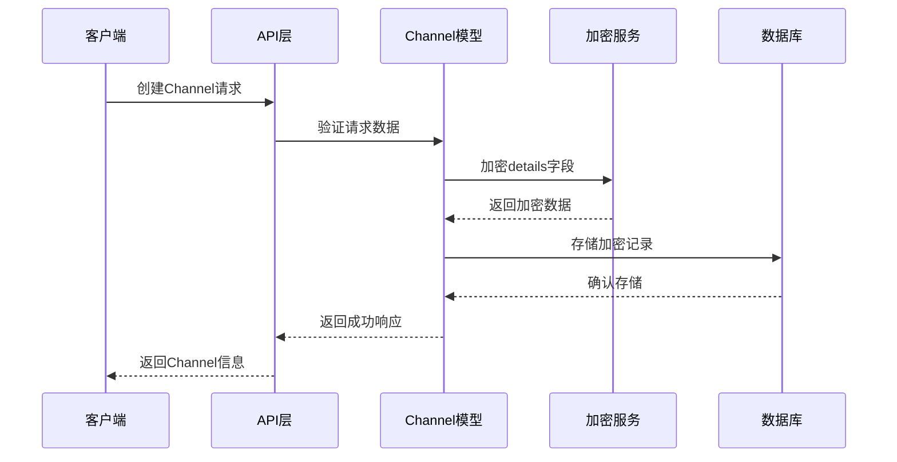
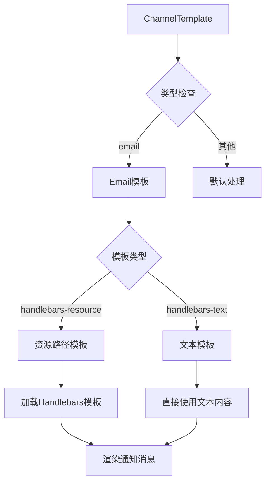
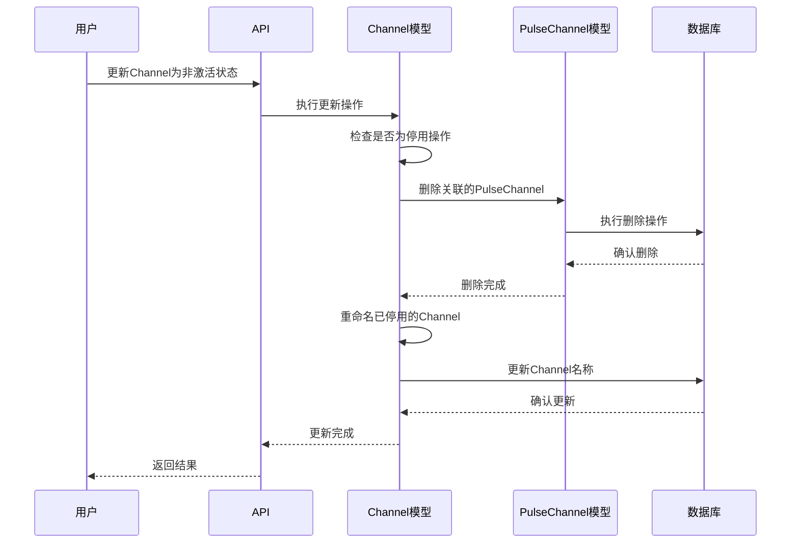
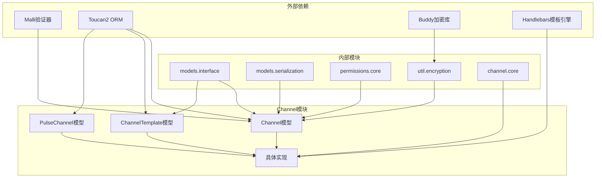

# 通用渠道框架

<cite>
**本文档中引用的文件**
- [channel.clj](file://src/metabase/channel/models/channel.clj)
- [pulse_channel.clj](file://src/metabase/pulse/models/pulse_channel.clj)
- [channel.clj](file://src/metabase/channel/api/channel.clj)
- [core.clj](file://src/metabase/channel/core.clj)
- [email.clj](file://src/metabase/channel/impl/email.clj)
- [slack.clj](file://src/metabase/channel/impl/slack.clj)
- [encryption.clj](file://src/metabase/util/encryption.clj)
- [serialization.clj](file://src/metabase/models/serialization.clj)
- [interface.clj](file://src/metabase/models/interface.clj)
</cite>

## 目录
1. [简介](#简介)
2. [项目结构](#项目结构)
3. [核心组件](#核心组件)
4. [架构概览](#架构概览)
5. [详细组件分析](#详细组件分析)
6. [依赖关系分析](#依赖关系分析)
7. [性能考虑](#性能考虑)
8. [故障排除指南](#故障排除指南)
9. [结论](#结论)

## 简介

Metabase的Channel模型是一个通用的通知渠道框架，为不同类型的通知渠道（如电子邮件、Slack、HTTP Webhook等）提供了统一的抽象层。该框架与专门的PulseChannel模型形成对比，后者主要用于仪表板订阅功能。

Channel模型通过`type`字段（如`:email`、`:slack`）和加密的`details`字段实现了灵活的渠道配置存储。它还包含了基于超级用户或设置管理权限的权限控制系统，以及在渠道停用时自动清理关联PulseChannel的机制。

## 项目结构

Metabase的Channel模块采用分层架构设计，主要包含以下目录结构：

**图表来源**
- [channel.clj](file://src/metabase/channel/models/channel.clj#L1-L130)
- [pulse_channel.clj](file://src/metabase/pulse/models/pulse_channel.clj#L1-L324)

**章节来源**
- [channel.clj](file://src/metabase/channel/models/channel.clj#L1-L130)
- [pulse_channel.clj](file://src/metabase/pulse/models/pulse_channel.clj#L1-L324)

## 核心组件

### Channel模型

Channel模型是整个通知系统的核心抽象，定义了所有渠道的基本属性和行为：

| 字段 | 类型 | 描述 | 必需性 |
|------|------|------|--------|
| `name` | string | 渠道名称，具有唯一约束 | 必需 |
| `type` | keyword | 渠道类型标识符（如:email、:slack） | 必需 |
| `details` | map | 加密存储的渠道配置详情 | 必需 |
| `active` | boolean | 渠道是否启用状态 | 可选，默认true |
| `description` | string | 渠道描述信息 | 可选 |

### 权限控制机制

Channel模型实现了基于角色的权限控制：

**图表来源**
- [channel.clj](file://src/metabase/channel/models/channel.clj#L44-L50)

### 序列化支持

Channel模型支持完整的序列化/反序列化功能：

| 方法 | 功能 | 实现位置 |
|------|------|----------|
| `entity-id` | 基于name字段的实体标识 | `serdes/entity-id` |
| `hash-fields` | 哈希计算字段：[:name :type] | `serdes/hash-fields` |
| `make-spec` | 序列化规范定义 | `serdes/make-spec` |

**章节来源**
- [channel.clj](file://src/metabase/channel/models/channel.clj#L66-L72)

## 架构概览

Channel框架采用多层架构设计，实现了关注点分离：

**图表来源**
- [channel.clj](file://src/metabase/channel/models/channel.clj#L1-L130)
- [core.clj](file://src/metabase/channel/core.clj#L1-L43)

## 详细组件分析

### Channel模型实现

Channel模型通过Malli验证器确保数据完整性：

**图表来源**
- [channel.clj](file://src/metabase/channel/models/channel.clj#L32-L69)
- [pulse_channel.clj](file://src/metabase/pulse/models/pulse_channel.clj#L85-L120)

### 加密机制

Channel模型使用AES256-CBC-HMAC-SHA512算法对敏感配置进行加密存储：

**图表来源**
- [encryption.clj](file://src/metabase/util/encryption.clj#L80-L120)
- [interface.clj](file://src/metabase/models/interface.clj#L310-L330)

### Channel类型系统

系统支持多种Channel类型，每种类型都有特定的实现：

| 类型 | 实现类 | 特性 | 支持的收件人 |
|------|--------|------|--------------|
| `:email` | `email.clj` | HTML邮件、附件支持 | 用户和邮箱地址 |
| `:slack` | `slack.clj` | Slack Block Kit格式 | Slack频道 |
| `:http` | `http.clj` | Webhook调用 | 自定义URL |

**章节来源**
- [email.clj](file://src/metabase/channel/impl/email.clj#L1-L200)
- [slack.clj](file://src/metabase/channel/impl/slack.clj#L1-L200)

### ChannelTemplate模板系统

ChannelTemplate提供了预定义的渠道配置模板：

**图表来源**
- [channel.clj](file://src/metabase/channel/models/channel.clj#L74-L102)

**章节来源**
- [channel.clj](file://src/metabase/channel/models/channel.clj#L97-L128)

### 自动清理机制

当Channel被停用时，系统会自动清理相关的PulseChannel：

**图表来源**
- [channel.clj](file://src/metabase/channel/models/channel.clj#L52-L65)

**章节来源**
- [channel.clj](file://src/metabase/channel/models/channel.clj#L52-L65)

## 依赖关系分析

Channel框架的依赖关系体现了清晰的分层架构：

**图表来源**
- [channel.clj](file://src/metabase/channel/models/channel.clj#L1-L15)
- [serialization.clj](file://src/metabase/models/serialization.clj#L1-L50)

**章节来源**
- [channel.clj](file://src/metabase/channel/models/channel.clj#L1-L15)

## 性能考虑

Channel框架在设计时充分考虑了性能优化：

### 缓存策略
- 加密/解密操作使用缓存机制，避免重复计算
- JSON解析结果缓存1小时，提升高频访问性能

### 内存优化
- 大字段（如details）采用延迟加载策略
- 序列化过程中对长字符串进行截断处理

### 并发处理
- 权限检查采用快速路径优先策略
- 批量操作支持事务保证一致性

## 故障排除指南

### 常见问题及解决方案

| 问题类型 | 症状 | 可能原因 | 解决方案 |
|----------|------|----------|----------|
| 加密失败 | 无法保存Channel配置 | MB_ENCRYPTION_SECRET_KEY未设置 | 设置环境变量或使用默认密钥 |
| 权限错误 | 无法访问Channel | 用户缺少设置管理权限 | 联系管理员授予相应权限 |
| 模板无效 | ChannelTemplate验证失败 | 模板格式不正确 | 检查模板语法和必需字段 |
| 渠道连接失败 | 测试连接返回错误 | 配置参数错误 | 验证渠道配置的正确性 |

### 调试工具

系统提供了多种调试工具：
- `can-connect?` 多态方法用于测试连接性
- 详细的错误日志记录
- 模板渲染预览功能

**章节来源**
- [channel.clj](file://src/metabase/channel/api/channel.clj#L80-L107)

## 结论

Metabase的Channel模型提供了一个强大而灵活的通知渠道框架，通过以下特性实现了优秀的可扩展性和维护性：

1. **统一抽象**：为不同类型的渠道提供一致的API接口
2. **安全存储**：采用强加密机制保护敏感配置信息
3. **权限控制**：基于角色的细粒度访问控制
4. **自动管理**：智能的生命周期管理和资源清理
5. **模板系统**：灵活的配置模板和渲染机制

该框架不仅满足了当前的功能需求，还为未来的扩展预留了充足的空间，是现代企业级应用中通知系统设计的优秀范例。