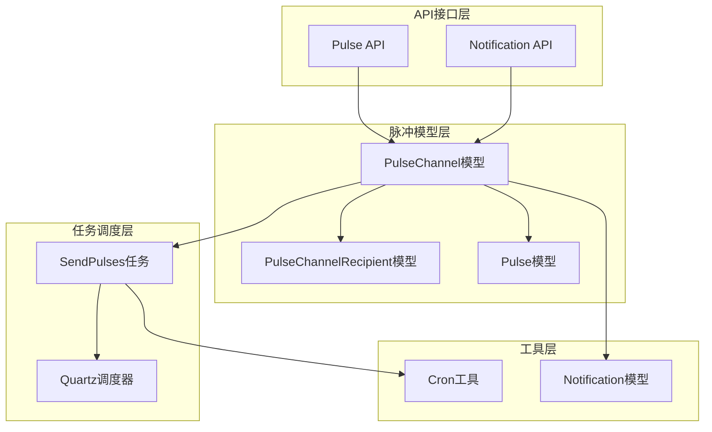
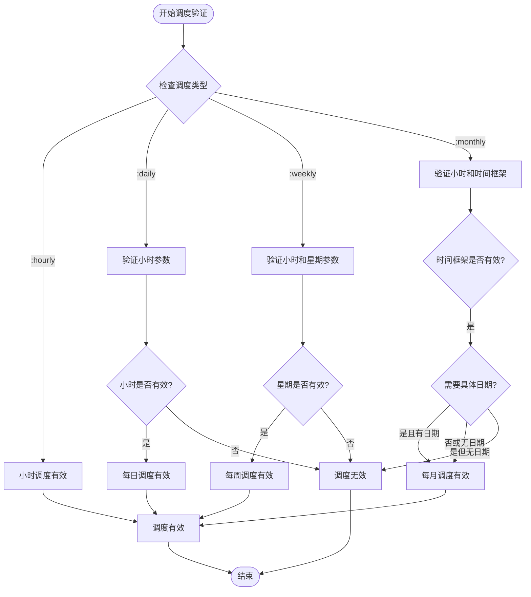
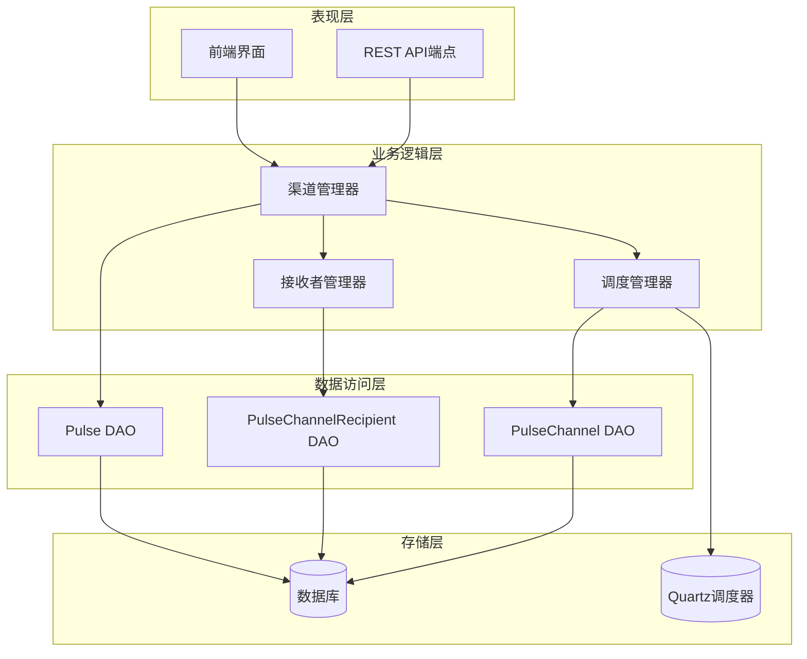
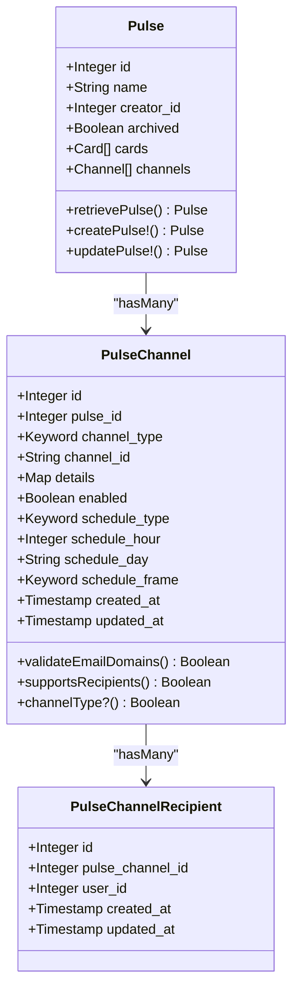
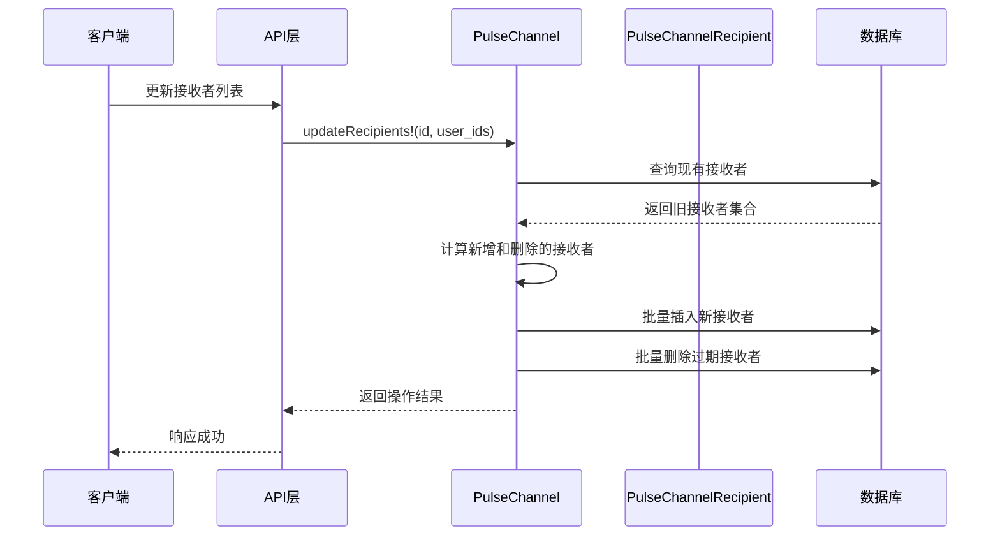
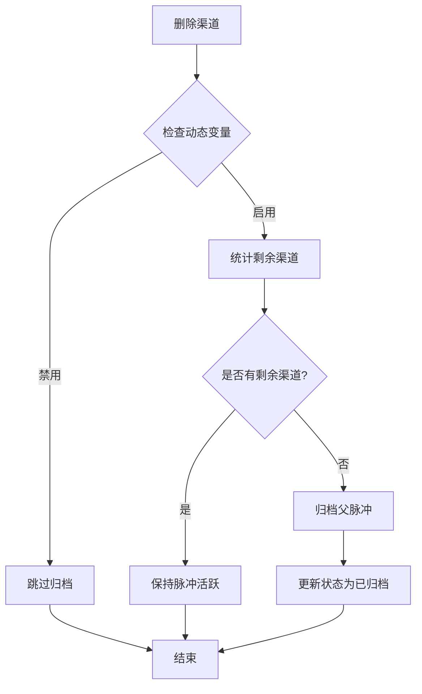
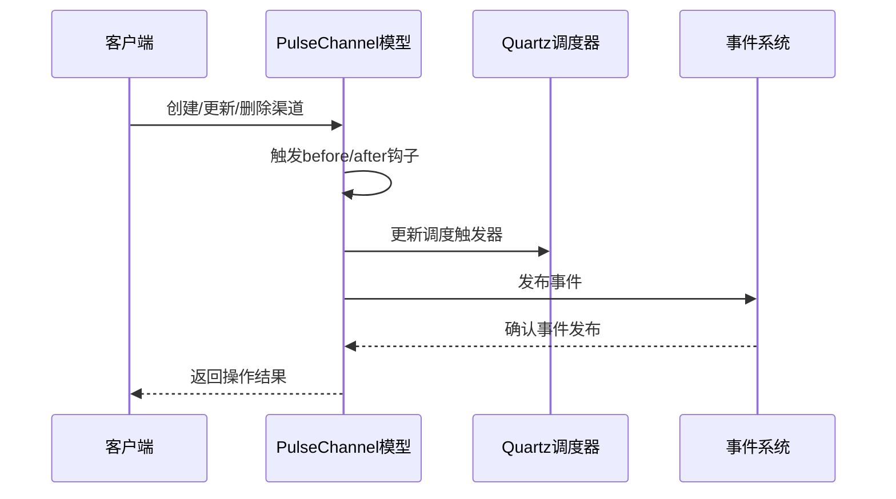
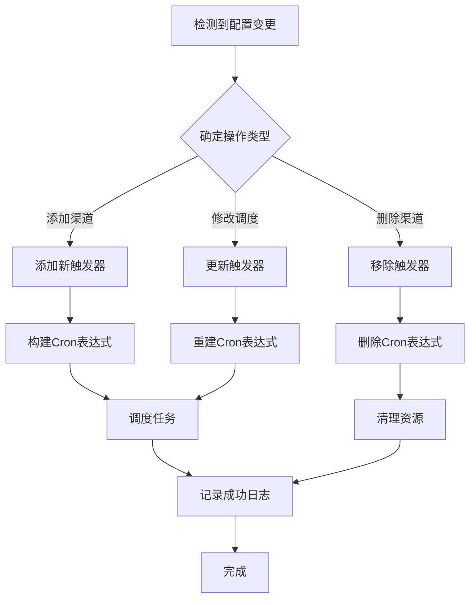
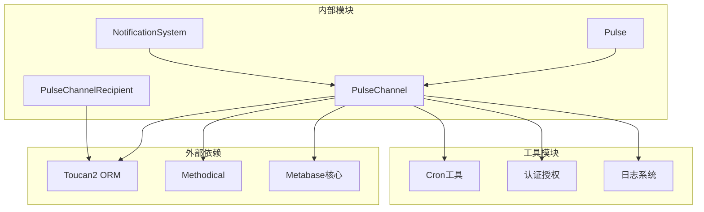

# 通知渠道模型

<cite>
**本文档中引用的文件**
- [pulse_channel.clj](file://src/metabase/pulse/models/pulse_channel.clj)
- [pulse_channel_recipient.clj](file://src/metabase/pulse/models/pulse_channel_recipient.clj)
- [send_pulses.clj](file://src/metabase/pulse/task/send_pulses.clj)
- [pulse.clj](file://src/metabase/pulse/models/pulse.clj)
- [pulse.clj](file://src/metabase/pulse/api/pulse.clj)
- [models.clj](file://src/metabase/notification/models.clj)
- [cron.clj](file://src/metabase/util/cron.clj)
</cite>

## 目录
1. [简介](#简介)
2. [项目结构概览](#项目结构概览)
3. [核心组件分析](#核心组件分析)
4. [架构概览](#架构概览)
5. [详细组件分析](#详细组件分析)
6. [依赖关系分析](#依赖关系分析)
7. [性能考虑](#性能考虑)
8. [故障排除指南](#故障排除指南)
9. [结论](#结论)

## 简介

Metabase的通知渠道模型是一个复杂而精密的系统，用于管理和调度各种类型的仪表板订阅通知。该系统支持三种主要的渠道类型：电子邮件（Email）、Slack 和 Webhook（HTTP），每种渠道都有其特定的配置选项、调度策略和权限控制机制。

本文档深入分析了`PulseChannel`模型的设计与实现，包括渠道类型定义、调度策略验证、时间框架约束、接收者管理机制以及事件处理流程。

## 项目结构概览

通知渠道模型的核心文件组织如下：

**图表来源**
- [pulse_channel.clj](file://src/metabase/pulse/models/pulse_channel.clj#L1-L50)
- [send_pulses.clj](file://src/metabase/pulse/task/send_pulses.clj#L1-L30)

**章节来源**
- [pulse_channel.clj](file://src/metabase/pulse/models/pulse_channel.clj#L1-L324)
- [pulse_channel_recipient.clj](file://src/metabase/pulse/models/pulse_channel_recipient.clj#L1-L25)

## 核心组件分析

### 渠道类型定义（Channel Types）

系统支持三种基本的渠道类型，每种都有其独特的属性和限制：

| 渠道类型 | 名称 | 是否支持接收者 | 支持的调度类型 | 特殊字段 |
|---------|------|---------------|---------------|----------|
| `:email` | 邮件 | 是 | `:hourly`, `:daily`, `:weekly`, `:monthly` | 支持用户和邮箱地址 |
| `:slack` | Slack | 否 | `:hourly`, `:daily`, `:weekly`, `:monthly` | 必须指定频道 |
| `:http` | Webhook | 否 | `:hourly`, `:daily`, `:weekly`, `:monthly` | HTTP通道ID |

### 调度策略验证（Schedule Validation）

系统实现了严格的调度验证机制，确保每个渠道的调度配置有效：

**图表来源**
- [pulse_channel.clj](file://src/metabase/pulse/models/pulse_channel.clj#L65-L85)

### 时间框架约束（Schedule Frame Constraints）

时间框架定义了月度调度的具体执行时机：

| 时间框架 | 描述 | 适用场景 |
|---------|------|----------|
| `:first` | 每月第一天 | 月初报告 |
| `:mid` | 每月第15天 | 中期检查 |
| `:last` | 每月最后一天 | 月末总结 |

**章节来源**
- [pulse_channel.clj](file://src/metabase/pulse/models/pulse_channel.clj#L35-L85)

## 架构概览

通知渠道模型采用分层架构设计，确保职责分离和可维护性：

**图表来源**
- [pulse.clj](file://src/metabase/pulse/models/pulse.clj#L1-L50)
- [send_pulses.clj](file://src/metabase/pulse/task/send_pulses.clj#L1-L30)

## 详细组件分析

### PulseChannel模型分析

#### 数据结构设计

`PulseChannel`模型包含了所有必要的字段来描述一个通知渠道：

**图表来源**
- [pulse_channel.clj](file://src/metabase/pulse/models/pulse_channel.clj#L107-L130)
- [pulse_channel_recipient.clj](file://src/metabase/pulse/models/pulse_channel_recipient.clj#L1-L10)

#### 接收者管理机制

接收者管理是通知系统的核心功能之一，支持两种类型的接收者：

**图表来源**
- [pulse_channel.clj](file://src/metabase/pulse/models/pulse_channel.clj#L225-L245)

### 动态变量*archive-parent-pulse-when-last-channel-is-deleted*

这个动态变量控制着当最后一个渠道被删除时是否自动归档父脉冲：

**图表来源**
- [pulse_channel.clj](file://src/metabase/pulse/models/pulse_channel.clj#L145-L160)

### 事件处理机制

#### 创建/更新/删除渠道时的事件处理

系统在渠道生命周期的关键节点触发相应的事件：

**图表来源**
- [pulse_channel.clj](file://src/metabase/pulse/models/pulse_channel.clj#L160-L230)

#### 更新Quartz调度触发器

每次渠道配置变更时，系统都会智能地更新Quartz调度器：

**图表来源**
- [send_pulses.clj](file://src/metabase/pulse/task/send_pulses.clj#L180-L250)

### 用户权限验证

系统实现了多层次的权限验证机制：

| 权限级别 | 可执行操作 | 验证条件 |
|---------|-----------|----------|
| 超级用户 | 读写所有渠道 | `api/*is-superuser?*` |
| 创建者 | 读写自己的渠道 | `current-user-is-creator?` |
| 接收者 | 读取渠道详情 | `current-user-is-recipient?` |
| 公共用户 | 仅读取公开渠道 | 基于集合权限 |

**章节来源**
- [pulse_channel.clj](file://src/metabase/pulse/models/pulse_channel.clj#L145-L160)
- [pulse.clj](file://src/metabase/pulse/models/pulse.clj#L120-L180)

## 依赖关系分析

通知渠道模型的依赖关系展现了清晰的分层架构：

**图表来源**
- [pulse_channel.clj](file://src/metabase/pulse/models/pulse_channel.clj#L1-L15)
- [send_pulses.clj](file://src/metabase/pulse/task/send_pulses.clj#L1-L25)

**章节来源**
- [pulse_channel.clj](file://src/metabase/pulse/models/pulse_channel.clj#L1-L324)
- [pulse_channel_recipient.clj](file://src/metabase/pulse/models/pulse_channel_recipient.clj#L1-L25)

## 性能考虑

### 批量操作优化

系统通过批量操作显著提升了性能：

- **接收者更新**：使用`set/difference`计算差异，避免逐条操作
- **触发器管理**：智能合并相同调度的渠道，减少调度器负载
- **数据库事务**：在必要时使用事务保证数据一致性

### 内存管理

- **延迟加载**：接收者信息按需加载
- **缓存策略**：关键配置信息进行内存缓存
- **垃圾回收**：及时释放不再使用的资源

### 并发处理

- **线程安全**：所有共享状态都进行了适当的同步
- **锁机制**：在关键路径上使用细粒度锁
- **异步处理**：非阻塞的操作使用异步执行

## 故障排除指南

### 常见问题及解决方案

#### 调度失败

**症状**：通知没有按时发送
**可能原因**：
- Quartz调度器未启动
- 调度配置无效
- 数据库连接问题

**解决步骤**：
1. 检查调度器状态
2. 验证调度配置
3. 查看相关日志

#### 接收者管理错误

**症状**：接收者列表更新失败
**可能原因**：
- 用户不存在
- 权限不足
- 数据格式错误

**解决步骤**：
1. 验证用户ID有效性
2. 检查用户权限
3. 格式化输入数据

#### 邮箱域名验证失败

**症状**：邮件通知被阻止
**可能原因**：
- 邮箱域名不在白名单中
- 企业配置缺失
- 邮箱格式错误

**解决步骤**：
1. 检查域名白名单设置
2. 验证邮箱格式
3. 联系管理员配置

**章节来源**
- [pulse_channel.clj](file://src/metabase/pulse/models/pulse_channel.clj#L175-L220)
- [send_pulses.clj](file://src/metabase/pulse/task/send_pulses.clj#L110-L150)

## 结论

Metabase的通知渠道模型展现了一个成熟的企业级系统的复杂性和精密性。通过深入分析，我们可以看到：

### 设计优势

1. **模块化架构**：清晰的分层设计便于维护和扩展
2. **强类型验证**：严格的输入验证确保数据完整性
3. **灵活的调度**：支持多种调度策略满足不同需求
4. **完善的权限控制**：多层次的安全机制保护数据安全

### 技术亮点

1. **智能触发器管理**：动态调整Quartz调度器配置
2. **批量操作优化**：提升大规模数据处理效率
3. **事件驱动架构**：松耦合的系统集成方式
4. **动态配置支持**：运行时调整系统行为的能力

### 改进方向

1. **监控增强**：增加更详细的性能监控指标
2. **错误恢复**：完善自动故障恢复机制
3. **扩展性优化**：支持更大规模的并发处理
4. **用户体验**：简化复杂的配置流程

这个通知渠道模型不仅展示了Metabase在企业级应用开发方面的深厚功底，也为类似系统的设计提供了宝贵的参考价值。通过持续的优化和改进，它将继续为企业用户提供可靠、高效的仪表板订阅服务。