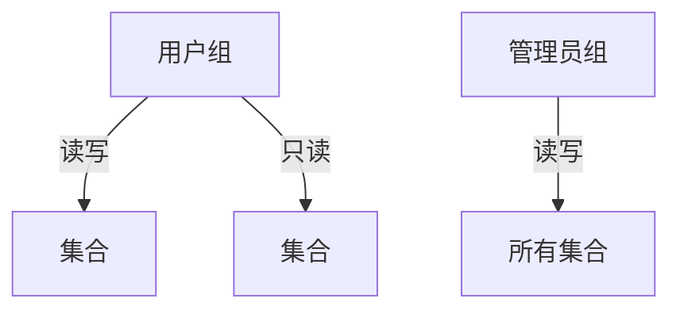
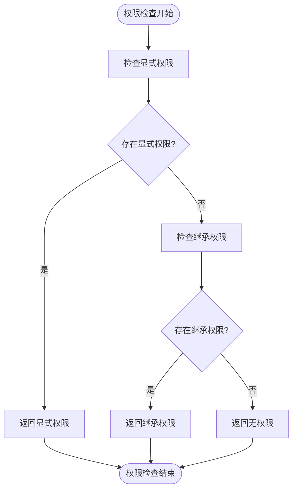
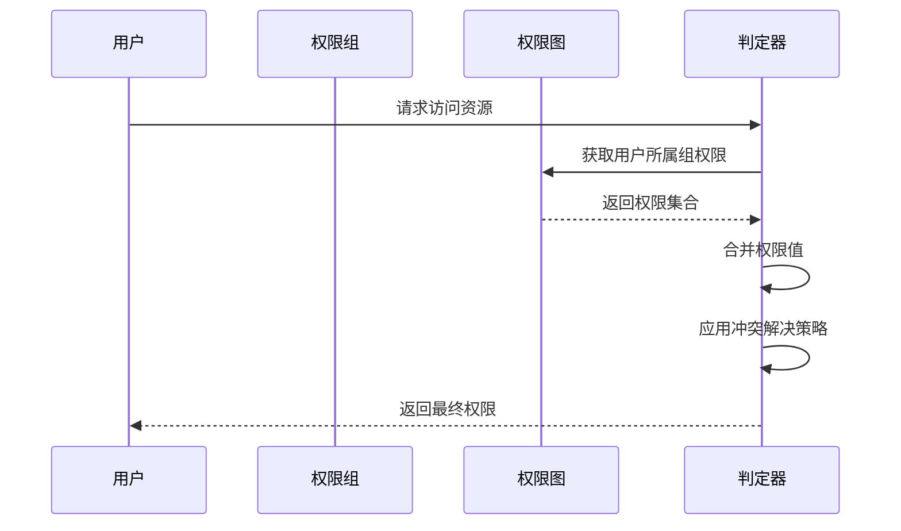
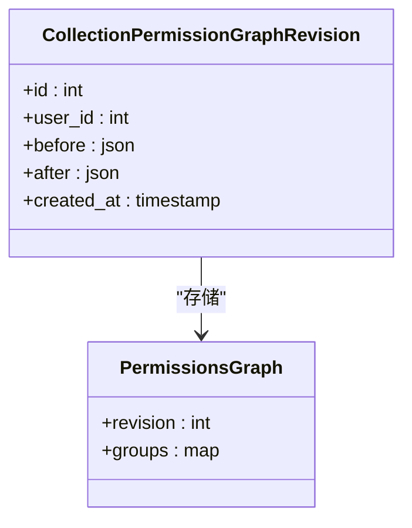
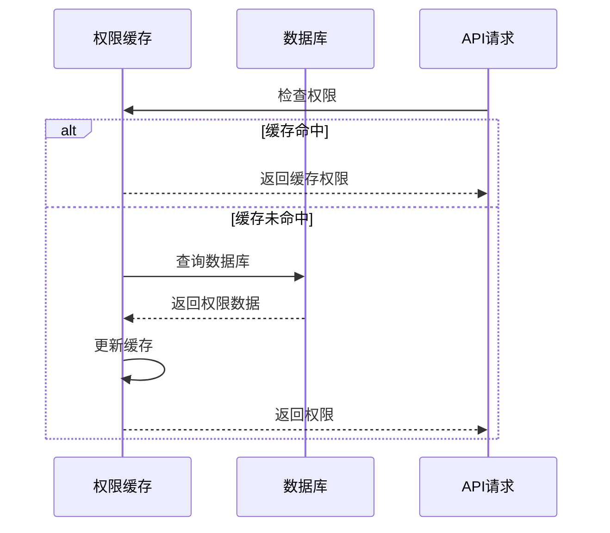

# 权限图模型

<cite>
**本文档中引用的文件**  
- [collection_permission_graph_revision.clj](file://src/metabase/permissions/models/collection_permission_graph_revision.clj)
- [graph.clj](file://src/metabase/permissions/models/collection/graph.clj)
- [util.clj](file://src/metabase/permissions/util.clj)
- [permissions.clj](file://src/metabase/permissions/models/permissions.clj)
- [resolution.clj](file://src/metabase/models/resolution.clj)
</cite>

## 目录
1. [引言](#引言)
2. [权限图结构与存储机制](#权限图结构与存储机制)
3. [权限继承与覆盖策略](#权限继承与覆盖策略)
4. [权限判定算法](#权限判定算法)
5. [审计日志与版本控制](#审计日志与版本控制)
6. [序列化与性能考量](#序列化与性能考量)
7. [权限预计算与缓存更新](#权限预计算与缓存更新)
8. [结论](#结论)

## 引言

Metabase系统中的权限管理系统采用基于图结构的模型来管理集合（Collection）的访问权限。该系统以用户组为节点，集合为资源，通过有向边表示读写权限，并支持跨层级的权限继承与显式覆盖。本文档深入剖析`collection_permission_graph_revision.clj`中权限图的版本化存储机制，详细说明权限判定算法、审计日志记录、序列化格式及性能优化策略。

## 权限图结构与存储机制

权限图模型的核心是将权限关系表示为一个有向图，其中用户组作为图的节点，集合作为资源节点，通过有向边表示读写权限。该图结构以稀疏形式存储，仅包含具有显式权限的组和集合条目。

**图来源**  
- [graph.clj](file://src/metabase/permissions/models/collection/graph.clj#L78-L107)

**权限图结构：**
- `:revision`：整数，表示当前权限图的版本号
- `:groups`：映射结构，包含组ID到集合权限的映射
- 每个组/集合对可具有三种权限值：`:write`（读写）、`:read`（只读）、`:none`（无访问）

**Section sources**
- [graph.clj](file://src/metabase/permissions/models/collection/graph.clj#L78-L107)

## 权限继承与覆盖策略

权限系统支持复杂的继承机制，允许子集合具有比父集合更严格的权限。这种设计确保了权限管理的灵活性和安全性。

### 继承规则
1. 管理员组默认对所有集合具有读写权限
2. 个人集合及其后代不能通过图API编辑
3. 不同命名空间的集合权限相互隔离

### 覆盖机制
当多个权限规则适用于同一资源时，系统采用"最近优先"原则解决冲突。具体来说：
- 显式设置的权限优先于继承的权限
- 更具体的路径权限优先于更通用的路径权限
- 写权限优先于读权限

**图来源**  
- [graph.clj](file://src/metabase/permissions/models/collection/graph.clj#L274-L304)

**Section sources**
- [graph.clj](file://src/metabase/permissions/models/collection/graph.clj#L274-L304)

## 权限判定算法

权限判定算法在`resolution.clj`中实现，通过多层逻辑判断用户对特定资源的访问权限。

### 判定流程
1. 首先检查用户是否属于管理员组
2. 检查用户所属组的显式权限
3. 检查继承权限
4. 应用权限合并规则

### 冲突解决策略
当用户属于多个组且权限冲突时，系统采用以下策略：
- 返回最宽松的权限级别
- 特殊情况下（如阻止权限），采用最高优先级规则
- 使用`coalesce`函数合并权限值

**图来源**  
- [resolution.clj](file://src/metabase/models/resolution.clj#L0-L154)

**Section sources**
- [resolution.clj](file://src/metabase/models/resolution.clj#L0-L154)

## 审计日志与版本控制

系统通过版本化机制确保权限变更的可追溯性和一致性。

### 版本化存储
- 每次权限变更都会生成新的修订版本
- 修订号用于防止并发修改冲突
- 旧版本保留用于审计和回滚

### 审计日志
- 记录每次权限变更的详细信息
- 包含变更前后的权限状态
- 记录操作用户和时间戳

**图来源**  
- [collection_permission_graph_revision.clj](file://src/metabase/permissions/models/collection_permission_graph_revision.clj#L0-L21)

**Section sources**
- [collection_permission_graph_revision.clj](file://src/metabase/permissions/models/collection_permission_graph_revision.clj#L0-L21)

## 序列化与性能考量

权限图的序列化和反序列化过程经过优化，以确保高性能和数据完整性。

### 序列化格式
- 使用JSON格式存储权限图
- 前后状态分别存储在`before`和`after`字段
- 采用关键字转换确保数据一致性

### 性能优化
- 异步更新修订详情以减少延迟
- 使用事务确保数据一致性
- 缓存常用权限查询结果

**图来源**  
- [util.clj](file://src/metabase/permissions/util.clj#L24-L48)

**Section sources**
- [util.clj](file://src/metabase/permissions/util.clj#L24-L48)

## 权限预计算与缓存更新

系统采用预计算和缓存机制来提高权限检查的性能。

### 预计算策略
- 在权限变更时预计算相关权限
- 使用`prime-db-cache`函数预加载数据库缓存
- 批量处理权限更新以减少数据库查询

### 缓存更新机制
- 绑定当前用户权限到线程局部变量
- 使用原子引用确保线程安全
- 定期刷新缓存以保持数据新鲜

**图来源**  
- [permissions.clj](file://src/metabase/permissions/models/permissions.clj#L137-L174)

**Section sources**
- [permissions.clj](file://src/metabase/permissions/models/permissions.clj#L137-L174)

## 结论

Metabase的权限图模型提供了一个强大而灵活的权限管理系统。通过基于图结构的权限表示，系统能够有效地管理复杂的权限关系，支持继承和覆盖机制。版本化存储和审计日志确保了权限变更的可追溯性，而预计算和缓存机制则保证了高性能的权限检查。该系统的设计平衡了安全性、灵活性和性能，为大型组织提供了可靠的权限管理解决方案。