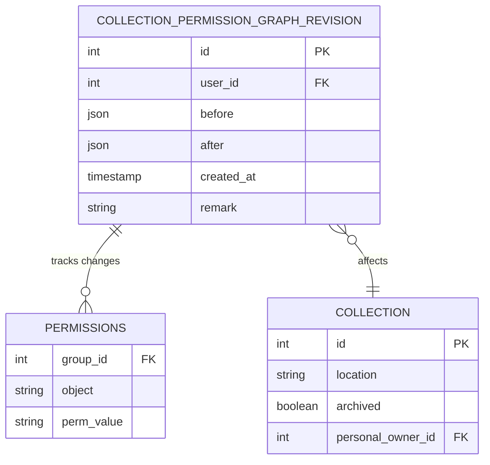
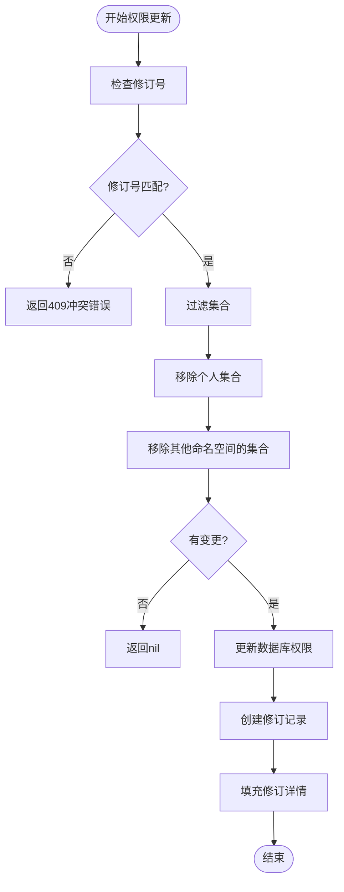

# 集合与权限模型

<cite>
**本文档引用的文件**
- [collection.clj](file://src/metabase/collections/models/collection.clj)
- [core.clj](file://src/metabase/collections/core.clj)
- [graph.clj](file://src/metabase/permissions/models/collection/graph.clj)
- [collection_permission_graph_revision.clj](file://src/metabase/permissions/models/collection_permission_graph_revision.clj)
- [permissions.clj](file://src/metabase/permissions/models/permissions.clj)
- [path.clj](file://src/metabase/permissions/path.clj)
- [util.clj](file://src/metabase/permissions/util.clj)
</cite>

## 目录
1. [引言](#引言)
2. [集合模型设计](#集合模型设计)
3. [权限继承机制](#权限继承机制)
4. [根集合的特殊性](#根集合的特殊性)
5. [权限图模型](#权限图模型)
6. [权限判定实现](#权限判定实现)
7. [权限变更审计](#权限变更审计)
8. [权限冲突解决策略](#权限冲突解决策略)
9. [集合移动与复制的权限传播](#集合移动与复制的权限传播)

## 引言
本文档详细记录Metabase系统中`Collection`作为内容组织单元的模型设计，重点分析其树状层次结构、权限继承机制和根集合的特殊性。文档将深入探讨权限图（Graph）如何表示用户组对集合的读写权限，以及如何通过`resolution.clj`实现高效的权限判定。同时，文档将说明权限变更的审计日志记录方式，提供权限冲突解决策略的实例，并涵盖集合移动、复制时的权限传播规则。

## 集合模型设计

`Collection`是Metabase中用于组织卡片（Cards）、仪表板（Dashboards）和脉冲（Pulses）的核心内容组织单元。从v0.30版本开始，集合成为确定这些对象权限的主要方式。

集合采用树状层次结构来组织内容，通过`location`字段来维护这种层次关系。`location`是一个字符串，记录了集合在文件系统样式的层次结构中的位置。例如，集合30的`location`可能是`/10/20/`，这意味着它是集合20的子集，而集合20本身又是集合10的子集。值得注意的是，`location`不包含集合自身的ID。

这种存储关系的方式（而不是使用`parent_id`这样的外键）允许我们高效地获取集合的所有祖先或后代，而无需进行多次数据库调用。

**Section sources**
- [collection.clj](file://src/metabase/collections/models/collection.clj#L216-L244)

## 权限继承机制

集合的权限继承机制具有独特的特点。与数据权限的继承方式不同（例如，对数据库的完整`读`权限意味着对其所有模式的`读`权限），子集合可以比其父集合具有更严格的权限。

权限系统基于权限路径（permissions paths）的概念，这些路径被授予各个权限组（Permissions Groups）。权限路径是斜杠分隔的字符串，例如`/collection/10/`。权限使用前缀系统，这意味着如果用户的一个组具有权限路径的任何前缀，则该用户可以执行相应操作。

对于集合权限，系统通过`collection-readwrite-path`和`collection-read-path`函数生成相应的权限路径。写权限路径如`/collection/:id/`，读权限路径则在写权限路径后添加`read/`，如`/collection/:id/read/`。

**Section sources**
- [permissions.clj](file://src/metabase/permissions/models/permissions.clj#L100-L150)
- [path.clj](file://src/metabase/permissions/path.clj#L20-L40)

## 根集合的特殊性

根集合（Root Collection）在系统中具有特殊地位。它代表了没有`collection_id`或在当前用户看来位于顶层的内容。根集合不是一个真正的集合，而是一个特殊的占位符对象。

根集合的权限路径为`/collection/root/`（写权限）和`/collection/root/read/`（读权限）。超级用户或具有相应权限的用户可以访问根集合。系统通过`can-access-root-collection?`函数检查当前用户是否可以访问根集合。

根集合的特殊性还体现在其权限处理上。当用户查看内容时，系统会检查用户是否可以访问根集合，并根据用户的权限级别、是否显示已归档项目等因素来决定可见性。

**Section sources**
- [collection.clj](file://src/metabase/collections/models/collection.clj#L601-L624)
- [root.clj](file://src/metabase/collections/models/collection/root.clj#L0-L30)

## 权限图模型

权限图（Permission Graph）是表示用户组对集合读写权限的核心数据结构。它通过`collection_permission_graph_revision.clj`文件中的模型来实现。

权限图的结构如下：
```
{:revision <int>
 :groups   {<group-id> {<collection-id> <:read|:write>
                        :root           <:read|:write>}}}
```

权限图是稀疏的，只包含具有显式权限（`读`或`写`）的组和集合。个人集合及其后代、已归档集合、垃圾集合以及来自其他命名空间的集合都被排除在外。

权限图的更新通过`update-graph!`函数实现。该函数会检查修订号以防止并发修改冲突（除非`force?`为true）。更新操作会自动过滤掉个人集合和来自其他命名空间的集合，确保命名空间隔离。



**Diagram sources**
- [collection_permission_graph_revision.clj](file://src/metabase/permissions/models/collection_permission_graph_revision.clj#L1-L22)
- [graph.clj](file://src/metabase/permissions/models/collection/graph.clj#L78-L107)

## 权限判定实现

权限判定通过`resolution.clj`文件中的函数实现。系统使用`visible-collection-query`函数生成HoneySQL查询，以选择所有可见的集合ID。这个查询考虑了用户的权限、所需的权限级别、垃圾箱/归档可见性等因素。

`visible-collection-filter-clause`函数返回一个HoneySQL过滤子句，可用于查询中。它结合了根集合的检查和非根集合的过滤。

对于超级用户，他们可以看到所有集合。对于普通用户，可见集合包括：
- 他们在数据库中有权限的集合
- 垃圾集合
- 他们的个人集合及其后代

系统还实现了`effective-location-path`，用于在当前用户无法查看某些集合时显示"有效"的位置路径。例如，如果集合的`location`为`/10/20/30/`，而当前用户只能查看集合10和30，则会显示`/10/30/`作为有效位置路径。

**Section sources**
- [collection.clj](file://src/metabase/collections/models/collection.clj#L624-L800)

## 权限变更审计

所有权限变更都记录在`CollectionPermissionGraphRevision`表中，用于审计目的。每次权限图更新时，系统会创建一个新的修订记录。

`create-perms-revision!`函数递增当前修订号并将其写入数据库。`fill-revision-details!`函数异步更新修订记录的`before`和`after`字段，记录变更前后的状态。

系统还提供了`increment-implicit-perms-revision!`函数，用于记录非显式权限图更新导致的权限变更，例如添加或删除集合时。

审计日志包含以下信息：
- 修订ID
- 用户ID（执行变更的用户）
- 变更前的状态（`before`）
- 变更后的状态（`after`）
- 创建时间戳
- 备注（用于隐式变更）

**Section sources**
- [collection_permission_graph_revision.clj](file://src/metabase/permissions/models/collection_permission_graph_revision.clj#L1-L22)
- [util.clj](file://src/metabase/permissions/util.clj#L46-L70)

## 权限冲突解决策略

权限冲突主要通过以下策略解决：

1. **管理员组优先**：管理员组（Admin Group）对所有集合具有写权限，即使没有显式权限条目。这通过在权限图查询中添加特殊查询来实现。

2. **修订号检查**：在更新权限图时，系统会检查传入的修订号是否与当前修订号匹配。如果不匹配，会返回409（冲突）错误，防止并发修改导致的数据丢失。

3. **自动过滤**：更新权限图时，系统会自动过滤掉不应被编辑的集合，如个人集合及其后代，以及来自其他命名空间的集合。

4. **权限值语义**：
   - `:write` - 完全读写访问
   - `:read` - 只读访问
   - `:none` - 无访问（撤销现有权限）

当权限变更时，系统会先撤销现有权限，然后根据新值授予相应权限。



**Diagram sources**
- [graph.clj](file://src/metabase/permissions/models/collection/graph.clj#L274-L304)
- [util.clj](file://src/metabase/permissions/util.clj#L24-L48)

## 集合移动与复制的权限传播

当集合移动或复制时，系统有特定的权限传播规则：

1. **创建新集合**：创建新集合时，系统会复制其父集合的权限。这意味着可以查看父集合的组也可以查看新集合，可以"管理"（写）父集合的组也可以"管理"新集合。

2. **跨个人集合边界移动**：当集合移动"跨越边界"时，需要特殊处理：
   - **移出个人集合**：当个人集合的后代移动到非个人集合区域时，需要授予权限，否则该集合将对除管理员外的所有人不可见。
   - **移入个人集合**：当非个人集合移动到个人集合或其后代中时，需要删除其之前的组权限条目，以防止其他用户访问此新个人集合。

3. **权限需求**：移动集合是递归操作，需要目标集合、其所有后代以及新父集合的写权限。

4. **复制操作**：复制集合时，权限会被复制到新集合，但新集合被视为独立实体，后续权限可以独立管理。

这些规则确保了权限系统的一致性和安全性，防止了权限泄露或意外的权限丢失。

**Section sources**
- [collection.clj](file://src/metabase/collections/models/collection.clj#L1472-L1532)
- [collection.clj](file://src/metabase/collections/models/collection.clj#L1550-L1601)