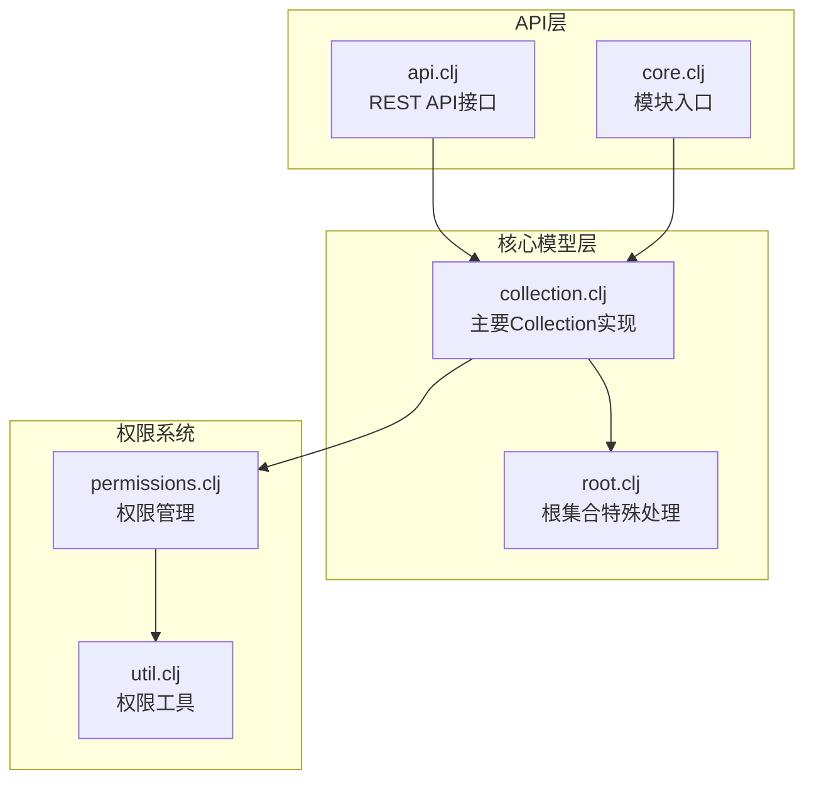
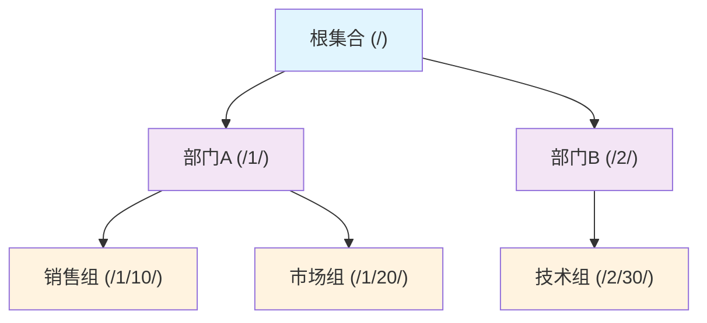
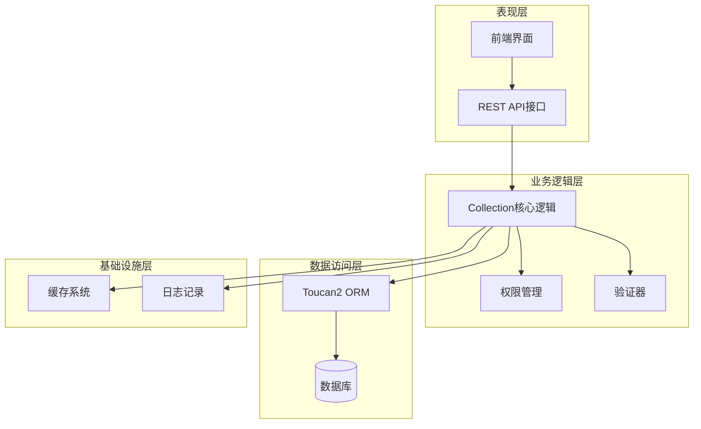
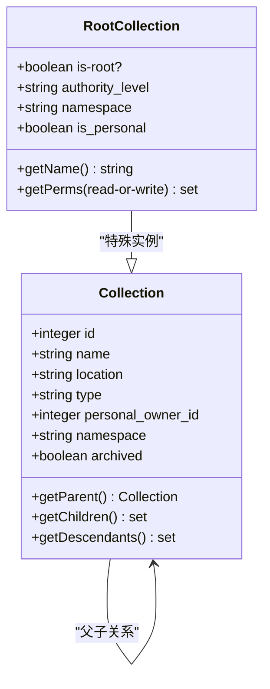
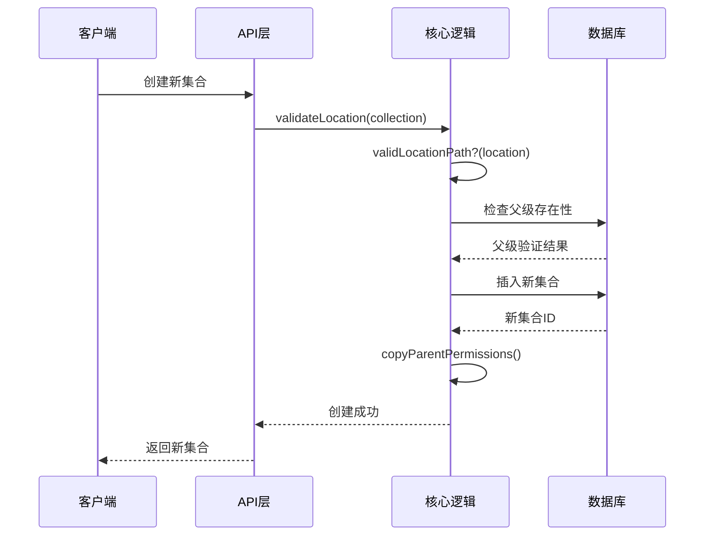
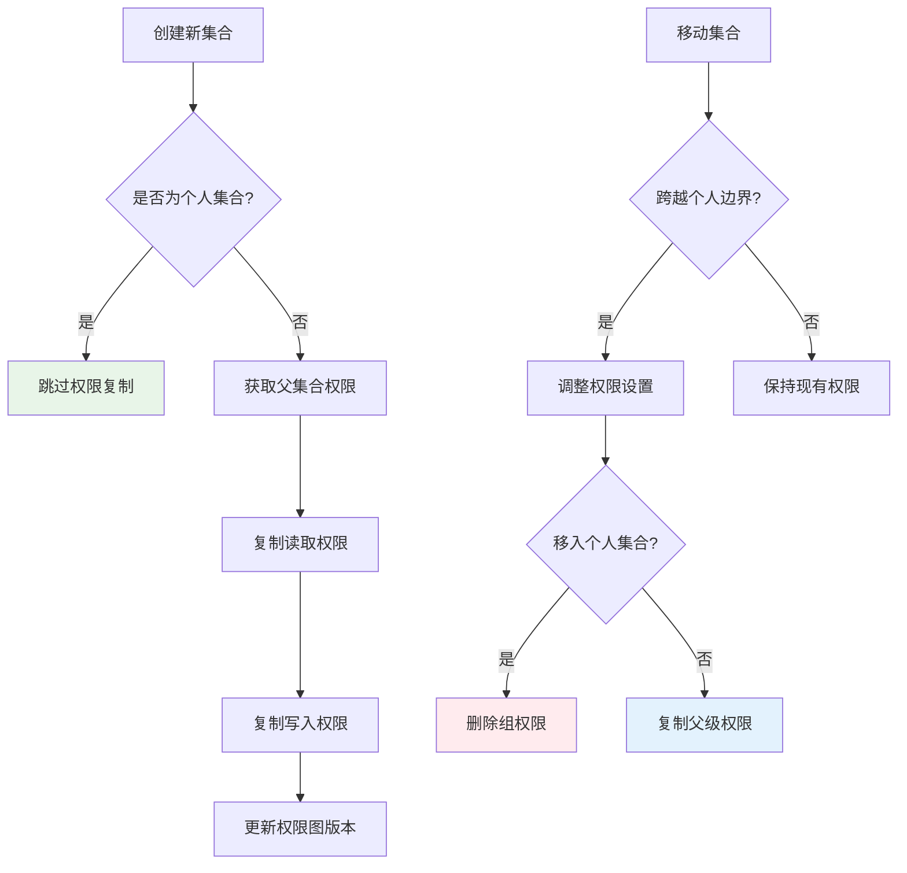
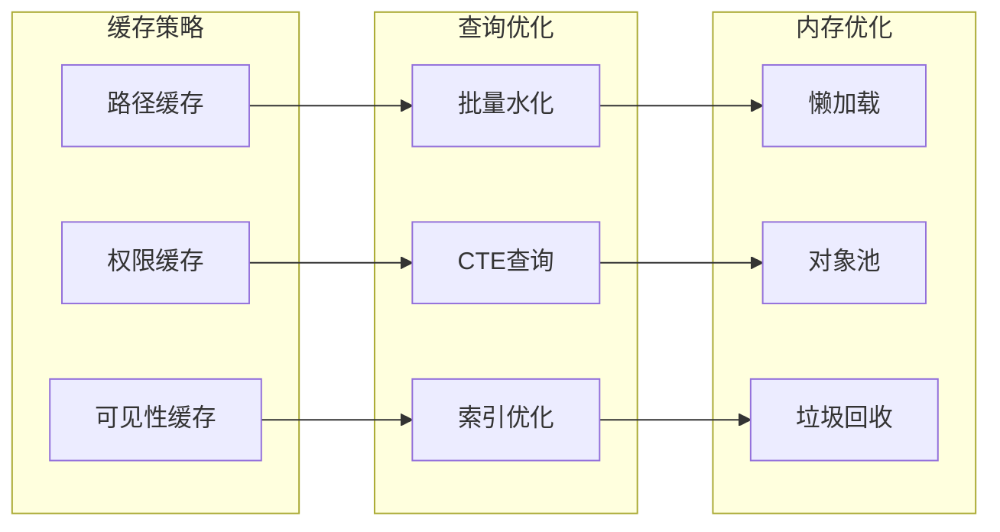
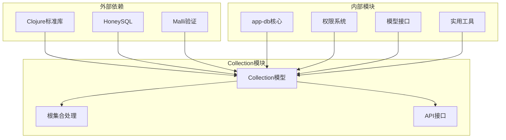

# 集合模型

<cite>
**本文档引用的文件**
- [collection.clj](file://src/metabase/collections/models/collection.clj)
- [core.clj](file://src/metabase/collections/core.clj)
- [api.clj](file://src/metabase/collections_rest/api.clj)
- [root.clj](file://src/metabase/collections/models/collection/root.clj)
- [permissions.clj](file://src/metabase/permissions/core.clj)
- [util.clj](file://src/metabase/permissions/util.clj)
</cite>

## 目录
1. [简介](#简介)
2. [项目结构](#项目结构)
3. [核心组件](#核心组件)
4. [架构概览](#架构概览)
5. [详细组件分析](#详细组件分析)
6. [依赖关系分析](#依赖关系分析)
7. [性能考虑](#性能考虑)
8. [故障排除指南](#故障排除指南)
9. [结论](#结论)

## 简介

Collection模型是Metabase中内容组织的核心单元，用于管理和组织Cards、Dashboards和Pulses等对象。该模型采用树状层次结构设计，通过路径表示法（/path/to/collection）实现高效的层次化管理和权限控制。

Collection模型的主要设计理念包括：
- **树状层次结构**：支持无限层级的嵌套集合
- **路径表示法**：使用字符串路径而非外键关联，提高查询效率
- **权限边界**：根集合具有特殊的权限边界作用
- **内容继承**：子集合自动继承父集合的权限设置

## 项目结构

Collection模型的实现分布在以下关键文件中：

**图表来源**
- [collection.clj](file://src/metabase/collections/models/collection.clj#L1-L50)
- [root.clj](file://src/metabase/collections/models/collection/root.clj#L1-L30)
- [api.clj](file://src/metabase/collections_rest/api.clj#L1-L40)

**章节来源**
- [collection.clj](file://src/metabase/collections/models/collection.clj#L1-L100)
- [core.clj](file://src/metabase/collections/core.clj#L1-L19)

## 核心组件

### Collection数据结构

Collection模型的核心数据结构包含以下关键字段：

| 字段名 | 类型 | 描述 | 约束 |
|--------|------|------|------|
| `id` | 正整数 | 唯一标识符 | 主键 |
| `name` | 字符串 | 集合名称 | 必填，最大长度510字符 |
| `location` | 路径字符串 | 层次位置路径 | 格式："/10/20/" |
| `type` | 枚举 | 集合类型 | 可选值："trash"、"remote-synced" |
| `personal_owner_id` | 整数 | 个人所有者ID | 个人集合专用 |
| `namespace` | 字符串 | 命名空间 | 默认为null |
| `archived` | 布尔值 | 是否已归档 | 默认false |

### 路径表示法系统

Collection模型采用独特的路径表示法来管理层次关系：

**图表来源**
- [collection.clj](file://src/metabase/collections/models/collection.clj#L216-L244)

**章节来源**
- [collection.clj](file://src/metabase/collections/models/collection.clj#L216-L300)

## 架构概览

Collection模型的整体架构采用分层设计，从底层数据存储到上层API接口：

**图表来源**
- [api.clj](file://src/metabase/collections_rest/api.clj#L1-L50)
- [collection.clj](file://src/metabase/collections/models/collection.clj#L1-L50)

## 详细组件分析

### 根集合（Root Collection）

根集合是Collection层次结构的顶级节点，具有特殊的语义和权限边界：

**图表来源**
- [root.clj](file://src/metabase/collections/models/collection/root.clj#L20-L50)
- [collection.clj](file://src/metabase/collections/models/collection.clj#L339-L374)

根集合的特殊特性：
- **无实际实体**：不是数据库中的真实记录
- **权限边界**：具有完整的读写权限
- **命名空间支持**：支持多命名空间隔离
- **动态生成**：根据用户权限动态生成

**章节来源**
- [root.clj](file://src/metabase/collections/models/collection/root.clj#L1-L76)

### 层次结构管理

Collection模型通过路径系统实现高效的层次结构管理：

**图表来源**
- [collection.clj](file://src/metabase/collections/models/collection.clj#L1472-L1532)
- [api.clj](file://src/metabase/collections_rest/api.clj#L100-L150)

### 权限继承机制

Collection模型实现了复杂的权限继承和传播机制：

**图表来源**
- [collection.clj](file://src/metabase/collections/models/collection.clj#L1472-L1532)
- [collection.clj](file://src/metabase/collections/models/collection.clj#L1550-L1600)

**章节来源**
- [collection.clj](file://src/metabase/collections/models/collection.clj#L1472-L1600)

### 路径解析和遍历

Collection模型提供了多种路径解析和遍历功能：

| 功能 | 函数名 | 描述 | 复杂度 |
|------|--------|------|--------|
| 路径转ID列表 | `location-path->ids` | 将路径字符串转换为ID序列 | O(n) |
| 获取父级ID | `location-path->parent-id` | 获取直接父级集合ID | O(1) |
| 获取所有祖先 | `ancestors` | 获取所有祖先集合 | O(log n) |
| 获取有效祖先 | `effective-ancestors` | 获取当前用户可见的祖先 | O(k) |
| 获取后代集合 | `descendants` | 获取所有后代集合 | O(m) |
| 获取有效子集 | `effective-children` | 获取有效的直接子集 | O(k) |

**章节来源**
- [collection.clj](file://src/metabase/collections/models/collection.clj#L823-L930)

### 性能优化策略

Collection模型采用了多种性能优化策略：

**图表来源**
- [collection.clj](file://src/metabase/collections/models/collection.clj#L572-L602)
- [collection.clj](file://src/metabase/collections/models/collection.clj#L774-L799)

**章节来源**
- [collection.clj](file://src/metabase/collections/models/collection.clj#L572-L799)

## 依赖关系分析

Collection模型的依赖关系展现了清晰的分层架构：

**图表来源**
- [collection.clj](file://src/metabase/collections/models/collection.clj#L1-L30)
- [api.clj](file://src/metabase/collections_rest/api.clj#L1-L30)

**章节来源**
- [collection.clj](file://src/metabase/collections/models/collection.clj#L1-L50)
- [core.clj](file://src/metabase/collections/core.clj#L1-L19)

## 性能考虑

### 查询性能优化

Collection模型在设计时充分考虑了查询性能：

1. **路径索引**：利用字符串前缀匹配进行高效查询
2. **批量操作**：支持批量水化和权限检查
3. **缓存机制**：多层缓存减少数据库访问
4. **延迟加载**：按需加载子集和权限信息

### 内存使用优化

1. **对象复用**：重用根集合等特殊对象
2. **惰性计算**：只在需要时计算复杂结构
3. **内存池**：复用临时对象和数据结构

### 并发安全

1. **事务隔离**：使用数据库事务保证一致性
2. **锁机制**：在关键操作中使用适当的锁
3. **乐观并发控制**：支持高并发场景下的冲突检测

## 故障排除指南

### 常见问题及解决方案

| 问题类型 | 症状 | 可能原因 | 解决方案 |
|----------|------|----------|----------|
| 路径验证失败 | 无效的location路径 | 路径格式错误或ID不存在 | 检查路径格式和父级存在性 |
| 权限继承问题 | 新集合无法访问 | 权限复制失败 | 手动检查权限设置 |
| 性能问题 | 查询响应缓慢 | 缺少索引或缓存失效 | 添加索引和清理缓存 |
| 移动失败 | 集合移动不成功 | 权限不足或循环引用 | 检查权限和路径完整性 |

**章节来源**
- [collection.clj](file://src/metabase/collections/models/collection.clj#L1267-L1319)

## 结论

Collection模型作为Metabase内容组织的核心，展现了优秀的软件设计原则：

1. **设计理念先进**：采用路径表示法而非传统外键，提高了查询效率
2. **权限控制完善**：实现了细粒度的权限继承和边界控制
3. **扩展性强**：支持无限层级和多种命名空间
4. **性能优化到位**：多层缓存和批量操作确保高性能
5. **可维护性好**：清晰的分层架构和完善的测试覆盖

该模型不仅满足了当前的功能需求，还为未来的扩展奠定了坚实的基础，是现代企业级应用中集合管理的最佳实践之一。