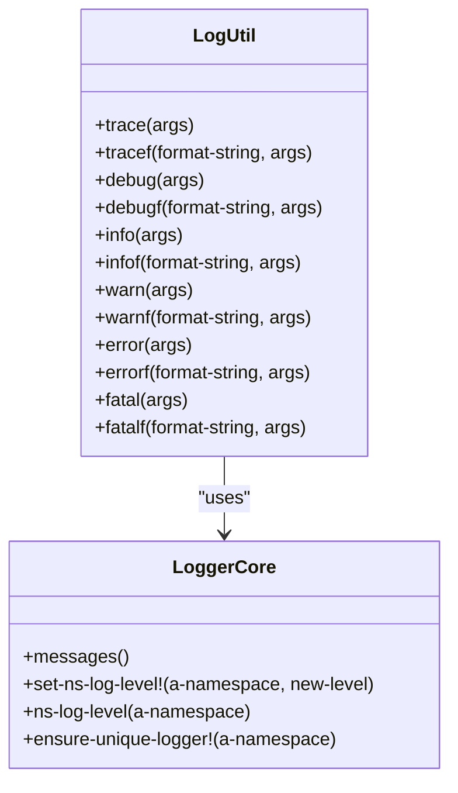
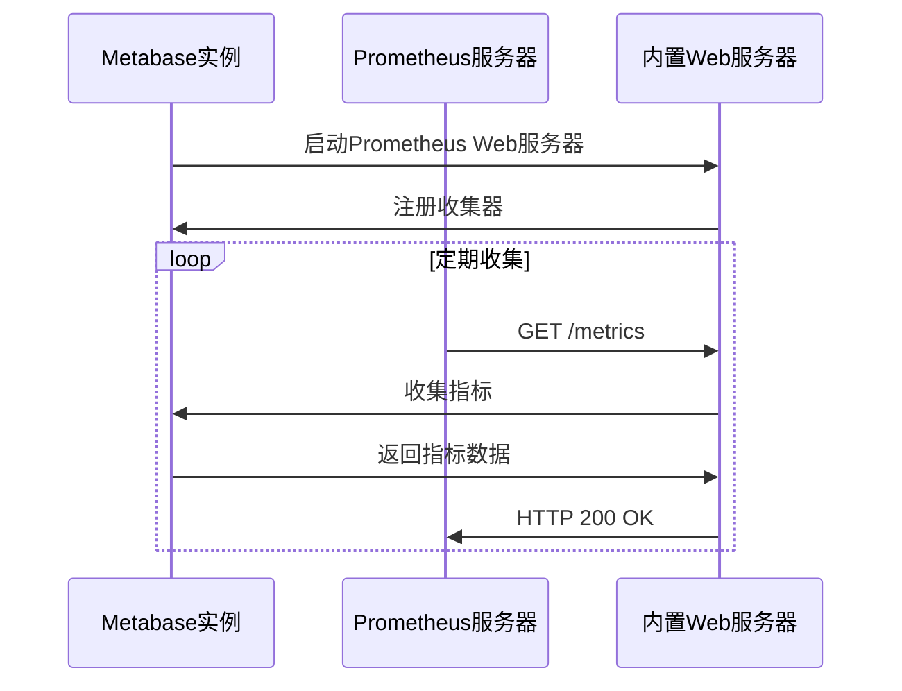
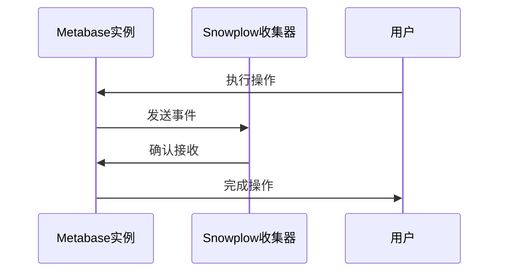

# 日志与监控

<cite>
**本文档中引用的文件**   
- [util/log.clj](file://src/metabase/util/log.clj)
- [logger/core.clj](file://src/metabase/logger/core.clj)
- [analytics/core.clj](file://src/metabase/analytics/core.clj)
- [analytics/prometheus.clj](file://src/metabase/analytics/prometheus.clj)
- [analytics/snowplow.clj](file://src/metabase/analytics/snowplow.clj)
- [analytics/stats.clj](file://src/metabase/analytics/stats.clj)
- [analytics/settings.clj](file://src/metabase/analytics/settings.clj)
- [analytics/init.clj](file://src/metabase/analytics/init.clj)
- [logger/api.clj](file://src/metabase/logger/api.clj)
- [analytics/task/send_anonymous_stats.clj](file://src/metabase/analytics/task/send_anonymous_stats.clj)
</cite>

## 目录
1. [简介](#简介)
2. [日志系统](#日志系统)
3. [监控系统](#监控系统)
4. [关键监控指标](#关键监控指标)
5. [配置与访问](#配置与访问)
6. [故障排查](#故障排查)
7. [结论](#结论)

## 简介
本文档旨在指导运维人员如何观察和诊断Metabase实例的运行状况。文档详细说明了`util/log.clj`和`logger`模块如何记录应用日志，包括日志级别、格式和输出位置。同时，文档还详细描述了`analytics`模块如何收集匿名使用统计信息，并介绍了与Prometheus和Snowplow的集成，用于性能监控和用户行为分析。最后，文档提供了关键监控指标的列表和解释，以及如何配置和访问这些监控数据的指导。

## 日志系统

### 日志记录模块
Metabase的日志系统主要由`util/log.clj`和`logger/core.clj`两个模块组成。`util/log.clj`模块提供了统一的日志接口，封装了`clojure.tools.logging`和`Glogi`，确保在JVM Clojure和CLJS环境中的一致性。该模块定义了多种日志级别，包括`trace`、`debug`、`info`、`warn`、`error`和`fatal`，并提供了相应的宏来记录日志。

**Diagram sources**
- [util/log.clj](file://src/metabase/util/log.clj#L1-L350)
- [logger/core.clj](file://src/metabase/logger/core.clj#L1-L280)

### 日志级别与格式
Metabase支持多种日志级别，从最详细的`trace`到最严重的`fatal`。每个日志级别都有对应的宏，如`info`和`infof`，用于记录不同级别的日志信息。日志格式包括时间戳、日志级别、命名空间、消息内容和异常信息。日志消息可以是简单的字符串，也可以是通过`format`函数格式化的字符串。

**Section sources**
- [util/log.clj](file://src/metabase/util/log.clj#L1-L350)
- [logger/core.clj](file://src/metabase/logger/core.clj#L1-L280)

### 日志输出位置
Metabase的日志输出位置可以通过配置文件或环境变量进行设置。默认情况下，日志会输出到控制台和文件。文件日志的位置和格式可以在`logger/core.clj`中进行配置。此外，Metabase还支持将日志发送到远程日志服务器，如Logstash或Fluentd。

**Section sources**
- [logger/core.clj](file://src/metabase/logger/core.clj#L1-L280)

## 监控系统

### Prometheus集成
Metabase通过`analytics/prometheus.clj`模块与Prometheus集成，用于收集和暴露性能监控数据。Prometheus模块在启动时会创建一个注册表和一个Web服务器，如果设置了`MB_PROMETHEUS_SERVER_PORT`环境变量，则会在指定端口上启动Web服务器。Prometheus收集器会定期收集各种指标，如JVM内存使用情况、数据库连接池状态、查询执行时间等，并通过HTTP接口暴露这些指标。

**Diagram sources**
- [analytics/prometheus.clj](file://src/metabase/analytics/prometheus.clj#L1-L668)

### Snowplow集成
Metabase通过`analytics/snowplow.clj`模块与Snowplow集成，用于收集匿名使用统计信息。Snowplow模块会发送各种事件，如用户登录、创建仪表板、执行查询等，这些事件会被发送到Snowplow收集器。收集到的数据可以用于分析用户行为、优化产品功能和改进用户体验。

**Diagram sources**
- [analytics/snowplow.clj](file://src/metabase/analytics/snowplow.clj#L1-L162)

### 内部统计
Metabase通过`analytics/stats.clj`模块收集内部统计信息，这些信息包括实例的基本信息、用户活动、查询执行情况等。这些统计信息可以用于监控系统健康状况、分析性能瓶颈和优化资源分配。

**Section sources**
- [analytics/stats.clj](file://src/metabase/analytics/stats.clj#L1-L1005)

## 关键监控指标

### 查询延迟
查询延迟是衡量Metabase性能的重要指标之一。Metabase通过`analytics/prometheus.clj`模块收集查询执行时间，并将其分为多个区间，如0-1秒、1-10秒、10-50秒等。这些指标可以帮助运维人员识别慢查询和性能瓶颈。

**Section sources**
- [analytics/prometheus.clj](file://src/metabase/analytics/prometheus.clj#L1-L668)

### 错误率
错误率是衡量系统稳定性的关键指标。Metabase通过`analytics/prometheus.clj`模块收集查询执行失败的次数，并计算错误率。高错误率可能表明系统存在配置问题、资源不足或代码缺陷。

**Section sources**
- [analytics/prometheus.clj](file://src/metabase/analytics/prometheus.clj#L1-L668)

### 活跃用户数
活跃用户数是衡量系统使用情况的重要指标。Metabase通过`analytics/stats.clj`模块收集过去24小时内登录的用户数量，并将其作为活跃用户数。这些数据可以帮助运维人员了解系统的使用趋势和用户行为。

**Section sources**
- [analytics/stats.clj](file://src/metabase/analytics/stats.clj#L1-L1005)

## 配置与访问

### 配置Prometheus
要启用Prometheus监控，需要在启动Metabase时设置`MB_PROMETHEUS_SERVER_PORT`环境变量。例如，可以在启动命令中添加`-Dmb.prometheus-server-port=9090`。启动后，Prometheus服务器将在`localhost:9090/metrics`上暴露指标数据。

**Section sources**
- [analytics/settings.clj](file://src/metabase/analytics/settings.clj#L1-L110)

### 配置Snowplow
要启用Snowplow监控，需要在`analytics/settings.clj`中配置`snowplow-url`和`snowplow-available`。`snowplow-url`指定了Snowplow收集器的URL，`snowplow-available`指定了是否启用Snowplow收集器。默认情况下，Snowplow在生产环境中是启用的。

**Section sources**
- [analytics/settings.clj](file://src/metabase/analytics/settings.clj#L1-L110)

### 访问日志
Metabase的日志可以通过API接口访问。运维人员可以通过调用`/api/logger/logs`接口获取最近的日志条目。此外，日志文件通常位于`logs`目录下，可以直接查看和分析。

**Section sources**
- [logger/api.clj](file://src/metabase/logger/api.clj#L1-L236)

## 故障排查

### 日志分析
当遇到问题时，首先应该检查日志文件。日志文件中包含了详细的错误信息和堆栈跟踪，可以帮助快速定位问题。运维人员可以使用`grep`命令搜索特定的错误信息，或使用日志分析工具进行更深入的分析。

**Section sources**
- [util/log.clj](file://src/metabase/util/log.clj#L1-L350)
- [logger/core.clj](file://src/metabase/logger/core.clj#L1-L280)

### 监控数据
如果日志中没有明显的错误信息，可以查看Prometheus和Snowplow的监控数据。Prometheus提供了丰富的性能指标，可以帮助识别性能瓶颈。Snowplow提供了用户行为数据，可以帮助理解用户操作和使用模式。

**Section sources**
- [analytics/prometheus.clj](file://src/metabase/analytics/prometheus.clj#L1-L668)
- [analytics/snowplow.clj](file://src/metabase/analytics/snowplow.clj#L1-L162)

## 结论
本文档详细介绍了Metabase的日志与监控系统，包括日志记录模块、监控系统集成、关键监控指标和配置与访问方法。通过这些信息，运维人员可以更好地观察和诊断Metabase实例的运行状况，确保系统的稳定性和高性能。