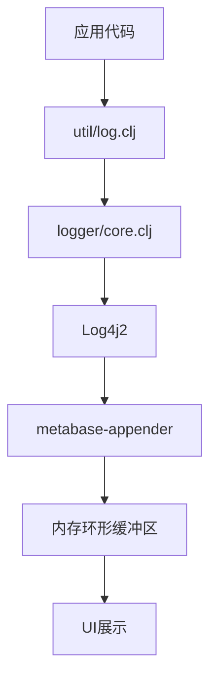
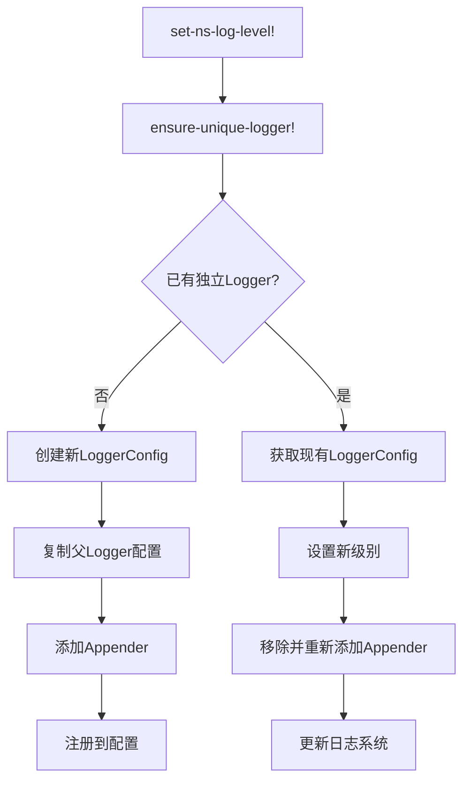
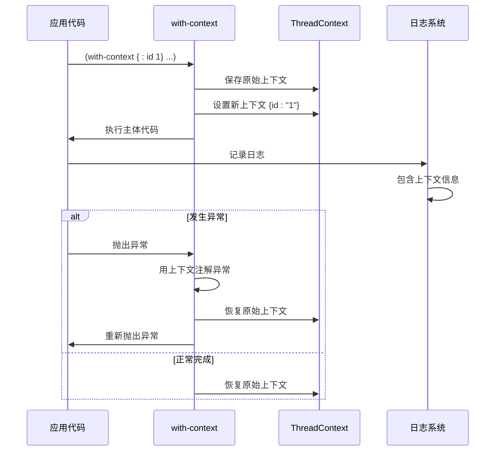

# 日志记录

<cite>
**本文档中引用的文件**  
- [util/log.clj](file://src/metabase/util/log.clj)
- [logger/core.clj](file://src/metabase/logger/core.clj)
- [logger/api.clj](file://src/metabase/logger/api.clj)
- [config/core.clj](file://src/metabase/config/core.clj)
- [core/bootstrap.clj](file://src/metabase/core/bootstrap.clj)
</cite>

## 目录
1. [简介](#简介)
2. [核心日志函数](#核心日志函数)
3. [日志系统架构](#日志系统架构)
4. [日志级别控制](#日志级别控制)
5. [日志格式与输出](#日志格式与输出)
6. [上下文与异常日志](#上下文与异常日志)
7. [API端点与动态配置](#api端点与动态配置)
8. [环境变量与配置](#环境变量与配置)
9. [最佳实践](#最佳实践)

## 简介
Metabase的日志系统基于`clojure.tools.logging`构建，通过`util/log.clj`提供统一的API接口，并由`logger/core.clj`进行底层封装和配置。该系统支持结构化日志输出、多级别日志控制、上下文信息注入以及异常上下文捕获。日志系统使用Log4j2作为底层实现，通过自定义Appender将日志存储在内存环形缓冲区中，以便在UI中展示。系统还提供了API端点，允许超级用户在运行时动态调整日志级别，便于故障排查。

**Section sources**
- [util/log.clj](file://src/metabase/util/log.clj#L1-L350)
- [logger/core.clj](file://src/metabase/logger/core.clj#L1-L280)

## 核心日志函数
`util/log.clj`文件定义了Metabase的核心日志函数，这些函数作为`clojure.tools.logging`的封装，提供了一致的API接口。主要日志函数包括`info`、`warn`、`error`等，它们都是基于`logp`和`logf`宏构建的。

`info`宏用于在`:info`级别记录一个或多个参数，它通过`logp`宏实现，将日志级别和参数传递给底层日志系统。`warn`和`error`宏具有相同的结构，分别用于警告和错误级别的日志记录。这些宏都支持两种调用形式：直接记录参数，或记录异常和附加信息。

`infof`、`warnf`和`errorf`宏则基于`logf`实现，支持格式化字符串输出，类似于`printf`风格的日志记录。这些函数在开发和生产环境中保持一致的接口，同时在开发模式下会额外捕获日志信息用于测试。

**Section sources**
- [util/log.clj](file://src/metabase/util/log.clj#L182-L228)

## 日志系统架构
Metabase的日志系统采用分层架构，上层是`util/log.clj`提供的公共API，下层是`logger/core.clj`对Log4j2的封装。系统在启动时通过`core/bootstrap.clj`配置Log4j2的上下文选择器，确保使用单一的`LoggerContext`，避免类加载器隔离导致的多个日志上下文问题。

`logger/core.clj`创建了一个名为`metabase-appender`的自定义Appender，该Appender继承自`AbstractAppender`，将日志事件存储在内存环形缓冲区中。这个缓冲区大小限制为250条日志，采用先进先出策略。每条日志事件被转换为包含时间戳、级别、命名空间、消息、异常堆栈和进程UUID的结构化数据。

系统在初始化时将这个Appender添加到全局配置中，并将其附加到所有现有的LoggerConfig上，确保所有命名空间的日志都能被捕获。这种设计使得Metabase能够在UI中实时显示最近的日志条目，而无需依赖外部日志文件。

**Diagram sources**
- [logger/core.clj](file://src/metabase/logger/core.clj#L29-L62)
- [core/bootstrap.clj](file://src/metabase/core/bootstrap.clj#L25-L26)

**Section sources**
- [logger/core.clj](file://src/metabase/logger/core.clj#L0-L280)
- [core/bootstrap.clj](file://src/metabase/core/bootstrap.clj#L0-L26)

## 日志级别控制
Metabase支持标准的日志级别：`:off`、`:fatal`、`:error`、`:warn`、`:info`、`:debug`和`:trace`，按从最低到最高详细程度排序。这些级别通过`keyword->Level`有序映射进行管理，确保级别比较的正确性。

`set-ns-log-level!`函数允许为特定命名空间设置日志级别。该函数首先确保目标命名空间有独立的LoggerConfig（通过`ensure-unique-logger!`），然后设置新的级别。由于Log4j2的级别更改不会自动更新Appender的级别，系统需要手动移除并重新添加Appender以确保级别变更生效。

`ns-log-level`函数用于查询当前应用于特定命名空间的日志级别。`effective-ns-logger`函数获取将用于特定命名空间的LoggerConfig，如果该命名空间没有精确匹配的LoggerConfig，则返回其父命名空间的LoggerConfig。

**Diagram sources**
- [logger/core.clj](file://src/metabase/logger/core.clj#L246-L270)
- [logger/core.clj](file://src/metabase/logger/core.clj#L203-L229)

**Section sources**
- [logger/core.clj](file://src/metabase/logger/core.clj#L165-L203)

## 日志格式与输出
Metabase的日志系统支持结构化日志输出，每条日志条目被转换为包含多个字段的映射。`event->log-data`函数负责将Log4j2的`LogEvent`转换为结构化数据，包括ISO格式的时间戳、日志级别、完全限定命名空间、消息文本、异常堆栈跟踪和进程UUID。

消息和异常文本会被截断以防止过长的条目占用过多内存。消息最多保留4000个字符，异常堆栈的每一行最多保留500个字符，最多显示20行。这种截断策略确保了内存使用的可预测性，同时保留了足够的诊断信息。

除了内存缓冲区，系统还支持通过`for-ns`函数为特定命名空间创建独立的日志记录器，可以将日志输出到文件或输出流。该函数使用`make-appender`协议根据输出目标类型创建相应的Appender（`FileAppender`或`OutputStreamAppender`），并将其附加到指定命名空间的LoggerConfig上。

**Section sources**
- [logger/core.clj](file://src/metabase/logger/core.clj#L29-L62)

## 上下文与异常日志
Metabase提供了强大的上下文日志功能，允许在日志记录中注入额外的上下文信息。`with-context`宏是主要的上下文管理工具，它在执行主体代码时，将上下文映射中的键值对添加到Log4j2的`ThreadContext`中。这些上下文信息会自动包含在所有日志条目中，便于追踪特定操作或请求。

`with-context`还处理异常情况：当主体代码抛出异常时，它会使用`with-exception-context`将上下文信息附加到异常上。这是通过向异常添加一个被抑制的`ExceptionInfo`来实现的，该`ExceptionInfo`包含上下文数据。当异常被记录时，这些上下文信息也会被输出，极大地增强了错误诊断能力。

`with-thread-context-fn`函数是`with-thread-context`的基础实现，它在修改`ThreadContext`之前保存原始值，并在执行完成后恢复它们，确保上下文变更不会泄漏到外部代码。

**Diagram sources**
- [util/log.clj](file://src/metabase/util/log.clj#L90-L122)
- [util/log.clj](file://src/metabase/util/log.clj#L292-L326)

**Section sources**
- [util/log.clj](file://src/metabase/util/log.clj#L60-L92)

## API端点与动态配置
Metabase提供了`/api/logger`端点，允许超级用户在运行时动态调整日志配置。`/logs`端点返回内存缓冲区中的最近日志条目，按时间倒序排列。`/presets`端点返回预定义的日志调整预设，如用于同步问题、链接过滤器问题和序列化问题的预设。

`/adjustment`端点是核心的动态配置功能，它接受一个包含`duration`、`duration_unit`和`log_levels`的JSON对象。该端点会创建一个执行计划，为指定的命名空间设置新的日志级别，并安排一个定时任务在指定时间后恢复原始配置。这使得管理员可以临时提高特定组件的日志级别以诊断问题，而无需重启服务。

调整计划通过`create-plan`函数生成，该函数比较当前和目标日志级别，生成添加或更改操作的列表。`execute-plan!`函数执行这些操作，而`undo-plan!`函数在定时器触发时恢复原始状态。所有调整状态存储在`log-adjustment`原子中，确保同一时间只有一个调整处于活动状态。

**Section sources**
- [logger/api.clj](file://src/metabase/logger/api.clj#L0-L236)

## 环境变量与配置
Metabase的日志行为可以通过环境变量进行配置。虽然具体的日志相关环境变量未在提供的代码中明确列出，但系统通过`config/core.clj`中的`config-str`函数从环境变量、JVM选项和硬编码默认值中解析配置。

`mb-colorize-logs`和`mb-emoji-in-logs`配置项控制日志输出是否包含ANSI颜色代码和表情符号，默认情况下在非Windows系统上启用。`mb-ns-trace`配置项可用于指定要跟踪的命名空间，可能用于启用更详细的日志记录。

日志系统的初始化由`logger/init.clj`触发，该文件确保`logger/core.clj`在系统启动时被加载。`core/bootstrap.clj`负责设置Log4j2的配置文件位置，优先使用`log4j2-test.xml`（如果存在），否则使用`log4j2.xml`，并设置`BasicContextSelector`以确保单一的日志上下文。

**Section sources**
- [config/core.clj](file://src/metabase/config/core.clj#L0-L199)
- [core/bootstrap.clj](file://src/metabase/core/bootstrap.clj#L0-L26)
- [logger/init.clj](file://src/metabase/logger/init.clj#L0-L8)

## 最佳实践
在开发和生产环境中配置Metabase日志的最佳实践包括：

1. **开发环境**：充分利用`with-context`宏为关键操作添加上下文信息，使用`spy`和`spyf`宏临时调试表达式值。利用`/adjustment`端点为特定问题临时提高日志级别。

2. **生产环境**：保持默认的`:info`级别以避免日志过多，仅在诊断特定问题时使用`/adjustment`端点临时提高级别。监控内存缓冲区中的日志以快速发现错误。

3. **故障诊断**：对于查询失败，检查`metabase.query-processor`命名空间的日志；对于认证错误，检查`metabase.auth`相关命名空间。使用预设的同步问题日志配置来诊断数据库同步问题。

4. **性能考虑**：避免在循环或高频调用的代码路径中使用`debug`或`trace`级别的日志，因为即使日志被禁用，字符串拼接也可能产生开销。使用`level-enabled?`函数检查级别是否启用，再进行昂贵的字符串构建。

5. **安全**：确保敏感信息不会无意中记录在日志中，特别是在启用`debug`级别时。利用上下文信息进行追踪，但避免在上下文中包含密码或令牌等敏感数据。