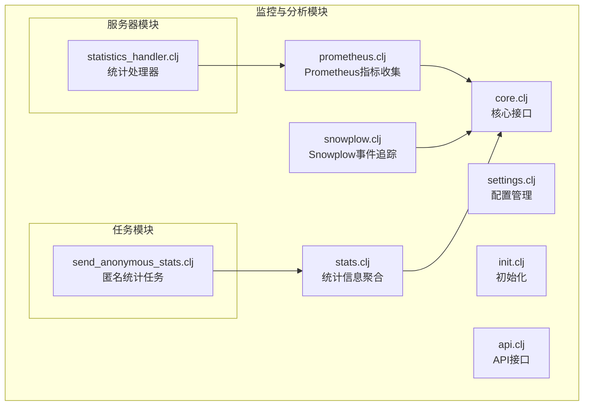
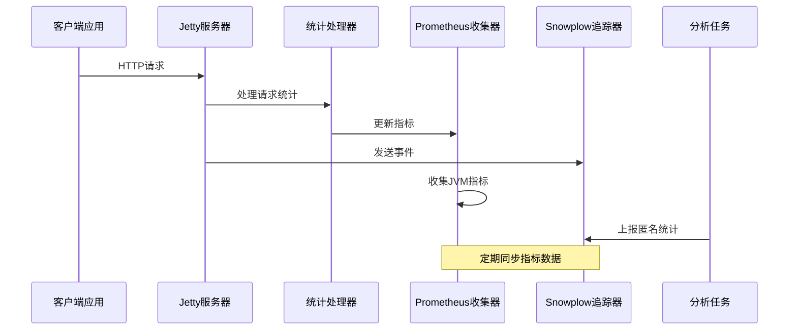
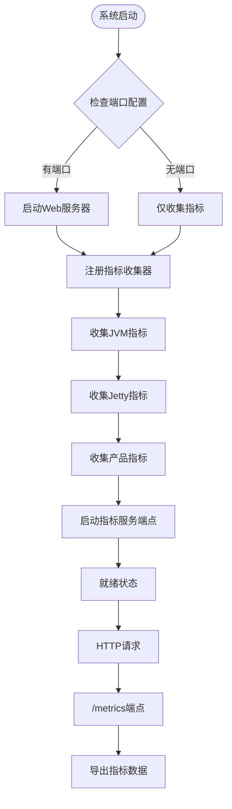
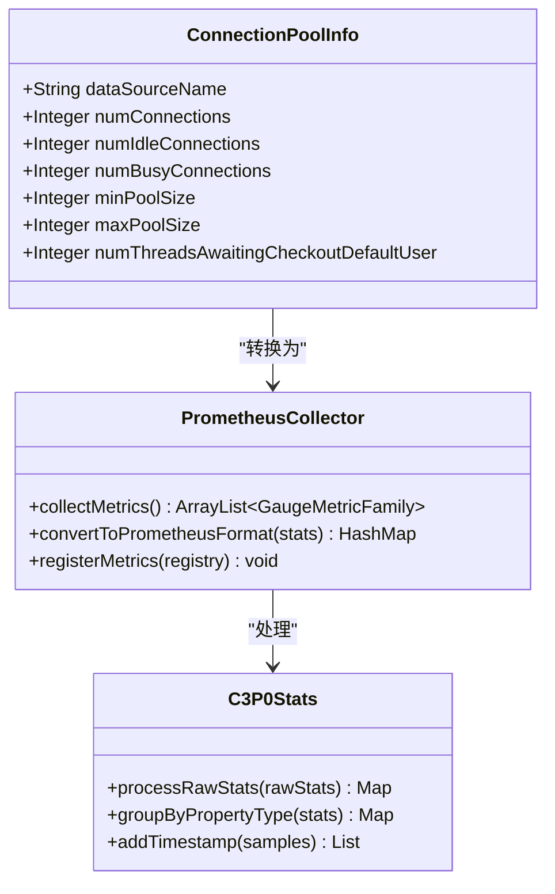
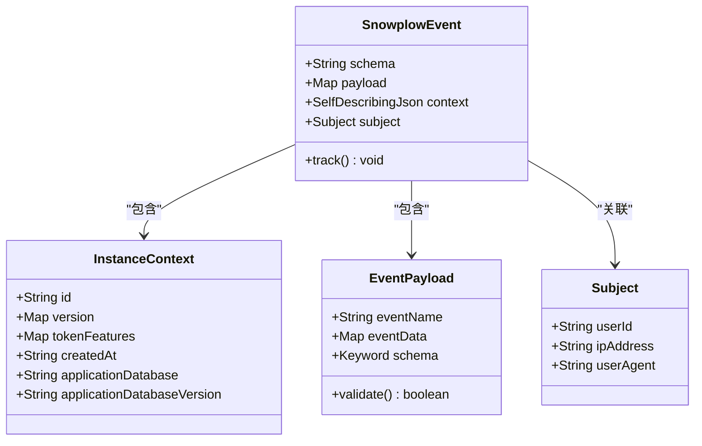
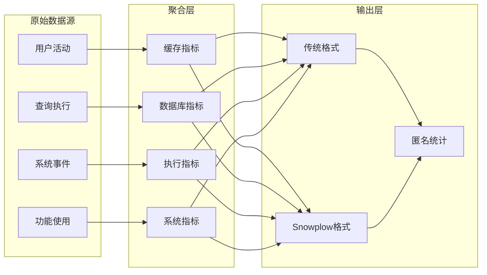
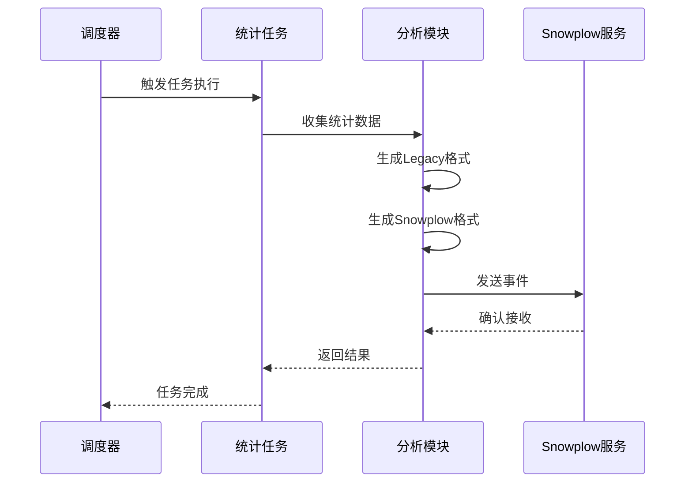
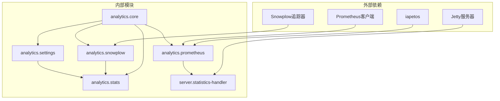

# 监控与分析集成

<cite>
**本文档中引用的文件**
- [prometheus.clj](file://src/metabase/analytics/prometheus.clj)
- [snowplow.clj](file://src/metabase/analytics/snowplow.clj)
- [core.clj](file://src/metabase/analytics/core.clj)
- [stats.clj](file://src/metabase/analytics/stats.clj)
- [send_anonymous_stats.clj](file://src/metabase/analytics/task/send_anonymous_stats.clj)
- [settings.clj](file://src/metabase/analytics/settings.clj)
- [init.clj](file://src/metabase/analytics/init.clj)
- [api.clj](file://src/metabase/analytics/api.clj)
- [statistics_handler.clj](file://src/metabase/server/statistics_handler.clj)
</cite>

## 目录
1. [简介](#简介)
2. [项目结构](#项目结构)
3. [核心组件](#核心组件)
4. [架构概览](#架构概览)
5. [详细组件分析](#详细组件分析)
6. [依赖关系分析](#依赖关系分析)
7. [性能考虑](#性能考虑)
8. [故障排除指南](#故障排除指南)
9. [结论](#结论)

## 简介

Metabase 的监控与分析集成功能提供了全面的系统监控和数据分析能力。该系统包含三个主要组件：Prometheus 指标收集器、Snowplow 用户行为追踪和匿名统计数据上报。这些组件协同工作，为系统管理员和开发者提供深入的性能洞察和使用模式分析。

## 项目结构

Metabase 的监控与分析功能位于 `src/metabase/analytics/` 目录下，采用模块化设计：

**图表来源**
- [prometheus.clj](file://src/metabase/analytics/prometheus.clj#L1-L50)
- [snowplow.clj](file://src/metabase/analytics/snowplow.clj#L1-L30)
- [stats.clj](file://src/metabase/analytics/stats.clj#L1-L40)

**章节来源**
- [core.clj](file://src/metabase/analytics/core.clj#L1-L59)
- [init.clj](file://src/metabase/analytics/init.clj#L1-L5)

## 核心组件

### Prometheus 指标收集器

Prometheus 集成负责暴露系统级指标，支持实时监控和告警。主要功能包括：

- **JVM 指标监控**：垃圾回收、内存池、线程状态
- **连接池监控**：数据库连接池状态和性能指标
- **HTTP 请求监控**：请求计数、响应时间、并发请求数
- **产品特定指标**：查询执行、通知发送、搜索性能

### Snowplow 用户行为追踪

Snowplow 集成用于跟踪用户行为事件，支持隐私友好的数据分析：

- **事件类型**：账户活动、仪表板操作、数据库交互
- **上下文数据**：实例属性、功能启用状态、设置配置
- **隐私保护**：本地化IP地址、可选的数据发送控制

### 匿名统计数据上报

定期收集和上报匿名使用统计数据，帮助 Metabase 团队改进产品：

- **使用统计**：查询执行次数、用户活跃度、功能使用情况
- **系统信息**：部署环境、版本信息、性能指标
- **激活信号**：用户增长、查询量、功能采用率

**章节来源**
- [prometheus.clj](file://src/metabase/analytics/prometheus.clj#L1-L30)
- [snowplow.clj](file://src/metabase/analytics/snowplow.clj#L1-L30)
- [stats.clj](file://src/metabase/analytics/stats.clj#L1-L40)

## 架构概览

监控与分析系统的整体架构展示了各组件之间的交互关系：

**图表来源**
- [statistics_handler.clj](file://src/metabase/server/statistics_handler.clj#L80-L120)
- [prometheus.clj](file://src/metabase/analytics/prometheus.clj#L550-L580)

## 详细组件分析

### Prometheus 指标端点分析

#### 关键指标定义

Prometheus 集成暴露以下核心指标：

| 指标名称 | 类型 | 标签维度 | 描述 |
|---------|------|----------|------|
| `metabase_query_duration_seconds` | Histogram | `driver`, `status` | 查询执行时间分布 |
| `metabase_http_request_duration_seconds` | Histogram | `method`, `path`, `status` | HTTP请求响应时间 |
| `jetty_requests_total` | Counter | 无 | 总请求数 |
| `jetty_requests_active` | Gauge | 无 | 当前活跃请求数 |
| `jetty_requests_max` | Gauge | 无 | 历史最大并发请求数 |
| `metabase_application_jvm_gc_seconds_total` | Counter | `gc` | JVM垃圾回收总时间 |
| `metabase_application_jvm_memory_bytes_used` | Gauge | `area` | JVM内存使用量 |

#### 指标收集流程

**图表来源**
- [prometheus.clj](file://src/metabase/analytics/prometheus.clj#L550-L580)
- [statistics_handler.clj](file://src/metabase/server/statistics_handler.clj#L80-L120)

#### 连接池监控

系统自动监控数据库连接池状态：

**图表来源**
- [prometheus.clj](file://src/metabase/analytics/prometheus.clj#L100-L150)

**章节来源**
- [prometheus.clj](file://src/metabase/analytics/prometheus.clj#L100-L200)
- [statistics_handler.clj](file://src/metabase/server/statistics_handler.clj#L1-L50)

### Snowplow 事件追踪分析

#### 事件结构设计

Snowplow 集成采用标准化的事件结构：

**图表来源**
- [snowplow.clj](file://src/metabase/analytics/snowplow.clj#L80-L120)

#### 隐私保护机制

系统实现了多层隐私保护措施：

| 保护层级 | 实现方式 | 目标 |
|---------|----------|------|
| IP 地址 | 本地化覆盖 | 避免真实IP泄露 |
| 用户标识 | 可选包含 | 仅在授权情况下发送 |
| 数据格式 | 关键字转字符串 | 确保Snowplow兼容性 |
| 传输安全 | HTTPS协议 | 加密数据传输 |

**章节来源**
- [snowplow.clj](file://src/metabase/analytics/snowplow.clj#L80-L162)

### 统计数据聚合分析

#### 数据收集策略

统计数据收集采用分层聚合策略：

**图表来源**
- [stats.clj](file://src/metabase/analytics/stats.clj#L400-L500)

#### 激活信号检测

系统智能检测实例激活状态：

| 检测条件 | Pro 计划 | Starter 计划 |
|---------|----------|-------------|
| 用户数量 | ≥ 4个活跃用户 | ≥ 2个活跃用户 |
| 查询量 | ≥ 201次查询 | ≥ 101次查询 |
| 时间窗口 | 创建后3天内 | 创建后3天内 |

**章节来源**
- [stats.clj](file://src/metabase/analytics/stats.clj#L700-L800)

### 匿名统计任务分析

#### 定时任务调度

匿名统计任务采用随机调度避免负载峰值：

**图表来源**
- [send_anonymous_stats.clj](file://src/metabase/analytics/task/send_anonymous_stats.clj#L20-L40)

**章节来源**
- [send_anonymous_stats.clj](file://src/metabase/analytics/task/send_anonymous_stats.clj#L1-L41)

## 依赖关系分析

监控与分析系统的依赖关系展现了模块间的协作：

**图表来源**
- [core.clj](file://src/metabase/analytics/core.clj#L1-L20)
- [prometheus.clj](file://src/metabase/analytics/prometheus.clj#L10-L30)

**章节来源**
- [core.clj](file://src/metabase/analytics/core.clj#L1-L59)
- [settings.clj](file://src/metabase/analytics/settings.clj#L1-L30)

## 性能考虑

### 指标收集性能

- **异步处理**：所有指标收集操作都是异步执行
- **内存优化**：使用原子操作减少锁竞争
- **批量传输**：Prometheus指标支持批量导出

### 隐私保护开销

- **本地化处理**：敏感数据在本地处理不传输
- **可选功能**：所有分析功能均可禁用
- **最小权限**：仅收集必要的匿名数据

### 网络传输优化

- **压缩传输**：HTTP请求支持压缩
- **错误重试**：网络失败时自动重试
- **超时控制**：合理的超时设置避免阻塞

## 故障排除指南

### Prometheus 集成问题

**问题**：指标无法访问
- **检查**：确认 `MB_PROMETHEUS_SERVER_PORT` 环境变量设置
- **验证**：访问 `http://localhost:<port>/metrics` 端点
- **日志**：检查启动日志中的 Prometheus 初始化信息

**问题**：指标数据不准确
- **重启**：尝试重启 Prometheus 系统
- **清理**：调用 `clear!` 函数清理旧指标
- **重新注册**：确保指标收集器正确注册

### Snowplow 集成问题

**问题**：事件未发送
- **检查**：确认 `anon-tracking-enabled` 设置为 `true`
- **验证**：检查 `snowplow-available` 配置
- **测试**：使用本地 Snowplow 微服务进行测试

**问题**：隐私设置冲突
- **审查**：检查用户隐私设置
- **调整**：适当调整匿名跟踪级别
- **审计**：定期审查发送的事件内容

### 统计数据问题

**问题**：统计数据缺失
- **权限**：确认监控权限设置
- **配置**：检查统计收集配置
- **日志**：查看统计任务执行日志

**章节来源**
- [prometheus.clj](file://src/metabase/analytics/prometheus.clj#L650-L670)
- [settings.clj](file://src/metabase/analytics/settings.clj#L25-L45)

## 结论

Metabase 的监控与分析集成功能提供了全面而灵活的系统监控解决方案。通过 Prometheus 指标的实时监控、Snowplow 的用户行为追踪和匿名统计数据的定期上报，系统能够为管理员和开发者提供深入的性能洞察和使用模式分析。

该系统的设计充分考虑了性能、隐私和可扩展性要求，采用了模块化架构和异步处理机制，确保在高负载环境下仍能稳定运行。同时，丰富的配置选项和可选功能使得系统能够适应不同的部署需求和隐私要求。

对于希望深入了解系统性能或优化用户体验的用户，建议充分利用这些监控工具，定期审查指标数据，并根据实际情况调整监控配置。通过合理使用这些功能，可以显著提升系统的可观测性和运维效率。