# Metabase Quartz调度器初始化过程详解

<cite>
**本文档中引用的文件**
- [impl.clj](file://src/metabase/task/impl.clj)
- [bootstrap.clj](file://src/metabase/task/bootstrap.clj)
- [job_factory.clj](file://src/metabase/task/job_factory.clj)
- [quartz.clj](file://src/metabase/analytics/quartz.clj)
- [core.clj](file://src/metabase/task/core.clj)
- [QUARTZ.md](file://src/metabase/task/QUARTZ.md)
</cite>

## 目录
1. [概述](#概述)
2. [项目结构分析](#项目结构分析)
3. [核心组件架构](#核心组件架构)
4. [init-scheduler!函数详细分析](#init-scheduler!函数详细分析)
5. [JDBC后端配置机制](#jdbc后端配置机制)
6. [ClassLoader加载机制](#classloader加载机制)
7. [JobFactory注册与错误处理](#jobfactory注册与错误处理)
8. [滚动更新场景下的错误恢复](#滚动更新场景下的错误恢复)
9. [日志记录与异常处理最佳实践](#日志记录与异常处理最佳实践)
10. [性能考虑与优化建议](#性能考虑与优化建议)
11. [故障排除指南](#故障排除指南)
12. [总结](#总结)

## 概述

Metabase使用Quartz调度器来管理各种后台任务，包括数据库同步、发送通知、会话清理等。调度器的初始化是一个复杂的过程，涉及多个组件的协调工作，特别是需要处理滚动更新场景下的错误恢复机制。

本文档详细分析了Metabase中Quartz调度器的初始化过程，重点关注`init-scheduler!`函数的实现细节，以及如何通过多种机制确保调度器在各种部署环境下的稳定运行。

## 项目结构分析

Metabase的Quartz调度器相关代码主要分布在以下模块中：

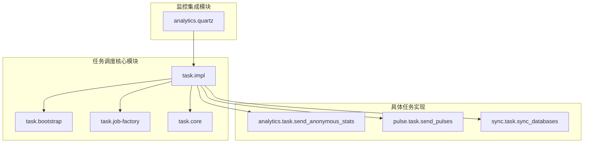

**图表来源**
- [impl.clj](file://src/metabase/task/impl.clj#L1-L30)
- [bootstrap.clj](file://src/metabase/task/bootstrap.clj#L1-L20)
- [job_factory.clj](file://src/metabase/task/job_factory.clj#L1-L15)

**章节来源**
- [impl.clj](file://src/metabase/task/impl.clj#L1-L50)
- [core.clj](file://src/metabase/task/core.clj#L1-L30)

## 核心组件架构

### 调度器实例管理

Metabase使用全局原子变量来管理调度器实例，确保在整个应用生命周期内只有一个调度器实例存在：

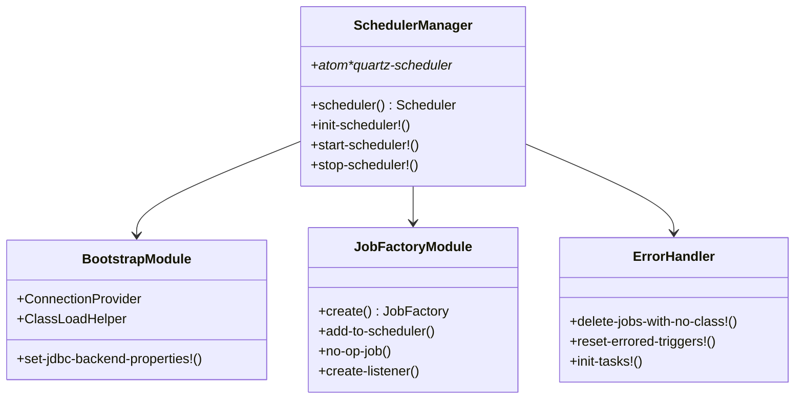

**图表来源**
- [impl.clj](file://src/metabase/task/impl.clj#L40-L55)
- [bootstrap.clj](file://src/metabase/task/bootstrap.clj#L30-L55)
- [job_factory.clj](file://src/metabase/task/job_factory.clj#L29-L65)

### 任务初始化流程

任务的初始化遵循多方法模式，每个任务模块都可以定义自己的初始化逻辑：

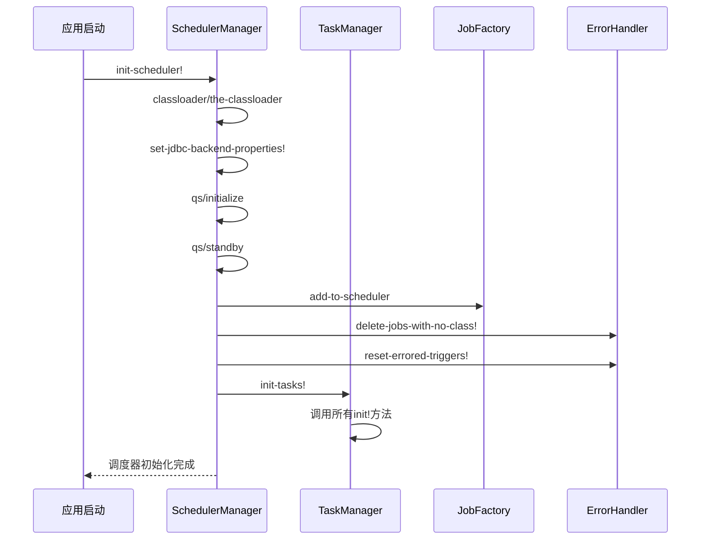

**图表来源**
- [impl.clj](file://src/metabase/task/impl.clj#L115-L130)
- [impl.clj](file://src/metabase/task/impl.clj#L65-L85)

**章节来源**
- [impl.clj](file://src/metabase/task/impl.clj#L115-L130)
- [impl.clj](file://src/metabase/task/impl.clj#L65-L85)

## init-scheduler!函数详细分析

`init-scheduler!`函数是整个调度器初始化的核心入口点，它执行以下关键步骤：

### 函数签名与基本结构

该函数采用无参数设计，通过动态绑定和全局状态管理来控制调度器的初始化过程：

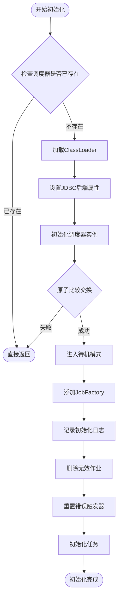

**图表来源**
- [impl.clj](file://src/metabase/task/impl.clj#L115-L130)

### 初始化步骤详解

1. **ClassLoader加载验证**：确保类加载器可用，为后续的类加载做准备
2. **JDBC后端属性设置**：根据数据库类型配置相应的驱动委托类
3. **调度器实例化**：调用Quartzite库创建新的调度器实例
4. **原子性初始化**：使用compare-and-set确保只有一个调度器实例被创建
5. **待机模式设置**：将调度器置于待机状态，等待显式启动
6. **JobFactory注册**：将自定义的JobFactory添加到调度器中
7. **错误清理**：删除因类路径变化而无法加载的作业
8. **错误恢复**：重置因滚动更新导致的错误状态触发器
9. **任务初始化**：调用所有已注册的任务初始化方法

**章节来源**
- [impl.clj](file://src/metabase/task/impl.clj#L115-L130)

## JDBC后端配置机制

### 数据库类型检测与适配

Metabase支持多种数据库后端，通过运行时检测确定合适的JDBC委托类：

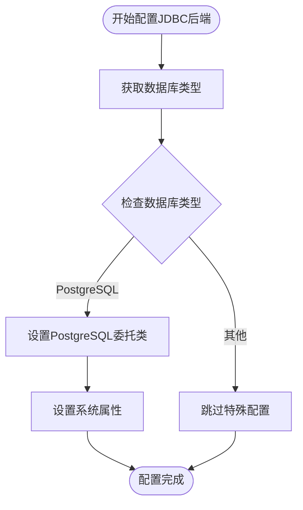

**图表来源**
- [bootstrap.clj](file://src/metabase/task/bootstrap.clj#L45-L55)

### 连接提供者实现

自定义的连接提供者确保Quartz使用Metabase的应用程序连接池：

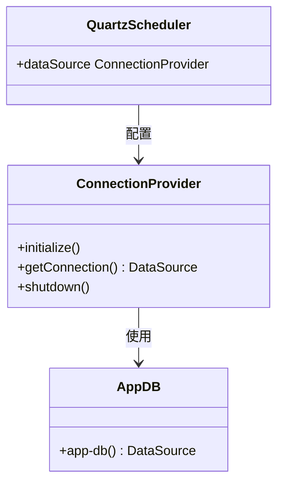

**图表来源**
- [bootstrap.clj](file://src/metabase/task/bootstrap.clj#L10-L30)

**章节来源**
- [bootstrap.clj](file://src/metabase/task/bootstrap.clj#L45-L55)
- [bootstrap.clj](file://src/metabase/task/bootstrap.clj#L10-L30)

## ClassLoader加载机制

### 自定义ClassLoadHelper实现

Metabase实现了自定义的ClassLoadHelper来确保Quartz能够正确加载所需的类：

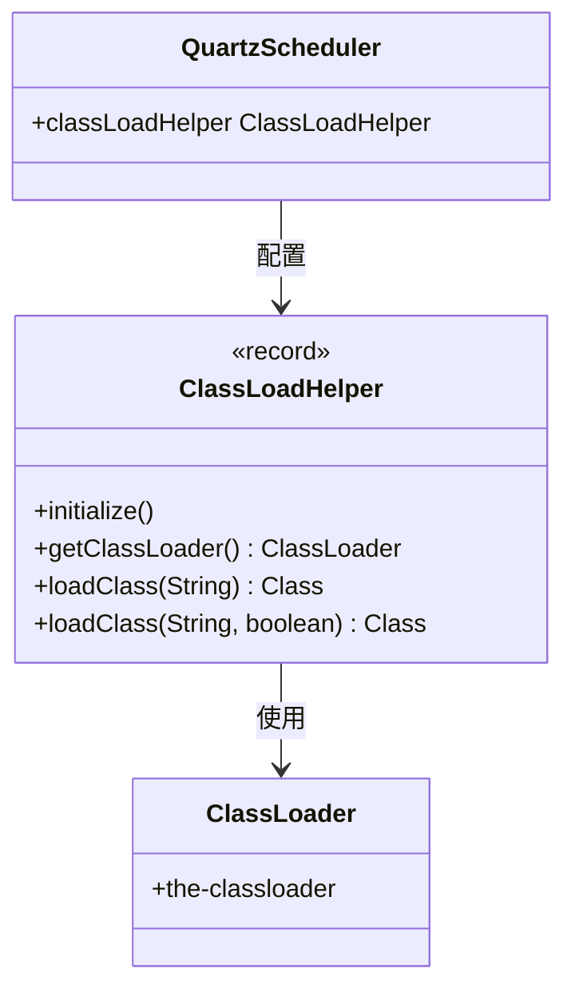

**图表来源**
- [bootstrap.clj](file://src/metabase/task/bootstrap.clj#L30-L50)

### 类加载策略

系统采用以下策略确保类加载的可靠性：

1. **延迟加载**：仅在需要时才加载类
2. **ClassLoader隔离**：使用应用程序的ClassLoader避免类冲突
3. **编译时检查**：在非编译模式下注册自定义Helper
4. **异常处理**：优雅处理类加载失败的情况

**章节来源**
- [bootstrap.clj](file://src/metabase/task/bootstrap.clj#L30-L50)

## JobFactory注册与错误处理

### 自定义JobFactory设计

JobFactory是Quartz调度器的核心组件，负责创建和管理作业实例：

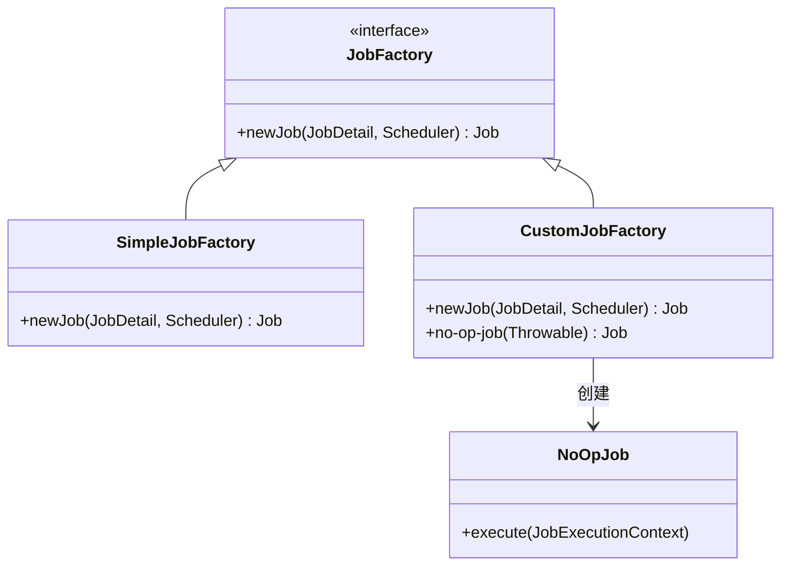

**图表来源**
- [job_factory.clj](file://src/metabase/task/job_factory.clj#L29-L45)

### 错误处理机制

当作业类无法加载时，系统会自动创建一个空操作（NoOp）作业：

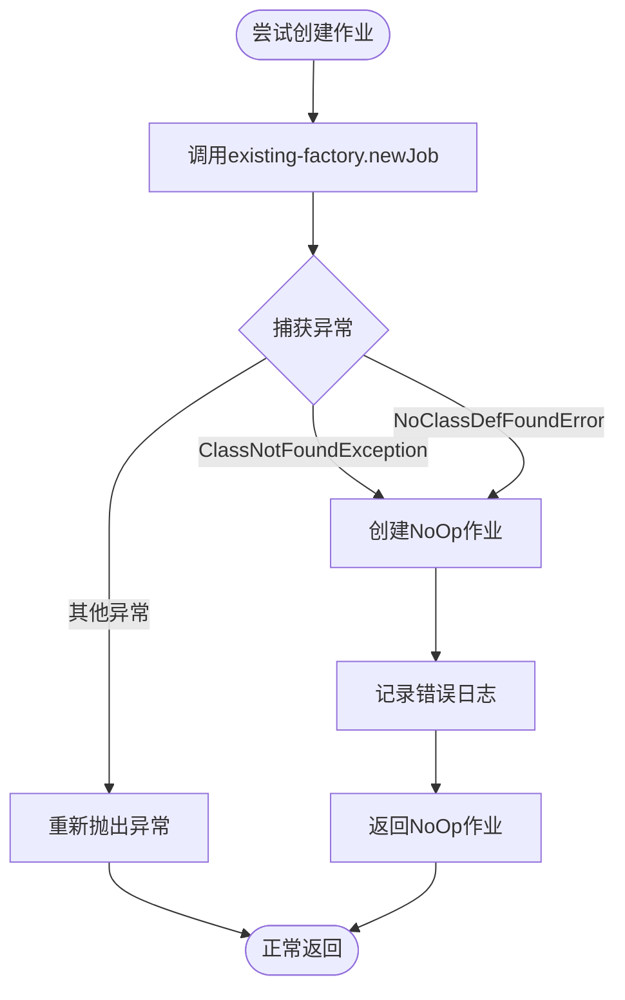

**图表来源**
- [job_factory.clj](file://src/metabase/task/job_factory.clj#L35-L45)

### 触发器监听器

为了防止NoOp作业被执行，系统还提供了触发器监听器：

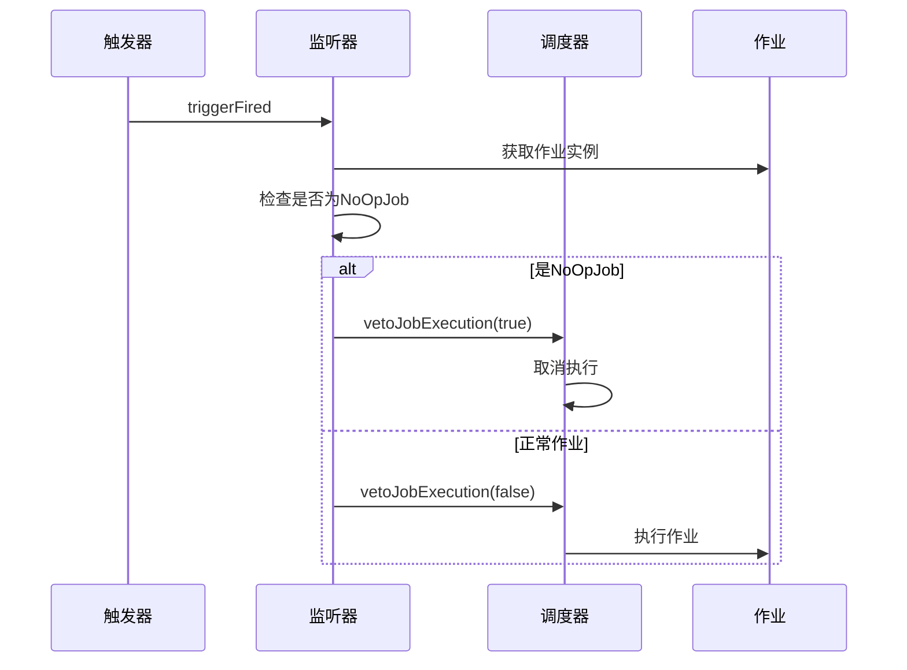

**图表来源**
- [job_factory.clj](file://src/metabase/task/job_factory.clj#L47-L65)

**章节来源**
- [job_factory.clj](file://src/metabase/task/job_factory.clj#L29-L65)

## 滚动更新场景下的错误恢复

### 滚动更新问题分析

在分布式环境中，滚动更新可能导致以下问题：

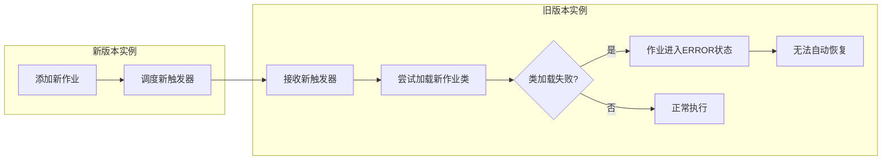

**图表来源**
- [impl.clj](file://src/metabase/task/impl.clj#L104-L115)

### 错误恢复机制

系统通过两个关键函数来解决滚动更新问题：

#### delete-jobs-with-no-class!函数

该函数扫描所有作业，删除那些无法加载对应类的作业：

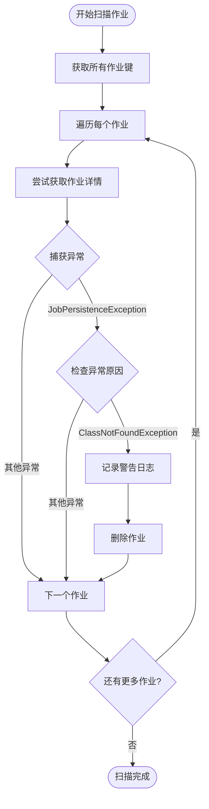

**图表来源**
- [impl.clj](file://src/metabase/task/impl.clj#L85-L100)

#### reset-errored-triggers!函数

该函数重置所有处于ERROR状态的触发器：

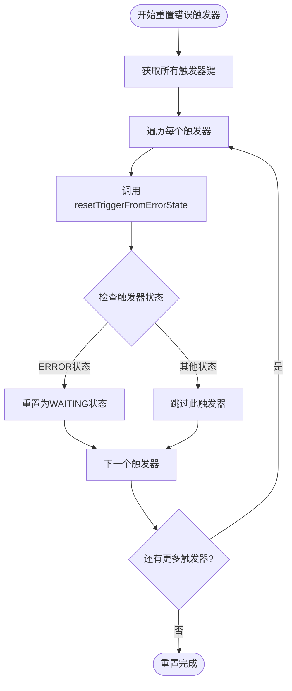

**图表来源**
- [impl.clj](file://src/metabase/task/impl.clj#L104-L115)

### 滚动更新最佳实践

1. **渐进式部署**：分批次更新实例，减少同时出现的版本差异
2. **作业兼容性**：确保新旧版本之间的作业接口兼容
3. **错误监控**：密切监控ERROR状态的作业数量
4. **回滚策略**：准备快速回滚机制应对部署问题

**章节来源**
- [impl.clj](file://src/metabase/task/impl.clj#L85-L115)

## 日志记录与异常处理最佳实践

### 日志级别与消息设计

Metabase在调度器初始化过程中使用了不同级别的日志记录：

| 日志级别 | 使用场景 | 示例消息 |
|---------|---------|---------|
| INFO | 关键操作完成 | "Task scheduler initialized into standby mode." |
| WARN | 潜在问题但可恢复 | "Deleting job %s due to class not found (%s)" |
| ERROR | 严重错误需要关注 | "Failed to load a job class. Usually this means an old version of metabase tried to run a job from a newer version" |

### 异常处理策略

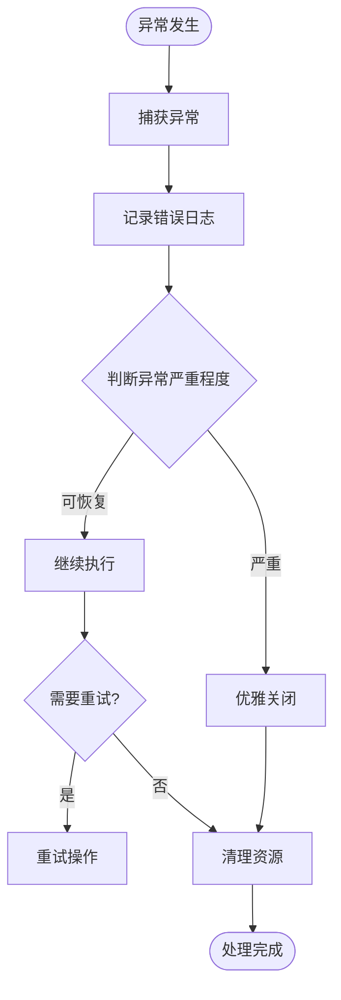

### 监控指标集成

系统集成了Prometheus监控指标：

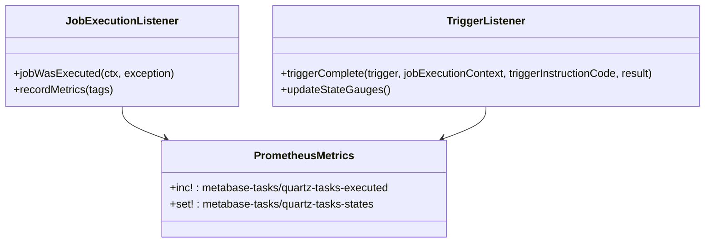

**图表来源**
- [quartz.clj](file://src/metabase/analytics/quartz.clj#L20-L45)
- [quartz.clj](file://src/metabase/analytics/quartz.clj#L55-L90)

**章节来源**
- [impl.clj](file://src/metabase/task/impl.clj#L78-L85)
- [job_factory.clj](file://src/metabase/task/job_factory.clj#L20-L30)
- [quartz.clj](file://src/metabase/analytics/quartz.clj#L20-L90)

## 性能考虑与优化建议

### 初始化性能优化

1. **延迟初始化**：只在真正需要时才初始化调度器
2. **并发安全**：使用原子操作确保线程安全
3. **资源预热**：提前加载常用类避免运行时加载开销
4. **内存管理**：及时释放不需要的资源

### 运行时性能监控

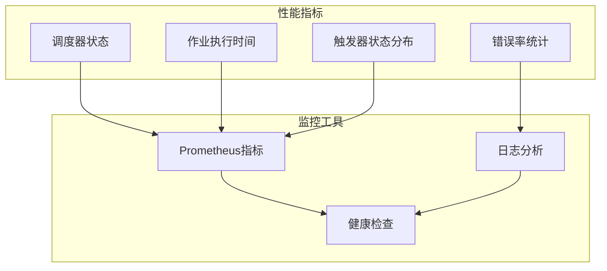

### 扩展性考虑

1. **水平扩展**：支持多实例部署时的状态同步
2. **垂直扩展**：优化单实例的资源利用率
3. **弹性设计**：在部分组件故障时保持核心功能可用

## 故障排除指南

### 常见问题诊断

| 问题症状 | 可能原因 | 解决方案 |
|---------|---------|---------|
| 调度器无法启动 | 数据库连接失败 | 检查数据库配置和连接池 |
| 作业执行失败 | 类加载异常 | 确认类路径包含所需依赖 |
| 触发器状态异常 | 滚动更新问题 | 运行reset-errored-triggers! |
| 作业丢失 | 类找不到异常 | 运行delete-jobs-with-no-class! |

### 调试技巧

1. **启用详细日志**：设置适当的日志级别进行调试
2. **使用监控工具**：通过Prometheus指标监控调度器状态
3. **手动测试**：使用临时调度器进行功能验证
4. **状态检查**：定期检查作业和触发器的状态

### 恢复程序

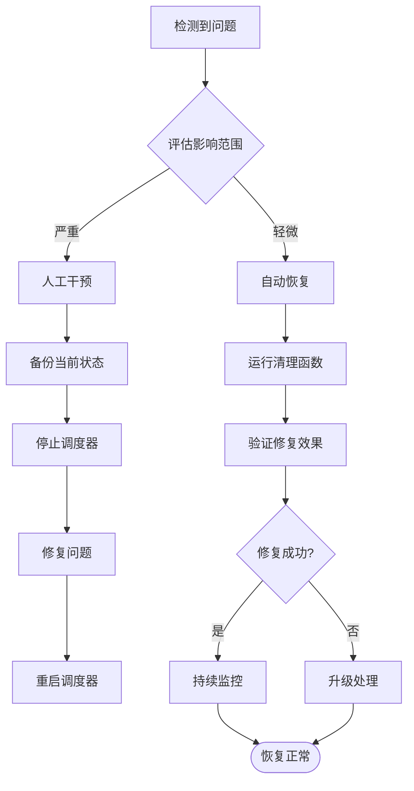

## 总结

Metabase的Quartz调度器初始化过程体现了现代分布式系统中任务调度的最佳实践。通过精心设计的错误恢复机制、完善的日志记录体系和灵活的配置选项，系统能够在各种复杂的部署环境中稳定运行。

关键要点包括：

1. **健壮的初始化流程**：通过多层检查和保护确保调度器的正确初始化
2. **智能的错误处理**：自动处理类加载失败和滚动更新问题
3. **全面的监控集成**：提供丰富的指标和日志用于运维监控
4. **灵活的配置选项**：支持多种数据库后端和部署场景

这种设计不仅保证了系统的稳定性，也为开发者提供了强大的任务调度能力，是构建可靠后台服务的重要参考。