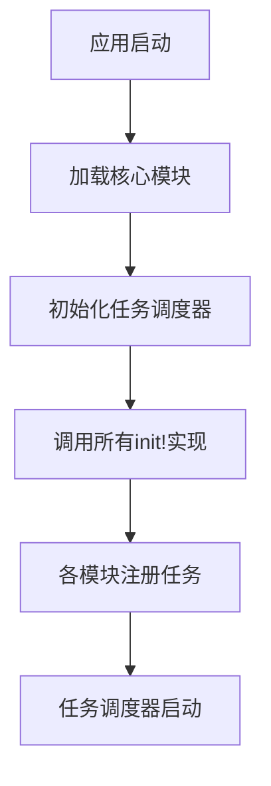
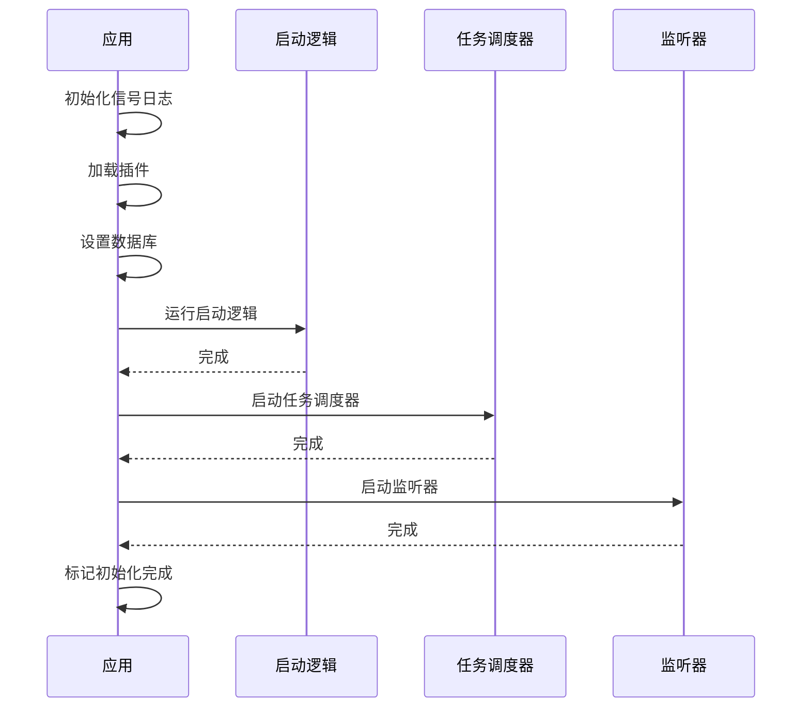

# 任务注册机制

<cite>
**本文档中引用的文件**  
- [metabase/task/impl.clj](file://src/metabase/task/impl.clj)
- [metabase/core/core.clj](file://src/metabase/core/core.clj)
- [metabase/startup/core.clj](file://src/metabase/startup/core.clj)
- [metabase/analytics/task/send_anonymous_stats.clj](file://src/metabase/analytics/task/send_anonymous_stats.clj)
- [metabase/notification/task/send.clj](file://src/metabase/notification/task/send.clj)
- [metabase/sync/task/sync_databases.clj](file://src/metabase/sync/task/sync_databases.clj)
- [metabase/core/init.clj](file://src/metabase/core/init.clj)
- [metabase/analytics/init.clj](file://src/metabase/analytics/init.clj)
- [metabase/notification/init.clj](file://src/metabase/notification/init.clj)
- [metabase/sync/init.clj](file://src/metabase/sync/init.clj)
</cite>

## 目录
1. [引言](#引言)
2. [任务注册机制概述](#任务注册机制概述)
3. [基于defmulti的init!多态分发系统](#基于defmulti的init!多态分发系统)
4. [模块任务注册实现](#模块任务注册实现)
5. [任务注册调用时机与执行顺序](#任务注册调用时机与执行顺序)
6. [任务注册安全性考虑](#任务注册安全性考虑)
7. [任务注册最佳实践](#任务注册最佳实践)
8. [结论](#结论)

## 引言
Metabase是一个开源的数据分析平台，其任务注册机制是系统初始化过程中的关键组成部分。该机制通过基于`defmulti`的`init!`多态分发系统，实现了各个模块在应用启动时注册自身任务的功能。本文档详细说明了这一机制的工作原理、实现方式、调用时机、安全性考虑以及最佳实践，为开发者提供了全面的理解和指导。

## 任务注册机制概述
Metabase的任务注册机制基于Quartzite调度框架，通过`defmulti`定义的`init!`多态函数实现。该机制允许各个模块在应用启动时注册自己的后台任务，确保系统功能的完整性和可扩展性。任务注册的核心思想是将任务的定义和调度分离，通过多态分发机制实现灵活的任务管理。



**Diagram sources**
- [metabase/task/impl.clj](file://src/metabase/task/impl.clj#L54-L81)
- [metabase/core/core.clj](file://src/metabase/core/core.clj#L202-L236)

## 基于defmulti的init!多态分发系统
Metabase使用Clojure的`defmulti`宏定义了一个名为`init!`的多态函数，作为任务注册的核心机制。这个多态函数的分派值是关键字类型，允许各个模块通过实现`defmethod`来注册自己的任务。

```clojure
(defmulti init!
  "Initialize (i.e., schedule) Job(s) with a given name. All implementations of this method are called once and only
  once when the Quartz task scheduler is initialized. Task namespaces (`metabase.<module>.task.*`) should add new
  implementations of this method to schedule the jobs they define (i.e., with a call to `schedule-task!`.)"
  {:arglists '([job-name-string])}
  keyword)
```

`init!`函数的分派函数是`keyword`，这意味着所有实现都必须使用关键字作为分派值。按照惯例，这些关键字应该是命名空间化的，并且保持驼峰命名法，以确保唯一性和一致性。

`init!`函数的实现由`init-tasks!`函数调用，该函数遍历所有`init!`的实现方法并依次执行：

```clojure
(defn- init-tasks!
  "Call all implementations of `init!`"
  []
  (doseq [[k f] (methods init!)]
    (try
      (log/info "Initializing task" (u/format-color 'green (name k)) (u/emoji "📆"))
      (f k)
      (catch Throwable e
        (log/errorf e "Error initializing task %s" k)))))
```

这种设计模式具有以下优点：
- **灵活性**：各个模块可以独立地注册自己的任务，无需修改核心代码。
- **可扩展性**：新的模块可以轻松地添加任务注册逻辑。
- **解耦**：任务定义和调度逻辑分离，提高了代码的可维护性。

**Section sources**
- [metabase/task/impl.clj](file://src/metabase/task/impl.clj#L54-L81)

## 模块任务注册实现
各个模块通过在各自的`task`命名空间中实现`init!`方法来注册任务。以下是一些具体的实现示例：

### 分析模块任务注册
分析模块通过`metabase.analytics.task.send_anonymous_stats`命名空间注册了一个发送匿名统计信息的任务：

```clojure
(defmethod task/init! ::SendAnonymousUsageStats
  [_]
  (let [job      (jobs/build
                  (jobs/of-type SendAnonymousUsageStats)
                  (jobs/with-identity (jobs/key job-key)))
        schedule (cron/cron-schedule
                  (format "0 %d %d * * ? *"
                          (rand-int 60)
                          (rand-int 24)))
        trigger  (triggers/build
                  (triggers/with-identity (triggers/key trigger-key))
                  (triggers/start-now)
                  (triggers/with-schedule schedule))]
    (task/schedule-task! job trigger)))
```

这个实现创建了一个定时任务，每天在随机的小时和分钟执行，用于发送匿名使用统计信息。

### 通知模块任务注册
通知模块通过`metabase.notification.task.send`命名空间注册了发送通知的任务：

```clojure
(defmethod task/init! ::SendNotifications [_]
  (let [send-notification-job              (jobs/build
                                            (jobs/with-identity send-notification-job-key)
                                            (jobs/with-description "Send Notification")
                                            (jobs/of-type SendNotification)
                                            (jobs/store-durably))
        init-notification-triggers-job     (jobs/build
                                            (jobs/of-type InitNotificationTriggers)
                                            (jobs/with-identity (jobs/key "metabase.task.notification.init-notification-triggers.job"))
                                            (jobs/store-durably))
        init-notification-triggers-trigger (triggers/build
                                            (triggers/with-identity (triggers/key "metabase.task.notification.init-notification-triggers.trigger"))
                                            (triggers/start-now))]
    (task/add-job! send-notification-job)
    (task/schedule-task! init-notification-triggers-job init-notification-triggers-trigger)))
```

这个实现注册了两个任务：一个是发送通知的主任务，另一个是初始化通知触发器的辅助任务。

### 同步模块任务注册
同步模块通过`metabase.sync.task.sync_databases`命名空间注册了数据库同步任务：

```clojure
(defmethod task/init! ::SyncDatabases
  [_]
  (job-init)
  (randomize-db-schedules-if-needed!))
```

这个实现首先初始化了同步和分析任务的作业，然后随机化了数据库的调度时间，以避免所有数据库同时进行同步操作。

**Section sources**
- [metabase/analytics/task/send_anonymous_stats.clj](file://src/metabase/analytics/task/send_anonymous_stats.clj#L30-L39)
- [metabase/notification/task/send.clj](file://src/metabase/notification/task/send.clj#L200-L211)
- [metabase/sync/task/sync_databases.clj](file://src/metabase/sync/task/sync_databases.clj#L360-L367)

## 任务注册调用时机与执行顺序
任务注册的调用时机和执行顺序是Metabase应用启动过程中的关键环节。整个过程遵循严格的顺序，确保系统稳定性和功能完整性。

### 应用启动流程
Metabase的应用启动流程如下：

1. **初始化信号日志**：设置信号处理和日志记录。
2. **加载插件**：加载所有可用的插件。
3. **设置数据库**：验证数据库连接并执行必要的迁移。
4. **运行启动逻辑**：执行所有`def-startup-logic!`的实现。
5. **启动任务调度器**：初始化并启动Quartz任务调度器。
6. **启动监听器**：启动所有消息队列监听器。
7. **标记初始化完成**：通知系统初始化完成。



**Diagram sources**
- [metabase/core/core.clj](file://src/metabase/core/core.clj#L151-L176)
- [metabase/core/core.clj](file://src/metabase/core/core.clj#L202-L236)

### 任务注册执行顺序
任务注册的具体执行顺序如下：

1. **加载核心模块**：首先加载`metabase.core.init`模块，该模块负责加载所有需要在系统启动时加载的命名空间。
2. **初始化任务调度器**：调用`init-scheduler!`函数初始化Quartz调度器。
3. **调用init!实现**：遍历所有`init!`的实现方法并依次执行。
4. **启动调度器**：调用`start-scheduler!`函数启动调度器，开始执行已注册的任务。

这种顺序确保了任务在系统完全初始化后才开始执行，避免了因依赖未准备好而导致的错误。

**Section sources**
- [metabase/core/core.clj](file://src/metabase/core/core.clj#L202-L236)
- [metabase/task/impl.clj](file://src/metabase/task/impl.clj#L100-L120)

## 任务注册安全性考虑
任务注册机制在设计时充分考虑了安全性，包括异常处理和日志记录等方面。

### 异常处理
每个`init!`实现的调用都被包裹在`try-catch`块中，确保即使某个任务注册失败，也不会影响其他任务的注册：

```clojure
(doseq [[k f] (methods init!)]
  (try
    (log/info "Initializing task" (u/format-color 'green (name k)) (u/emoji "📆"))
    (f k)
    (catch Throwable e
      (log/errorf e "Error initializing task %s" k))))
```

这种设计模式确保了系统的健壮性，即使某个模块的任务注册出现异常，整个系统仍然可以正常启动。

### 日志记录
任务注册过程中的每个步骤都有详细的日志记录，便于调试和监控：

- **任务初始化**：记录每个任务的初始化过程。
- **错误信息**：记录任务注册失败的详细错误信息。
- **执行时间**：记录任务注册的执行时间，便于性能分析。

```clojure
(log/info "Initializing task" (u/format-color 'green (name k)) (u/emoji "📆"))
```

这些日志信息对于系统维护和故障排查非常重要。

**Section sources**
- [metabase/task/impl.clj](file://src/metabase/task/impl.clj#L70-L81)

## 任务注册最佳实践
为了确保任务注册的正确性和可维护性，遵循以下最佳实践：

### 命名约定
- **分派关键字**：使用命名空间化的关键字，保持驼峰命名法，如`::SendAnonymousUsageStats`。
- **任务名称**：任务名称应简洁明了，反映任务的功能。
- **触发器名称**：触发器名称应包含任务名称和数据库ID等信息，确保唯一性。

### 依赖管理
- **模块初始化**：确保任务所在的模块在`<module>.init`中被正确加载。
- **核心初始化**：确保`<module>.init`被添加到`core.init`中。
- **依赖顺序**：注意任务之间的依赖关系，确保依赖的任务先于被依赖的任务注册。

### 代码组织
- **单一职责**：每个任务文件应只包含一个任务的定义和注册逻辑。
- **文档注释**：为每个任务提供详细的文档注释，说明任务的功能和配置选项。
- **测试覆盖**：为任务注册逻辑编写单元测试，确保其正确性。

### 性能考虑
- **异步执行**：对于耗时较长的初始化逻辑，使用`quick-task/submit-task!`在后台执行。
- **资源管理**：合理管理数据库连接和其他资源，避免资源泄漏。
- **错误恢复**：实现错误恢复机制，确保任务在失败后能够自动重试。

**Section sources**
- [metabase/task/impl.clj](file://src/metabase/task/impl.clj#L54-L81)
- [metabase/analytics/init.clj](file://src/metabase/analytics/init.clj#L1-L4)
- [metabase/notification/init.clj](file://src/metabase/notification/init.clj#L1-L10)
- [metabase/sync/init.clj](file://src/metabase/sync/init.clj#L1-L8)

## 结论
Metabase的任务注册机制通过基于`defmulti`的`init!`多态分发系统，实现了灵活、可扩展的任务管理。该机制在应用启动过程中按照严格的顺序执行，确保了系统的稳定性和功能完整性。通过合理的异常处理和日志记录，提高了系统的健壮性和可维护性。遵循最佳实践，可以确保任务注册的正确性和高效性，为Metabase的稳定运行提供有力支持。