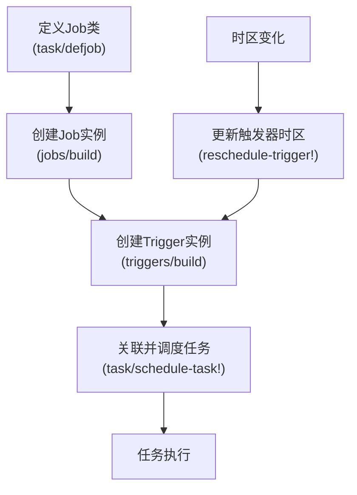
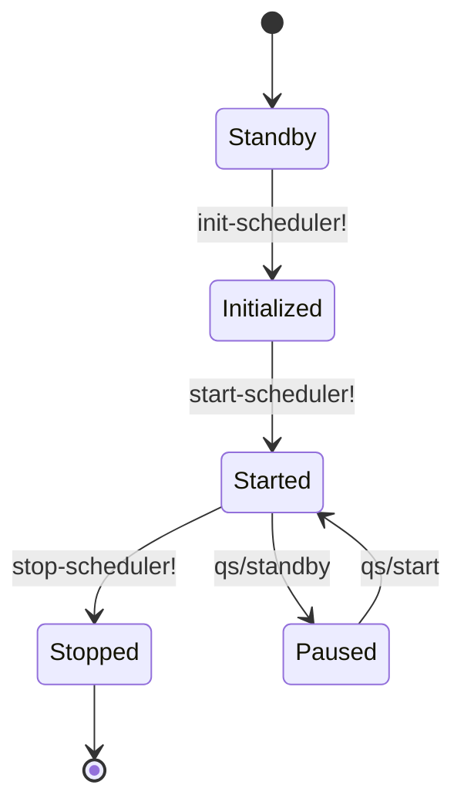
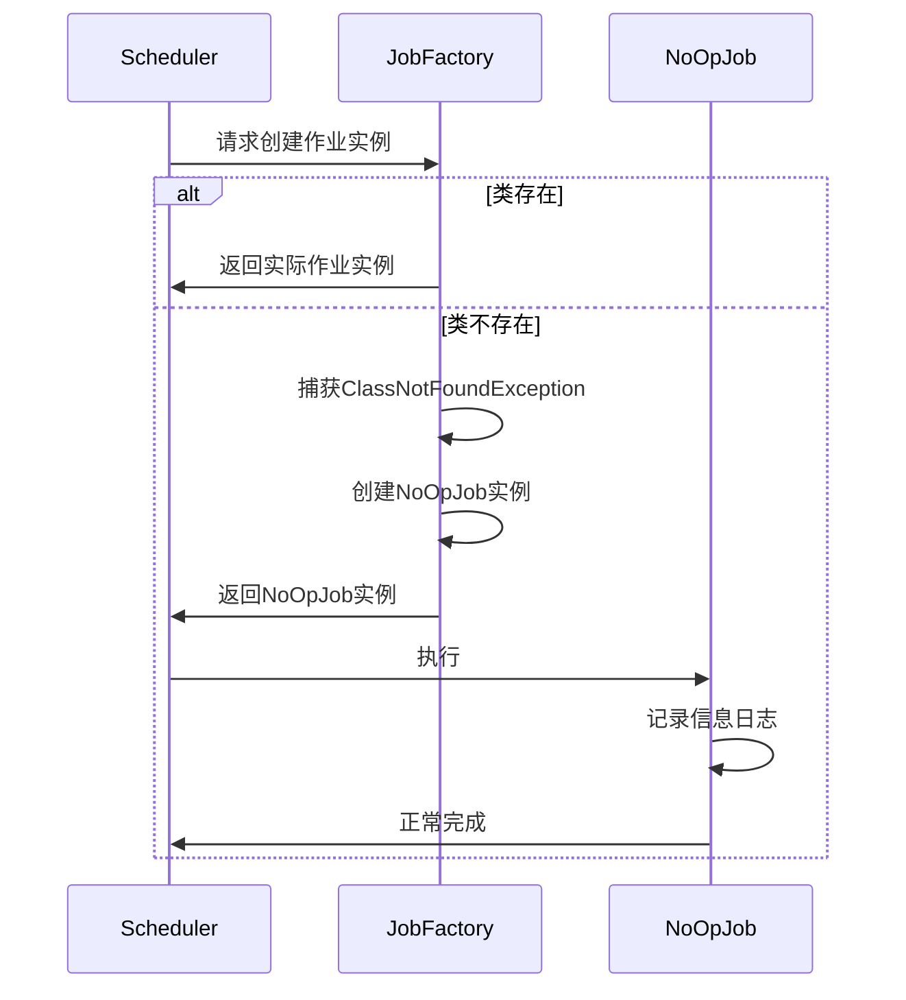

# 任务注册生命周期

<cite>
**本文档中引用的文件**   
- [impl.clj](file://src/metabase/task/impl.clj)
- [core.clj](file://src/metabase/task/core.clj)
- [QUARTZ.md](file://src/metabase/task/QUARTZ.md)
- [job_factory.clj](file://src/metabase/task/job_factory.clj)
- [send_anonymous_stats.clj](file://src/metabase/analytics/task/send_anonymous_stats.clj)
- [session_cleanup.clj](file://src/metabase/session/task/session_cleanup.clj)
- [send.clj](file://src/metabase/notification/task/send.clj)
- [send_pulses.clj](file://src/metabase/pulse/task/send_pulses.clj)
</cite>

## 目录
1. [任务初始化机制](#任务初始化机制)
2. [任务调度流程](#任务调度流程)
3. [QUARTZ任务示例分析](#quartz任务示例分析)
4. [任务启动与停止](#任务启动与停止)
5. [状态转换与错误处理](#状态转换与错误处理)

## 任务初始化机制

Metabase使用多态分发机制`defmethod task/init!`来初始化后台任务。该机制通过Clojure的多方法（multimethod）实现，允许各个模块在系统启动时注册自己的任务。

`init!`多方法的分发值为关键字类型，按照约定使用命名空间关键字版本的任务名称，且保持驼峰命名法。所有`init!`方法的实现会在Quartz任务调度器初始化时被调用一次且仅一次。

`init-tasks!`函数负责遍历并安全调用所有`init!`方法的实现。该函数通过`(methods init!)`获取所有已注册的方法，然后逐个调用。在调用过程中，系统会记录初始化日志，并在发生异常时进行错误捕获和记录，确保一个任务的初始化失败不会影响其他任务的初始化。

任务初始化的典型模式是在模块的`task`命名空间中实现`defmethod task/init!`，然后将该命名空间添加到相应模块的`init`命名空间中，最终由核心初始化流程统一调用。

**Section sources**
- [impl.clj](file://src/metabase/task/impl.clj#L54-L81)

## 任务调度流程

`schedule-task!`函数是任务调度的核心逻辑，负责将给定的Job和Trigger添加到调度器中。其执行逻辑如下：首先尝试直接调度任务，如果调度器中已存在同名任务（抛出`ObjectAlreadyExistsException`异常），则进入回退机制`reschedule-task!`。

`reschedule-task!`函数处理已存在任务的重新调度。它会查找与新触发器同名的现有触发器，如果找到则替换；否则选择一个随机的现有触发器进行替换。这种机制确保了任务配置更新时的平滑过渡。

在任务调度过程中，系统还实现了多种保障机制：
- `delete-jobs-with-no-class!`：删除那些已调度但其类不再可用的任务，防止因类缺失导致的调度错误
- `reset-errored-triggers!`：在启动时自动将处于`ERROR`状态的触发器重置为`WAITING`状态，解决滚动更新时新旧实例兼容性问题

**Section sources**
- [impl.clj](file://src/metabase/task/impl.clj#L181-L215)
- [impl.clj](file://src/metabase/task/impl.clj#L78-L104)

## QUARTZ任务示例分析

结合QUARTZ.md文档中的示例，我们可以深入理解Job和Trigger的创建、关联和调度过程。

以`send_anonymous_stats.clj`中的匿名统计任务为例，任务注册过程如下：
1. 使用`task/defjob`定义`SendAnonymousUsageStats`作业类
2. 创建Job实例，指定作业类型、标识和描述
3. 创建Trigger实例，定义触发器标识、启动时间和调度计划（使用cron表达式）
4. 调用`task/schedule-task!`将Job和Trigger关联并注册到调度器

对于更复杂的任务如通知系统中的`SendNotifications`，采用了更高级的模式：
- 使用`add-job!`单独添加持久化作业
- 为初始化任务创建一次性触发器，确保在启动时执行初始化逻辑
- 实现`update-send-notification-triggers-timezone!`函数，在时区变化时动态更新所有相关触发器的时区设置

这些示例展示了Metabase任务系统的灵活性，支持从简单周期性任务到复杂状态管理任务的各种场景。

**Diagram sources **
- [send_anonymous_stats.clj](file://src/metabase/analytics/task/send_anonymous_stats.clj#L1-L40)
- [send.clj](file://src/metabase/notification/task/send.clj#L1-L211)

**Section sources**
- [QUARTZ.md](file://src/metabase/task/QUARTZ.md#L0-L159)
- [send_anonymous_stats.clj](file://src/metabase/analytics/task/send_anonymous_stats.clj#L1-L40)
- [send.clj](file://src/metabase/notification/task/send.clj#L1-L211)

## 任务启动与停止

任务调度器的生命周期由`start-scheduler!`和`stop-scheduler!`函数管理。

`start-scheduler!`函数启动任务调度器，使任务开始运行。该函数首先检查是否禁用了调度器（通过环境变量`MB_DISABLE_SCHEDULER`），如果未禁用，则执行以下步骤：
1. 调用`init-scheduler!`初始化调度器
2. 调用`qs/start`启动调度器
3. 记录启动日志

`init-scheduler!`函数负责调度器的初始化，包括：
- 设置JDBC后端属性
- 初始化Quartz调度器实例
- 将调度器置于待机模式
- 添加自定义作业工厂
- 删除无类的任务
- 重置错误的触发器
- 调用`init-tasks!`初始化所有任务

`stop-scheduler!`函数停止调度器并关闭所有正在执行的任务。它通过`reset-vals!`原子操作获取并重置调度器实例，然后调用`qs/shutdown`安全关闭调度器。

**Diagram sources **
- [impl.clj](file://src/metabase/task/impl.clj#L128-L160)

**Section sources**
- [impl.clj](file://src/metabase/task/impl.clj#L128-L160)

## 状态转换与错误处理

Metabase任务系统实现了完善的错误处理机制。`job-factory.clj`中的自定义作业工厂是关键组件，它解决了滚动更新期间新旧版本实例兼容性问题。

当较旧版本的Metabase实例尝试运行较新版本定义的任务时，由于类路径中找不到相应的作业类，会抛出`ClassNotFoundException`。自定义作业工厂捕获此类异常，并返回一个`NoOpJob`（空操作作业），而不是让触发器进入不可恢复的`ERROR`状态。这确保了系统的稳定性，避免了因单个任务问题导致整个调度系统失效。

`NoOpJob`的实现非常简单，只记录一条信息日志，然后正常完成。同时，系统会记录错误日志，便于运维人员发现问题。

此外，系统还提供了`rerun-on-error`宏，用于在任务执行失败时自动重试。该宏捕获异常，记录错误日志，然后抛出`JobExecutionException`并设置`refireImmediately`为`true`，指示Quartz立即重新执行任务。

这些机制共同构成了一个健壮的任务调度系统，能够在各种异常情况下保持稳定运行。

**Diagram sources **
- [job_factory.clj](file://src/metabase/task/job_factory.clj#L1-L65)

**Section sources**
- [job_factory.clj](file://src/metabase/task/job_factory.clj#L1-L65)
- [impl.clj](file://src/metabase/task/impl.clj#L331-L368)