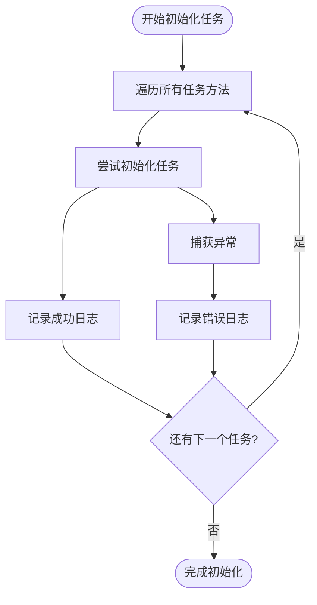
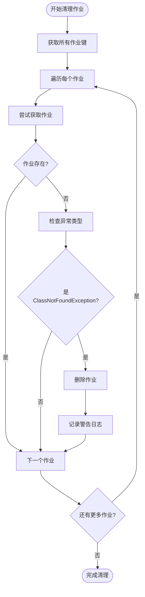
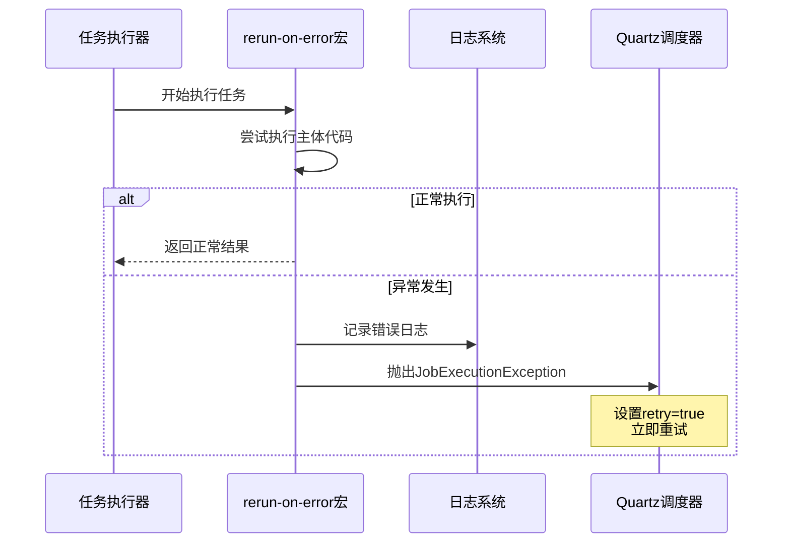
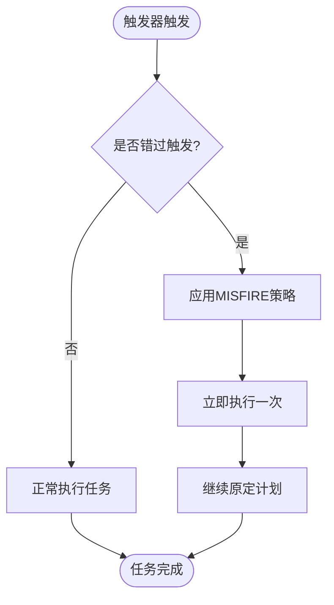
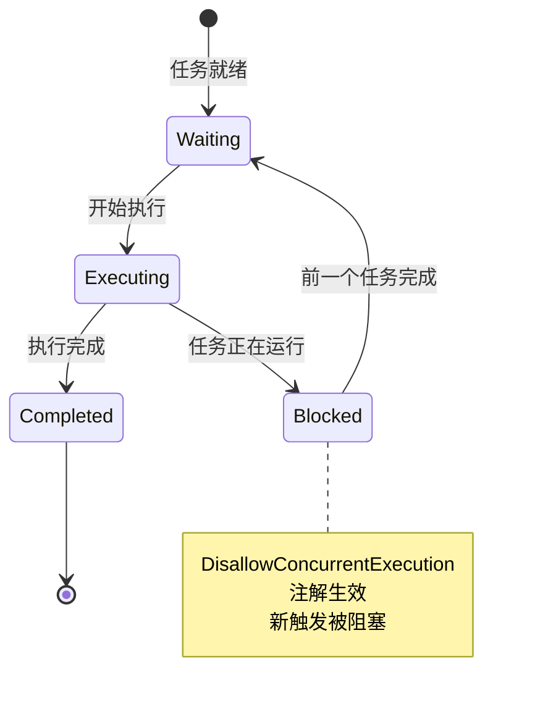
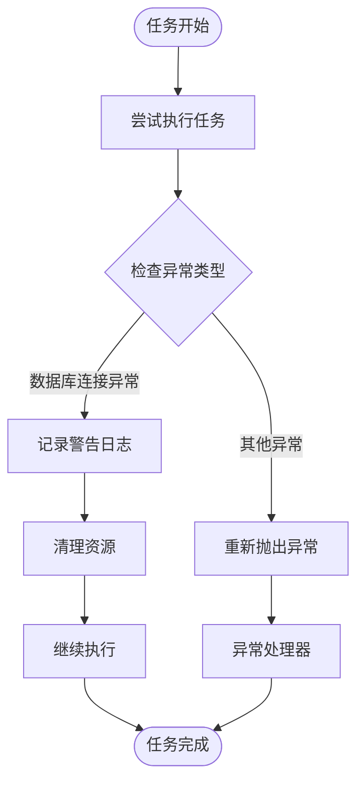
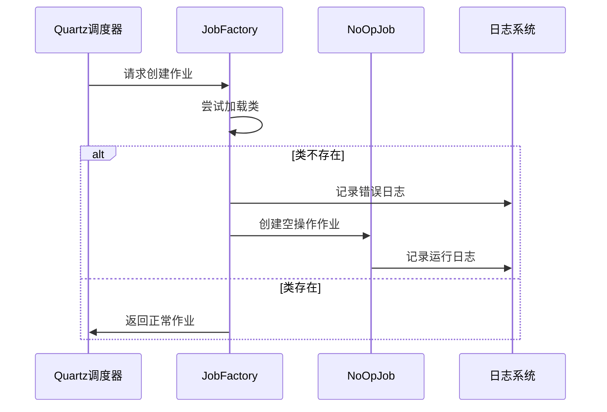
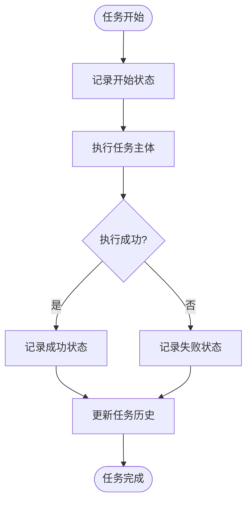

# 任务错误处理与恢复

<cite>
**本文档中引用的文件**
- [src/metabase/task/impl.clj](file://src/metabase/task/impl.clj)
- [src/metabase/task/job_factory.clj](file://src/metabase/task/job_factory.clj)
- [src/metabase/task/QUARTZ.md](file://src/metabase/task/QUARTZ.md)
- [src/metabase/task/bootstrap.clj](file://src/metabase/task/bootstrap.clj)
- [src/metabase/util/retry.clj](file://src/metabase/util/retry.clj)
- [src/metabase/sync/task/sync_databases.clj](file://src/metabase/sync/task/sync_databases.clj)
- [src/metabase/notification/task/send.clj](file://src/metabase/notification/task/send.clj)
- [src/metabase/pulse/task/send_pulses.clj](file://src/metabase/pulse/task/send_pulses.clj)
</cite>

## 目录
1. [概述](#概述)
2. [任务初始化错误处理机制](#任务初始化错误处理机制)
3. [rerun-on-error宏实现原理](#rerun-on-error宏实现原理)
4. [QUARTZ.md中的错误处理策略](#quartz-md中的错误处理策略)
5. [DisallowConcurrentExecution注解的作用](#disallowconcurrentexecution注解的作用)
6. [持久化异常处理最佳实践](#持久化异常处理最佳实践)
7. [类找不到异常处理机制](#类找不到异常处理机制)
8. [任务历史记录与监控](#任务历史记录与监控)
9. [故障排除指南](#故障排除指南)
10. [总结](#总结)

## 概述

Metabase的任务系统基于Quartz调度器构建，提供了完善的错误处理和恢复机制。该系统通过多层次的异常捕获、自动重试、任务隔离和状态监控等机制，确保单个任务的失败不会影响整个系统的稳定性。

核心特性包括：
- **任务初始化保护**：init-tasks!中的try-catch块确保任务加载失败不影响系统启动
- **智能重试机制**：rerun-on-error宏提供立即重试功能
- **并发控制**：DisallowConcurrentExecution注解防止任务堆积
- **异常隔离**：NoOpJob机制处理类找不到等异常情况
- **状态恢复**：自动重置ERROR状态的触发器

## 任务初始化错误处理机制

### init-tasks!中的异常捕获

Metabase在任务初始化阶段实现了严格的错误隔离机制，确保单个任务的失败不会影响整体启动流程。



**图表来源**
- [src/metabase/task/impl.clj](file://src/metabase/task/impl.clj#L78-L88)

init-tasks!函数通过以下方式实现错误隔离：

1. **逐个任务处理**：使用doseq遍历所有任务方法
2. **独立异常捕获**：每个任务都在单独的try-catch块中执行
3. **详细错误记录**：记录任务名称和完整异常堆栈
4. **继续执行其他任务**：即使某个任务失败，也会继续初始化其他任务

这种设计确保了：
- 单个任务失败不会导致系统无法启动
- 所有失败的任务都能被正确记录和诊断
- 系统能够尽可能多地完成任务初始化

**章节来源**
- [src/metabase/task/impl.clj](file://src/metabase/task/impl.clj#L78-L88)

### 删除不存在类的任务

系统还实现了清理机制，删除那些由于类路径变化而无法加载的任务：



**图表来源**
- [src/metabase/task/impl.clj](file://src/metabase/task/impl.clj#L90-L104)

**章节来源**
- [src/metabase/task/impl.clj](file://src/metabase/task/impl.clj#L90-L104)

## rerun-on-error宏实现原理

### 宏定义与工作原理

rerun-on-error宏是Metabase提供的一个强大工具，用于在任务执行失败时自动重试。该宏通过捕获异常并抛出特殊的JobExecutionException来实现这一功能。



**图表来源**
- [src/metabase/task/impl.clj](file://src/metabase/task/impl.clj#L343-L353)

### JobExecutionException的特殊行为

rerun-on-error宏的核心在于它抛出的JobExecutionException具有特殊的重试标志：

1. **异常包装**：捕获原始异常并重新包装
2. **重试标志**：设置true参数指示需要重试
3. **消息传递**：保留原始错误信息便于调试
4. **立即重试**：与带退避的重试不同，这是立即重试

这种设计适用于：
- 瞬态网络错误
- 资源暂时不可用
- 其他可预期的临时故障

但不适用于：
- 持久性数据错误
- 业务逻辑验证失败
- 配置问题

**章节来源**
- [src/metabase/task/impl.clj](file://src/metabase/task/impl.clj#L343-L353)

## QUARTZ.md中的错误处理策略

### MISFIRE处理策略

Quartz提供了多种MISFIRE（错过触发）处理指令，Metabase根据不同的任务需求选择合适的策略：

| 处理指令 | 行为描述 | 适用场景 |
|---------|---------|---------|
| IGNORE_MISFIRE_POLICY | 忽略错过的时间点，按原计划继续 | 高频任务，错过时间点无影响 |
| SMART_POLICY | 根据任务类型智能处理错过的时间 | 默认策略，适用于大多数任务 |
| FIRE_ONCE_NOW | 立即执行一次错过的时间点，然后继续原计划 | 关键任务，需要及时处理 |
| DO_NOTHING | 完全忽略错过的时间点 | 不重要的任务，避免堆积 |

### 时间敏感任务的Misfire处理

对于时间敏感的任务，如脉冲发送和通知订阅，系统采用FIRE_ONCE_NOW策略：



**图表来源**
- [src/metabase/pulse/task/send_pulses.clj](file://src/metabase/pulse/task/send_pulses.clj#L89-L91)

**章节来源**
- [src/metabase/task/QUARTZ.md](file://src/metabase/task/QUARTZ.md#L85-L95)

## DisallowConcurrentExecution注解的作用

### 防止任务堆积的关键机制

DisallowConcurrentExecution注解是Metabase防止任务堆积的重要机制。当这个注解应用于任务类时，Quartz会确保同一任务不会同时运行多个实例。



### 实际应用场景

多个任务类使用了这个注解来防止并发执行：

1. **数据库同步任务**：防止多个同步操作同时访问数据库
2. **通知发送任务**：避免重复发送相同的通知
3. **脉冲发送任务**：确保脉冲内容的一致性

### 对任务调度的影响

DisallowConcurrentExecution的影响包括：

- **触发器积压**：新的触发器会被标记为MISFIRED而不是执行
- **资源保护**：防止共享资源的竞争条件
- **任务隔离**：确保每个任务实例独立运行

**章节来源**
- [src/metabase/sync/task/sync_databases.clj](file://src/metabase/sync/task/sync_databases.clj#L110-L111)
- [src/metabase/pulse/task/send_pulses.clj](file://src/metabase/pulse/task/send_pulses.clj#L244-L245)

## 持久化异常处理最佳实践

### 数据库连接异常处理

Metabase在任务执行过程中实现了多层的数据库连接异常处理：



### 异常分类与处理策略

| 异常类型 | 处理策略 | 示例场景 |
|---------|---------|---------|
| ClassNotFoundException | 自动跳过，记录警告 | 类路径变更，旧版本实例 |
| JobPersistenceException | 清理无效作业 | 数据库损坏或结构变更 |
| ObjectAlreadyExistsException | 重新调度现有作业 | 重复注册任务 |
| InterruptedException | 安全中断任务 | 系统关闭或取消请求 |

### 连接池管理

系统通过专门的连接提供者管理数据库连接：

- **连接池隔离**：使用独立的连接池避免干扰主应用
- **自动回收**：确保连接在任务完成后正确归还
- **超时处理**：防止长时间占用连接

**章节来源**
- [src/metabase/task/bootstrap.clj](file://src/metabase/task/bootstrap.clj#L15-L30)

## 类找不到异常处理机制

### NoOpJob机制

当Quartz尝试执行一个不存在的类时，系统会自动降级到NoOpJob（空操作作业），避免系统崩溃。



**图表来源**
- [src/metabase/task/job_factory.clj](file://src/metabase/task/job_factory.clj#L29-L42)

### 滚动升级支持

NoOpJob机制特别适用于滚动升级场景：

1. **新版本部署**：添加新的任务类
2. **旧版本实例**：尝试执行新任务时找不到类
3. **自动降级**：系统自动创建NoOpJob
4. **无缝切换**：新版本实例接管任务执行

### 触发器监听器

系统还提供了专门的触发器监听器来过滤NoOpJob的执行：

- **vetoJobExecution**：阻止NoOpJob的执行
- **triggerMisfired**：处理错过触发的情况
- **triggerComplete**：清理相关状态

**章节来源**
- [src/metabase/task/job_factory.clj](file://src/metabase/task/job_factory.clj#L43-L65)

## 任务历史记录与监控

### with-task-history宏

Metabase提供了强大的任务历史记录功能，可以跟踪任务的执行状态和异常信息：



### 异常信息序列化

系统能够将异常信息序列化为JSON格式，便于存储和查询：

- **异常类名**：记录具体的异常类型
- **错误消息**：包含详细的错误描述
- **堆栈跟踪**：保存完整的调用栈信息
- **上下文数据**：附加的诊断信息

### 监控指标

任务历史记录提供了丰富的监控指标：

- **执行时间**：任务耗时统计
- **成功率**：任务执行成功率
- **失败模式**：常见失败原因分析
- **性能趋势**：随时间变化的性能指标

**章节来源**
- [src/metabase/task_history/models/task_history.clj](file://src/metabase/task_history/models/task_history.clj#L140-L185)

## 故障排除指南

### 常见错误场景与解决方案

#### 1. 任务初始化失败

**症状**：系统启动时某些任务未被初始化

**排查步骤**：
1. 检查任务初始化日志
2. 验证任务命名空间的正确性
3. 确认依赖服务的可用性

**解决方案**：
- 修复任务定义中的语法错误
- 添加缺失的依赖项
- 调整任务优先级顺序

#### 2. 任务执行异常

**症状**：任务执行过程中抛出异常

**排查步骤**：
1. 查看任务历史记录
2. 分析异常堆栈信息
3. 检查外部依赖状态

**解决方案**：
- 使用rerun-on-error宏处理瞬态错误
- 实现自定义异常处理器
- 调整任务配置参数

#### 3. 任务堆积问题

**症状**：任务队列持续增长，处理速度下降

**排查步骤**：
1. 检查DisallowConcurrentExecution设置
2. 分析任务执行时间分布
3. 监控系统资源使用情况

**解决方案**：
- 优化任务执行效率
- 调整并发限制
- 实现任务优先级调度

### 调试工具与技巧

#### 1. 启用详细日志

```clojure
(log/set-level! :debug)
```

#### 2. 查询任务状态

```clojure
(task/scheduler-info)
```

#### 3. 检查特定任务

```clojure
(task/job-info "任务名称")
```

#### 4. 手动触发任务

```clojure
(task/trigger-now! "任务键")
```

## 总结

Metabase的任务系统通过多层次的错误处理机制，确保了系统的稳定性和可靠性：

### 核心优势

1. **健壮的初始化机制**：init-tasks!中的异常隔离确保系统启动成功
2. **智能重试策略**：rerun-on-error宏提供灵活的重试选项
3. **并发控制**：DisallowConcurrentExecution防止资源竞争
4. **优雅降级**：NoOpJob机制处理类路径问题
5. **完善监控**：任务历史记录提供全面的诊断信息

### 最佳实践建议

1. **合理使用rerun-on-error**：仅对瞬态错误使用立即重试
2. **正确配置MISFIRE策略**：根据任务重要性选择合适的处理方式
3. **实施适当的并发控制**：使用DisallowConcurrentExecution保护关键资源
4. **建立完善的监控体系**：利用任务历史记录进行问题诊断
5. **定期维护任务状态**：清理无效的作业和触发器

通过遵循这些原则和最佳实践，可以构建一个高可用、易维护的任务系统，为Metabase的各项功能提供稳定可靠的支持。