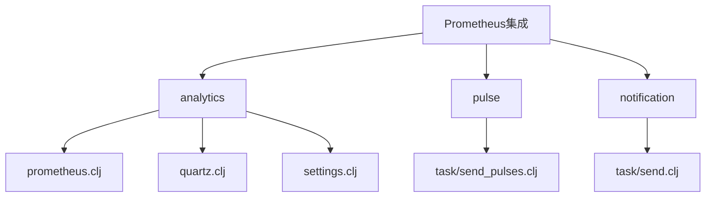
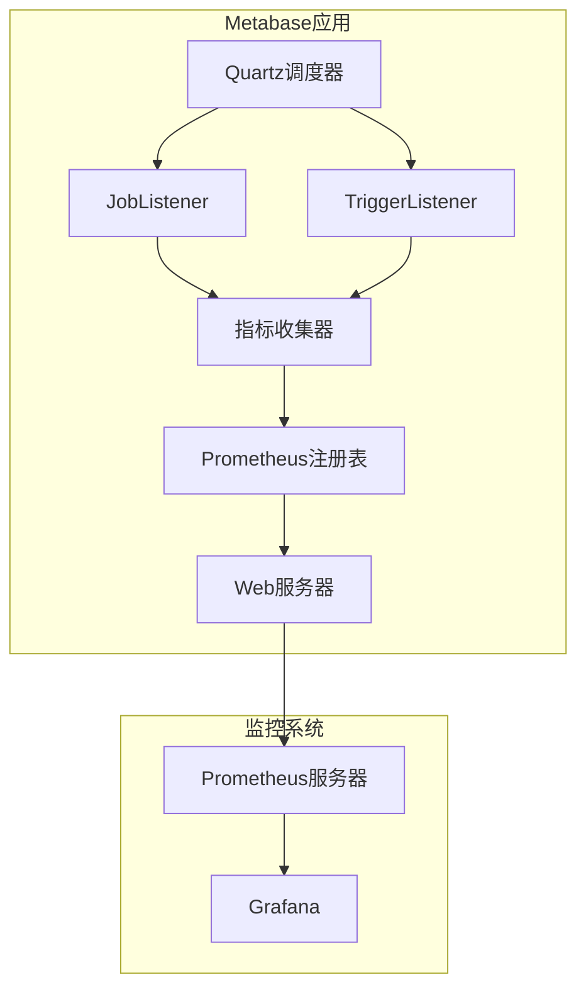
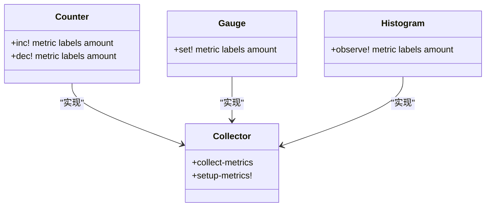
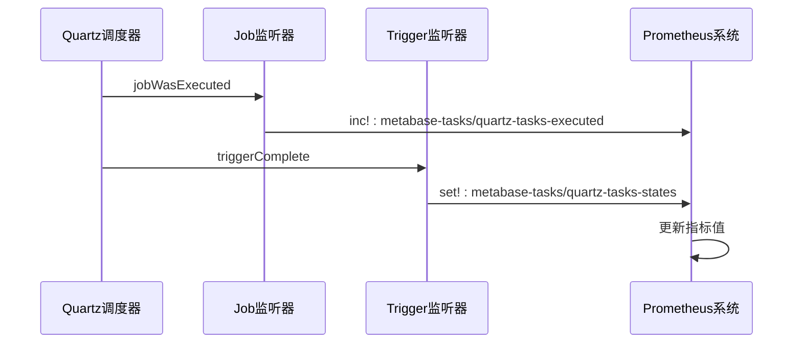
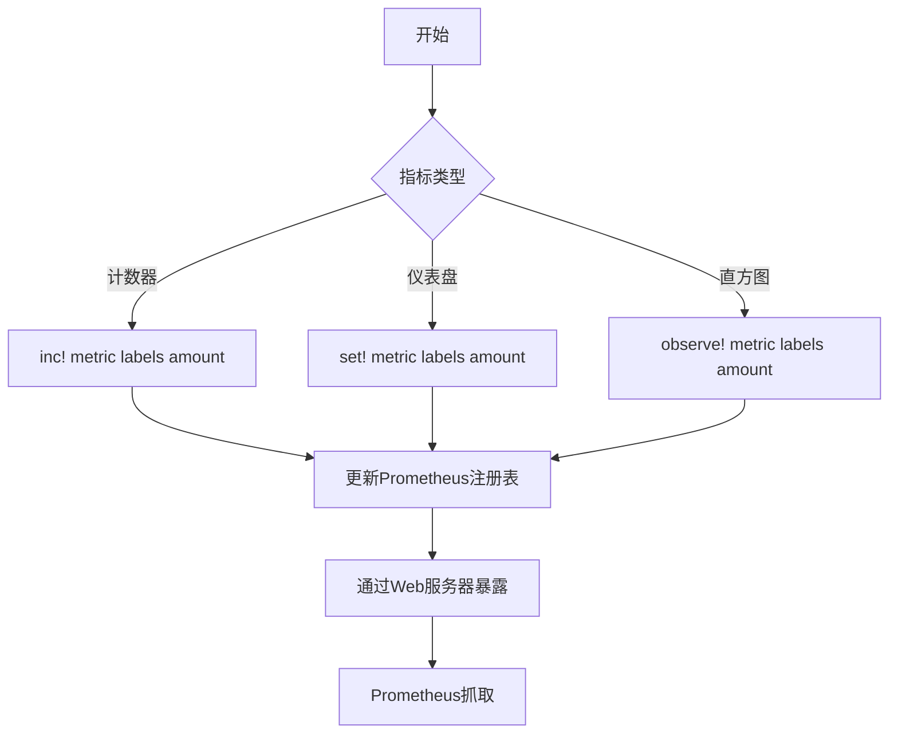
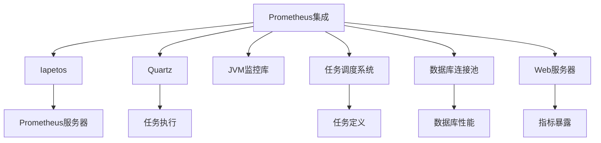

# Prometheus指标集成

<cite>
**本文档引用的文件**
- [prometheus.clj](file://src/metabase/analytics/prometheus.clj)
- [quartz.clj](file://src/metabase/analytics/quartz.clj)
- [settings.clj](file://src/metabase/analytics/settings.clj)
- [send_pulses.clj](file://src/metabase/pulse/task/send_pulses.clj)
- [send.clj](file://src/metabase/notification/task/send.clj)
</cite>

## 目录
1. [简介](#简介)
2. [项目结构](#项目结构)
3. [核心组件](#核心组件)
4. [架构概述](#架构概述)
5. [详细组件分析](#详细组件分析)
6. [依赖分析](#依赖分析)
7. [性能考虑](#性能考虑)
8. [故障排除指南](#故障排除指南)
9. [结论](#结论)

## 简介
本文档详细说明了Metabase如何通过Prometheus收集任务执行指标，包括任务执行次数、状态、耗时等关键性能指标。文档解释了指标注册机制和暴露端点配置，描述了如何定义和暴露自定义业务指标。提供了Prometheus查询示例来监控任务健康状况，并说明了如何设置告警规则。包含性能影响评估和最佳实践建议，如指标命名规范、标签使用策略和采样频率配置。

## 项目结构
Metabase的Prometheus集成主要位于`src/metabase/analytics`目录下，核心文件包括`prometheus.clj`用于指标收集和暴露，`quartz.clj`用于任务调度指标的收集。任务实现分布在各个模块的`task`子目录中，如`pulse/task`和`notification/task`。

**Diagram sources**
- [prometheus.clj](file://src/metabase/analytics/prometheus.clj)
- [quartz.clj](file://src/metabase/analytics/quartz.clj)
- [send_pulses.clj](file://src/metabase/pulse/task/send_pulses.clj)
- [send.clj](file://src/metabase/notification/task/send.clj)

**Section sources**
- [prometheus.clj](file://src/metabase/analytics/prometheus.clj)
- [quartz.clj](file://src/metabase/analytics/quartz.clj)
- [settings.clj](file://src/metabase/analytics/settings.clj)

## 核心组件
Metabase的Prometheus集成核心组件包括指标注册、收集器定义、任务监听器和暴露端点。系统通过`setup!`函数初始化Prometheus收集器和Web服务器，通过`quartz-collectors`定义任务相关指标，并通过JobListener和TriggerListener收集任务执行数据。

**Section sources**
- [prometheus.clj](file://src/metabase/analytics/prometheus.clj#L467-L491)
- [quartz.clj](file://src/metabase/analytics/quartz.clj#L32-L55)

## 架构概述
Metabase的Prometheus集成架构基于Iapetos库，通过Quartz任务调度框架收集任务执行指标。系统在启动时初始化Prometheus收集器和Web服务器，注册各种指标收集器，包括JVM、Jetty、数据库连接池和业务特定指标。任务执行指标通过Quartz的JobListener和TriggerListener机制收集。

**Diagram sources**
- [prometheus.clj](file://src/metabase/analytics/prometheus.clj)
- [quartz.clj](file://src/metabase/analytics/quartz.clj)

## 详细组件分析

### 指标注册与收集机制
Metabase使用Iapetos库作为Prometheus客户端，通过`setup-metrics!`函数注册各种指标收集器。系统定义了JVM、Jetty、数据库连接池和业务特定的收集器，并通过`register`函数将它们添加到Prometheus注册表中。

#### 指标类型定义

**Diagram sources**
- [prometheus.clj](file://src/metabase/analytics/prometheus.clj#L168-L198)

**Section sources**
- [prometheus.clj](file://src/metabase/analytics/prometheus.clj#L168-L198)

### 任务执行指标收集
Metabase通过Quartz框架的监听器机制收集任务执行指标。`create-job-execution-listener`创建JobListener，在任务执行完成后记录执行次数和状态。`create-trigger-listener`创建TriggerListener，监控任务状态变化。

#### 任务指标收集流程

**Diagram sources**
- [quartz.clj](file://src/metabase/analytics/quartz.clj#L32-L55)
- [prometheus.clj](file://src/metabase/analytics/prometheus.clj#L467-L491)

**Section sources**
- [quartz.clj](file://src/metabase/analytics/quartz.clj#L32-L55)

### 自定义业务指标
Metabase支持定义和暴露自定义业务指标，如通知发送、CSV上传、邮件发送等。这些指标通过`product-collectors`函数定义，包括计数器、直方图和仪表盘等多种类型。

#### 业务指标示例

**Diagram sources**
- [prometheus.clj](file://src/metabase/analytics/prometheus.clj#L217-L239)

**Section sources**
- [prometheus.clj](file://src/metabase/analytics/prometheus.clj#L217-L239)

## 依赖分析
Metabase的Prometheus集成依赖于多个外部库和内部组件。主要依赖包括Iapetos（Prometheus客户端库）、Quartz（任务调度框架）和JVM监控库。内部组件依赖包括任务调度系统、数据库连接池和Web服务器。

**Diagram sources**
- [prometheus.clj](file://src/metabase/analytics/prometheus.clj)
- [quartz.clj](file://src/metabase/analytics/quartz.clj)

**Section sources**
- [prometheus.clj](file://src/metabase/analytics/prometheus.clj)
- [quartz.clj](file://src/metabase/analytics/quartz.clj)

## 性能考虑
Prometheus指标收集对系统性能有一定影响，主要体现在内存使用、CPU开销和网络带宽。Metabase通过优化指标收集频率、使用高效的序列化格式和限制指标数量来最小化性能影响。建议在生产环境中监控Prometheus收集器自身的性能指标，如`metabase_application/jvm_allocation_rate`和`metabase_application/jvm_hiccups`。

**Section sources**
- [prometheus.clj](file://src/metabase/analytics/prometheus.clj#L654-L666)

## 故障排除指南
当Prometheus集成出现问题时，可以检查以下方面：确保`MB_PROMETHEUS_SERVER_PORT`环境变量已正确设置，验证Prometheus Web服务器是否正常启动，检查日志中是否有指标收集错误。可以使用`prometheus/value`函数获取特定指标的当前值进行调试。

**Section sources**
- [prometheus.clj](file://src/metabase/analytics/prometheus.clj#L654-L666)
- [settings.clj](file://src/metabase/analytics/settings.clj)

## 结论
Metabase的Prometheus集成提供了一套完整的指标收集和监控解决方案。通过Quartz任务调度框架的监听器机制，系统能够准确收集任务执行指标。自定义业务指标的定义和暴露机制使得系统监控更加全面。建议在生产环境中启用Prometheus集成，并配置适当的告警规则以确保系统健康。