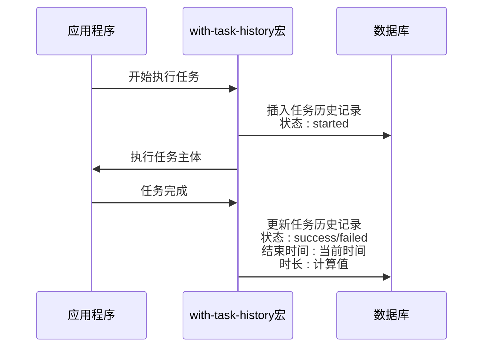
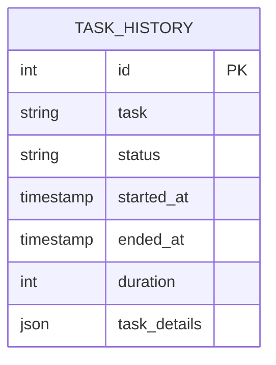
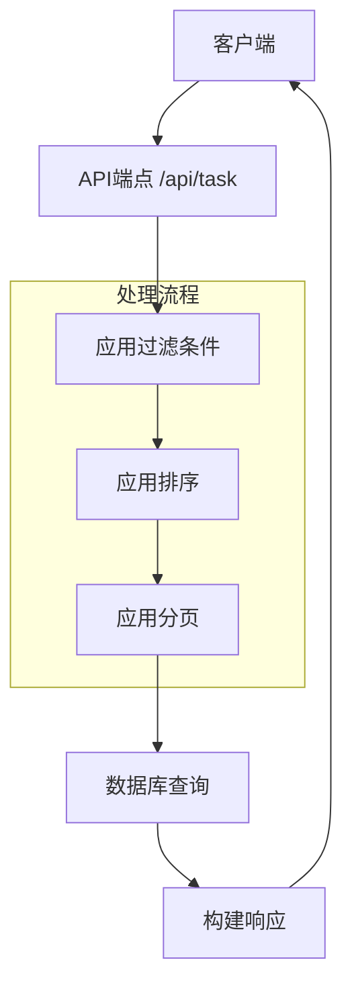
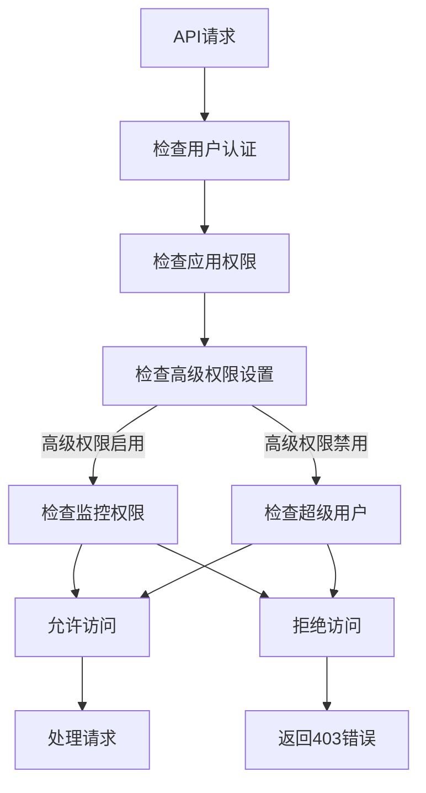

# 任务状态管理

<cite>
**本文档中引用的文件**  
- [task_history.clj](file://src/metabase/task_history/models/task_history.clj)
- [api.clj](file://src/metabase/task_history/api.clj)
- [task_history_cleanup.clj](file://src/metabase/task_history/task/task_history_cleanup.clj)
- [core.clj](file://src/metabase/task_history/core.clj)
- [init.clj](file://src/metabase/task_history/init.clj)
- [permissions.clj](file://src/metabase/permissions/path.clj)
</cite>

## 目录
1. [介绍](#介绍)
2. [任务状态生命周期管理](#任务状态生命周期管理)
3. [任务历史记录数据模型](#任务历史记录数据模型)
4. [任务执行历史查询API](#任务执行历史查询api)
5. [权限控制机制](#权限控制机制)
6. [常见查询场景示例](#常见查询场景示例)
7. [结论](#结论)

## 介绍
本文档详细阐述Metabase系统中任务状态的生命周期管理、任务历史记录的数据模型设计、API查询功能以及权限控制机制。文档基于对Metabase代码库的分析，重点关注任务状态管理的核心组件，包括任务历史记录的持久化、查询和权限控制。

**Section sources**
- [task_history.clj](file://src/metabase/task_history/models/task_history.clj#L1-L50)

## 任务状态生命周期管理

Metabase系统通过`with-task-history`宏来管理任务状态的生命周期。该宏在任务执行前后自动记录任务状态，确保任务执行过程的完整跟踪。

任务状态的生命周期包括以下阶段：
- **开始（started）**：任务开始执行时的状态
- **成功（success）**：任务成功完成时的状态
- **失败（failed）**：任务执行失败时的状态
- **未知（unknown）**：任务状态未知时的状态

当使用`with-task-history`宏包装任务代码时，系统会自动在任务开始时创建任务历史记录，状态设置为"started"。任务完成后，根据执行结果更新状态为"success"或"failed"，并记录结束时间和执行时长。



**Diagram sources**
- [task_history.clj](file://src/metabase/task_history/models/task_history.clj#L140-L185)

**Section sources**
- [task_history.clj](file://src/metabase/task_history/models/task_history.clj#L140-L185)

## 任务历史记录数据模型

任务历史记录的数据模型设计旨在高效存储和查询任务执行信息。数据模型包含以下关键字段：

### 任务历史记录表结构
| 字段名 | 数据类型 | 描述 | 索引策略 |
|--------|--------|------|----------|
| id | 整数 | 主键，自增 | 主键索引 |
| task | 字符串 | 任务名称 | 普通索引 |
| status | 枚举 | 任务状态（started, success, failed, unknown） | 普通索引 |
| started_at | 时间戳 | 任务开始时间 | 复合索引（started_at, ended_at） |
| ended_at | 时间戳 | 任务结束时间 | 复合索引（started_at, ended_at） |
| duration | 整数 | 任务执行时长（毫秒） | 普通索引 |
| task_details | JSON | 任务详细信息，包含错误信息等 | JSON索引 |

### 索引策略和查询优化
系统采用了多种索引策略来优化查询性能：

1. **复合索引**：在`started_at`和`ended_at`字段上创建复合索引，优化按时间范围查询的性能
2. **状态索引**：在`status`字段上创建索引，优化按任务状态过滤的查询
3. **任务名称索引**：在`task`字段上创建索引，优化按任务类型查询的性能

查询优化方面，系统通过以下方式提高性能：
- 使用分页查询避免一次性加载大量数据
- 提供过滤和排序参数，减少返回结果集的大小
- 对JSON字段进行适当的索引，提高复杂查询的性能



**Diagram sources**
- [task_history.clj](file://src/metabase/task_history/models/task_history.clj#L0-L33)

**Section sources**
- [task_history.clj](file://src/metabase/task_history/models/task_history.clj#L51-L95)

## 任务执行历史查询API

系统提供了REST API来查询任务执行历史，支持过滤、排序和分页功能。

### API端点
| 端点 | HTTP方法 | 描述 |
|------|--------|------|
| /api/task | GET | 获取任务历史记录列表 |
| /api/task/:id | GET | 获取指定ID的任务历史记录 |
| /api/task/info | GET | 获取所有计划任务的原始信息 |
| /api/task/unique-tasks | GET | 获取所有唯一的任务名称 |

### 查询参数
查询API支持以下参数：

#### 过滤参数
- **status**：按任务状态过滤（started, success, failed, unknown）
- **task**：按任务名称过滤

#### 排序参数
- **sort_column**：排序字段（started_at, ended_at, duration），默认为started_at
- **sort_direction**：排序方向（asc, desc），默认为desc

#### 分页参数
- **limit**：每页记录数
- **offset**：偏移量

API响应格式包含总记录数、当前页大小、偏移量和数据列表：

```json
{
  "total": 100,
  "limit": 20,
  "offset": 0,
  "data": [
    {
      "id": 1,
      "task": "send-pulses",
      "status": "success",
      "started_at": "2023-01-01T00:00:00Z",
      "ended_at": "2023-01-01T00:01:00Z",
      "duration": 60000,
      "task_details": {}
    }
  ]
}
```



**Diagram sources**
- [api.clj](file://src/metabase/task_history/api.clj#L0-L35)

**Section sources**
- [api.clj](file://src/metabase/task_history/api.clj#L0-L35)

## 权限控制机制

系统通过多层次的权限控制机制确保只有授权用户可以访问监控数据。

### 权限检查流程


### 权限实现细节
权限控制主要通过以下方式实现：

1. **应用权限路径**：系统定义了特定的应用权限路径`/application/monitoring/`用于监控相关的权限控制
2. **条件权限检查**：根据`advanced-permissions`设置的不同，权限要求也不同：
   - 当`advanced-permissions`启用时，需要超级用户或具有监控权限的非管理员用户
   - 当`advanced-permissions`禁用时，仅需要超级用户权限

3. **权限检查代码**：
```clojure
(defmethod mi/perms-objects-set :model/TaskHistory
  [_task _read-or-write]
  #{(if (premium-features/enable-advanced-permissions?)
      (perms/application-perms-path :monitoring)
      "/")})
```

在API层面，通过`perms/check-has-application-permission`函数进行权限检查：

```clojure
(api.macros/defendpoint :get "/"
  "获取任务历史记录列表"
  [_ params]
  (perms/check-has-application-permission :monitoring)
  {:total (task-history/total params)
   :limit (request/limit)
   :offset (request/offset)
   :data (task-history/all (request/limit) (request/offset) params)})
```

**Diagram sources**
- [api.clj](file://src/metabase/task_history/api.clj#L0-L35)
- [path.clj](file://src/metabase/permissions/path.clj#L30-L47)

**Section sources**
- [task_history.clj](file://src/metabase/task_history/models/task_history.clj#L0-L33)
- [api.clj](file://src/metabase/task_history/api.clj#L0-L35)

## 常见查询场景示例

以下是几个常见的任务历史查询场景及其示例代码：

### 获取最近失败的任务
```clojure
;; 获取最近10个失败的任务
(task-history/all 10 0 {:status :failed :sort_column :started_at :sort_direction :desc})
```

### 按任务类型查询执行历史
```clojure
;; 查询所有"send-pulses"任务的执行历史
(task-history/all nil nil {:task "send-pulses" :sort_column :started_at :sort_direction :desc})
```

### 查询特定时间段内的任务
```clojure
;; 查询过去24小时内开始的所有任务
(let [twenty-four-hours-ago (t/minus (t/instant) (t/days 1))]
  (t2/select :model/TaskHistory
             {:where [:>= :started_at twenty-four-hours-ago]
              :order-by [[:started_at :desc]]}))
```

### 分页查询任务历史
```clojure
;; 分页查询，每页20条，获取第2页数据
(task-history/all 20 20 {:sort_column :started_at :sort_direction :desc})
```

### 统计各状态任务数量
```clojure
;; 统计各种状态的任务数量
{:started (task-history/total {:status :started})
 :success (task-history/total {:status :success})
 :failed (task-history/total {:status :failed})
 :unknown (task-history/total {:status :unknown})}
```

### 获取所有唯一任务名称
```clojure
;; 获取系统中所有唯一的任务名称
(task-history/unique-tasks)
```

**Section sources**
- [task_history.clj](file://src/metabase/task_history/models/task_history.clj#L94-L117)
- [api.clj](file://src/metabase/task_history/api.clj#L34-L41)

## 结论
Metabase系统的任务状态管理机制通过`with-task-history`宏实现了任务生命周期的完整跟踪，确保每个任务的执行过程都被准确记录。任务历史记录的数据模型设计合理，通过适当的索引策略和查询优化保证了查询性能。

API接口提供了丰富的查询功能，支持过滤、排序和分页，满足了不同场景下的查询需求。权限控制机制确保了监控数据的安全性，只有授权用户才能访问敏感的监控信息。

系统还实现了自动化的任务历史清理机制，通过`TaskHistoryCleanup`任务每天在午夜执行，删除超出保留数量的旧记录，防止数据库无限增长。这种综合性的设计确保了任务状态管理既功能完整又性能高效。