# 任务监控与管理

<cite>
**本文档中引用的文件**
- [prometheus.clj](file://src/metabase/analytics/prometheus.clj)
- [quartz.clj](file://src/metabase/analytics/quartz.clj)
- [core.clj](file://src/metabase/task/core.clj)
- [impl.clj](file://src/metabase/task/impl.clj)
- [api.clj](file://src/metabase/task_history/api.clj)
- [task_history.clj](file://src/metabase/task_history/models/task_history.clj)
- [bootstrap.clj](file://src/metabase/task/bootstrap.clj)
- [stats.clj](file://src/metabase/analytics/stats.clj)
</cite>

## 目录
1. [简介](#简介)
2. [项目结构概览](#项目结构概览)
3. [Prometheus集成与指标收集](#prometheus集成与指标收集)
4. [任务调度器架构](#任务调度器架构)
5. [任务历史记录系统](#任务历史记录系统)
6. [监控接口与API](#监控接口与api)
7. [作业监听器与触发器监听器](#作业监听器与触发器监听器)
8. [任务执行问题诊断](#任务执行问题诊断)
9. [性能优化建议](#性能优化建议)
10. [故障排除指南](#故障排除指南)
11. [总结](#总结)

## 简介

Metabase的任务监控与管理系统是一个基于Quartz调度器构建的完整解决方案，提供了全面的任务执行监控、指标收集和性能分析功能。该系统通过Prometheus集成实现了实时指标监控，通过任务历史记录提供了详细的执行追踪，并通过丰富的API接口支持各种监控和管理需求。

## 项目结构概览

任务监控与管理功能主要分布在以下核心模块中：

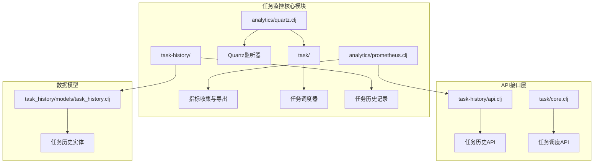

**图表来源**
- [prometheus.clj](file://src/metabase/analytics/prometheus.clj#L1-L50)
- [quartz.clj](file://src/metabase/analytics/quartz.clj#L1-L30)
- [core.clj](file://src/metabase/task/core.clj#L1-L30)

**章节来源**
- [prometheus.clj](file://src/metabase/analytics/prometheus.clj#L1-L100)
- [quartz.clj](file://src/metabase/analytics/quartz.clj#L1-L93)
- [impl.clj](file://src/metabase/task/impl.clj#L1-L50)

## Prometheus集成与指标收集

### 指标定义与收集

Metabase通过Prometheus集成实现了全面的任务执行指标监控，主要包括以下关键指标：

#### Quartz任务执行指标

| 指标名称 | 类型 | 描述 | 标签 |
|---------|------|------|------|
| `metabase_tasks_quartz_tasks_executed` | Counter | 任务执行总数 | `status`, `job_name` |
| `metabase_tasks_quartz_tasks_states` | Gauge | 各状态任务数量 | `state` |

#### JVM指标监控

系统自动收集以下JVM级别的指标：
- 垃圾回收统计
- 内存使用情况
- 线程池状态
- 堆分配速率
- 系统暂停检测

#### 自定义业务指标

除了基础的Quartz指标外，系统还收集特定于Metabase的业务指标：
- 查询处理器指标
- 数据库连接池指标
- 通知发送指标
- 搜索索引指标

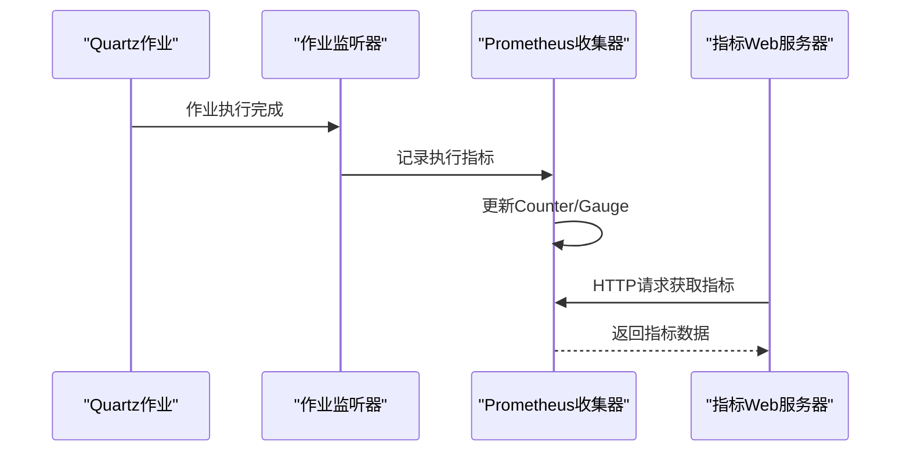

**图表来源**
- [quartz.clj](file://src/metabase/analytics/quartz.clj#L15-L45)
- [prometheus.clj](file://src/metabase/analytics/prometheus.clj#L467-L491)

**章节来源**
- [prometheus.clj](file://src/metabase/analytics/prometheus.clj#L467-L550)
- [quartz.clj](file://src/metabase/analytics/quartz.clj#L15-L93)

## 任务调度器架构

### Quartz调度器初始化

Metabase使用Quartz调度器作为任务执行的核心引擎，通过专门的Bootstrap模块进行初始化：

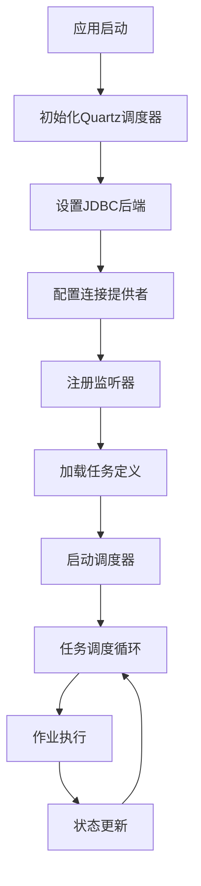

**图表来源**
- [impl.clj](file://src/metabase/task/impl.clj#L104-L130)
- [bootstrap.clj](file://src/metabase/task/bootstrap.clj#L1-L55)

### 任务生命周期管理

任务调度器提供了完整的任务生命周期管理功能：

#### 任务调度操作

| 操作 | 函数 | 描述 |
|------|------|------|
| 调度任务 | `schedule-task!` | 添加作业和触发器到调度器 |
| 立即执行 | `trigger-now!` | 立即触发任务执行 |
| 删除任务 | `delete-task!` | 从调度器中删除任务 |
| 重新调度 | `reschedule-trigger!` | 更新触发器属性 |

#### 调度器状态管理

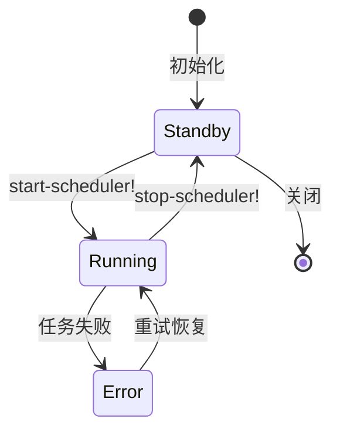

**图表来源**
- [impl.clj](file://src/metabase/task/impl.clj#L130-L180)

**章节来源**
- [impl.clj](file://src/metabase/task/impl.clj#L104-L250)
- [bootstrap.clj](file://src/metabase/task/bootstrap.clj#L1-L55)

## 任务历史记录系统

### 任务历史数据模型

任务历史记录系统提供了详细的任务执行追踪功能，包含以下核心字段：

#### 任务历史实体结构

| 字段名 | 类型 | 描述 |
|--------|------|------|
| `task` | String | 任务名称（小写命名） |
| `status` | Enum | 执行状态：started/success/failed/unknown |
| `started_at` | DateTime | 开始时间 |
| `ended_at` | DateTime | 结束时间 |
| `duration` | Integer | 执行时长（毫秒） |
| `task_details` | JSON | 任务详情信息 |
| `db_id` | Integer | 关联数据库ID |

### 任务历史API接口

系统提供了完整的任务历史查询和管理API：

#### 主要API端点

| 端点 | 方法 | 功能 | 权限要求 |
|------|------|------|----------|
| `/api/task/` | GET | 获取任务历史列表 | monitoring权限 |
| `/api/task/:id` | GET | 获取指定任务历史 | monitoring权限 |
| `/api/task/info` | GET | 获取调度器信息 | monitoring权限 |
| `/api/task/unique-tasks` | GET | 获取唯一任务名称列表 | monitoring权限 |

#### 查询参数与过滤

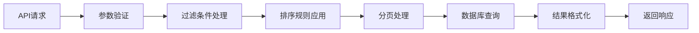

**图表来源**
- [api.clj](file://src/metabase/task_history/api.clj#L10-L42)
- [task_history.clj](file://src/metabase/task_history/models/task_history.clj#L60-L95)

### 任务历史清理机制

为防止历史数据无限增长，系统实现了自动清理机制：

#### 清理策略

清理过程按照任务结束时间降序排列，保留最新的`num-rows-to-keep`条记录，删除更早的历史记录。

**章节来源**
- [task_history.clj](file://src/metabase/task_history/models/task_history.clj#L32-L198)
- [api.clj](file://src/metabase/task_history/api.clj#L10-L42)

## 监控接口与API

### 调度器信息API

系统提供了详细的调度器状态查询接口，返回以下信息：

#### 调度器元数据

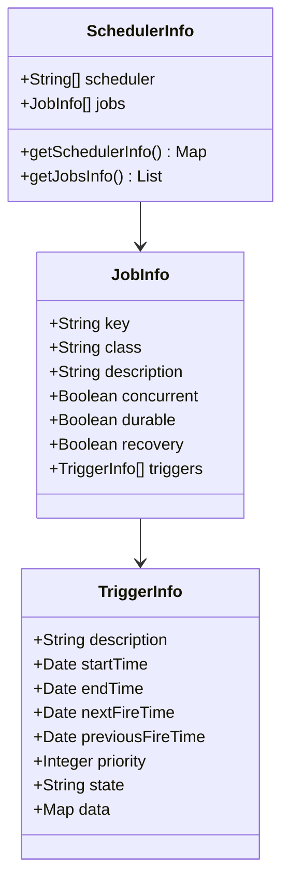

**图表来源**
- [impl.clj](file://src/metabase/task/impl.clj#L300-L377)

### 任务状态查询

通过任务历史API可以查询各种维度的任务状态：

#### 状态过滤选项

| 状态值 | 描述 |
|--------|------|
| `started` | 正在执行 |
| `success` | 执行成功 |
| `failed` | 执行失败 |
| `unknown` | 状态未知 |

#### 排序与分页

系统支持多种排序方式和分页控制：
- 按开始时间排序（默认）
- 按结束时间排序  
- 按执行时长排序
- 支持升序/降序排列

**章节来源**
- [api.clj](file://src/metabase/task_history/api.clj#L10-L42)
- [impl.clj](file://src/metabase/task/impl.clj#L300-L377)

## 作业监听器与触发器监听器

### 作业执行监听器

作业监听器负责监控任务的执行过程并记录相关指标：

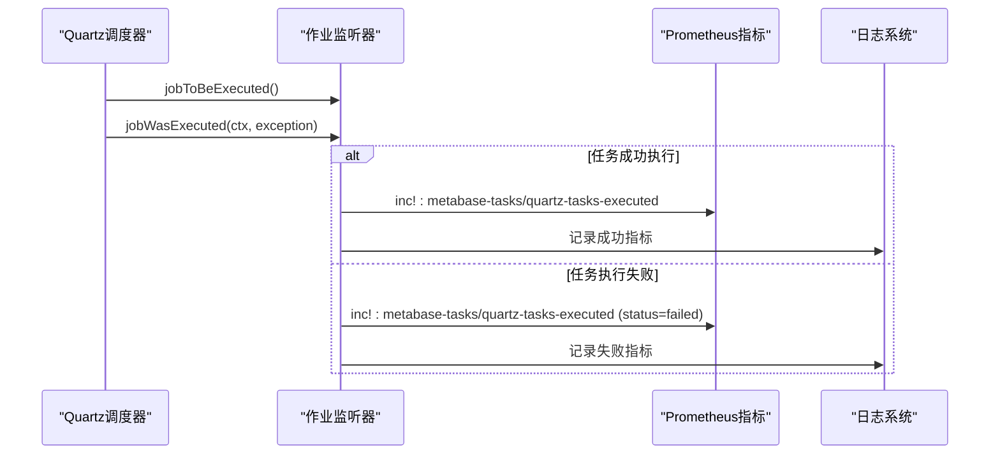

**图表来源**
- [quartz.clj](file://src/metabase/analytics/quartz.clj#L15-L45)

### 触发器状态监听器

触发器监听器专注于监控任务触发器的状态变化：

#### 状态监控功能

触发器监听器会持续监控以下状态指标：
- `EXECUTING`: 正在执行的任务数量
- `WAITING`: 等待执行的任务数量
- `PAUSED`: 暂停的任务数量
- `BLOCKED`: 阻塞的任务数量
- `ERROR`: 错误状态的任务数量

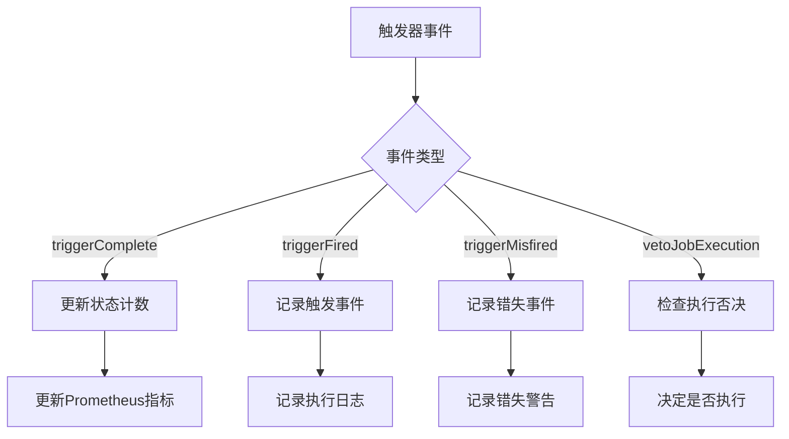

**图表来源**
- [quartz.clj](file://src/metabase/analytics/quartz.clj#L55-L93)

### 监听器注册与管理

系统在调度器初始化时自动注册所有必要的监听器：

#### 注册流程

1. **作业监听器注册**: 监控任务执行状态
2. **触发器监听器注册**: 监控任务触发状态  
3. **错误状态恢复**: 自动重置错误状态的触发器
4. **类不存在处理**: 清理已删除任务的残留记录

**章节来源**
- [quartz.clj](file://src/metabase/analytics/quartz.clj#L15-L93)
- [impl.clj](file://src/metabase/task/impl.clj#L364-L377)

## 任务执行问题诊断

### 异常处理机制

系统实现了完善的异常处理和诊断机制：

#### 异常信息捕获

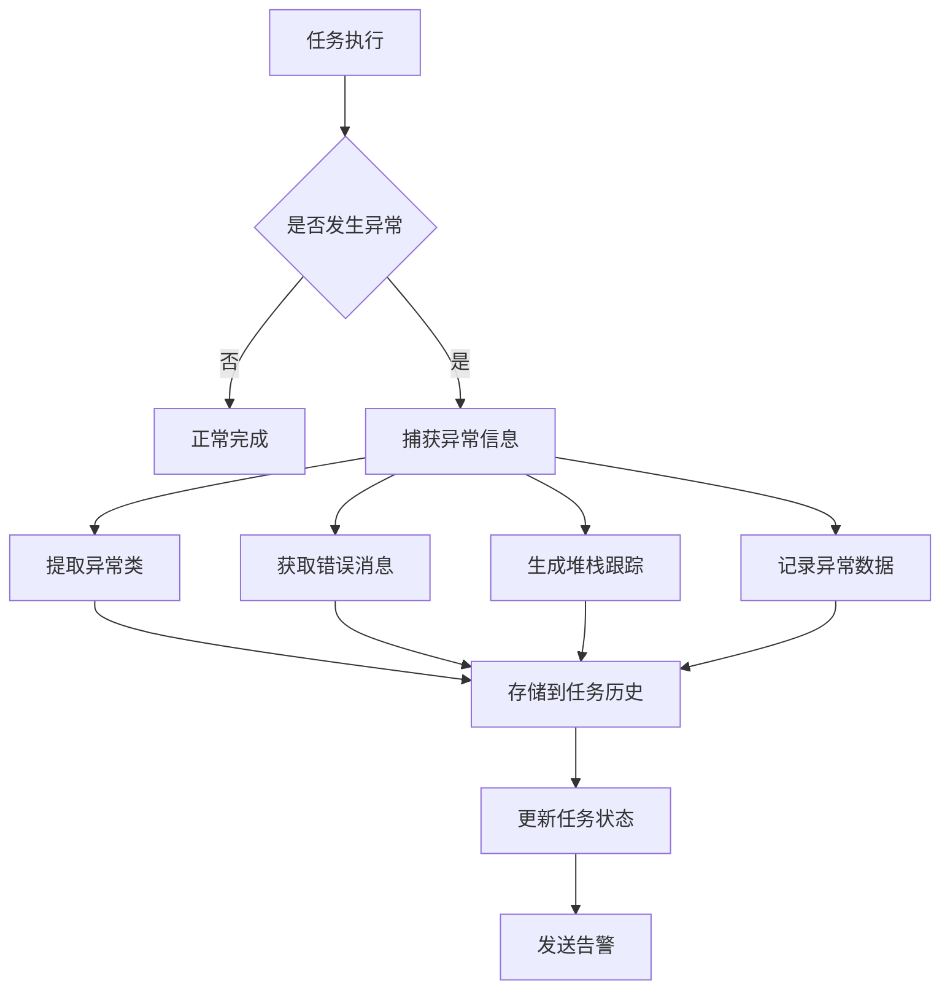

**图表来源**
- [task_history.clj](file://src/metabase/task_history/models/task_history.clj#L163-L185)

### 诊断信息记录

任务历史系统会记录详细的诊断信息：

#### 异常信息结构

| 字段 | 类型 | 描述 |
|------|------|------|
| `exception` | Class | 异常类名 |
| `message` | String | 错误消息 |
| `stacktrace` | Array | 堆栈跟踪 |
| `ex-data` | Map | 异常附加数据 |
| `original-info` | Map | 原始任务信息 |

### 性能问题识别

通过任务历史数据可以识别常见的性能问题：

#### 性能指标分析

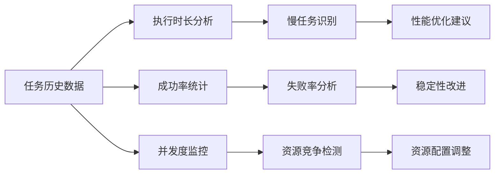

**图表来源**
- [task_history.clj](file://src/metabase/task_history/models/task_history.clj#L140-L163)

**章节来源**
- [task_history.clj](file://src/metabase/task_history/models/task_history.clj#L140-L198)

## 性能优化建议

### 监控指标优化

#### 指标收集优化

1. **批量指标更新**: 使用Prometheus的批量更新功能减少网络开销
2. **标签优化**: 合理设计指标标签，避免高基数问题
3. **采样策略**: 对高频指标实施采样以降低资源消耗

#### 内存使用优化

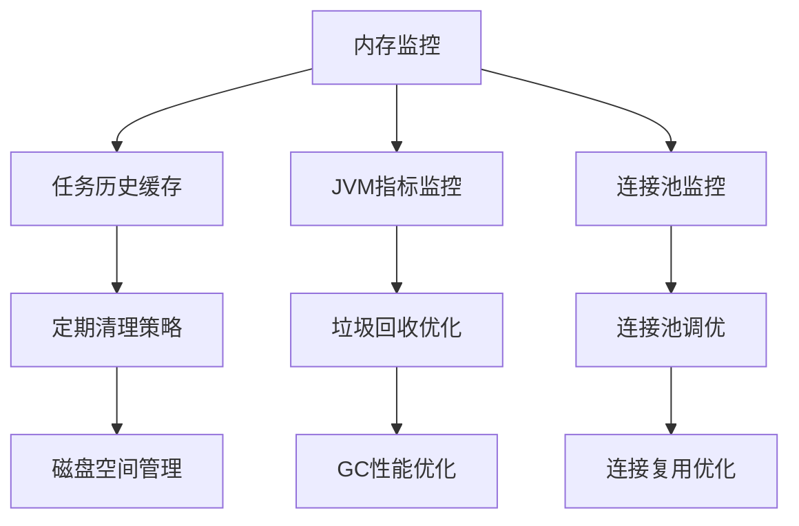

### 任务执行优化

#### 并发控制策略

1. **任务优先级设置**: 根据业务重要性设置不同优先级
2. **资源限制**: 为不同类型任务设置资源上限
3. **负载均衡**: 在多个实例间分布任务负载

#### 执行效率提升

| 优化方面 | 具体措施 | 预期效果 |
|----------|----------|----------|
| 任务拆分 | 将大任务分解为小任务 | 提高并发度 |
| 缓存利用 | 复用计算结果 | 减少重复计算 |
| 连接池优化 | 调整连接池大小 | 提高连接利用率 |
| 错失策略 | 设置合理的错失策略 | 平衡准确性与及时性 |

### 系统配置优化

#### 调度器配置

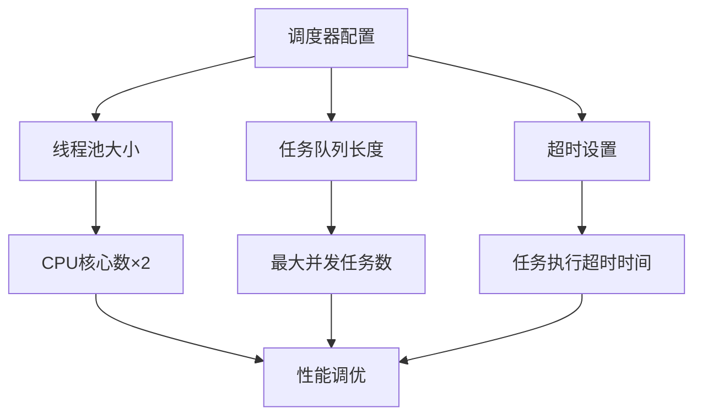

**章节来源**
- [prometheus.clj](file://src/metabase/analytics/prometheus.clj#L550-L667)
- [impl.clj](file://src/metabase/task/impl.clj#L104-L180)

## 故障排除指南

### 常见问题诊断

#### 任务执行失败

**问题症状**: 任务频繁失败或无法启动

**诊断步骤**:
1. 检查任务历史记录中的异常信息
2. 查看调度器状态和任务队列
3. 验证任务依赖的服务可用性
4. 检查系统资源使用情况

**解决方案**:
- 修复导致异常的代码逻辑
- 调整任务重试策略
- 增加系统资源配额
- 优化任务执行逻辑

#### 性能问题

**问题症状**: 任务执行缓慢或超时

**诊断方法**:
1. 分析任务执行时间趋势
2. 检查系统资源瓶颈
3. 评估任务复杂度
4. 监控外部服务响应

**优化措施**:
- 实施任务分片处理
- 添加适当的缓存机制
- 优化数据库查询
- 调整并发度设置

### 监控告警配置

#### 关键指标监控

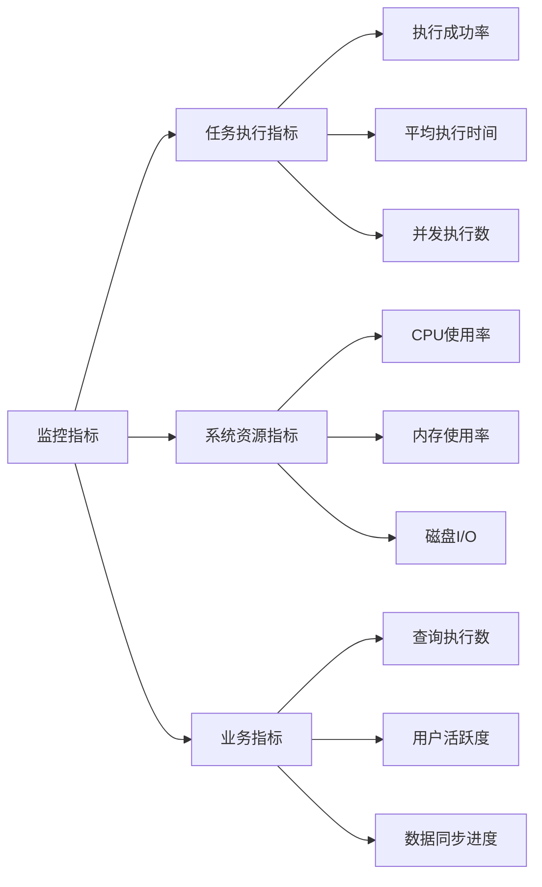

#### 告警规则设置

| 指标 | 告警阈值 | 告警级别 | 处理建议 |
|------|----------|----------|----------|
| 任务失败率 | >5% | 警告 | 检查任务逻辑 |
| 平均执行时间 | >30分钟 | 警告 | 优化任务性能 |
| CPU使用率 | >80% | 严重 | 扩容或优化 |
| 内存使用率 | >90% | 严重 | 增加内存或优化 |

### 日志分析

#### 日志级别配置

系统采用分级日志记录策略：

- **DEBUG**: 详细的调试信息
- **INFO**: 一般信息记录  
- **WARN**: 警告信息
- **ERROR**: 错误信息和异常堆栈

#### 日志分析工具

推荐使用以下工具进行日志分析：
- **Promtail + Loki**: 实时日志聚合和查询
- **Grafana**: 日志可视化和告警
- **ELK Stack**: 完整的日志分析解决方案

**章节来源**
- [task_history.clj](file://src/metabase/task_history/models/task_history.clj#L163-L198)
- [impl.clj](file://src/metabase/task/impl.clj#L104-L130)

## 总结

Metabase的任务监控与管理系统提供了一个完整、可靠的解决方案，涵盖了从任务调度到性能监控的各个方面。通过Prometheus集成，系统能够实时收集和展示关键指标；通过任务历史记录，提供了详细的执行追踪能力；通过丰富的API接口，支持各种监控和管理需求。

### 主要优势

1. **全面的监控覆盖**: 包括任务执行、系统资源、业务指标等多个维度
2. **实时指标收集**: 基于Prometheus的高效指标收集和导出机制
3. **详细的执行追踪**: 完整的任务历史记录和异常信息捕获
4. **灵活的API接口**: 支持各种查询、过滤和管理操作
5. **强大的诊断能力**: 提供完整的异常信息和性能分析

### 最佳实践建议

1. **合理设置监控指标**: 避免过多的低价值指标
2. **建立完善的告警机制**: 及时发现和响应问题
3. **定期清理历史数据**: 保持系统的高效运行
4. **持续优化任务性能**: 基于监控数据不断改进
5. **建立故障响应流程**: 快速定位和解决问题

通过合理使用这些监控和管理功能，可以确保Metabase系统的稳定运行和最佳性能表现。