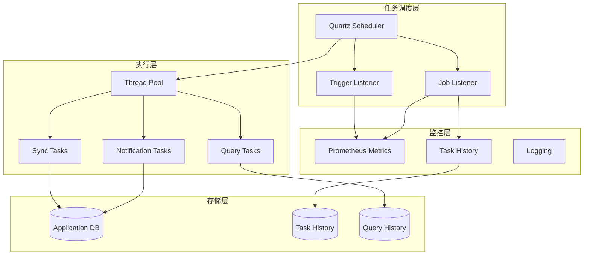
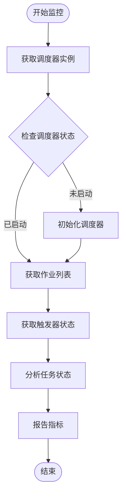
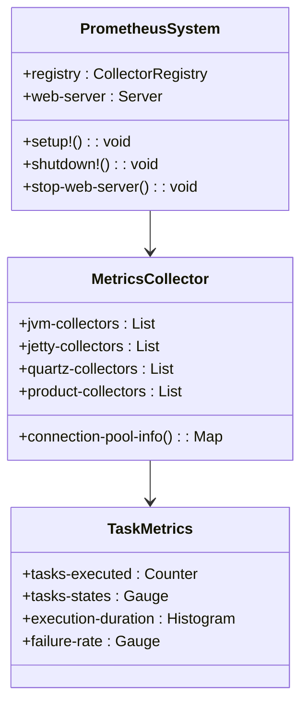
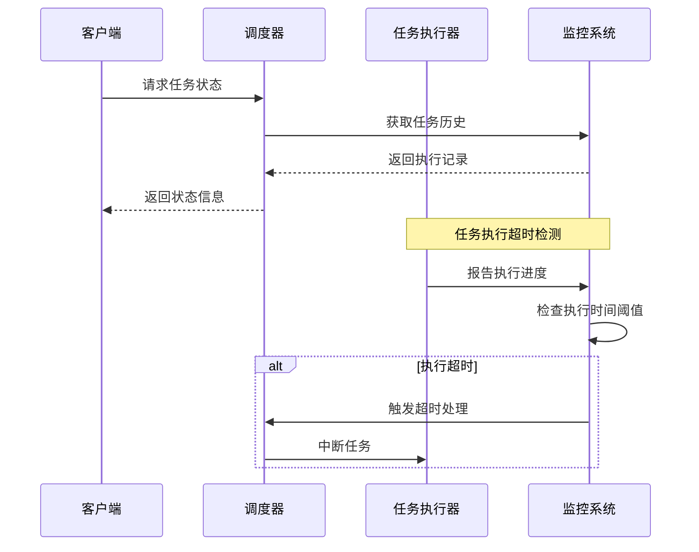
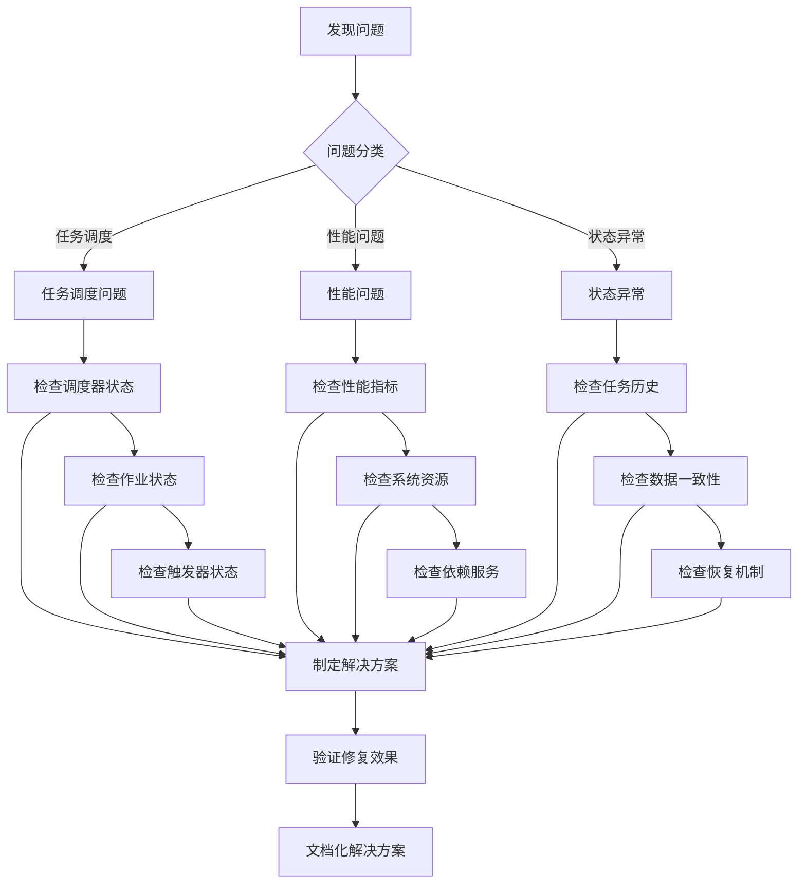
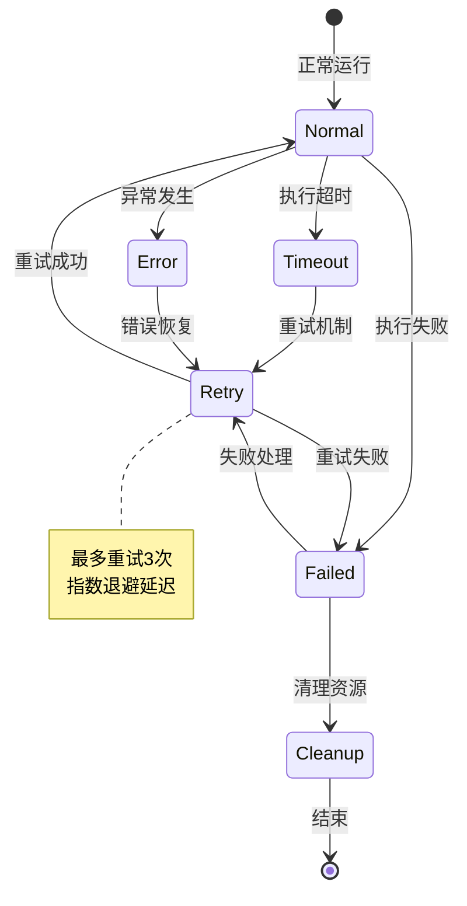

# 监控诊断与故障排除指南

<cite>
**本文档中引用的文件**
- [QUARTZ.md](file://src/metabase/task/QUARTZ.md)
- [quartz.clj](file://src/metabase/analytics/quartz.clj)
- [prometheus.clj](file://src/metabase/analytics/prometheus.clj)
- [core.clj](file://src/metabase/task/core.clj)
- [impl.clj](file://src/metabase/task/impl.clj)
- [job_factory.clj](file://src/metabase/task/job_factory.clj)
- [task_history.clj](file://src/metabase/task_history/models/task_history.clj)
- [send.clj](file://src/metabase/notification/send.clj)
- [stats.clj](file://src/metabase/analytics/stats.clj)
- [query.clj](file://src/metabase/queries/models/query.clj)
- [settings.clj](file://src/metabase/analytics/settings.clj)
- [retry.clj](file://src/metabase/util/retry.clj)
- [thread_pool.clj](file://src/metabase/server/streaming-response/thread_pool.clj)
</cite>

## 目录
1. [概述](#概述)
2. [系统架构概览](#系统架构概览)
3. [任务调度监控](#任务调度监控)
4. [性能指标收集](#性能指标收集)
5. [常见问题诊断](#常见问题诊断)
6. [故障排除方法论](#故障排除方法论)
7. [诊断工具使用](#诊断工具使用)
8. [错误模式与解决方案](#错误模式与解决方案)
9. [性能优化建议](#性能优化建议)
10. [最佳实践](#最佳实践)

## 概述

Metabase使用Quartz调度器管理后台任务，通过Prometheus进行监控，并提供了完整的任务历史记录和错误处理机制。本指南涵盖了从基础监控到高级故障排除的完整流程。

### 核心组件

- **Quartz调度器**: 负责任务调度和执行
- **Prometheus监控**: 提供实时指标收集
- **任务历史记录**: 记录所有任务的执行状态
- **错误处理机制**: 包含重试和异常恢复
- **线程池管理**: 控制并发执行能力

## 系统架构概览



**图表来源**
- [quartz.clj](file://src/metabase/analytics/quartz.clj#L0-L91)
- [impl.clj](file://src/metabase/task/impl.clj#L104-L160)

## 任务调度监控

### Quartz调度器状态监控

Quartz调度器提供了丰富的状态信息，可以通过以下方式获取：



**图表来源**
- [impl.clj](file://src/metabase/task/impl.clj#L302-L334)

### 关键监控指标

| 指标名称 | 描述 | 数据类型 | 用途 |
|---------|------|----------|------|
| `metabase-tasks/quartz-tasks-executed` | 任务执行次数 | Counter | 监控任务执行频率 |
| `metabase-tasks/quartz-tasks-states` | 任务状态分布 | Gauge | 监控任务状态 |
| `metabase-tasks/quartz-tasks-executed` | 任务执行状态 | Counter | 监控成功/失败率 |

**章节来源**
- [quartz.clj](file://src/metabase/analytics/quartz.clj#L53-L91)

## 性能指标收集

### Prometheus监控配置

Metabase集成了Prometheus监控系统，提供以下关键指标：



**图表来源**
- [prometheus.clj](file://src/metabase/analytics/prometheus.clj#L40-L80)

### 查询性能监控

查询执行时间监控通过以下机制实现：

| 监控维度 | 指标名称 | 时间范围 | 分桶策略 |
|---------|----------|----------|----------|
| 执行时间 | `running_time` | 0ms - 10000ms | 0, 1, 10, 100, 1000, 10000 |
| 成功率 | `by_status__completed` | 实时统计 | 成功/失败计数 |
| 用户活跃度 | `num_per_user` | 用户级别 | 0, 1-10, 11-50, 51-250, 251-1000+ |

**章节来源**
- [stats.clj](file://src/metabase/analytics/stats.clj#L368-L428)

## 常见问题诊断

### 任务卡顿问题

任务卡顿通常表现为执行时间过长或状态长时间保持不变：



**图表来源**
- [task_history.clj](file://src/metabase/task_history/models/task_history.clj#L140-L185)

### 执行超时诊断

执行超时问题的诊断流程：

1. **检查任务历史记录**
   - 查看任务开始时间和结束时间
   - 分析执行持续时间分布

2. **监控资源使用情况**
   - CPU使用率
   - 内存占用
   - 数据库连接池状态

3. **分析依赖服务状态**
   - 外部API响应时间
   - 数据库查询性能
   - 网络连接状态

**章节来源**
- [task_history.clj](file://src/metabase/task_history/models/task_history.clj#L32-L53)

### 状态不一致问题

状态不一致通常由以下原因引起：

- **并发访问冲突**
- **事务处理异常**
- **网络分区问题**
- **系统重启导致的状态丢失**

## 故障排除方法论

### 系统性问题排查流程



### 诊断检查清单

#### 基础检查项
- [ ] Quartz调度器是否正常运行
- [ ] 任务历史记录是否完整
- [ ] Prometheus指标是否正常采集
- [ ] 数据库连接是否稳定

#### 高级检查项
- [ ] 线程池配置是否合理
- [ ] 错误重试机制是否生效
- [ ] 并发控制是否适当
- [ ] 资源清理是否及时

## 诊断工具使用

### 关键API调用

#### 任务状态查询
```clojure
;; 获取调度器信息
(task/scheduler-info)

;; 获取特定任务详情
(task/job-info "task-name")

;; 获取所有任务列表
(task/jobs-info)
```

#### 监控指标查询
```clojure
;; 获取Quartz任务状态
(get-quartz-task-states scheduler)

;; 获取连接池信息
(connection-pool-info)

;; 获取查询执行统计
(execution-metrics)
```

**章节来源**
- [impl.clj](file://src/metabase/task/impl.clj#L302-L334)

### 数据库查询示例

#### 任务历史查询
```sql
-- 查询最近的任务执行记录
SELECT * FROM task_history 
WHERE ended_at > NOW() - INTERVAL '1 day'
ORDER BY ended_at DESC;

-- 查询失败的任务
SELECT * FROM task_history 
WHERE status = 'failed'
ORDER BY ended_at DESC;
```

#### 性能分析查询
```sql
-- 分析任务执行时间分布
SELECT 
    CASE 
        WHEN duration < 1000 THEN '< 1s'
        WHEN duration < 10000 THEN '1-10s'
        WHEN duration < 60000 THEN '10-60s'
        ELSE '> 1min'
    END AS duration_bucket,
    COUNT(*) as count
FROM task_history
GROUP BY 1
ORDER BY 1;
```

### Prometheus查询示例

#### 任务执行监控
```
rate(metabase_tasks_quartz_tasks_executed_total[5m])
```

#### 错误率监控
```
rate(metabase_tasks_quartz_tasks_executed_total{status="failed"}[5m]) 
/ 
rate(metabase_tasks_quartz_tasks_executed_total[5m])
```

#### 执行时间分布
```
histogram_quantile(0.95, 
    rate(metabase_tasks_quartz_tasks_duration_ms_bucket[5m]))
```

**章节来源**
- [prometheus.clj](file://src/metabase/analytics/prometheus.clj#L580-L620)

## 错误模式与解决方案

### 常见错误模式

#### 1. 任务执行超时
**症状**: 任务长时间处于"执行中"状态
**原因**: 
- 任务逻辑复杂度高
- 外部依赖响应慢
- 资源竞争激烈

**解决方案**:
- 增加任务超时配置
- 优化任务执行逻辑
- 添加进度报告机制

#### 2. 触发器错误状态
**症状**: 任务触发器进入ERROR状态
**原因**: 
- 类加载失败
- 配置变更
- 版本升级

**解决方案**:
- 自动重置错误触发器
- 实现向后兼容性检查
- 提供优雅降级机制

#### 3. 内存泄漏
**症状**: 系统内存使用持续增长
**原因**: 
- 任务历史记录过多
- 线程池未正确关闭
- 缓存未及时清理

**解决方案**:
- 定期清理任务历史
- 实现资源池管理
- 添加内存监控告警

**章节来源**
- [impl.clj](file://src/metabase/task/impl.clj#L104-L130)
- [job_factory.clj](file://src/metabase/task/job_factory.clj#L29-L64)

### 错误恢复机制



**图表来源**
- [retry.clj](file://src/metabase/util/retry.clj#L73-L119)

## 性能优化建议

### 线程池配置优化

#### 连接池参数调优
| 参数 | 默认值 | 推荐值 | 说明 |
|------|--------|--------|------|
| `maxPoolSize` | 15 | 20-50 | 根据并发需求调整 |
| `minPoolSize` | 1 | 5 | 保持最小连接数 |
| `maxIdleTime` | 0 | 300 | 连接空闲超时时间 |
| `maxConnectionAge` | 0 | 3600 | 连接生命周期 |

#### 任务线程池配置
```clojure
;; 根据CPU核心数和任务特性配置
(def ^:private thread-pool-size
  (max 4 (* 2 (.availableProcessors (Runtime/getRuntime)))))
```

**章节来源**
- [thread_pool.clj](file://src/metabase/server/streaming-response/thread_pool.clj#L10-L36)

### 任务优先级调整

#### 优先级分类
1. **紧急任务**: 系统健康检查、关键数据同步
2. **重要任务**: 用户通知、报表生成
3. **常规任务**: 数据清理、统计更新
4. **低优先级任务**: 日志清理、缓存刷新

#### 优先级配置示例
```clojure
(defn- configure-task-priority
  [task-name]
  (cond
    (re-matches #"urgent-.*" task-name) :high
    (re-matches #"important-.*" task-name) :medium
    :else :low))
```

### 数据库优化策略

#### 查询性能优化
- 使用索引覆盖查询
- 避免全表扫描
- 合理使用分页查询
- 定期分析查询计划

#### 连接池优化
- 监控连接池使用率
- 设置合理的超时时间
- 实现连接健康检查
- 定期清理空闲连接

**章节来源**
- [query.clj](file://src/metabase/queries/models/query.clj#L35-L81)

## 最佳实践

### 监控最佳实践

#### 1. 指标设计原则
- **可测量性**: 每个关键操作都有对应的指标
- **完整性**: 覆盖所有重要场景
- **及时性**: 实时反映系统状态
- **准确性**: 确保数据真实可靠

#### 2. 告警策略
- **阈值告警**: 基于历史数据设定合理阈值
- **趋势告警**: 监控指标变化趋势
- **异常检测**: 使用机器学习识别异常模式
- **分级告警**: 根据严重程度发送不同级别的告警

#### 3. 日志管理
- **结构化日志**: 使用JSON格式记录关键信息
- **日志轮转**: 定期清理过期日志
- **敏感信息过滤**: 避免泄露敏感数据
- **分布式追踪**: 跟踪跨服务的请求链路

### 故障预防措施

#### 1. 容错设计
- 实现幂等性操作
- 添加重试机制
- 提供优雅降级
- 建立熔断保护

#### 2. 测试策略
- 单元测试覆盖关键逻辑
- 集成测试验证系统交互
- 压力测试评估系统容量
- 故障演练验证恢复能力

#### 3. 运维自动化
- 自动化部署流程
- 自动化监控配置
- 自动化故障恢复
- 自动化容量规划

### 文档维护

#### 1. 变更记录
- 记录每次配置变更
- 说明变更原因和影响
- 维护版本兼容性信息
- 提供回滚方案

#### 2. 知识库建设
- 收集常见问题解决方案
- 总结最佳实践经验
- 建立培训材料体系
- 维护技术债务清单

通过遵循这些最佳实践，可以显著提高系统的稳定性、可维护性和可扩展性，为业务发展提供坚实的技术保障。