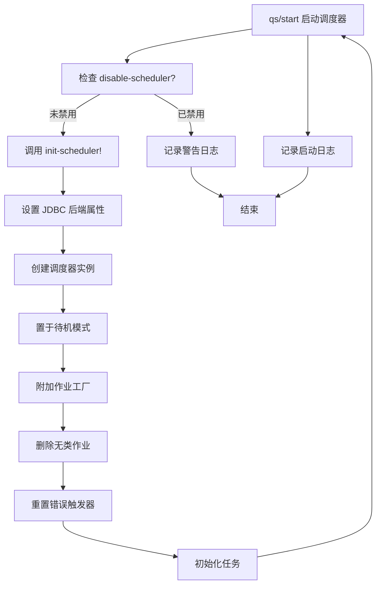
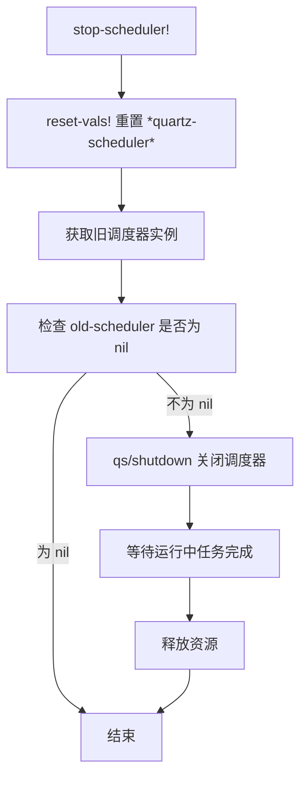
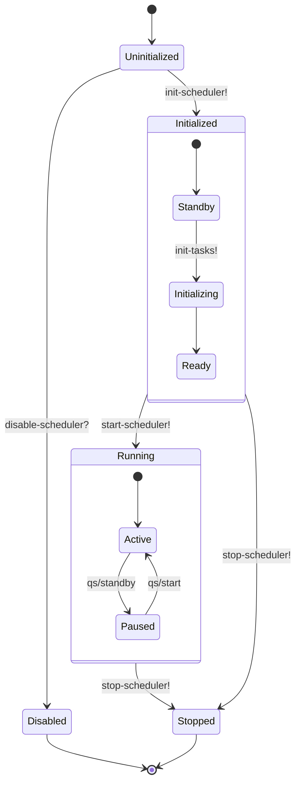
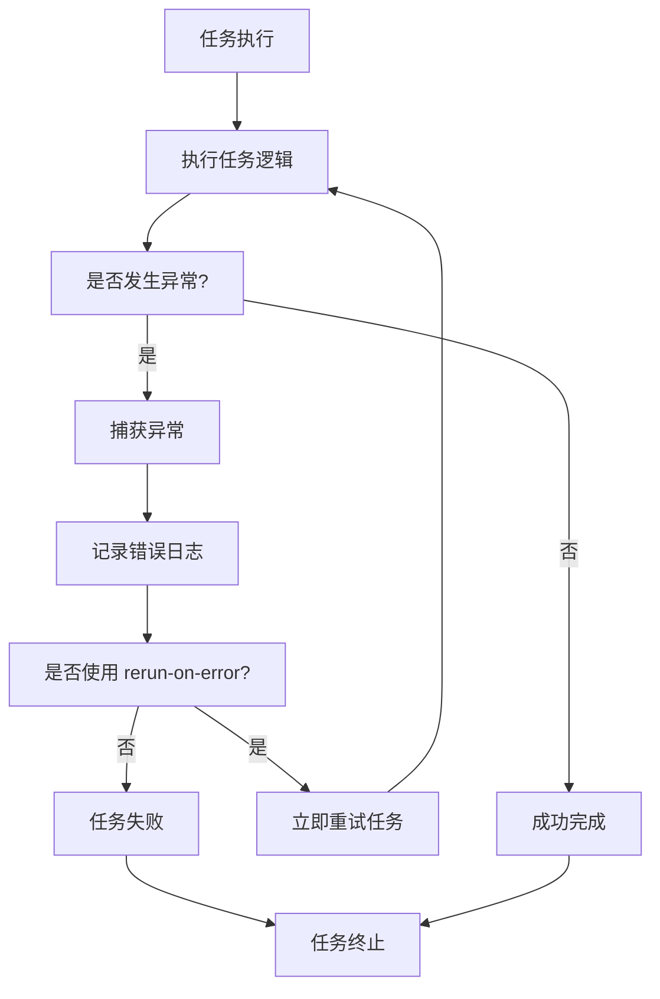

# 任务生命周期管理

<cite>
**本文档中引用的文件**  
- [impl.clj](file://src/metabase/task/impl.clj#L27-L377)
- [core.clj](file://src/metabase/task/core.clj#L1-L31)
- [bootstrap.clj](file://src/metabase/task/bootstrap.clj#L1-L55)
- [QUARTZ.md](file://src/metabase/task/QUARTZ.md#L1-L160)
- [other-env-vars.md](file://src/metabase/cmd/resources/other-env-vars.md#L137-L188)
- [init.clj](file://src/metabase/core/init.clj#L1-L76)
- [sync/init.clj](file://src/metabase/sync/init.clj#L1-L9)
- [analytics/init.clj](file://src/metabase/analytics/init.clj#L1-L5)
</cite>

## 目录
1. [引言](#引言)
2. [调度器生命周期管理](#调度器生命周期管理)
3. [start-scheduler! 实现机制](#start-scheduler--实现机制)
4. [stop-scheduler! 实现机制](#stop-scheduler--实现机制)
5. [disable-scheduler? 环境变量控制逻辑](#disable-scheduler--环境变量控制逻辑)
6. [scheduler 动态变量线程安全处理](#scheduler-动态变量线程安全处理)
7. [生命周期状态转换图](#生命周期状态转换图)
8. [异常处理流程图](#异常处理流程图)

## 引言
Metabase 使用 Quartzite 调度器来管理后台任务的执行，包括数据库同步、脉冲发送、会话清理等周期性任务。任务调度器的生命周期管理是系统稳定运行的关键组成部分，涉及调度器的初始化、启动、停止以及在多实例环境下的协调。本文档深入解析 Metabase 任务调度器的生命周期管理机制，重点分析 `start-scheduler!` 和 `stop-scheduler!` 的实现细节，解释 `MB_DISABLE_SCHEDULER` 环境变量的控制逻辑，并阐述 `scheduler` 动态变量在多实例环境下的线程安全处理方式。

## 调度器生命周期管理
Metabase 的任务调度器生命周期管理主要通过 `metabase.task.impl` 命名空间中的函数实现。调度器的生命周期包括初始化、启动、运行和停止四个主要阶段。整个生命周期由全局原子变量 `*quartz-scheduler*` 管理，确保了调度器实例的唯一性和线程安全性。

调度器的初始化和启动是两个独立的操作。首先通过 `init-scheduler!` 函数将调度器置于待机模式，然后通过 `start-scheduler!` 函数启动调度器以开始执行任务。这种分离的设计允许在启动前完成必要的配置和准备工作。调度器的停止操作通过 `stop-scheduler!` 函数实现，该函数会优雅地关闭调度器并清理相关资源。

**Section sources**
- [impl.clj](file://src/metabase/task/impl.clj#L27-L377)

## start-scheduler! 实现机制
`start-scheduler!` 函数是启动任务调度器的核心入口点。该函数首先检查 `disable-scheduler?` 函数的返回值，以确定是否应该禁用调度器。如果调度器被禁用，则记录警告日志并返回，不执行任何启动操作。

当调度器未被禁用时，`start-scheduler!` 会调用 `init-scheduler!` 函数进行调度器的初始化。初始化过程包括设置 JDBC 后端属性、创建新的调度器实例、将调度器置于待机模式、附加自定义作业工厂以及执行一系列初始化任务。初始化完成后，通过 `qs/start` 函数启动调度器实例，使其开始执行已调度的任务。

`start-scheduler!` 函数的实现确保了调度器的原子性设置。通过使用 `compare-and-set!` 原子操作来设置 `*quartz-scheduler*` 变量，防止了多个线程同时初始化调度器实例。这种设计保证了在多线程环境下的线程安全性，避免了调度器实例的重复创建。

**Diagram sources**
- [impl.clj](file://src/metabase/task/impl.clj#L130-L160)

**Section sources**
- [impl.clj](file://src/metabase/task/impl.clj#L130-L160)

## stop-scheduler! 实现机制
`stop-scheduler!` 函数负责优雅地停止任务调度器。该函数通过 `reset-vals!` 函数原子性地将 `*quartz-scheduler*` 变量重置为 `nil`，并获取旧的调度器实例。这种原子操作确保了在多线程环境下的线程安全性，防止了竞态条件的发生。

如果成功获取到旧的调度器实例，`stop-scheduler!` 会调用 `qs/shutdown` 函数来关闭调度器。`qs/shutdown` 函数会等待所有正在运行的任务完成执行，然后释放调度器占用的资源。这种优雅的关闭方式确保了正在执行的任务能够正常完成，避免了因突然终止而导致的数据不一致或资源泄漏问题。

`stop-scheduler!` 的实现还考虑了调度器可能已经被停止的情况。通过检查 `old-scheduler` 是否为 `nil`，函数能够安全地处理重复停止操作，避免了空指针异常或其他运行时错误。

**Diagram sources**
- [impl.clj](file://src/metabase/task/impl.clj#L155-L160)

**Section sources**
- [impl.clj](file://src/metabase/task/impl.clj#L155-L160)

## disable-scheduler? 环境变量控制逻辑
`disable-scheduler?` 函数实现了对 `MB_DISABLE_SCHEDULER` 环境变量的控制逻辑。该函数通过 `env/env` 函数获取 `:mb-disable-scheduler` 环境变量的值，并使用 `Boolean/parseBoolean` 函数将其解析为布尔值。`some->` 线程优先宏确保了当环境变量不存在时返回 `nil`，从而默认不启用禁用逻辑。

`MB_DISABLE_SCHEDULER` 环境变量的主要用途是在特定场景下禁用 Metabase 的计划任务，如测试环境、Git 工作流设置或临时维护期间。当该变量设置为 `true` 时，`start-scheduler!` 函数会检测到这一状态并跳过调度器的启动过程，同时记录相应的警告日志。

这种设计提供了灵活的调度器控制机制，允许管理员根据实际需求动态启用或禁用后台任务。例如，在进行数据库迁移或系统升级时，可以临时禁用调度器以避免后台任务干扰主要操作。环境变量的使用也使得配置管理更加方便，无需修改代码即可调整系统行为。

**Section sources**
- [impl.clj](file://src/metabase/task/impl.clj#L136-L138)
- [other-env-vars.md](file://src/metabase/cmd/resources/other-env-vars.md#L137-L188)

## scheduler 动态变量线程安全处理
`scheduler` 动态变量通过 `defonce` 和 `atom` 的组合实现了线程安全的单例模式。`*quartz-scheduler*` 变量被定义为一个原子引用，确保了对其值的读写操作是原子的。`defonce` 宏保证了该变量在整个 JVM 生命周期内只被定义一次，防止了重复定义导致的问题。

在多实例环境下，`scheduler` 变量的线程安全处理尤为重要。`init-scheduler!` 函数中使用的 `compare-and-set!` 操作确保了即使多个线程同时尝试初始化调度器，也只有一个线程能够成功创建并设置调度器实例。失败的线程会检测到 `*quartz-scheduler*` 已经被设置，从而跳过初始化过程。

`scheduler` 函数作为访问器，通过解引用原子变量 `@*quartz-scheduler*` 来获取当前的调度器实例。这种设计模式既保证了线程安全性，又提供了简单的访问接口。在分布式部署场景中，每个 Metabase 实例都会维护自己的 `*quartz-scheduler*` 实例，通过共享的数据库后端进行协调，避免了多个实例之间的任务冲突。

**Section sources**
- [impl.clj](file://src/metabase/task/impl.clj#L27-L35)

## 生命周期状态转换图

**Diagram sources**
- [impl.clj](file://src/metabase/task/impl.clj#L104-L160)

## 异常处理流程图

**Diagram sources**
- [impl.clj](file://src/metabase/task/impl.clj#L345-L355)