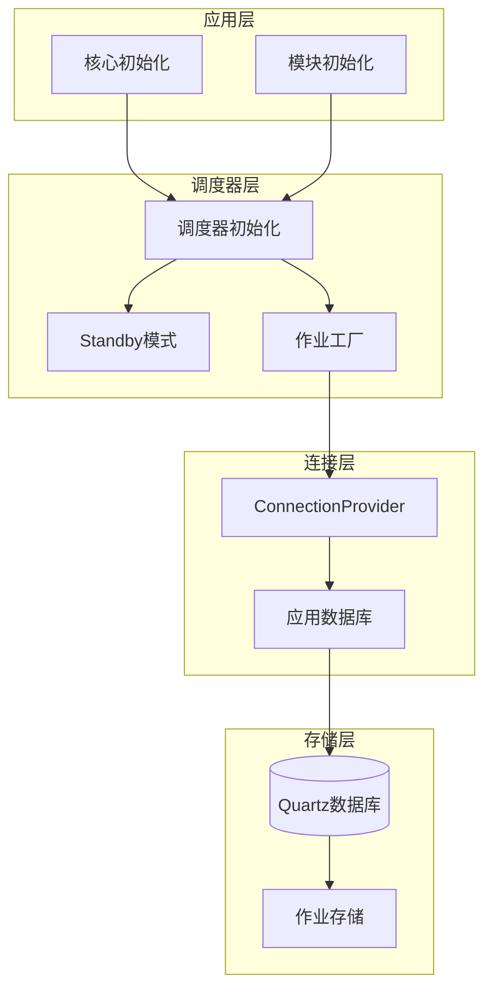
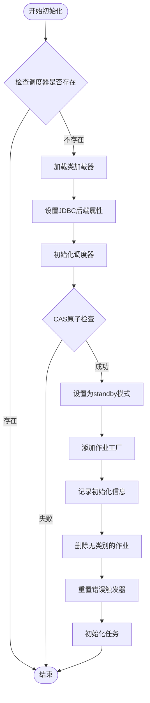
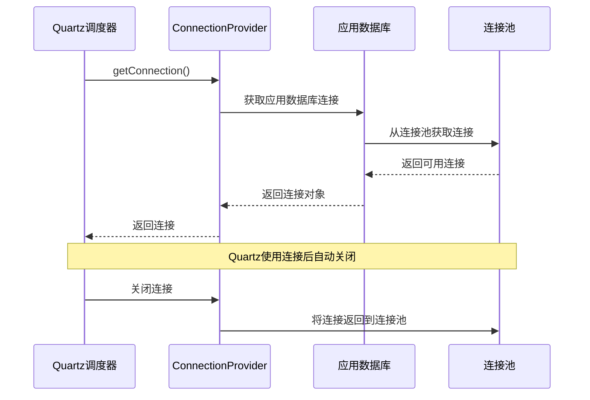
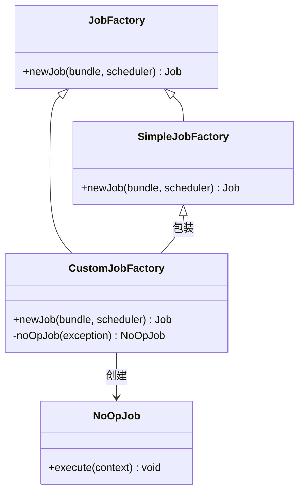
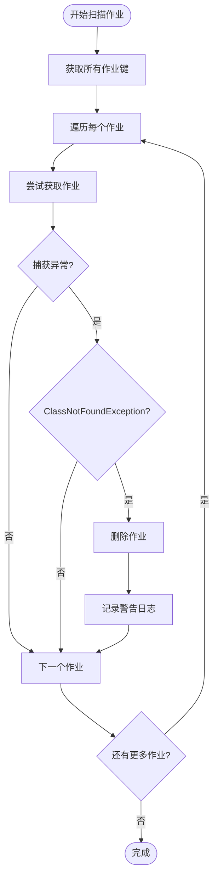
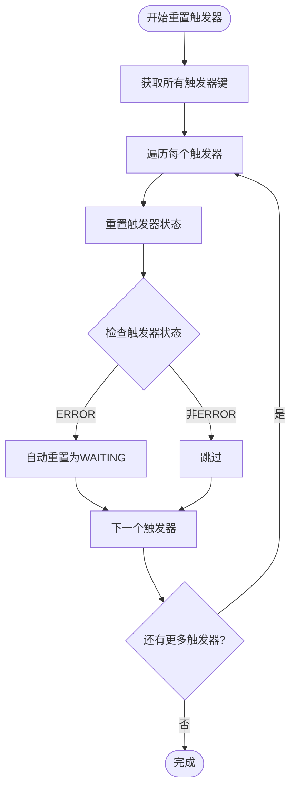
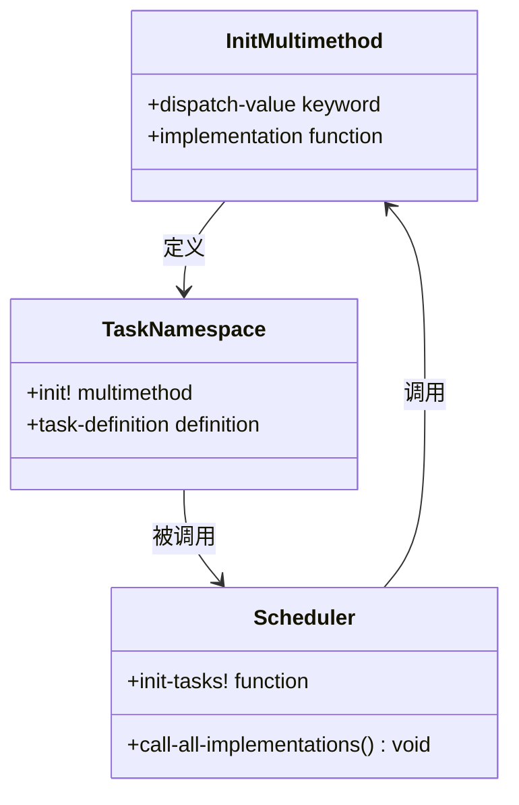
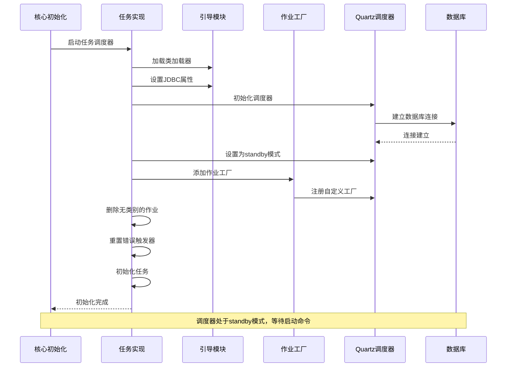
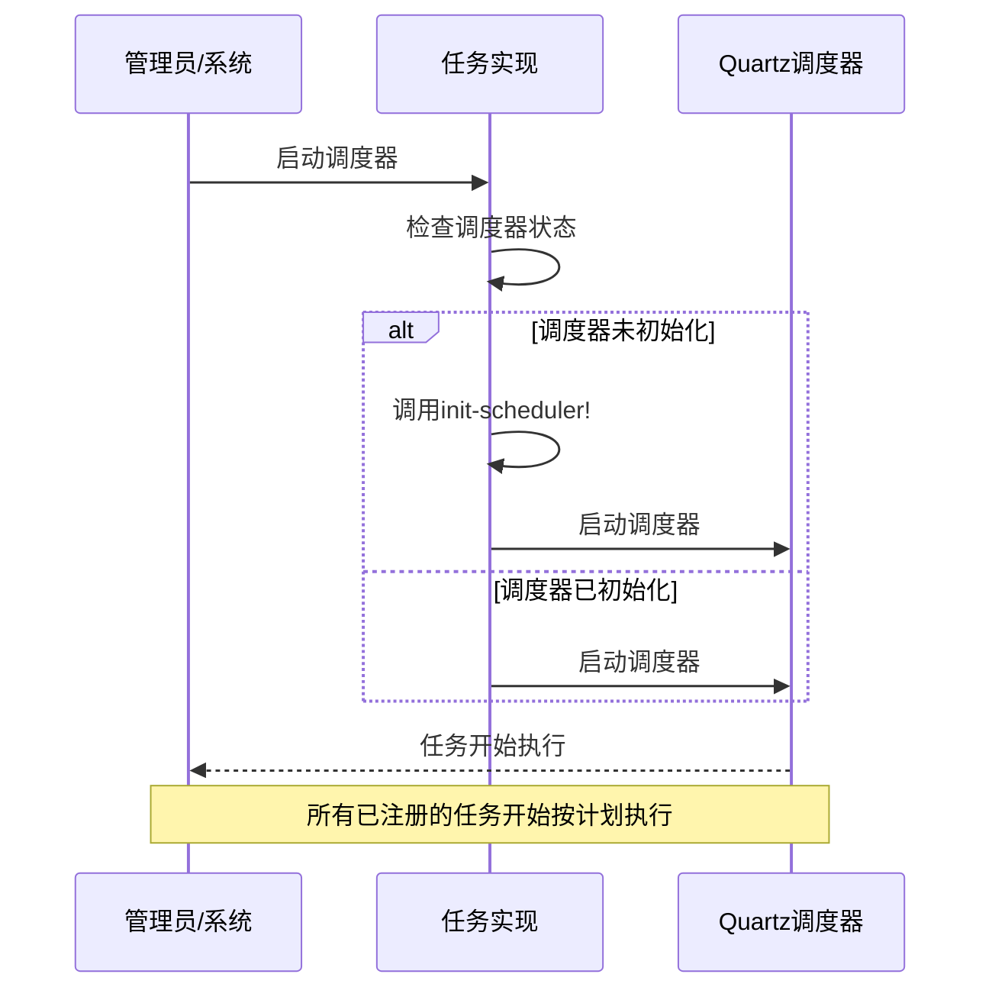

# Metabase任务调度初始化流程详细文档

<cite>
**本文档中引用的文件**
- [task/impl.clj](file://src/metabase/task/impl.clj)
- [task/bootstrap.clj](file://src/metabase/task/bootstrap.clj)
- [task/job_factory.clj](file://src/metabase/task/job_factory.clj)
- [task/QUARTZ.md](file://src/metabase/task/QUARTZ.md)
- [sync/init.clj](file://src/metabase/sync/init.clj)
- [pulse/init.clj](file://src/metabase/pulse/init.clj)
- [core/init.clj](file://src/metabase/core/init.clj)
</cite>

## 目录
1. [概述](#概述)
2. [系统架构](#系统架构)
3. [init-scheduler!函数详解](#init-scheduler函数详解)
4. [standby模式启动机制](#standby模式启动机制)
5. [自定义ConnectionProvider集成](#自定义connectionprovider集成)
6. [作业工厂注册流程](#作业工厂注册流程)
7. [JDBC后端属性配置](#jdbc后端属性配置)
8. [错误恢复机制](#错误恢复机制)
9. [任务初始化流程](#任务初始化流程)
10. [组件交互时序图](#组件交互时序图)
11. [最佳实践与注意事项](#最佳实践与注意事项)

## 概述

Metabase使用Quartz调度器进行后台任务管理，通过精心设计的初始化流程确保任务调度系统的稳定性和可靠性。本文档详细分析了`init-scheduler!`函数的执行流程，包括standby模式启动、自定义ConnectionProvider集成、作业工厂注册等关键步骤。

## 系统架构

Metabase任务调度系统采用分层架构设计，主要包含以下核心组件：



**图表来源**
- [task/impl.clj](file://src/metabase/task/impl.clj#L104-L130)
- [task/bootstrap.clj](file://src/metabase/task/bootstrap.clj#L10-L30)

## init-scheduler!函数详解

`init-scheduler!`函数是Metabase任务调度初始化的核心入口点，负责创建和配置Quartz调度器实例。

### 函数签名与功能

该函数的主要职责包括：
- 初始化Quartz调度器实例
- 配置JDBC后端属性
- 设置standby模式
- 注册作业工厂
- 执行错误恢复操作
- 初始化所有任务

### 执行流程



**图表来源**
- [task/impl.clj](file://src/metabase/task/impl.clj#L104-L130)

**章节来源**
- [task/impl.clj](file://src/metabase/task/impl.clj#L104-L130)

## standby模式启动机制

### 模式介绍

Standby模式是Quartz调度器的一种特殊状态，在此状态下调度器已初始化但不会自动执行任何任务。这种设计提供了以下优势：

1. **安全性**：防止意外任务执行
2. **可控性**：允许管理员手动控制任务启动
3. **维护友好**：支持系统维护期间的安全操作

### 实现细节

调度器进入standby模式的关键步骤：

1. **原子性检查**：使用`compare-and-set!`确保单例模式
2. **状态设置**：调用`qs/standby`方法设置状态
3. **日志记录**：记录初始化完成信息

### 启动控制

当需要启动任务执行时，系统会调用`start-scheduler!`函数，该函数会：
- 检查调度器是否被禁用
- 调用`init-scheduler!`（如果尚未初始化）
- 调用`qs/start`启动调度器

**章节来源**
- [task/impl.clj](file://src/metabase/task/impl.clj#L104-L130)
- [task/impl.clj](file://src/metabase/task/impl.clj#L128-L160)

## 自定义ConnectionProvider集成

### 设计理念

Metabase实现了自定义的`ConnectionProvider`来替代Quartz默认的连接管理方式，确保与应用数据库连接池的一致性。

### 核心特性

1. **连接池集成**：直接使用应用的数据库连接池
2. **资源管理**：自动处理连接的获取和释放
3. **线程安全**：确保多线程环境下的安全性

### 实现机制



**图表来源**
- [task/bootstrap.clj](file://src/metabase/task/bootstrap.clj#L10-L30)

### 关键实现要点

- **新连接获取**：每次请求都从连接池获取新的连接，避免现有连接被意外关闭
- **自动回收**：Quartz使用完连接后会自动关闭，这实际上将连接归还给连接池
- **异常处理**：完善的异常处理机制确保资源正确释放

**章节来源**
- [task/bootstrap.clj](file://src/metabase/task/bootstrap.clj#L10-L30)

## 作业工厂注册流程

### 作业工厂的作用

作业工厂负责创建和管理Quartz作业实例，是任务调度系统的核心组件之一。

### 自定义作业工厂

Metabase实现了自定义作业工厂来处理版本升级过程中的兼容性问题：



**图表来源**
- [task/job_factory.clj](file://src/metabase/task/job_factory.clj#L29-L64)

### 版本兼容性处理

自定义作业工厂的核心功能是处理滚动更新期间的类加载问题：

1. **类加载检查**：尝试加载作业类
2. **异常捕获**：捕获`ClassNotFoundException`和`NoClassDefFoundError`
3. **降级处理**：创建空操作作业（NoOpJob）代替失败的作业
4. **日志记录**：记录错误信息便于调试

### 触发器监听器

除了作业工厂，系统还注册了触发器监听器来监控作业执行：

- **事件拦截**：拦截作业执行事件
- **条件判断**：识别空操作作业
- **执行控制**：阻止空操作作业的执行

**章节来源**
- [task/job_factory.clj](file://src/metabase/task/job_factory.clj#L29-L64)

## JDBC后端属性配置

### 配置机制

`set-jdbc-backend-properties!`函数负责根据数据库类型设置Quartz的JDBC后端属性。

### 支持的数据库类型

目前系统支持PostgreSQL数据库的特定配置：

```clojure
(defn set-jdbc-backend-properties!
  "Set the appropriate system properties needed so Quartz can connect to the JDBC backend."
  [db-type]
  (when (= db-type :postgres)
    (System/setProperty "org.quartz.jobStore.driverDelegateClass" 
                       "org.quartz.impl.jdbcjobstore.PostgreSQLDelegate")))
```

### 属性配置原理

- **运行时设置**：由于数据库连接属性在运行时才确定，因此采用运行时配置而非静态配置文件
- **驱动适配**：为不同数据库提供特定的驱动委托类
- **性能优化**：针对PostgreSQL的特定优化配置

**章节来源**
- [task/bootstrap.clj](file://src/metabase/task/bootstrap.clj#L45-L53)

## 错误恢复机制

### 问题背景

Quartz在滚动更新场景下存在固有问题：新实例添加的新作业可能被旧实例拾取，但由于缺少对应类而陷入ERROR状态，无法自动恢复。

### 解决方案

系统实现了两层错误恢复机制：

#### 1. 删除无类别作业



**图表来源**
- [task/impl.clj](file://src/metabase/task/impl.clj#L83-L98)

#### 2. 重置错误触发器



**图表来源**
- [task/impl.clj](file://src/metabase/task/impl.clj#L104-L112)

### 技术实现

- **原子操作**：仅影响处于ERROR状态的触发器
- **批量处理**：一次性处理所有错误触发器
- **状态转换**：从ERROR自动转换为WAITING状态

**章节来源**
- [task/impl.clj](file://src/metabase/task/impl.clj#L83-L112)

## 任务初始化流程

### 多方法架构

Metabase使用Clojure的多方法（multimethod）来管理任务初始化：



**图表来源**
- [task/impl.clj](file://src/metabase/task/impl.clj#L54-L81)

### 初始化顺序

任务初始化遵循严格的顺序：

1. **发现阶段**：扫描所有`init!`方法
2. **排序阶段**：按名称排序以保证一致性
3. **执行阶段**：逐个执行初始化函数
4. **错误处理**：捕获并记录初始化错误

### 模块化设计

每个功能模块都有自己的初始化命名空间：

- **同步模块**：`metabase.sync.init`
- **脉冲模块**：`metabase.pulse.init`
- **通知模块**：`metabase.notification.init`

这些初始化命名空间被核心初始化系统加载，形成完整的初始化链。

**章节来源**
- [task/impl.clj](file://src/metabase/task/impl.clj#L54-L81)
- [core/init.clj](file://src/metabase/core/init.clj#L10-L40)

## 组件交互时序图

### 完整初始化时序



**图表来源**
- [task/impl.clj](file://src/metabase/task/impl.clj#L104-L130)
- [task/bootstrap.clj](file://src/metabase/task/bootstrap.clj#L10-L30)
- [task/job_factory.clj](file://src/metabase/task/job_factory.clj#L55-L64)

### 任务启动时序



**图表来源**
- [task/impl.clj](file://src/metabase/task/impl.clj#L128-L160)

## 最佳实践与注意事项

### 初始化最佳实践

1. **幂等性设计**：确保初始化函数可以安全地重复执行
2. **错误隔离**：单个任务初始化失败不应影响其他任务
3. **资源清理**：正确处理资源分配和释放
4. **日志记录**：提供详细的初始化过程日志

### 性能考虑

- **延迟初始化**：某些重型初始化操作可以采用延迟加载
- **并发控制**：合理控制初始化过程中的并发度
- **内存管理**：注意初始化过程中的内存使用

### 维护建议

- **定期检查**：定期验证调度器状态和任务执行情况
- **监控告警**：建立完善的监控和告警机制
- **版本兼容**：在版本升级时充分测试兼容性

### 故障排除

常见的初始化问题及解决方案：

1. **数据库连接失败**：检查数据库连接配置和网络连通性
2. **类加载失败**：确认相关类在类路径中可用
3. **权限不足**：验证数据库用户权限设置
4. **配置冲突**：检查Quartz配置参数的正确性

通过遵循这些最佳实践和注意事项，可以确保Metabase任务调度系统的稳定运行和高效维护。