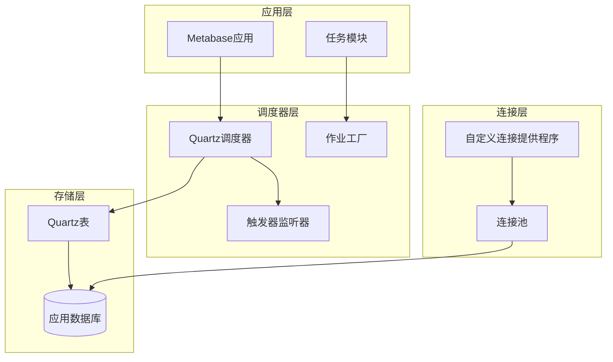
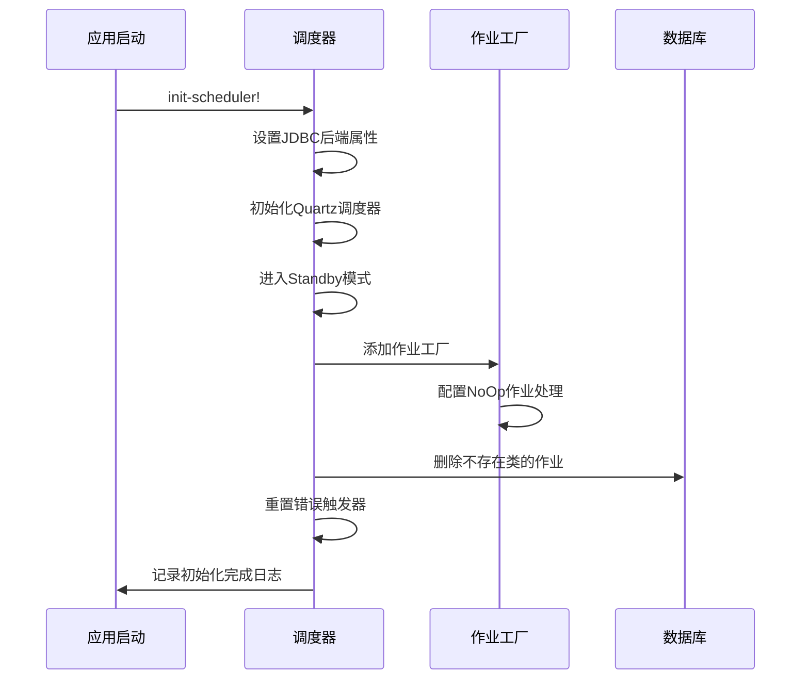
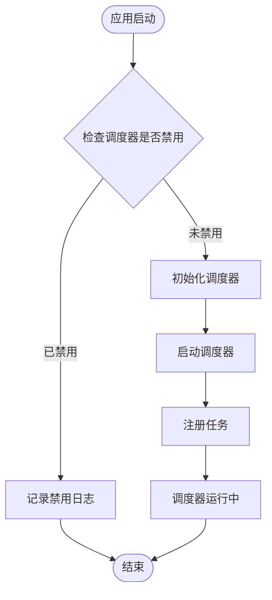
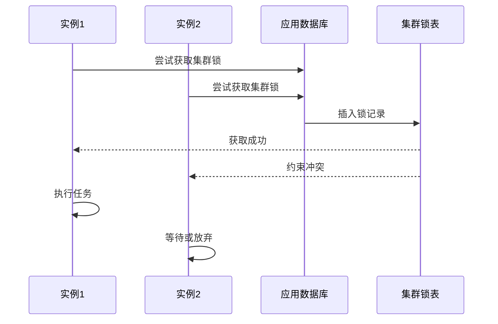
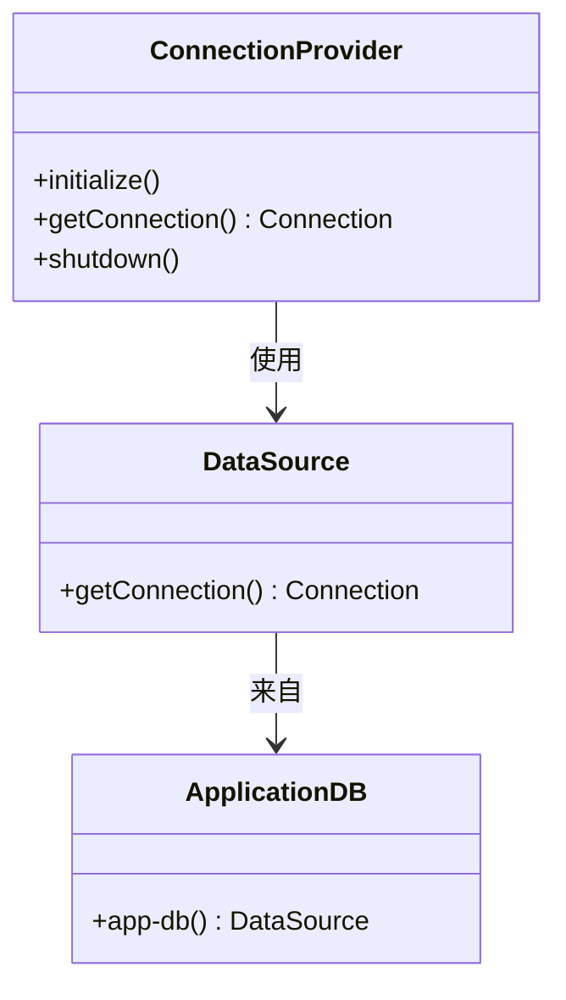
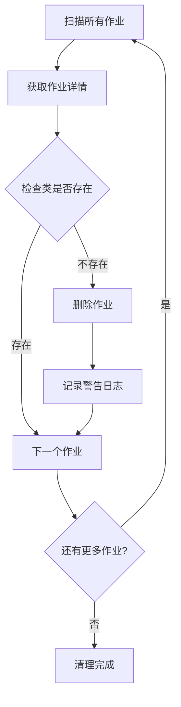
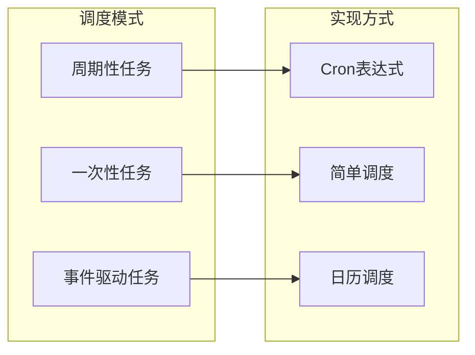

# Metabase任务调度系统架构文档

<cite>
**本文档中引用的文件**
- [impl.clj](file://src/metabase/task/impl.clj)
- [job_factory.clj](file://src/metabase/task/job_factory.clj)
- [bootstrap.clj](file://src/metabase/task/bootstrap.clj)
- [core.clj](file://src/metabase/task/core.clj)
- [QUARTZ.md](file://src/metabase/task/QUARTZ.md)
- [cluster_lock.clj](file://src/metabase/app_db/cluster_lock.clj)
- [startup/core.clj](file://src/metabase/startup/core.clj)
- [core.clj](file://src/metabase/core/core.clj)
</cite>

## 目录
1. [概述](#概述)
2. [系统架构](#系统架构)
3. [调度器初始化流程](#调度器初始化流程)
4. [任务调度器生命周期管理](#任务调度器生命周期管理)
5. [多实例部署与集群协调](#多实例部署与集群协调)
6. [自定义ConnectionProvider集成](#自定义connectionprovider集成)
7. [错误恢复策略](#错误恢复策略)
8. [任务类型与调度模式](#任务类型与调度模式)
9. [性能优化与监控](#性能优化与监控)
10. [故障排除指南](#故障排除指南)

## 概述

Metabase任务调度系统基于Quartz调度框架构建，提供了一个强大而灵活的后台任务管理系统。该系统支持多种任务调度模式，包括一次性启动任务、周期性任务和事件驱动任务，并具备完善的错误恢复和集群协调机制。

### 核心特性

- **基于Quartz的调度引擎**：利用成熟的Quartz调度框架提供可靠的调度服务
- **多实例部署支持**：通过集群锁机制实现多实例环境下的任务协调
- **自定义连接提供程序**：集成应用数据库连接池，提高资源利用率
- **智能错误恢复**：自动处理丢失类的作业和错误状态触发器
- **灵活的任务类型**：支持一次性任务、周期性任务和事件触发任务

## 系统架构

**图表来源**
- [impl.clj](file://src/metabase/task/impl.clj#L1-L50)
- [job_factory.clj](file://src/metabase/task/job_factory.clj#L1-L30)
- [bootstrap.clj](file://src/metabase/task/bootstrap.clj#L1-L25)

## 调度器初始化流程

### Standby模式启动

调度器采用Standby模式启动策略，确保在完全初始化前不会执行任何任务。

**图表来源**
- [impl.clj](file://src/metabase/task/impl.clj#L110-L130)
- [job_factory.clj](file://src/metabase/task/job_factory.clj#L55-L65)

### 连接池配置

调度器通过自定义ConnectionProvider集成应用数据库连接池，实现统一的连接管理。

**节来源**
- [bootstrap.clj](file://src/metabase/task/bootstrap.clj#L10-L35)

### 作业工厂初始化

作业工厂负责处理作业类加载失败的情况，通过NoOp作业避免调度器进入错误状态。

**节来源**
- [job_factory.clj](file://src/metabase/task/job_factory.clj#L20-L45)

## 任务调度器生命周期管理

### 启动流程

**图表来源**
- [impl.clj](file://src/metabase/task/impl.clj#L130-L150)

### 停止流程

调度器停止时会优雅地关闭所有正在执行的任务和连接。

**节来源**
- [impl.clj](file://src/metabase/task/impl.clj#L150-L160)

### 待机状态转换

调度器支持在Standby和Running状态之间动态切换，便于维护操作。

**节来源**
- [impl.clj](file://src/metabase/task/impl.clj#L110-L130)

## 多实例部署与集群协调

### 集群锁机制

为了防止多实例环境下重复执行任务，系统实现了基于数据库的集群锁机制。

**图表来源**
- [cluster_lock.clj](file://src/metabase/app_db/cluster_lock.clj#L58-L83)

### 任务初始化协调

任务初始化过程通过多态方法分发机制确保每个任务只被初始化一次。

**节来源**
- [impl.clj](file://src/metabase/task/impl.clj#L54-L81)

## 自定义ConnectionProvider集成

### 连接提供程序设计

自定义ConnectionProvider实现了Quartz与Metabase应用数据库连接池的无缝集成。

**图表来源**
- [bootstrap.clj](file://src/metabase/task/bootstrap.clj#L10-L35)

### 连接管理策略

系统采用独立连接获取策略，确保Quartz连接不会干扰应用其他操作。

**节来源**
- [bootstrap.clj](file://src/metabase/task/bootstrap.clj#L15-L30)

## 错误恢复策略

### 丢失类的作业清理

系统定期扫描并删除因版本升级导致的不存在类的作业。

**图表来源**
- [impl.clj](file://src/metabase/task/impl.clj#L83-L100)

### 错误状态触发器重置

针对滚动更新过程中出现的错误触发器，系统提供自动重置功能。

**节来源**
- [impl.clj](file://src/metabase/task/impl.clj#L104-L115)

### NoOp作业机制

当作业类加载失败时，系统自动创建NoOp作业避免调度器进入永久错误状态。

**节来源**
- [job_factory.clj](file://src/metabase/task/job_factory.clj#L20-L35)

## 任务类型与调度模式

### 任务分类

根据执行时机和频率，任务可分为以下类型：

| 任务类型 | 执行时机 | 典型用途 | 集群行为 |
|---------|---------|---------|---------|
| 一次性启动任务 | 应用启动时 | 初始化操作 | 每个实例都执行 |
| 周期性任务 | 定时执行 | 数据同步、报告发送 | 由调度器协调 |
| 事件驱动任务 | 事件触发 | 数据变更响应 | 可配置执行策略 |

### 调度模式

**图表来源**
- [QUARTZ.md](file://src/metabase/task/QUARTZ.md#L25-L80)

### 时间区域处理

系统支持基于报告时区的时间调度，确保全球用户的一致体验。

**节来源**
- [QUARTZ.md](file://src/metabase/task/QUARTZ.md#L60-L75)

## 性能优化与监控

### 连接池优化

通过共享应用数据库连接池，减少连接开销和资源消耗。

### 任务监控

系统提供详细的调度器状态信息和任务执行统计。

**节来源**
- [impl.clj](file://src/metabase/task/impl.clj#L300-L350)

### Prometheus集成

调度器集成了Prometheus指标收集，便于监控和告警。

**节来源**
- [impl.clj](file://src/metabase/task/impl.clj#L125-L130)

## 故障排除指南

### 常见问题诊断

1. **调度器无法启动**
   - 检查数据库连接配置
   - 验证Quartz表结构完整性
   - 查看启动日志中的错误信息

2. **任务执行异常**
   - 检查任务类是否正确加载
   - 验证任务依赖的服务可用性
   - 查看任务执行上下文信息

3. **多实例重复执行**
   - 确认集群锁机制正常工作
   - 检查数据库事务隔离级别
   - 验证锁超时配置

### 调试工具

系统提供了丰富的调试接口和日志信息，便于问题定位和性能分析。

**节来源**
- [impl.clj](file://src/metabase/task/impl.clj#L350-L377)

## 结论

Metabase任务调度系统通过精心设计的架构和完善的错误恢复机制，为应用提供了可靠、高效的后台任务管理能力。其多实例部署支持和集群协调机制确保了在复杂生产环境中的稳定运行，而自定义连接提供程序和NoOp作业机制则体现了系统对资源利用和容错性的深度考虑。