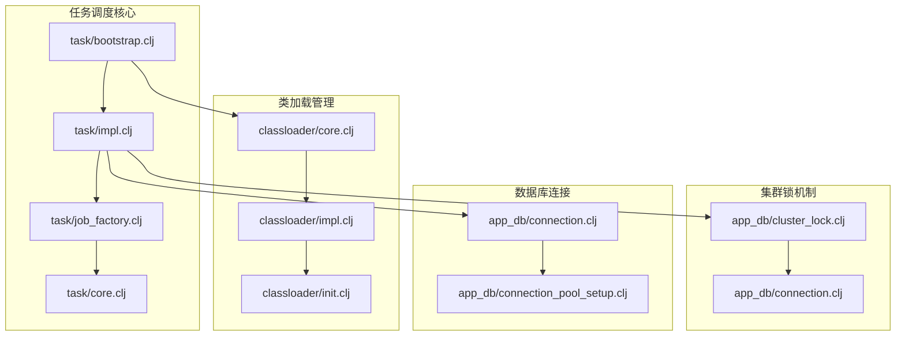
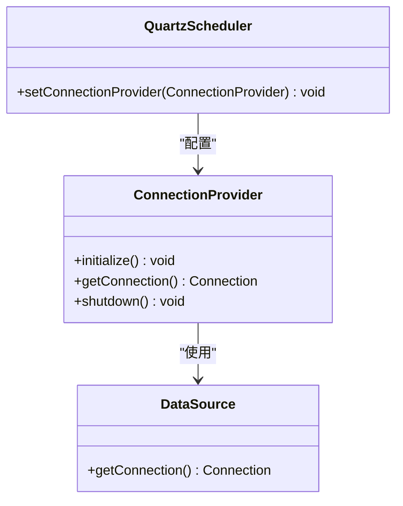
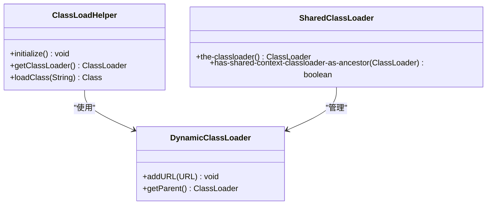
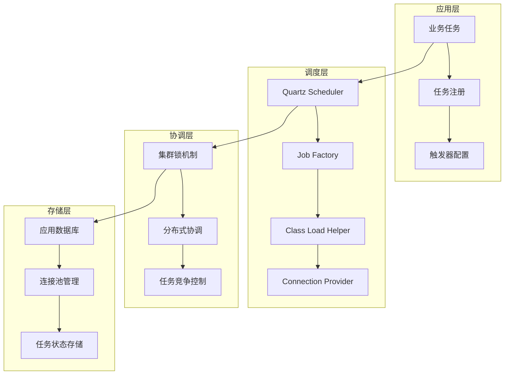
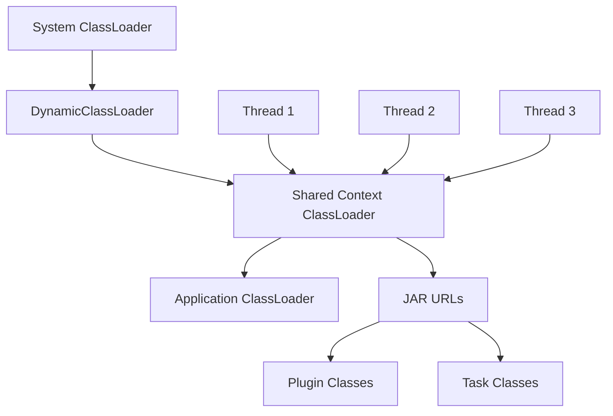
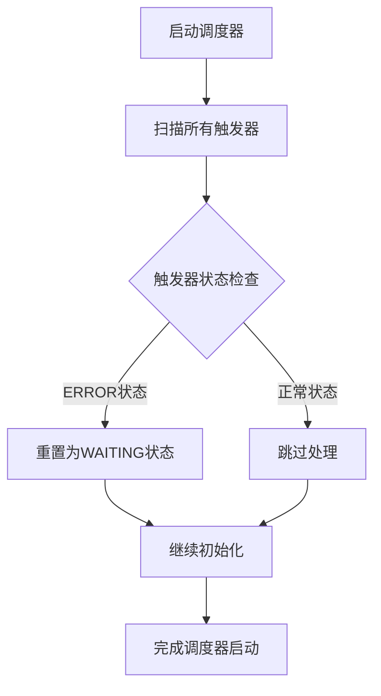
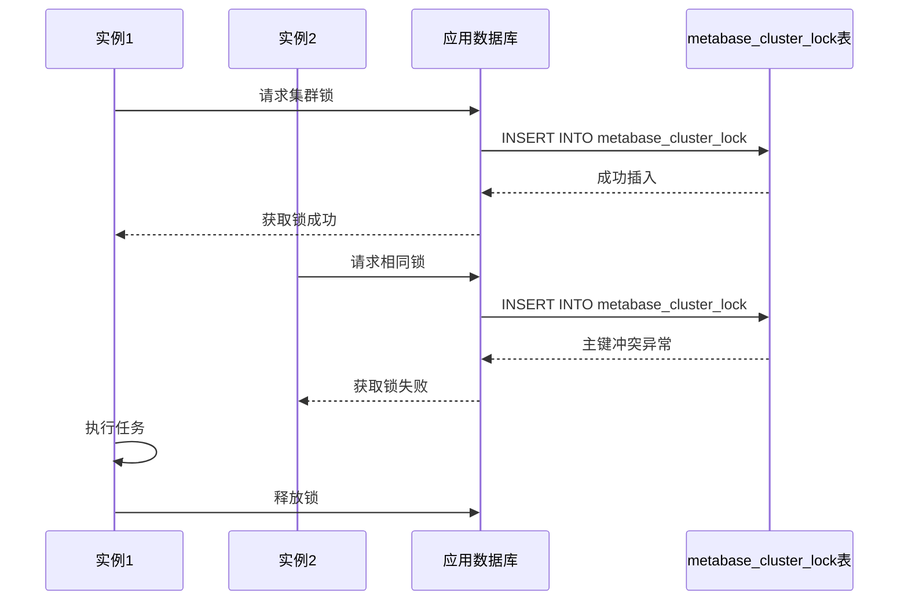
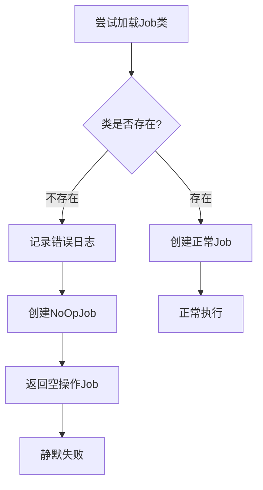
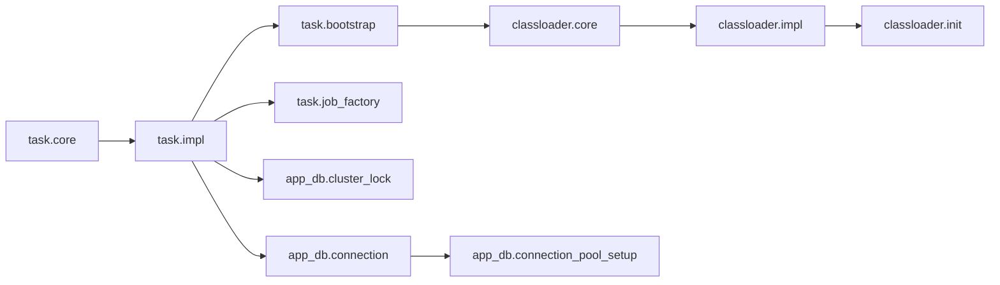

# 多实例协调机制

<cite>
**本文档中引用的文件**
- [bootstrap.clj](file://src/metabase/task/bootstrap.clj)
- [impl.clj](file://src/metabase/task/impl.clj)
- [job_factory.clj](file://src/metabase/task/job_factory.clj)
- [core.clj](file://src/metabase/classloader/core.clj)
- [impl.clj](file://src/metabase/classloader/impl.clj)
- [cluster_lock.clj](file://src/metabase/app_db/cluster_lock.clj)
- [QUARTZ.md](file://src/metabase/task/QUARTZ.md)
- [core.clj](file://src/metabase/task/core.clj)
</cite>

## 目录
1. [概述](#概述)
2. [项目结构](#项目结构)
3. [核心组件](#核心组件)
4. [架构概览](#架构概览)
5. [详细组件分析](#详细组件分析)
6. [依赖关系分析](#依赖关系分析)
7. [性能考虑](#性能考虑)
8. [故障排除指南](#故障排除指南)
9. [结论](#结论)

## 概述

Metabase在多实例部署环境中使用复杂的任务调度协调机制来确保分布式环境下的任务正确执行。该系统通过自定义的ConnectionProvider复用应用数据库连接池，通过ClassLoadHelper确保跨实例的类加载一致性，并实现了多种机制来防止任务竞争和重复执行。

## 项目结构

Metabase的任务调度协调机制主要分布在以下关键模块中：



**图表来源**
- [bootstrap.clj](file://src/metabase/task/bootstrap.clj#L1-L55)
- [impl.clj](file://src/metabase/task/impl.clj#L1-L50)
- [job_factory.clj](file://src/metabase/task/job_factory.clj#L1-L66)

## 核心组件

### 自定义ConnectionProvider

Metabase实现了一个自定义的ConnectionProvider来复用应用程序的数据库连接池：



**图表来源**
- [bootstrap.clj](file://src/metabase/task/bootstrap.clj#L10-L35)

### ClassLoadHelper机制

ClassLoadHelper确保所有Metabase实例使用相同的类加载器，保证类的一致性：



**图表来源**
- [bootstrap.clj](file://src/metabase/task/bootstrap.clj#L37-L50)
- [impl.clj](file://src/metabase/classloader/impl.clj#L60-L85)

**节来源**
- [bootstrap.clj](file://src/metabase/task/bootstrap.clj#L1-L55)
- [impl.clj](file://src/metabase/classloader/impl.clj#L1-L167)

## 架构概览

Metabase的多实例任务调度协调架构采用分层设计，从底层的数据库连接到上层的任务执行：



**图表来源**
- [impl.clj](file://src/metabase/task/impl.clj#L80-L130)
- [cluster_lock.clj](file://src/metabase/app_db/cluster_lock.clj#L1-L50)

## 详细组件分析

### ConnectionProvider实现原理

ConnectionProvider是实现数据库连接池复用的核心组件：

#### 关键特性
1. **连接池复用**：直接使用Metabase的应用程序数据库连接池
2. **线程安全**：每次获取新连接，避免与现有连接冲突
3. **自动回收**：Quartz会自动关闭连接，返回到连接池

#### 实现细节
- 避免使用当前绑定的连接，防止Quartz关闭后影响调用方
- 使用`app-db`函数动态解析数据源
- 确保连接获取的原子性和安全性

**节来源**
- [bootstrap.clj](file://src/metabase/task/bootstrap.clj#L10-L35)

### ClassLoadHelper跨实例一致性

ClassLoadHelper确保所有实例使用统一的类加载器：

#### 类加载器层次结构


**图表来源**
- [impl.clj](file://src/metabase/classloader/impl.clj#L90-L115)

#### 关键机制
1. **共享上下文类加载器**：确保所有线程使用相同的类加载器
2. **动态URL添加**：运行时向类加载器添加JAR路径
3. **层次结构维护**：保持正确的父类加载器关系

**节来源**
- [impl.clj](file://src/metabase/classloader/impl.clj#L25-L85)

### reset-errored-triggers!机制

该机制解决滚动更新时触发器错误状态的问题：

#### 工作流程


**图表来源**
- [impl.clj](file://src/metabase/task/impl.clj#L104-L115)

#### 解决策略
1. **自动检测**：扫描所有处于ERROR状态的触发器
2. **批量重置**：使用Quartz提供的API重置状态
3. **无状态恢复**：只影响ERROR状态的触发器

**节来源**
- [impl.clj](file://src/metabase/task/impl.clj#L104-L115)

### 任务竞争和重复执行预防

#### DisallowConcurrentExecution注解
通过Quartz的`DisallowConcurrentExecution`注解防止并发执行：

```clojure
(task/defjob ^{org.quartz.DisallowConcurrentExecution true} MyJob [job-context]
  ;; 任务逻辑
  )
```

#### 集群锁机制
使用数据库级别的分布式锁防止重复执行：



**图表来源**
- [cluster_lock.clj](file://src/metabase/app_db/cluster_lock.clj#L40-L70)

#### JobFactory错误处理
自定义JobFactory处理类加载错误：



**图表来源**
- [job_factory.clj](file://src/metabase/task/job_factory.clj#L35-L45)

**节来源**
- [job_factory.clj](file://src/metabase/task/job_factory.clj#L1-L66)
- [cluster_lock.clj](file://src/metabase/app_db/cluster_lock.clj#L1-L106)

## 依赖关系分析

### 组件间依赖关系



**图表来源**
- [bootstrap.clj](file://src/metabase/task/bootstrap.clj#L1-L5)
- [impl.clj](file://src/metabase/task/impl.clj#L1-L20)

### 启动顺序依赖

1. **类加载器初始化**：确保所有组件使用统一的类加载器
2. **数据库连接池设置**：建立连接池基础设施
3. **调度器初始化**：创建Quartz调度器实例
4. **任务注册**：加载并注册所有任务
5. **集群锁准备**：确保分布式协调机制就绪

**节来源**
- [impl.clj](file://src/metabase/task/impl.clj#L115-L130)

## 性能考虑

### 连接池优化
- **连接复用**：避免频繁创建和销毁数据库连接
- **超时设置**：合理设置连接超时时间
- **资源清理**：确保连接正确归还到池中

### 类加载优化
- **延迟加载**：按需加载类和资源
- **缓存机制**：缓存已加载的类以提高性能
- **内存管理**：及时释放不再需要的类加载器

### 分布式协调优化
- **锁粒度控制**：使用细粒度锁减少竞争
- **重试机制**：实现指数退避重试算法
- **超时处理**：设置合理的锁超时时间

## 故障排除指南

### 常见问题及解决方案

#### 触发器错误状态
**症状**：任务无法执行，触发器状态显示ERROR
**原因**：滚动更新导致类找不到或版本不匹配
**解决方案**：系统自动调用`reset-errored-triggers!`重置状态

#### 类加载不一致
**症状**：不同实例加载不同的类版本
**原因**：类加载器层次结构混乱
**解决方案**：确保使用共享上下文类加载器

#### 任务重复执行
**症状**：同一任务在多个实例中同时执行
**原因**：缺少分布式锁或锁机制失效
**解决方案**：使用集群锁机制确保唯一性

#### 连接池耗尽
**症状**：数据库连接请求被拒绝
**原因**：连接泄漏或连接池配置不当
**解决方案**：检查连接使用情况，调整池大小

**节来源**
- [impl.clj](file://src/metabase/task/impl.clj#L104-L115)
- [job_factory.clj](file://src/metabase/task/job_factory.clj#L15-L25)

## 结论

Metabase的多实例任务调度协调机制通过多层次的设计实现了可靠的分布式任务执行：

1. **ConnectionProvider**确保了数据库连接的有效复用
2. **ClassLoadHelper**保证了跨实例的类加载一致性
3. **reset-errored-triggers!**机制优雅地处理了滚动更新问题
4. **分布式锁**提供了强一致性的任务协调能力
5. **JobFactory**增强了系统的容错能力

这些组件协同工作，为Metabase在多实例环境下的稳定运行提供了坚实的基础。通过合理配置和监控，可以确保任务调度系统的高可用性和高性能。