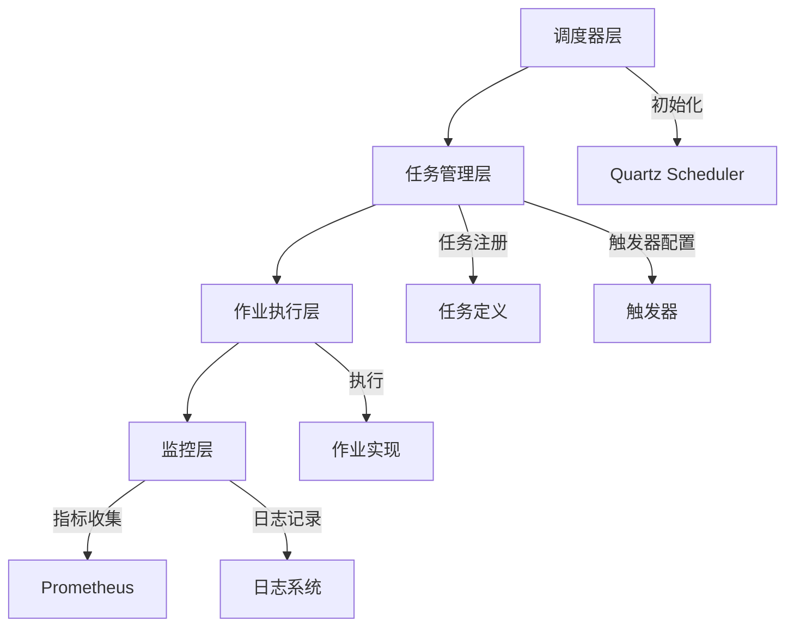
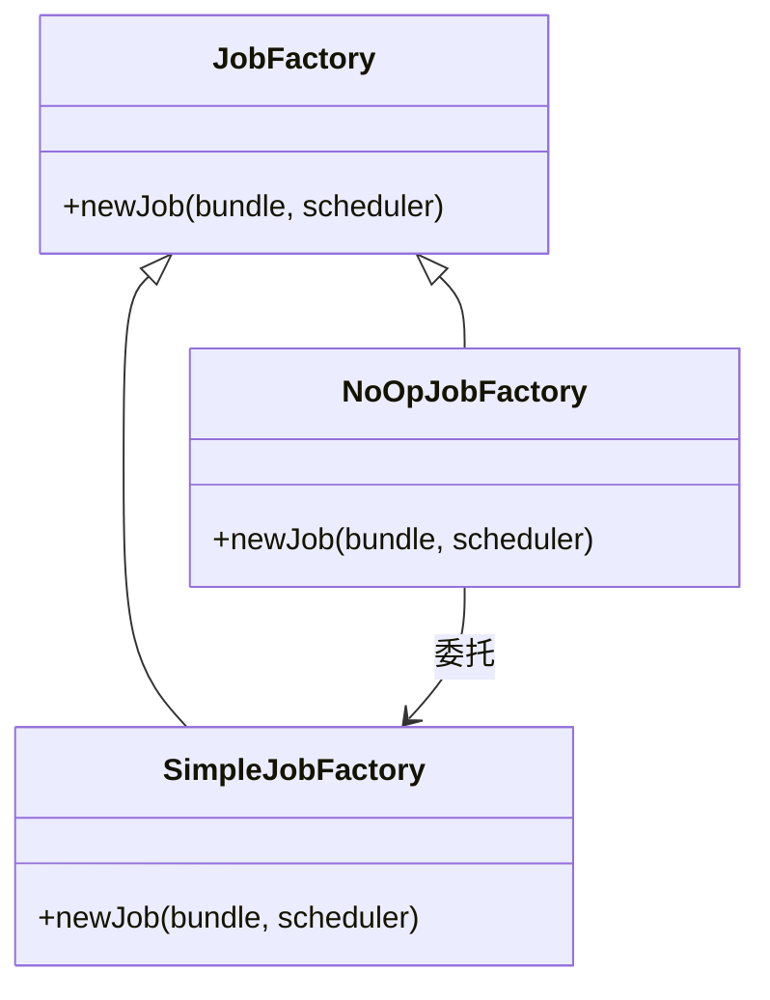
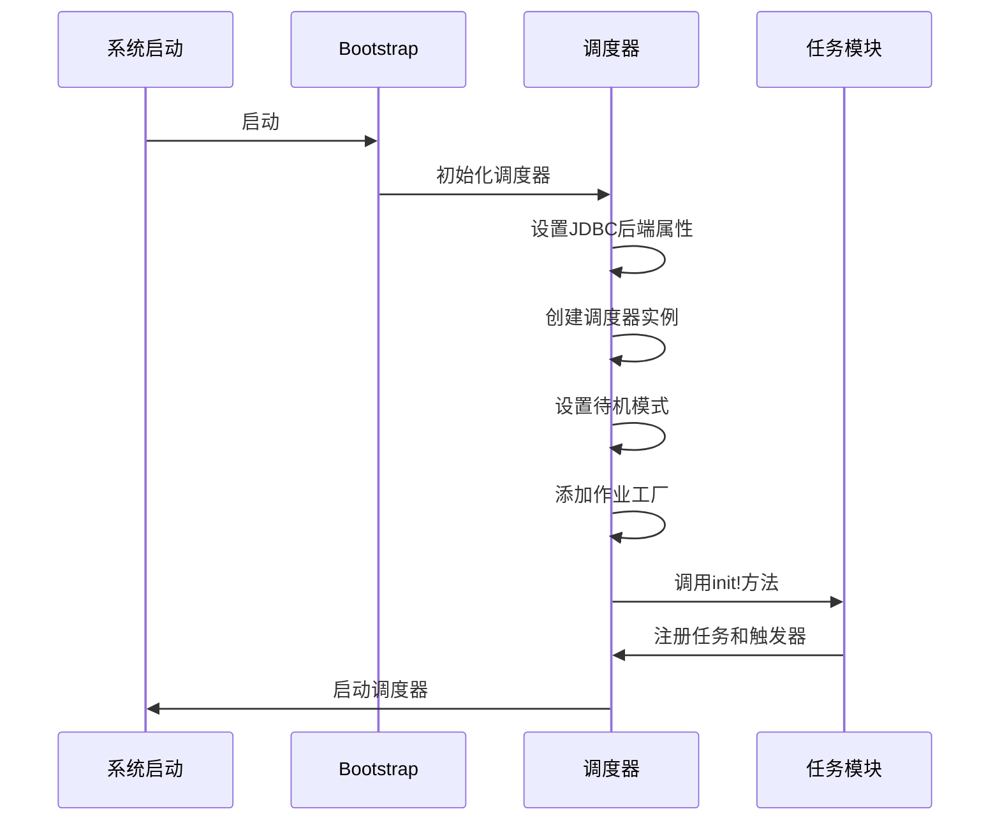
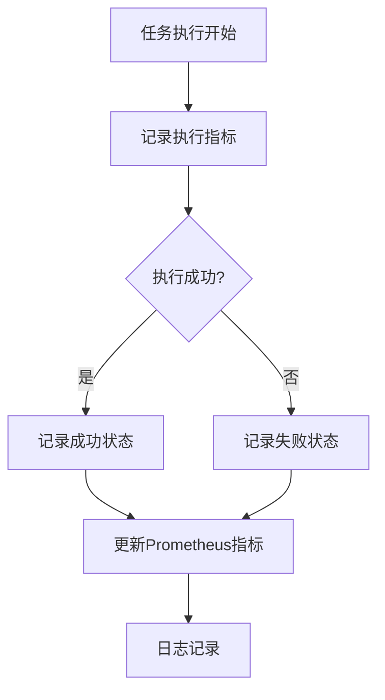
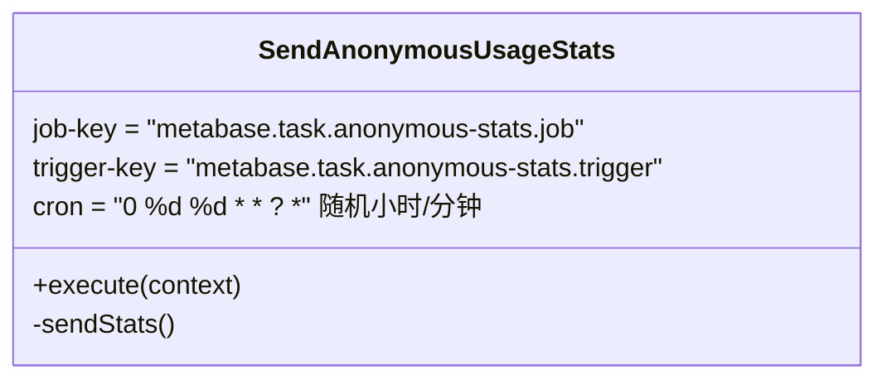
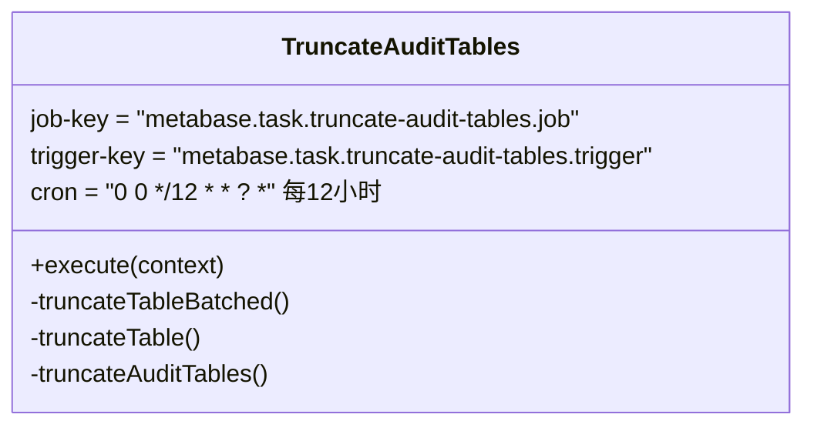
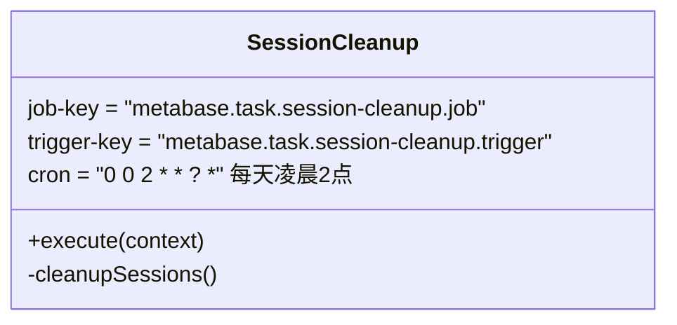
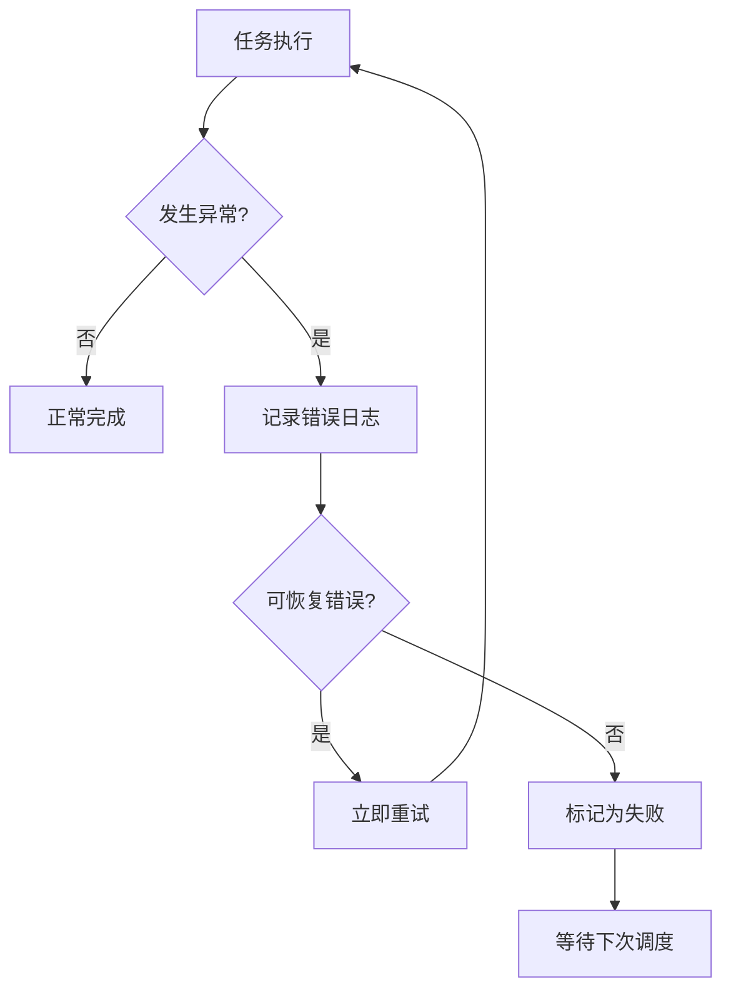

# 任务调度系统

<cite>
**本文档中引用的文件**  
- [src/metabase/task/core.clj](file://src/metabase/task/core.clj)
- [src/metabase/task/impl.clj](file://src/metabase/task/impl.clj)
- [src/metabase/task/bootstrap.clj](file://src/metabase/task/bootstrap.clj)
- [src/metabase/task/job_factory.clj](file://src/metabase/task/job_factory.clj)
- [src/metabase/analytics/quartz.clj](file://src/metabase/analytics/quartz.clj)
- [src/metabase/task/QUARTZ.md](file://src/metabase/task/QUARTZ.md)
- [src/metabase/analytics/task/send_anonymous_stats.clj](file://src/metabase/analytics/task/send_anonymous_stats.clj)
- [src/metabase/audit_app/task/truncate_audit_tables.clj](file://src/metabase/audit_app/task/truncate_audit_tables.clj)
- [src/metabase/session/task/session_cleanup.clj](file://src/metabase/session/task/session_cleanup.clj)
- [src/metabase/sync/task/sync_databases.clj](file://src/metabase/sync/task/sync_databases.clj)
</cite>

## 目录
1. [简介](#简介)
2. [系统架构](#系统架构)
3. [核心组件](#核心组件)
4. [任务初始化流程](#任务初始化流程)
5. [任务状态管理](#任务状态管理)
6. [定时任务实现](#定时任务实现)
7. [上下文管理与错误处理](#上下文管理与错误处理)
8. [自定义任务开发指南](#自定义任务开发指南)

## 简介
Metabase任务调度系统基于Quartz框架构建，负责管理后台各种周期性任务的执行。该系统在Metabase启动时初始化，管理包括数据库同步、脉冲报告发送、会话清理、审计日志清理等关键后台任务。本文档详细分析该系统的架构设计、核心组件、任务注册机制、触发器配置、作业执行流程以及自定义任务开发方法。

## 系统架构
Metabase任务调度系统采用Quartz作为核心调度引擎，通过Clojure封装提供高层API。系统架构分为四个主要层次：调度器层、任务管理层、作业执行层和监控层。



**图示来源**
- [src/metabase/task/impl.clj](file://src/metabase/task/impl.clj#L131-L160)
- [src/metabase/analytics/quartz.clj](file://src/metabase/analytics/quartz.clj#L1-L92)

## 核心组件
任务调度系统由多个核心组件构成，每个组件负责特定的功能。主要组件包括调度器实例、任务注册机制、触发器管理、作业工厂和监听器。

### 调度器实例
调度器是整个系统的核心，负责管理所有任务的生命周期。系统使用单例模式维护调度器实例，通过原子引用确保线程安全。

**组件来源**
- [src/metabase/task/impl.clj](file://src/metabase/task/impl.clj#L25-L35)

### 任务注册机制
任务注册通过`init!`多态函数实现，各个模块在系统启动时调用此函数注册自己的任务。这种设计实现了模块间的松耦合。

**组件来源**
- [src/metabase/task/impl.clj](file://src/metabase/task/impl.clj#L45-L65)

### 作业工厂
自定义作业工厂用于处理版本升级时的任务兼容性问题。当旧版本实例尝试执行新版本任务时，工厂返回空操作作业而非抛出异常。



**图示来源**
- [src/metabase/task/job_factory.clj](file://src/metabase/task/job_factory.clj#L1-L65)

## 任务初始化流程
系统启动时，任务调度器经历一系列初始化步骤，确保所有任务正确注册并准备执行。

### 初始化序列


**图示来源**
- [src/metabase/task/impl.clj](file://src/metabase/task/impl.clj#L131-L160)
- [src/metabase/task/bootstrap.clj](file://src/metabase/task/bootstrap.clj#L1-L54)

### 初始化步骤详解
1. **类加载器准备**：确保所有必要的类都能被正确加载
2. **JDBC后端配置**：根据数据库类型设置相应的驱动代理类
3. **调度器实例化**：创建Quartz调度器实例并置于待机模式
4. **作业工厂设置**：添加自定义作业工厂处理版本兼容性
5. **任务清理**：删除已不存在的作业定义
6. **错误触发器重置**：将处于错误状态的触发器重置为等待状态
7. **任务初始化**：调用所有`init!`实现来注册任务

**组件来源**
- [src/metabase/task/impl.clj](file://src/metabase/task/impl.clj#L131-L160)

## 任务状态管理
系统提供完善的任务状态管理机制，包括状态监控、指标收集和健康检查。

### 状态监控
系统通过Prometheus监听器收集任务执行指标，包括执行次数、执行状态和任务状态分布。



**图示来源**
- [src/metabase/analytics/quartz.clj](file://src/metabase/analytics/quartz.clj#L1-L92)

### 状态类型
系统维护多种任务状态，反映任务的生命周期：

| 状态 | 描述 | 来源 |
|------|------|------|
| EXECUTING | 任务正在执行 | [src/metabase/analytics/quartz.clj](file://src/metabase/analytics/quartz.clj#L32-L55) |
| WAITING | 任务等待执行 | [src/metabase/analytics/quartz.clj](file://src/metabase/analytics/quartz.clj#L32-L55) |
| PAUSED | 任务已暂停 | [src/metabase/analytics/quartz.clj](file://src/metabase/analytics/quartz.clj#L32-L55) |
| BLOCKED | 任务被阻塞 | [src/metabase/analytics/quartz.clj](file://src/metabase/analytics/quartz.clj#L32-L55) |
| ERROR | 任务出错 | [src/metabase/analytics/quartz.clj](file://src/metabase/analytics/quartz.clj#L32-L55) |

## 定时任务实现
系统实现了多种类型的定时任务，每种任务都有特定的业务目的和执行模式。

### 匿名统计发送任务
定期发送匿名使用统计信息给Metabase团队，帮助改进产品。



**组件来源**
- [src/metabase/analytics/task/send_anonymous_stats.clj](file://src/metabase/analytics/task/send_anonymous_stats.clj#L1-L41)

### 脉冲报告发送任务
定时发送预定义的报告给指定用户或渠道。

**组件来源**
- [src/metabase/pulse/task/send_pulses.clj](file://src/metabase/pulse/task/send_pulses.clj#L57-L91)

### 审计日志清理任务
根据配置的保留策略清理过期的审计日志。



**组件来源**
- [src/metabase/audit_app/task/truncate_audit_tables.clj](file://src/metabase/audit_app/task/truncate_audit_tables.clj#L1-L92)

### 会话清理任务
定期清理过期的用户会话，释放系统资源。



**组件来源**
- [src/metabase/session/task/session_cleanup.clj](file://src/metabase/session/task/session_cleanup.clj#L1-L41)

### 数据库同步任务
定期同步数据库元数据和分析信息。

**组件来源**
- [src/metabase/sync/task/sync_databases.clj](file://src/metabase/sync/task/sync_databases.clj#L1-L367)

## 上下文管理与错误处理
系统提供完善的执行上下文管理和错误处理策略，确保任务的可靠执行。

### 上下文管理
每个任务执行时都有独立的上下文，包含任务元数据和运行时信息。

| 上下文属性 | 描述 | 访问方式 |
|-----------|------|---------|
| jobDetail | 任务详情 | context.getJobDetail() |
| trigger | 触发器 | context.getTrigger() |
| jobDataMap | 任务数据 | context.getJobDetail().getJobDataMap() |
| fireTime | 触发时间 | context.getFireTime() |
| previousFireTime | 上次触发时间 | context.getPreviousFireTime() |

**组件来源**
- [src/metabase/task/impl.clj](file://src/metabase/task/impl.clj#L350-L377)

### 错误处理策略
系统采用多层次的错误处理机制：

1. **作业级重试**：使用`rerun-on-error`宏实现任务失败立即重试
2. **版本兼容性处理**：通过自定义作业工厂处理跨版本任务执行
3. **启动时错误恢复**：自动重置处于错误状态的触发器
4. **异常捕获**：在关键操作周围添加异常捕获和日志记录



**组件来源**
- [src/metabase/task/impl.clj](file://src/metabase/task/impl.clj#L350-L377)
- [src/metabase/task/job_factory.clj](file://src/metabase/task/job_factory.clj#L1-L65)

## 自定义任务开发指南
开发者可以遵循特定模式创建自定义后台任务，集成到Metabase任务调度系统中。

### 任务创建步骤
1. **定义任务命名空间**：创建新的Clojure命名空间
2. **定义作业类**：使用`defjob`宏定义任务逻辑
3. **实现init!方法**：在系统启动时注册任务
4. **配置触发器**：定义任务执行计划

### 基本模板
```clojure
(ns my.custom.task
  (:require
   [clojurewerkz.quartzite.jobs :as jobs]
   [clojurewerkz.quartzite.schedule.cron :as cron]
   [clojurewerkz.quartzite.triggers :as triggers]
   [metabase.task.core :as task]))

(def ^:private job-key (jobs/key "my.custom.task.job"))
(def ^:private trigger-key (triggers/key "my.custom.task.trigger"))

(task/defjob ^{:doc "自定义任务描述"} MyCustomTask [_]
  (try
    ;; 任务逻辑
    (do-something)
    (catch Throwable e
      (log/error e "任务执行失败"))))

(defmethod task/init! ::MyCustomTask [_]
  (let [job (jobs/build
             (jobs/of-type MyCustomTask)
             (jobs/with-identity job-key))
        trigger (triggers/build
                 (triggers/with-identity trigger-key)
                 (triggers/start-now)
                 (triggers/with-schedule
                  (cron/cron-schedule "0 0 * * * ? *")))] ; 每小时执行
    (task/schedule-task! job trigger)))
```

### 最佳实践
1. **幂等性设计**：确保任务可以安全地重复执行
2. **错误处理**：添加适当的异常捕获和日志记录
3. **资源管理**：及时释放数据库连接等资源
4. **性能考虑**：避免长时间运行的任务阻塞调度器
5. **测试**：为任务编写单元测试和集成测试

**组件来源**
- [src/metabase/task/QUARTZ.md](file://src/metabase/task/QUARTZ.md#L1-L159)
- [src/metabase/task/impl.clj](file://src/metabase/task/impl.clj#L45-L65)