# 任务错误处理与恢复

<cite>
**本文档中引用的文件**
- [task_history.clj](file://src/metabase/task_history/models/task_history.clj)
- [retry.clj](file://src/metabase/util/retry.clj)
- [catch_exceptions.clj](file://src/metabase/query_processor/middleware/catch_exceptions.clj)
- [sync_util.clj](file://src/metabase/sync/util.clj)
- [error_type.clj](file://src/metabase/query_processor/error_type.clj)
- [send.clj](file://src/metabase/notification/send.clj)
- [settings.clj](file://src/metabase/notification/settings.clj)
- [task_history_cleanup.clj](file://src/metabase/task_history/task/task_history_cleanup.clj)
- [core.clj](file://src/metabase/task_history/core.clj)
</cite>

## 目录
1. [概述](#概述)
2. [任务历史记录系统](#任务历史记录系统)
3. [异常捕获与分类](#异常捕获与分类)
4. [重试机制](#重试机制)
5. [瞬时故障与永久性错误](#瞬时故障与永久性错误)
6. [告警与通知配置](#告警与通知配置)
7. [错误日志分析最佳实践](#错误日志分析最佳实践)
8. [故障恢复策略](#故障恢复策略)
9. [监控与维护](#监控与维护)
10. [总结](#总结)

## 概述

Metabase采用了一套完整的任务错误处理与恢复策略，通过多层次的异常捕获、智能重试机制、详细的任务历史记录和灵活的告警配置，确保系统在面对各种故障时能够保持稳定性和可靠性。

该系统的核心特点包括：
- **统一的任务历史记录**：所有任务执行状态都被完整记录
- **分层的异常处理**：根据错误类型采取不同的处理策略
- **智能重试机制**：支持指数退避和自定义重试策略
- **灵活的通知系统**：可配置的告警规则和通知渠道
- **自动清理机制**：定期清理过期的历史记录

## 任务历史记录系统

### 核心架构

任务历史记录系统是Metabase错误处理的基础，提供了完整的任务执行跟踪能力。

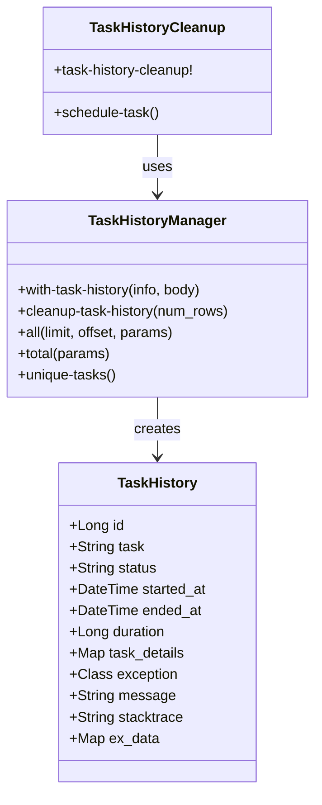

**图表来源**
- [task_history.clj](file://src/metabase/task_history/models/task_history.clj#L140-L198)
- [task_history_cleanup.clj](file://src/metabase/task_history/task/task_history_cleanup.clj#L33-L44)

### 任务状态管理

任务历史记录系统支持四种核心状态：

| 状态 | 描述 | 处理方式 |
|------|------|----------|
| `:started` | 任务开始执行 | 记录开始时间和初始状态 |
| `:success` | 任务成功完成 | 记录结束时间、持续时间和成功详情 |
| `:failed` | 任务执行失败 | 记录异常信息、堆栈跟踪和失败详情 |
| `:unknown` | 状态未知或被中断 | 记录中断原因和部分执行状态 |

### 使用示例

```clojure
(task-history/with-task-history 
  {:task "send-pulse"
   :db_id 1
   :on-success-info (fn [update-map result] 
                      (assoc-in update-map 
                                [:task_details :result] result))
   :on-fail-info (fn [update-map exception] 
                   (assoc-in update-map 
                             [:task_details :error] (.getMessage exception)))}
  (fn []
    ;; 任务逻辑
    (send-pulse! pulse-id)))
```

**章节来源**
- [task_history.clj](file://src/metabase/task_history/models/task_history.clj#L163-L198)

## 异常捕获与分类

### 查询处理器异常处理

查询处理器实现了分层的异常捕获机制，能够识别和分类不同类型的错误。

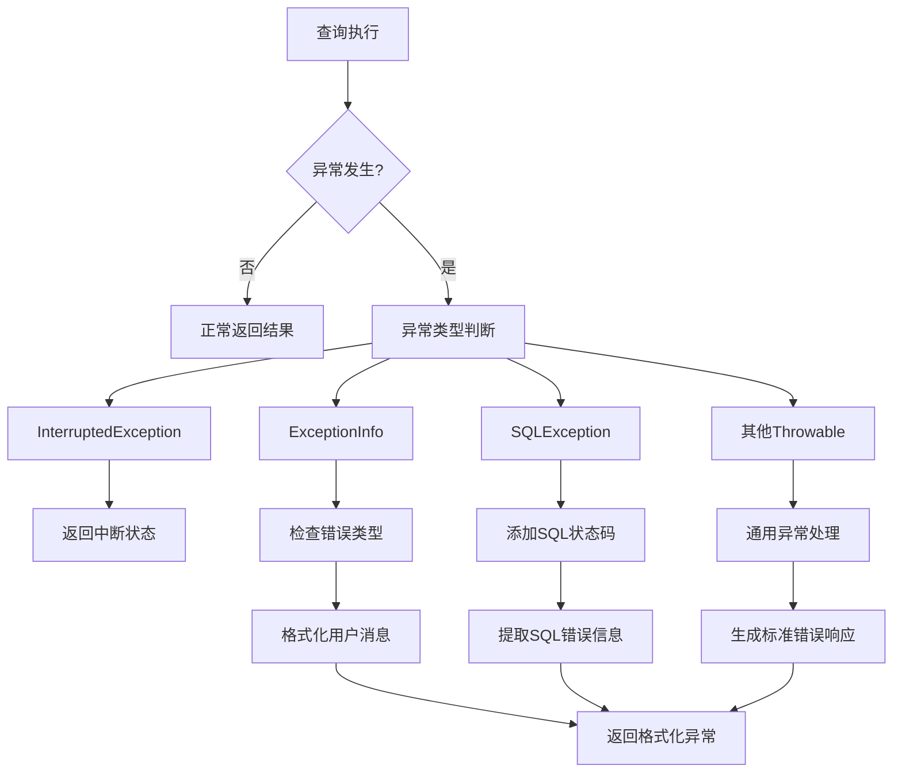

**图表来源**
- [catch_exceptions.clj](file://src/metabase/query_processor/middleware/catch_exceptions.clj#L34-L94)

### 错误类型层次结构

Metabase定义了完整的错误类型层次结构，便于分类处理：

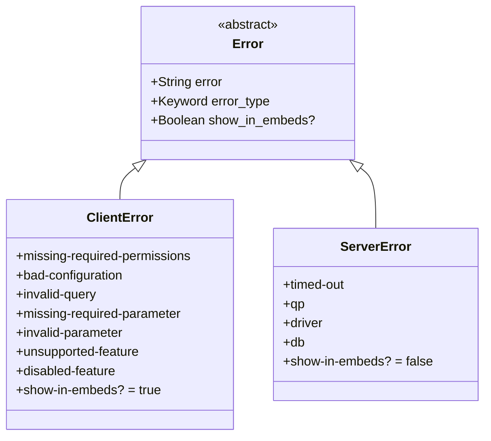

**图表来源**
- [error_type.clj](file://src/metabase/query_processor/error_type.clj#L40-L101)

### 同步操作异常处理

同步操作实现了专门的异常处理机制，能够区分可重试和不可重试的错误：

| 异常类别 | 可重试性 | 处理策略 |
|----------|----------|----------|
| `ConnectException` | 否 | 立即终止，不重试 |
| `NoRouteToHostException` | 否 | 立即终止，不重试 |
| `UnknownHostException` | 否 | 立即终止，不重试 |
| `SSLHandshakeException` | 否 | 立即终止，不重试 |
| 其他异常 | 是 | 根据重试配置进行重试 |

**章节来源**
- [sync_util.clj](file://src/metabase/sync/util.clj#L176-L209)

## 重试机制

### 基础重试框架

Metabase使用Resilience4j库构建了强大的重试机制，支持指数退避算法。

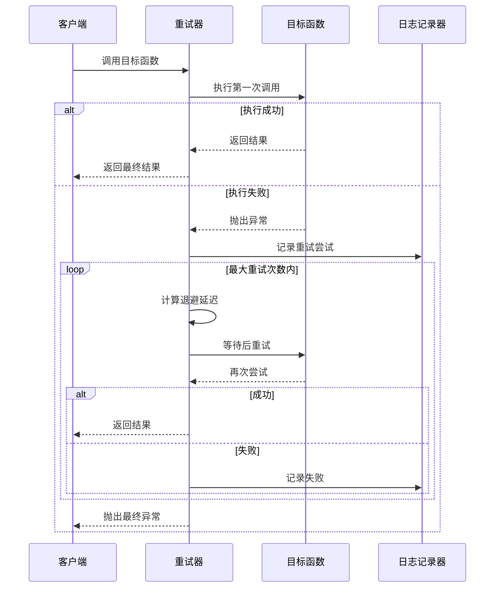

**图表来源**
- [retry.clj](file://src/metabase/util/retry.clj#L73-L120)

### 重试配置参数

| 参数 | 默认值 | 描述 |
|------|--------|------|
| `max-attempts` | 开发环境: 1, 生产环境: 7 | 最大重试次数 |
| `initial-interval-millis` | 500 | 初始重试间隔（毫秒） |
| `multiplier` | 2.0 | 退避倍数 |
| `randomization-factor` | 0.1 | 随机化因子（±10%） |
| `max-interval-millis` | 30000 | 最大重试间隔（毫秒） |

### Slack通道发送重试策略

对于Slack通道发送，实现了特殊的重试逻辑：

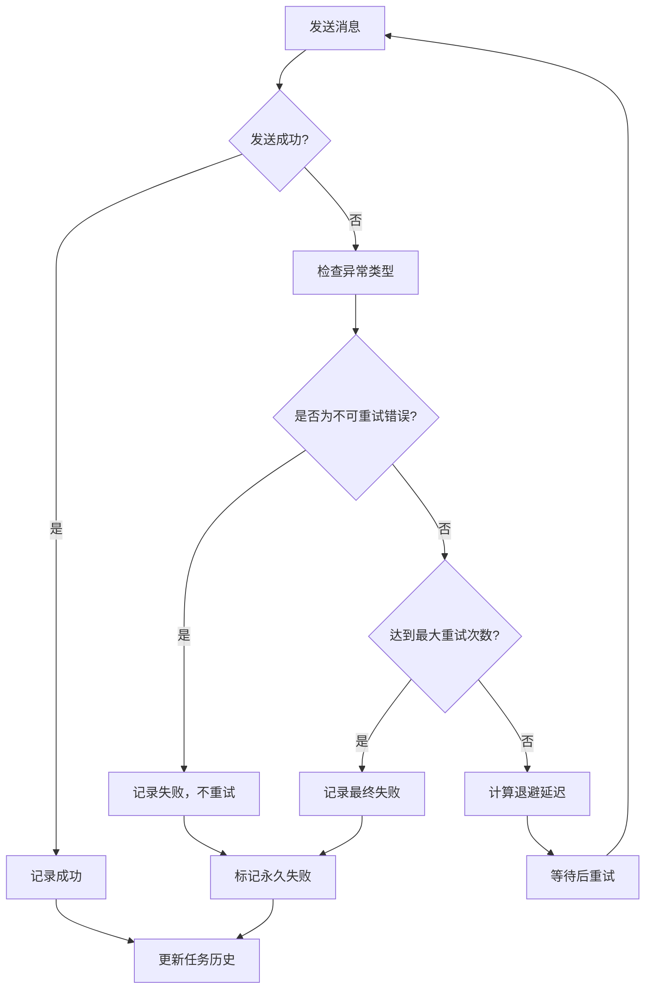

**图表来源**
- [send.clj](file://src/metabase/notification/send.clj#L47-L84)

**章节来源**
- [retry.clj](file://src/metabase/util/retry.clj#L34-L120)
- [send.clj](file://src/metabase/notification/send.clj#L47-L84)

## 瞬时故障与永久性错误

### 故障分类策略

Metabase根据错误特性将故障分为两类：

#### 瞬时故障（Transient Faults）
- **网络连接问题**：临时网络中断、DNS解析失败
- **资源竞争**：数据库连接池耗尽、文件锁冲突
- **服务暂时不可用**：第三方API限流、临时服务下线
- **超时错误**：查询超时、连接超时

#### 永久性错误（Permanent Faults）
- **认证失败**：无效的API密钥、过期的令牌
- **权限不足**：数据库访问权限被撤销
- **数据格式错误**：SQL语法错误、字段类型不匹配
- **配置错误**：无效的连接字符串、缺失的必需参数

### 自动重试机制

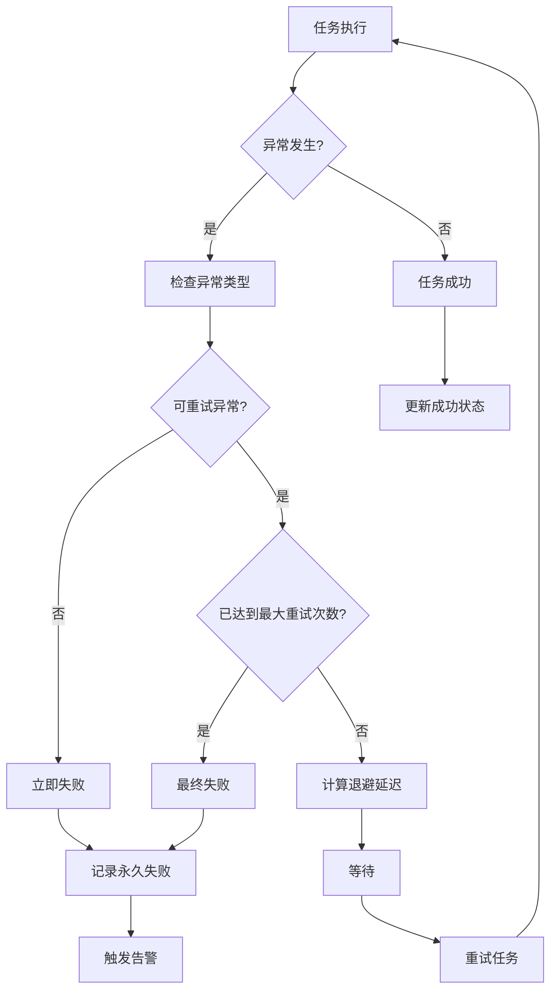

### 特殊错误处理

对于特定的错误类型，系统实现了专门的处理逻辑：

| 错误类型 | 处理策略 | 原因 |
|----------|----------|------|
| `:slack/invalid-token` | 永久失败 | Slack令牌无效，需要重新配置 |
| `:slack/channel-not-found` | 永久失败 | Slack频道不存在，无法发送 |
| `ConnectException` | 永久失败 | 网络连接问题，重试无意义 |
| `SSLHandshakeException` | 永久失败 | SSL证书问题，重试无效 |

**章节来源**
- [sync_util.clj](file://src/metabase/sync/util.clj#L176-L209)
- [send.clj](file://src/metabase/notification/send.clj#L47-L67)

## 告警与通知配置

### 通知系统架构

Metabase的通知系统支持多种渠道和灵活的配置选项：

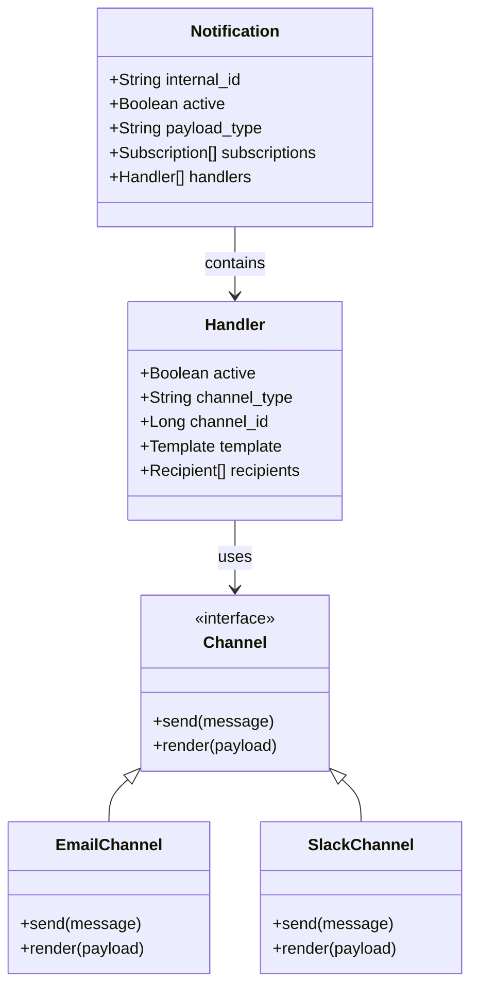

**图表来源**
- [settings.clj](file://src/metabase/notification/settings.clj#L5-L30)

### 通知配置参数

| 配置项 | 默认值 | 描述 |
|--------|--------|------|
| `notification-thread-pool-size` | 3 | 通知发送线程池大小 |
| `notification-system-event-thread-pool-size` | 5 | 系统事件通知线程池大小 |
| `notification-temp-file-size-max-bytes` | 10MB | 临时文件最大大小 |

### 告警规则配置

系统预置了多种告警规则：

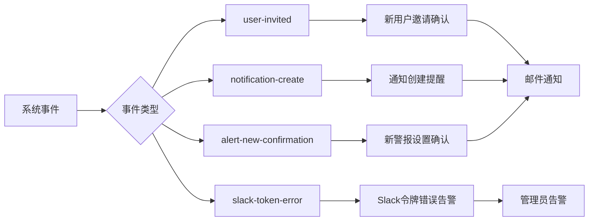

**章节来源**
- [settings.clj](file://src/metabase/notification/settings.clj#L5-L30)

## 错误日志分析最佳实践

### 日志级别配置

Metabase提供了专门的日志预设用于故障排除：

| 预设名称 | 适用场景 | 关键日志记录器 |
|----------|----------|----------------|
| `sync` | 同步问题排查 | `metabase.sync.*`, `metabase.driver.sql-jdbc.sync.*` |
| `linkedfilters` | 链式过滤器问题 | `metabase.parameters.chain-filter.*` |
| `serialization` | 序列化问题 | `metabase.models.serialization.*` |

### 错误信息标准化

系统对错误信息进行了标准化处理：

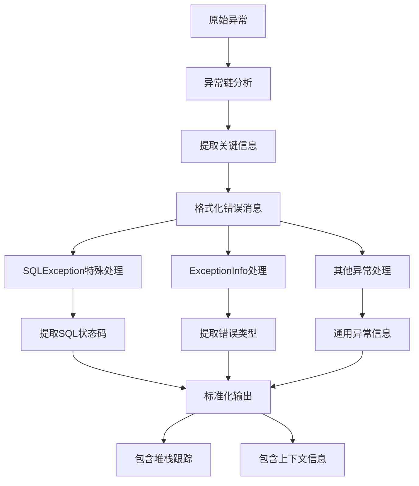

**图表来源**
- [catch_exceptions.clj](file://src/metabase/query_processor/middleware/catch_exceptions.clj#L65-L94)

### 性能监控指标

系统收集了丰富的性能监控指标：

| 指标名称 | 类别 | 描述 |
|----------|------|------|
| `metabase-notification/send-ok` | 成功计数 | 通知发送成功的次数 |
| `metabase-notification/send-error` | 错误计数 | 通知发送失败的次数 |
| `metabase-notification/channel-send-ok` | 渠道成功 | 各渠道发送成功的次数 |
| `metabase-notification/channel-send-error` | 渠道错误 | 各渠道发送失败的次数 |
| `metabase-notification/send-duration-ms` | 响应时间 | 通知发送的耗时分布 |
| `metabase-notification/wait-duration-ms` | 等待时间 | 从触发到实际发送的等待时间 |

**章节来源**
- [send.clj](file://src/metabase/notification/send.clj#L120-L140)

## 故障恢复策略

### 分层恢复机制

Metabase实现了多层的故障恢复策略：

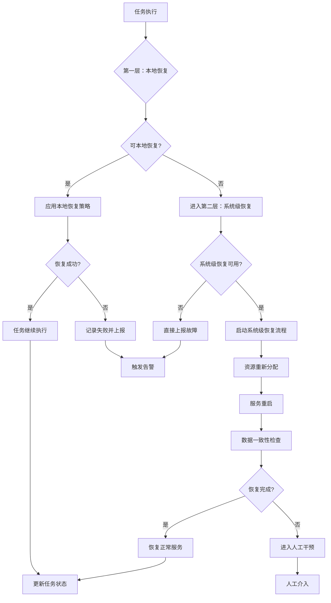

### 自动恢复策略

#### 数据库连接恢复
- **连接池监控**：实时监控连接池使用情况
- **连接重建**：自动重建断开的数据库连接
- **负载均衡**：在多个数据库实例间切换

#### 查询执行恢复
- **查询重写**：自动重写失败的查询语句
- **分片执行**：将大查询拆分为小片段执行
- **缓存利用**：利用查询缓存避免重复执行

#### 通知发送恢复
- **渠道降级**：主渠道失败时切换到备用渠道
- **消息队列**：使用消息队列保证消息不丢失
- **批量重试**：批量处理重试请求提高效率

### 人工干预接口

当自动恢复失败时，系统提供人工干预接口：

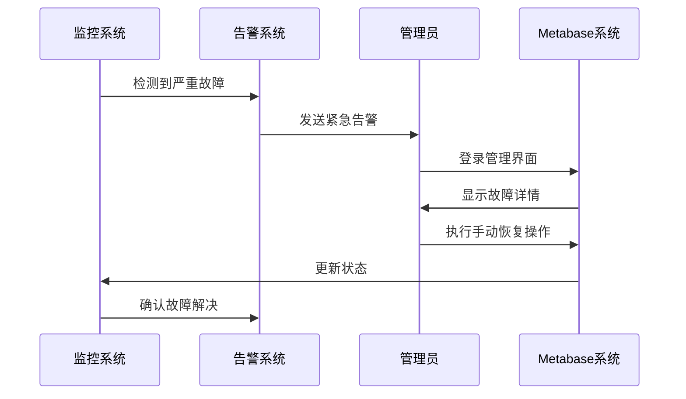

**章节来源**
- [sync_util.clj](file://src/metabase/sync/util.clj#L200-L250)

## 监控与维护

### 任务历史清理机制

系统实现了自动的任务历史清理机制，防止历史数据无限增长：

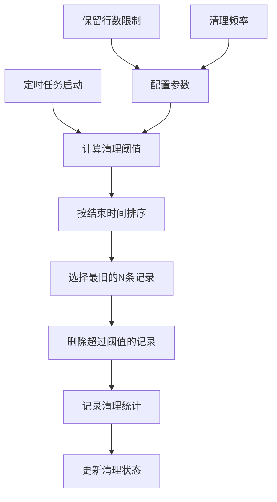

**图表来源**
- [task_history_cleanup.clj](file://src/metabase/task_history/task/task_history_cleanup.clj#L15-L30)

### 监控指标仪表板

建议监控的关键指标：

| 指标类别 | 关键指标 | 正常范围 | 告警阈值 |
|----------|----------|----------|----------|
| 任务成功率 | 成功/总任务比例 | > 95% | < 90% |
| 平均响应时间 | 任务执行平均耗时 | < 5秒 | > 30秒 |
| 错误率 | 失败任务比例 | < 5% | > 10% |
| 重试率 | 需要重试的任务比例 | < 10% | > 20% |
| 资源使用率 | CPU/内存使用率 | < 80% | > 90% |

### 维护建议

#### 日常维护
1. **定期检查任务历史**：确保历史记录不会过度增长
2. **监控告警配置**：验证告警规则的有效性
3. **测试重试机制**：定期测试重试配置的正确性
4. **审查错误日志**：分析常见错误模式

#### 周期性维护
1. **性能基准测试**：评估系统性能变化
2. **配置优化**：根据使用情况调整重试参数
3. **容量规划**：评估存储空间需求
4. **安全审计**：检查通知配置的安全性

**章节来源**
- [task_history_cleanup.clj](file://src/metabase/task_history/task/task_history_cleanup.clj#L15-L45)

## 总结

Metabase的任务错误处理与恢复系统是一个设计精良、功能完备的解决方案。它通过以下关键特性确保了系统的高可用性和可靠性：

### 核心优势

1. **完整的生命周期管理**：从任务开始到结束的全过程跟踪
2. **智能的异常分类**：基于错误特性的差异化处理策略
3. **灵活的重试机制**：支持指数退避和自定义重试策略
4. **完善的监控体系**：实时监控和自动告警
5. **可配置的恢复策略**：适应不同场景的恢复方案

### 最佳实践建议

1. **合理配置重试参数**：根据业务特点调整重试次数和间隔
2. **建立监控告警**：及时发现和响应系统异常
3. **定期维护清理**：保持系统性能和存储效率
4. **文档化恢复流程**：确保团队成员了解故障处理步骤
5. **持续优化配置**：基于实际使用情况不断改进配置

这套错误处理与恢复系统不仅保证了Metabase在面对各种故障时的稳定性，还为系统的持续改进和优化提供了坚实的基础。通过合理的配置和维护，可以最大化系统的可靠性和用户体验。