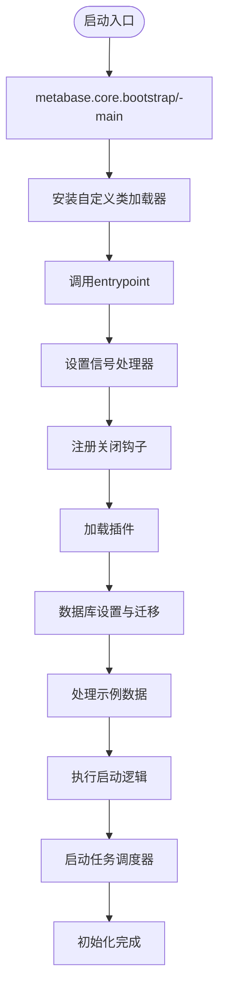
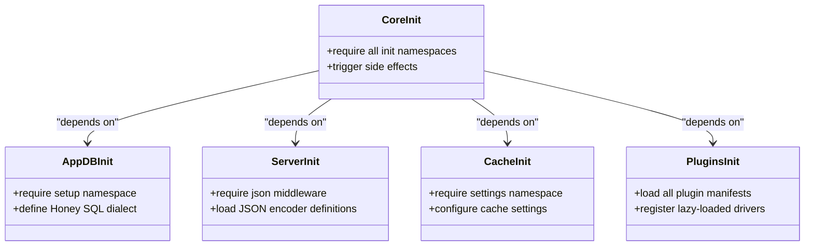
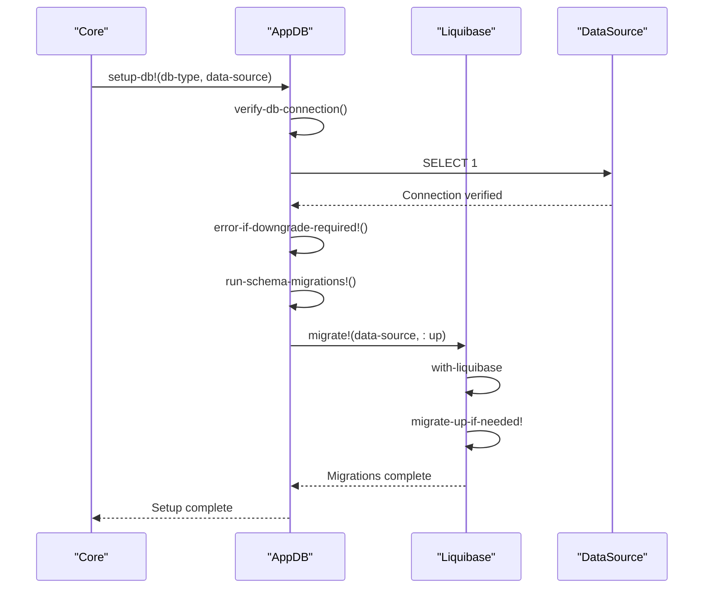
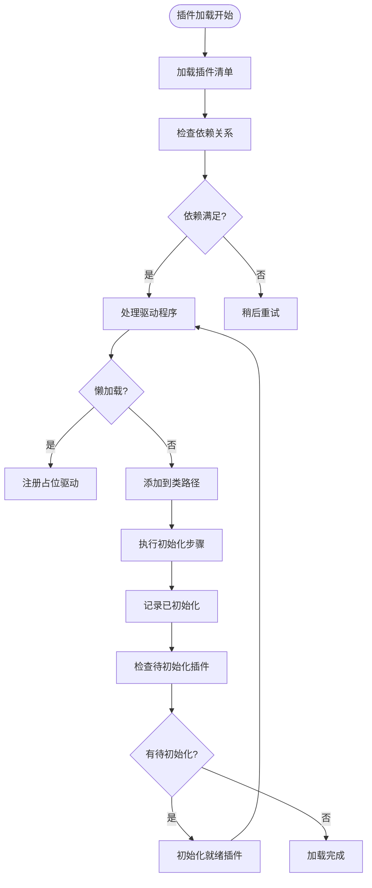
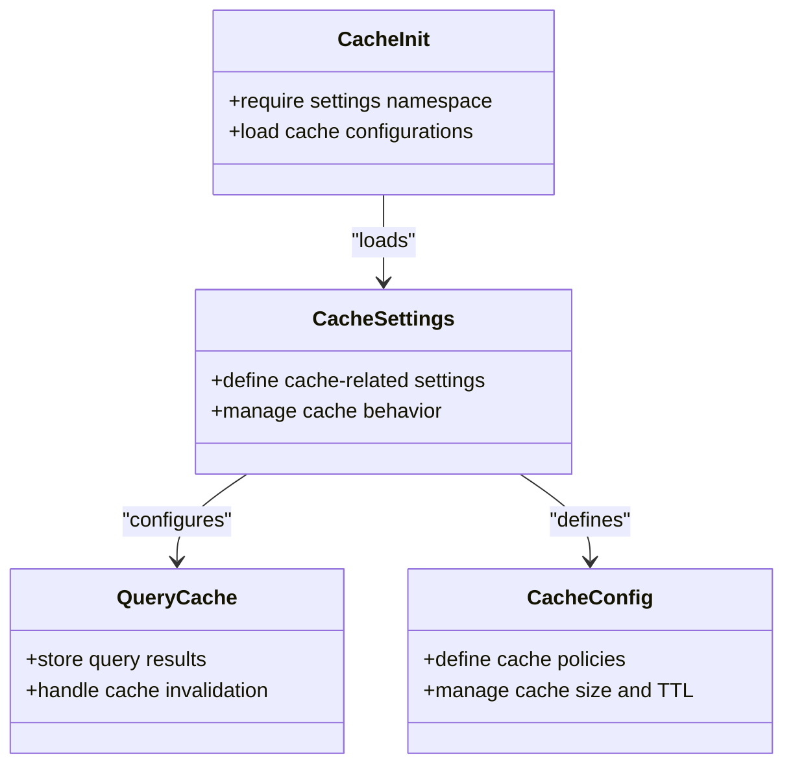
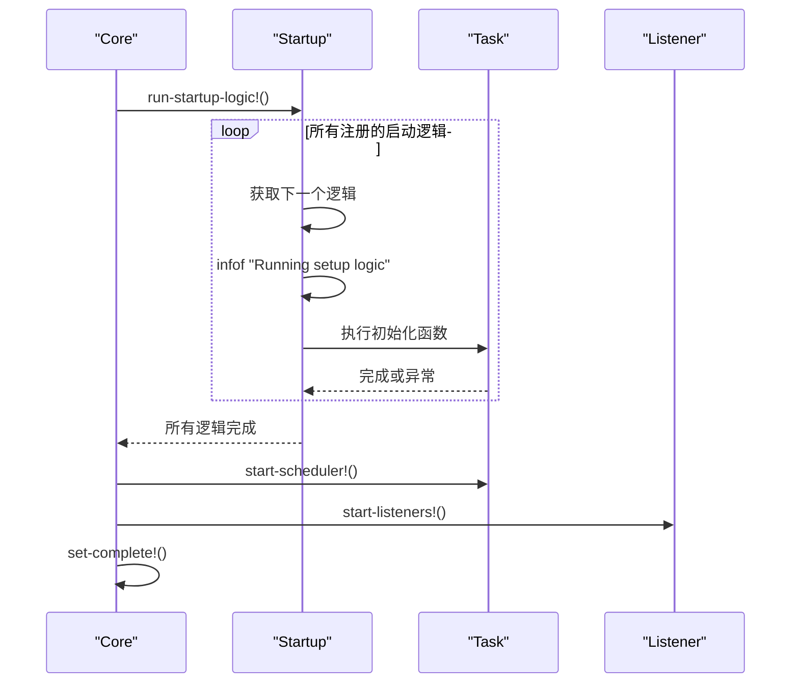
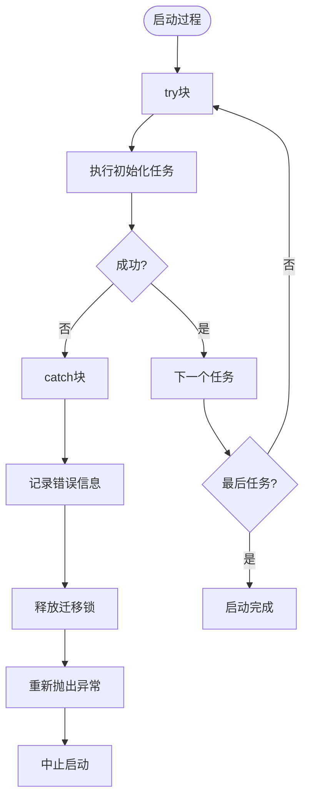
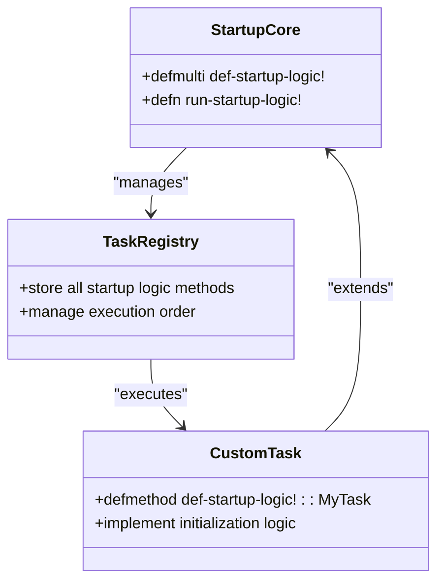

# 启动时任务

<cite>
**本文档中引用的文件**  
- [init.clj](file://src/metabase/core/init.clj)
- [core.clj](file://src/metabase/core/core.clj)
- [bootstrap.clj](file://src/metabase/core/bootstrap.clj)
- [setup.clj](file://src/metabase/app_db/setup.clj)
- [connection_pool_setup.clj](file://src/metabase/app_db/connection_pool_setup.clj)
- [initialize.clj](file://src/metabase/plugins/initialize.clj)
- [init_steps.clj](file://src/metabase/plugins/init_steps.clj)
- [lazy_loaded_driver.clj](file://src/metabase/plugins/lazy_loaded_driver.clj)
- [core.clj](file://src/metabase/app_db/core.clj)
- [startup.clj](file://src/metabase/startup/core.clj)
- [task.clj](file://src/metabase/task/core.clj)
- [log.clj](file://src/metabase/util/log.clj)
</cite>

## 目录
1. [系统启动流程概述](#系统启动流程概述)
2. [核心初始化任务](#核心初始化任务)
3. [数据库连接初始化](#数据库连接初始化)
4. [插件加载机制](#插件加载机制)
5. [缓存与预热策略](#缓存与预热策略)
6. [启动任务协调机制](#启动任务协调机制)
7. [错误恢复与日志记录](#错误恢复与日志记录)
8. [自定义启动任务](#自定义启动任务)

## 系统启动流程概述

Metabase系统的启动过程是一个精心编排的多阶段初始化流程，确保所有核心组件在服务可用前正确配置和准备就绪。启动流程从JVM入口点开始，通过一系列协调的步骤完成系统初始化。

启动流程始于`metabase.core.bootstrap/-main`函数，该函数作为应用程序的主入口点。它首先确保自定义类加载器被正确安装，然后调用`metabase.core.core/entrypoint`函数。整个初始化过程通过`init!*`函数协调执行，该函数按特定顺序执行各种初始化任务，并通过进度指示器跟踪初始化状态。

**Diagram sources**
- [bootstrap.clj](file://src/metabase/core/bootstrap.clj#L30-L37)
- [core.clj](file://src/metabase/core/core.clj#L151-L280)

**Section sources**
- [bootstrap.clj](file://src/metabase/core/bootstrap.clj#L0-L37)
- [core.clj](file://src/metabase/core/core.clj#L0-L280)

## 核心初始化任务

Metabase在启动时执行一系列核心初始化任务，这些任务通过`metabase.core.init`命名空间中的模块化设计进行组织。每个核心功能模块都有一个对应的`init`命名空间，这些命名空间在系统启动时被加载以执行必要的初始化操作。

核心初始化任务包括但不限于：应用数据库设置、API路由初始化、服务器配置、驱动程序加载、事件系统初始化等。这些任务通过在`metabase.core.init`中require相应的init命名空间来触发，确保所有必要的副作用在系统启动时发生。

**Diagram sources**
- [init.clj](file://src/metabase/core/init.clj#L1-L75)
- [app_db/init.clj](file://src/metabase/app_db/init.clj#L1-L6)
- [server/init.clj](file://src/metabase/server/init.clj#L1-L7)
- [cache/init.clj](file://src/metabase/cache/init.clj#L1-L4)

**Section sources**
- [init.clj](file://src/metabase/core/init.clj#L1-L75)

## 数据库连接初始化

数据库连接初始化是Metabase启动过程中的关键步骤，由`metabase.app-db`模块负责处理。该过程包括验证数据库连接、执行必要的模式迁移、检查加密配置以及设置连接池。

数据库初始化从`metabase.app-db.setup-db!`函数开始，该函数首先验证与应用数据库的连接，然后检查是否需要降级，最后执行模式迁移。迁移过程使用Liquibase来管理数据库变更，确保数据库模式与当前Metabase版本兼容。

**Diagram sources**
- [setup.clj](file://src/metabase/app_db/setup.clj#L0-L290)
- [core.clj](file://src/metabase/app_db/core.clj#L1-L50)

**Section sources**
- [setup.clj](file://src/metabase/app_db/setup.clj#L0-L290)

## 插件加载机制

Metabase的插件加载机制设计为灵活且可扩展，支持在启动时动态加载和初始化插件。插件系统通过解析插件清单文件（metabase-plugin.yaml）来确定如何加载每个插件，并根据插件的配置执行相应的初始化步骤。

插件加载过程由`metabase.plugins.initialize`模块管理，该模块首先检查插件的依赖关系，然后根据插件配置决定是立即初始化还是延迟加载。对于驱动程序插件，系统支持懒加载模式，只有在首次需要时才执行完整的初始化。

**Diagram sources**
- [initialize.clj](file://src/metabase/plugins/initialize.clj#L0-L60)
- [init_steps.clj](file://src/metabase/plugins/init_steps.clj#L0-L32)
- [lazy_loaded_driver.clj](file://src/metabase/plugins/lazy_loaded_driver.clj#L0-L73)

**Section sources**
- [initialize.clj](file://src/metabase/plugins/initialize.clj#L0-L60)

## 缓存与预热策略

Metabase的缓存系统在启动时通过`metabase.cache.init`模块进行初始化，主要涉及缓存设置的加载和配置。虽然缓存预热不是启动过程中的显式步骤，但系统通过各种机制确保关键数据在需要时可用。

缓存初始化相对简单，主要通过require `metabase.cache.settings`命名空间来加载缓存相关的设置。实际的缓存预热通常在后台任务或按需加载时发生，而不是在启动时阻塞执行。

**Diagram sources**
- [init.clj](file://src/metabase/cache/init.clj#L1-L4)
- [settings.clj](file://src/metabase/cache/settings.clj#L1-L50)

**Section sources**
- [init.clj](file://src/metabase/cache/init.clj#L1-L4)

## 启动任务协调机制

Metabase使用多层机制来协调不同模块的启动任务，确保初始化过程的有序执行。核心协调机制包括启动逻辑多方法（def-startup-logic!）和初始化进度跟踪系统。

`metabase.startup.core`模块定义了`def-startup-logic!`多方法，允许各个模块注册在服务器启动时执行的初始化逻辑。这些逻辑按注册顺序执行，确保依赖关系得到满足。同时，系统使用`initialization-status`来跟踪和报告初始化进度。

**Diagram sources**
- [startup.clj](file://src/metabase/startup/core.clj#L0-L31)
- [core.clj](file://src/metabase/core/core.clj#L202-L236)

**Section sources**
- [startup.clj](file://src/metabase/startup/core.clj#L0-L31)

## 错误恢复与日志记录

Metabase的启动过程包含完善的错误恢复机制和详细的日志记录策略，确保系统在遇到问题时能够提供有用的诊断信息并尽可能恢复。

日志记录系统在启动早期就已初始化，使用log4j2作为底层日志框架。系统通过`metabase.util.log`模块提供统一的日志接口，支持不同级别的日志输出和上下文信息。错误恢复主要依赖于异常处理和重试机制，特别是在数据库迁移和插件加载等关键步骤中。

**Diagram sources**
- [log.clj](file://src/metabase/util/log.clj#L0-L350)
- [setup.clj](file://src/metabase/app_db/setup.clj#L150-L290)
- [core.clj](file://src/metabase/core/core.clj#L151-L280)

**Section sources**
- [log.clj](file://src/metabase/util/log.clj#L0-L350)

## 自定义启动任务

开发人员可以通过`def-startup-logic!`多方法向Metabase的启动过程添加自定义任务。这种机制允许在系统启动时执行特定的初始化逻辑，而无需修改核心启动代码。

要添加自定义启动任务，只需在适当的命名空间中定义一个新的`defmethod`，使用唯一的关键词作为调度值，并实现所需的初始化逻辑。该方法将在`run-startup-logic!`调用时自动执行。

**Diagram sources**
- [startup.clj](file://src/metabase/startup/core.clj#L0-L31)
- [core.clj](file://src/metabase/core/core.clj#L202-L236)

**Section sources**
- [startup.clj](file://src/metabase/startup/core.clj#L0-L31)