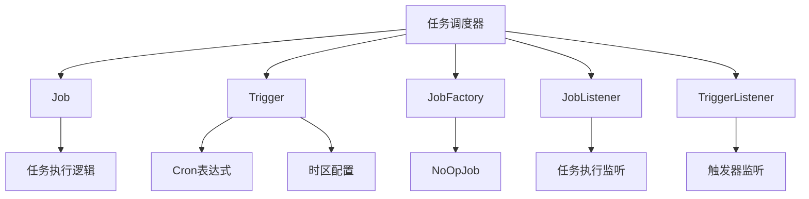
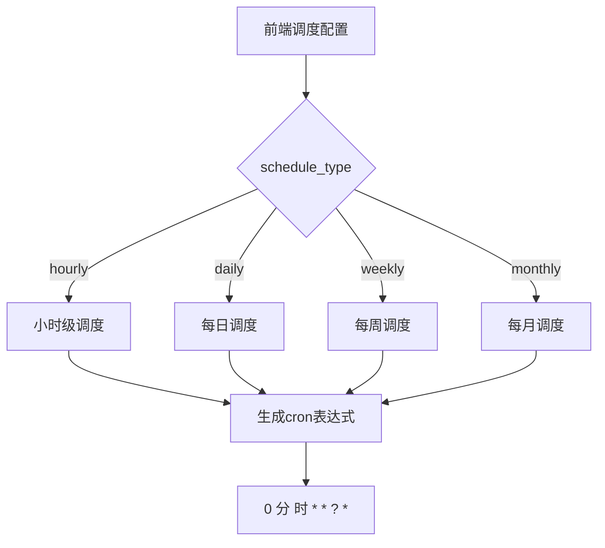
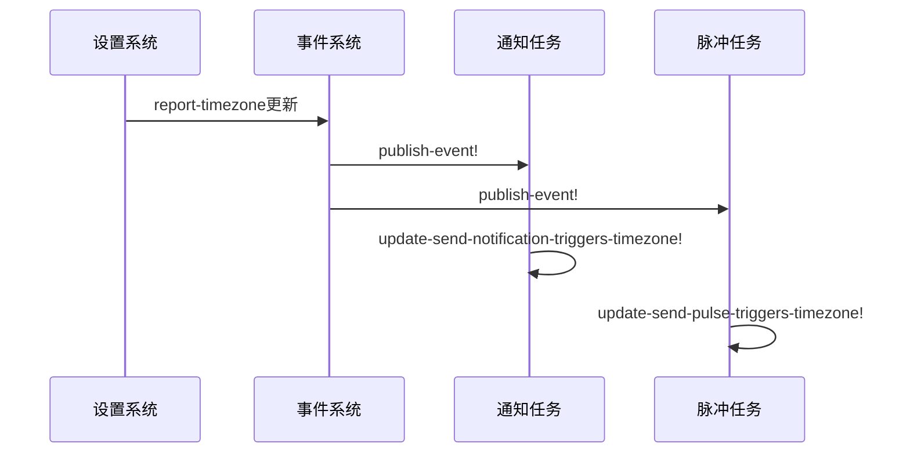
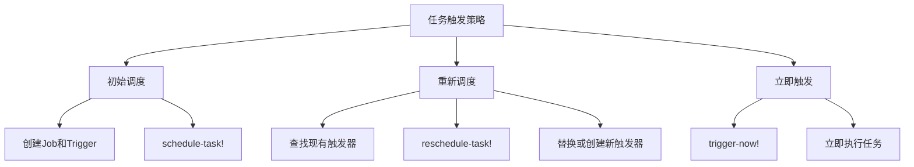
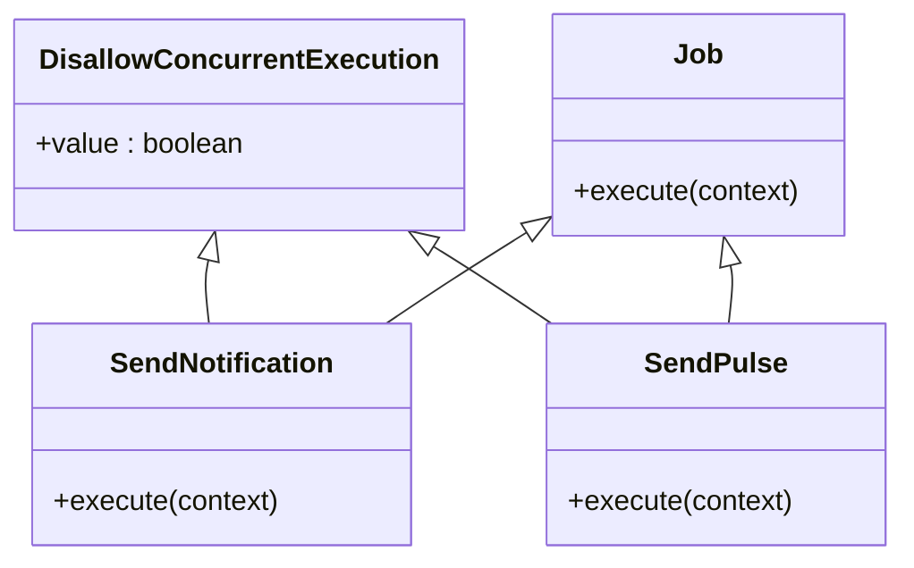
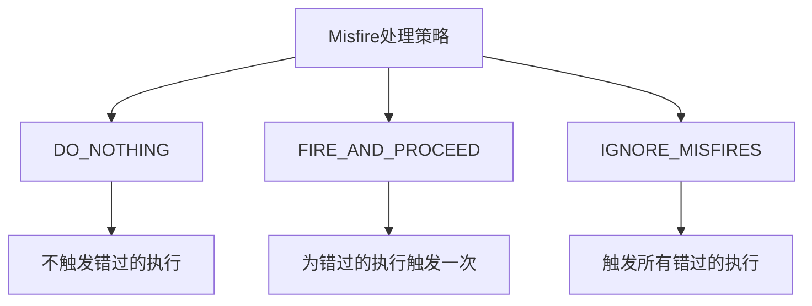
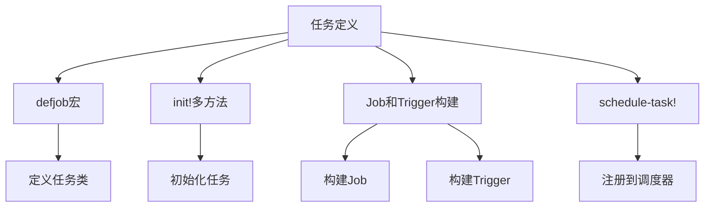
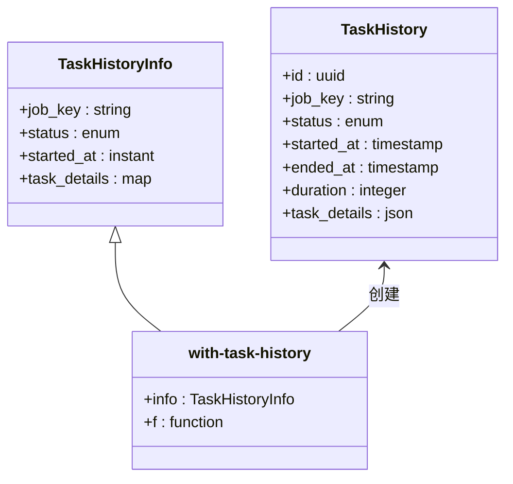
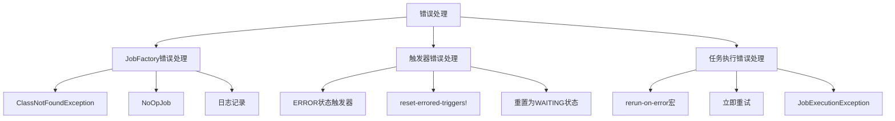

# 周期性调度任务

<cite>
**本文档中引用的文件**  
- [impl.clj](file://src/metabase/task/impl.clj)
- [core.clj](file://src/metabase/task/core.clj)
- [job_factory.clj](file://src/metabase/task/job_factory.clj)
- [QUARTZ.md](file://src/metabase/task/QUARTZ.md)
- [send.clj](file://src/metabase/notification/task/send.clj)
- [send_pulses.clj](file://src/metabase/pulse/task/send_pulses.clj)
- [cron.clj](file://src/metabase/util/cron.clj)
- [task_history.clj](file://src/metabase/task_history/models/task_history.clj)
</cite>

## 目录
1. [引言](#引言)
2. [任务调度架构](#任务调度架构)
3. [Cron表达式配置与处理](#cron表达式配置与处理)
4. [时区处理机制](#时区处理机制)
5. [任务触发策略](#任务触发策略)
6. [任务并发控制](#任务并发控制)
7. [Misfire处理策略](#misfire处理策略)
8. [任务定义与注册](#任务定义与注册)
9. [任务监控与历史记录](#任务监控与历史记录)
10. [错误处理与恢复](#错误处理与恢复)

## 引言
Metabase使用Quartz调度器来管理周期性任务，包括数据库同步、发送通知、清理会话等后台任务。本文档深入解析基于Quartz的周期性任务调度机制，详细描述cron表达式的配置格式、时区处理（特别是report-timezone的集成）以及任务触发策略。同时说明任务并发控制机制和misfire处理策略的选择与配置，并通过具体代码示例展示如何定义、注册和监控周期性任务。

## 任务调度架构
Metabase的周期性任务调度基于Quartz框架实现，通过Quartzite Clojure封装库进行操作。调度器在应用启动时初始化并进入待机模式，需要显式调用`start-scheduler!`来开始执行任务。

调度器的核心组件包括：
- **Job**：表示要执行的工作单元，包含实际的执行代码
- **Trigger**：定义任务的执行时间，可以基于cron表达式、特定时间或事件触发
- **Scheduler**：管理Job和Trigger的调度与执行

**Diagram sources**
- [impl.clj](file://src/metabase/task/impl.clj#L27-L55)
- [job_factory.clj](file://src/metabase/task/job_factory.clj#L0-L29)

**Section sources**
- [impl.clj](file://src/metabase/task/impl.clj#L27-L160)
- [core.clj](file://src/metabase/task/core.clj#L0-L30)

## Cron表达式配置与处理
Metabase中的周期性任务使用标准的Quartz cron表达式进行配置。cron表达式由7个字段组成，格式为"秒 分 时 日 月 星期 年"。

### Cron表达式格式
Metabase提供了`metabase.util.cron`命名空间来处理cron表达式与前端调度配置之间的转换：

**Diagram sources**
- [cron.clj](file://src/metabase/util/cron.clj#L65-L102)
- [cron.clj](file://src/metabase/util/cron.clj#L129-L159)

**Section sources**
- [cron.clj](file://src/metabase/util/cron.clj#L65-L159)
- [QUARTZ.md](file://src/metabase/task/QUARTZ.md#L57-L90)

## 时区处理机制
时区处理是Metabase周期性任务调度中的关键部分，特别是与`report-timezone`设置的集成。默认情况下，Quartz调度器使用JVM的默认时区，但在Metabase中通常使用`report-timezone`。

### Report-Timezone集成
当`driver/report-timezone`设置发生变化时，需要重新构建相关的触发器。Metabase通过事件监听机制来处理时区变更：

**Diagram sources**
- [send.clj](file://src/metabase/notification/task/send.clj#L141-L168)
- [send_pulses.clj](file://src/metabase/pulse/task/send_pulses.clj#L131-L154)
- [report_timezone_updated.clj](file://src/metabase/notification/events/report_timezone_updated.clj#L0-L12)

**Section sources**
- [send.clj](file://src/metabase/notification/task/send.clj#L141-L168)
- [send_pulses.clj](file://src/metabase/pulse/task/send_pulses.clj#L131-L154)

## 任务触发策略
Metabase实现了多种任务触发策略，包括立即触发、按计划触发和动态重新调度。

### 触发器管理
任务触发器的管理通过`reschedule-task!`和`reschedule-trigger!`函数实现：

**Diagram sources**
- [impl.clj](file://src/metabase/task/impl.clj#L27-L55)
- [impl.clj](file://src/metabase/task/impl.clj#L160-L200)

**Section sources**
- [impl.clj](file://src/metabase/task/impl.clj#L160-L270)
- [QUARTZ.md](file://src/metabase/task/QUARTZ.md#L57-L90)

## 任务并发控制
为了防止任务并发执行，Metabase提供了多种并发控制机制。

### Singleton装饰器
通过`DisallowConcurrentExecution`注解实现任务的单实例执行：

**Diagram sources**
- [send.clj](file://src/metabase/notification/task/send.clj#L0-L38)
- [send_pulses.clj](file://src/metabase/pulse/task/send_pulses.clj#L180-L204)

**Section sources**
- [QUARTZ.md](file://src/metabase/task/QUARTZ.md#L100-L138)
- [send.clj](file://src/metabase/notification/task/send.clj#L0-L38)

## Misfire处理策略
Misfire是指触发器的预定触发时间已过但未触发的情况，通常是因为调度器停机。Quartz提供了多种misfire处理指令：

### Misfire处理选项

**Diagram sources**
- [impl.clj](file://src/metabase/task/impl.clj#L78-L104)
- [QUARTZ.md](file://src/metabase/task/QUARTZ.md#L92-L138)

**Section sources**
- [impl.clj](file://src/metabase/task/impl.clj#L78-L104)
- [QUARTZ.md](file://src/metabase/task/QUARTZ.md#L92-L138)

## 任务定义与注册
周期性任务的定义和注册遵循特定的模式和最佳实践。

### 任务定义模式

**Diagram sources**
- [QUARTZ.md](file://src/metabase/task/QUARTZ.md#L57-L90)
- [send_anonymous_stats.clj](file://src/metabase/analytics/task/send_anonymous_stats.clj#L30-L39)

**Section sources**
- [QUARTZ.md](file://src/metabase/task/QUARTZ.md#L57-L90)
- [send_anonymous_stats.clj](file://src/metabase/analytics/task/send_anonymous_stats.clj#L0-L40)

## 任务监控与历史记录
Metabase提供了任务监控和历史记录功能，用于跟踪任务的执行情况。

### 任务历史记录

**Diagram sources**
- [task_history.clj](file://src/metabase/task_history/models/task_history.clj#L140-L163)
- [core.clj](file://src/metabase/task-history/core.clj#L0-L10)

**Section sources**
- [task_history.clj](file://src/metabase/task_history/models/task_history.clj#L140-L163)
- [core.clj](file://src/metabase/task-history/core.clj#L0-L10)

## 错误处理与恢复
Metabase实现了完善的错误处理和恢复机制，确保任务调度的稳定性。

### 错误处理机制

**Diagram sources**
- [job_factory.clj](file://src/metabase/task/job_factory.clj#L29-L64)
- [impl.clj](file://src/metabase/task/impl.clj#L104-L130)
- [QUARTZ.md](file://src/metabase/task/QUARTZ.md#L138-L159)

**Section sources**
- [job_factory.clj](file://src/metabase/task/job_factory.clj#L29-L64)
- [impl.clj](file://src/metabase/task/impl.clj#L104-L130)
- [QUARTZ.md](file://src/metabase/task/QUARTZ.md#L138-L159)