# 迁移类任务

<cite>
**本文档引用的文件**
- [custom_migrations.clj](file://src/metabase/app_db/custom_migrations.clj)
- [custom_migrations/util.clj](file://src/metabase/app_db/custom_migrations/util.clj)
- [custom_migrations/metrics_v2.clj](file://src/metabase/app_db/custom_migrations/metrics_v2.clj)
- [custom_migrations/pulse_to_notification.clj](file://src/metabase/app_db/custom_migrations/pulse_to_notification.clj)
- [json_migration.clj](file://src/metabase/models/json_migration.clj)
- [core.clj](file://src/metabase/app_db/core.clj)
- [setup.clj](file://src/metabase/app_db/setup.clj)
- [liquibase.clj](file://src/metabase/app_db/liquibase.clj)
- [migrate.clj](file://src/metabase/cmd/migrate.clj)
</cite>

## 目录
1. [概述](#概述)
2. [系统架构](#系统架构)
3. [核心组件分析](#核心组件分析)
4. [迁移任务实现方式](#迁移任务实现方式)
5. [幂等性设计](#幂等性设计)
6. [执行顺序控制](#执行顺序控制)
7. [回滚策略](#回滚策略)
8. [错误处理和状态追踪](#错误处理和状态追踪)
9. [自定义迁移示例](#自定义迁移示例)
10. [最佳实践](#最佳实践)

## 概述

Metabase的迁移系统是一个复杂而强大的数据和模式管理框架，负责处理数据库schema变更、数据格式升级和版本兼容性处理。该系统采用分层架构，结合Liquibase和自定义迁移机制，确保迁移过程的安全性和可靠性。

迁移系统的核心目标包括：
- 安全地执行数据库schema变更
- 处理复杂的数据格式升级
- 确保迁移操作的幂等性
- 提供完善的回滚机制
- 支持破坏性变更的安全执行

## 系统架构

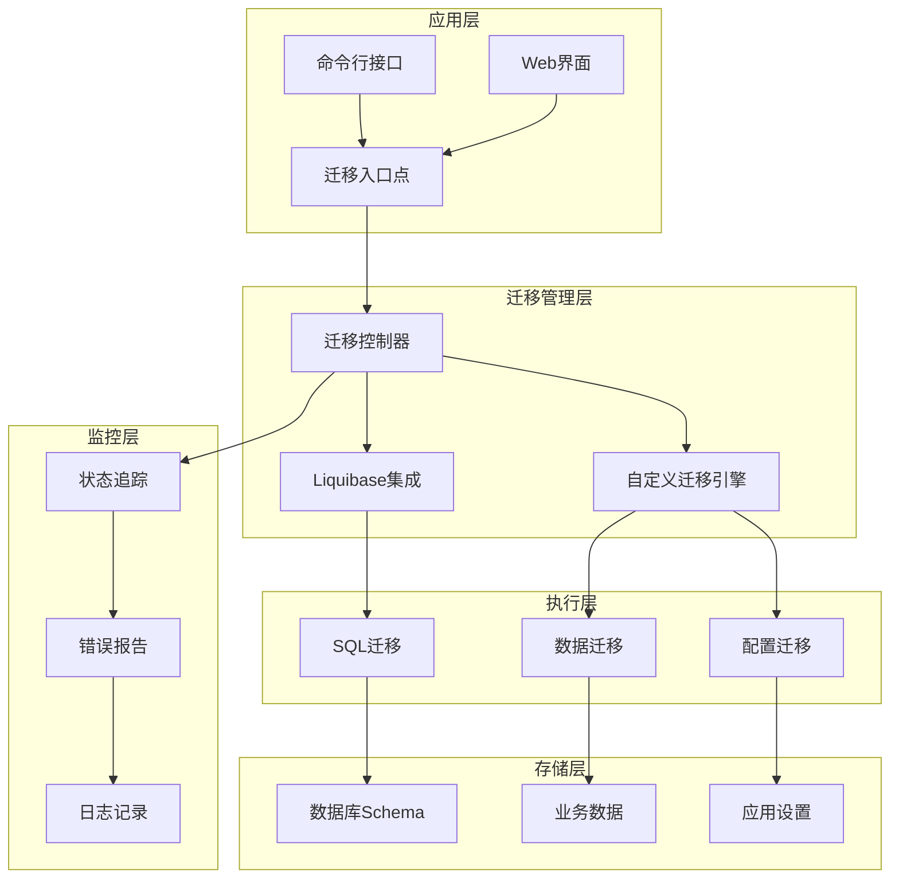

**图表来源**
- [core.clj](file://src/metabase/app_db/core.clj#L1-L50)
- [setup.clj](file://src/metabase/app_db/setup.clj#L1-L50)

## 核心组件分析

### 1. 迁移控制器

迁移控制器是整个迁移系统的核心协调器，负责管理不同类型的迁移任务。

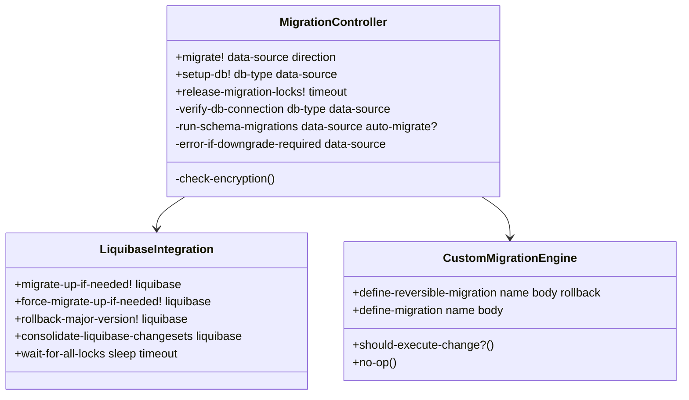

**图表来源**
- [setup.clj](file://src/metabase/app_db/setup.clj#L50-L100)
- [custom_migrations.clj](file://src/metabase/app_db/custom_migrations.clj#L50-L100)

### 2. 自定义迁移引擎

自定义迁移引擎提供了灵活的数据迁移能力，支持复杂的业务逻辑处理。

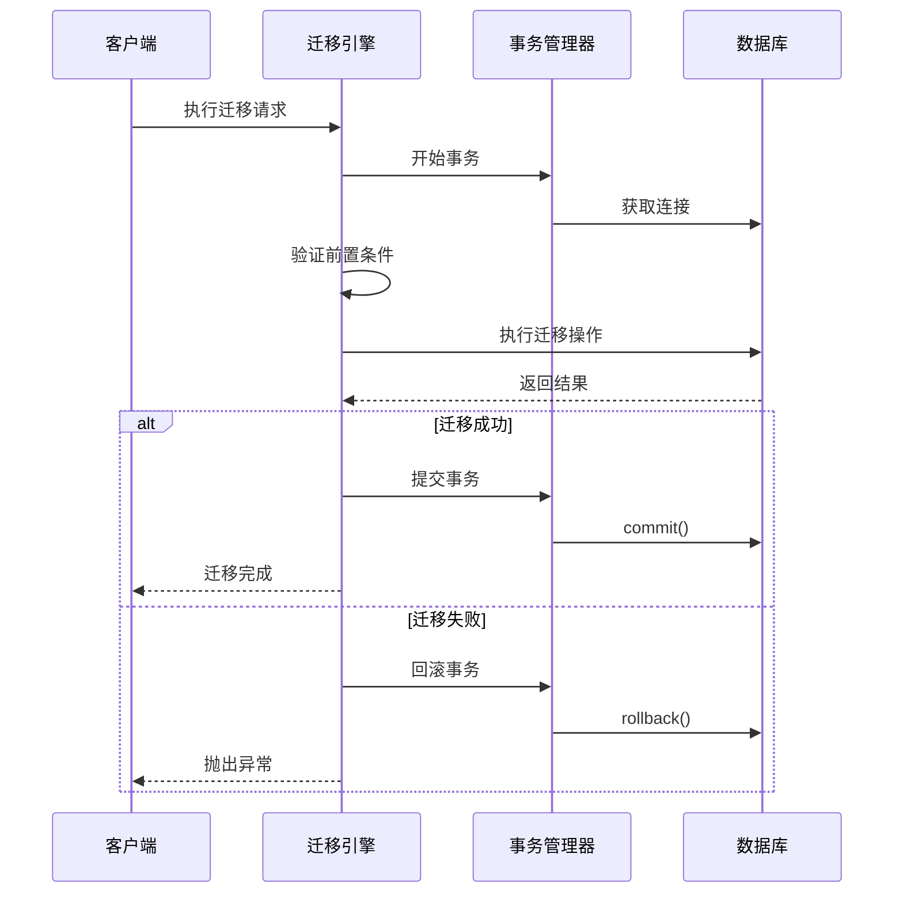

**图表来源**
- [custom_migrations.clj](file://src/metabase/app_db/custom_migrations.clj#L61-L99)

**章节来源**
- [setup.clj](file://src/metabase/app_db/setup.clj#L1-L100)
- [custom_migrations.clj](file://src/metabase/app_db/custom_migrations.clj#L1-L100)

## 迁移任务实现方式

### 1. Liquibase SQL迁移

Liquibase负责处理数据库schema的DDL变更，提供标准化的迁移管理。

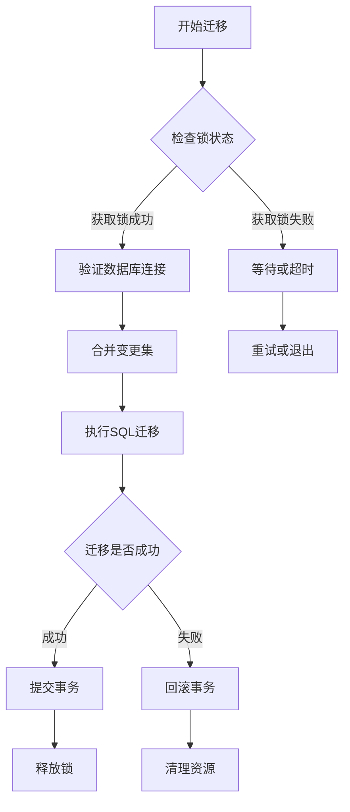

**图表来源**
- [liquibase.clj](file://src/metabase/app_db/liquibase.clj#L350-L400)

### 2. 自定义数据迁移

自定义迁移处理复杂的业务数据转换和配置升级。

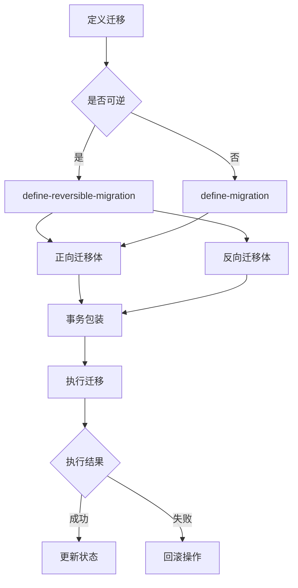

**图表来源**
- [custom_migrations.clj](file://src/metabase/app_db/custom_migrations.clj#L59-L99)

### 3. JSON结构化迁移

处理JSON字段的版本化迁移，确保数据格式的一致性。

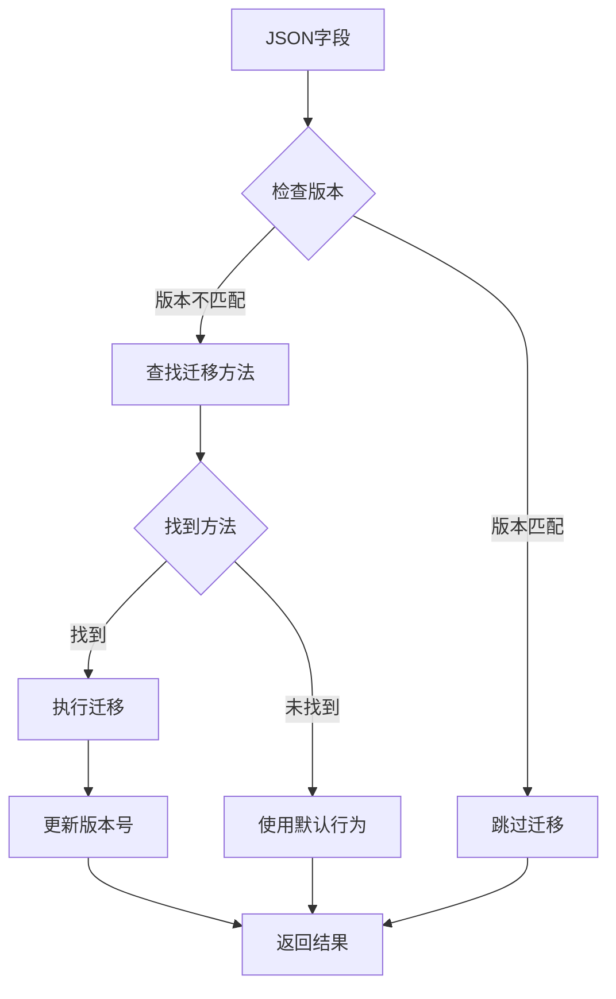

**图表来源**
- [json_migration.clj](file://src/metabase/models/json_migration.clj#L1-L54)

**章节来源**
- [liquibase.clj](file://src/metabase/app_db/liquibase.clj#L1-L100)
- [custom_migrations.clj](file://src/metabase/app_db/custom_migrations.clj#L1-L200)
- [json_migration.clj](file://src/metabase/models/json_migration.clj#L1-L54)

## 幂等性设计

### 版本控制机制

Metabase通过版本控制系统确保迁移的幂等性：

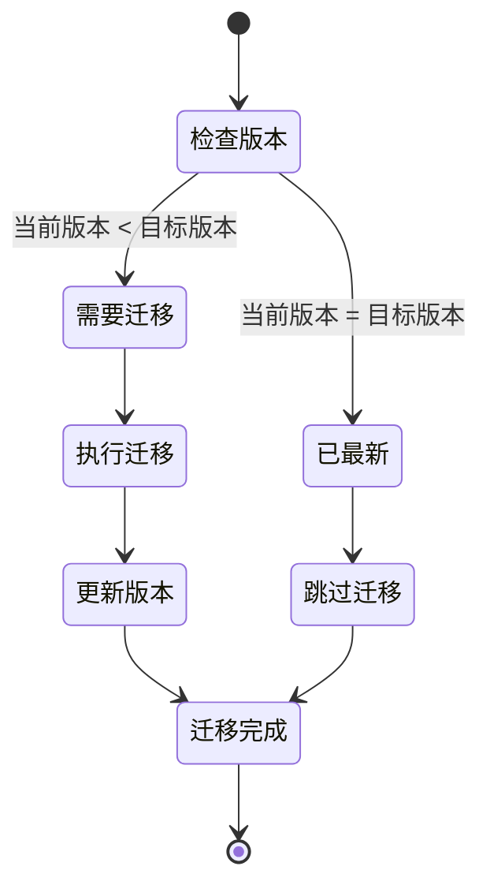

### 条件执行检查

系统在执行每个迁移步骤前都会进行充分的条件检查：

```clojure
(defn should-execute-change?
  "检查变更是否应该被执行。
  这是一个工作绕过。回滚方法被调用两次：一次用于生成MDC数据，
  一次用于实际执行变更。这个相同的问题已经在Liquibase中为前进变更修复，
  但对回滚来说还没有。"
  []
  (BooleanUtil/isTrue (.get (Scope/getCurrentScope) Change/SHOULD_EXECUTE true)))
```

### 去重和幂等性保证

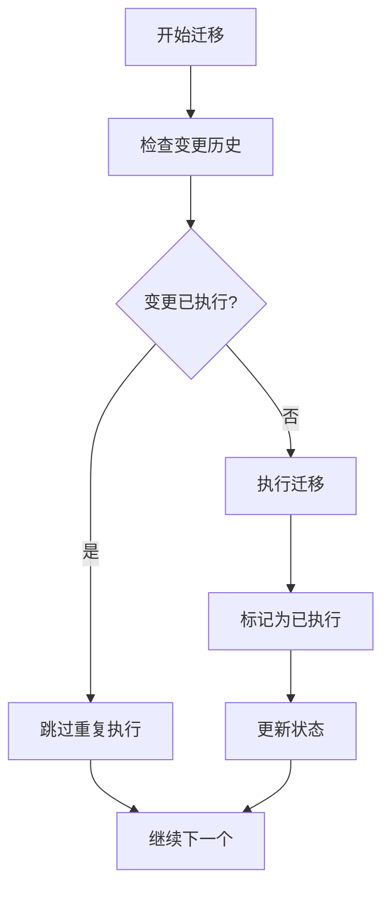

**章节来源**
- [custom_migrations.clj](file://src/metabase/app_db/custom_migrations.clj#L50-L60)
- [json_migration.clj](file://src/metabase/models/json_migration.clj#L3-L10)

## 执行顺序控制

### 迁移依赖图

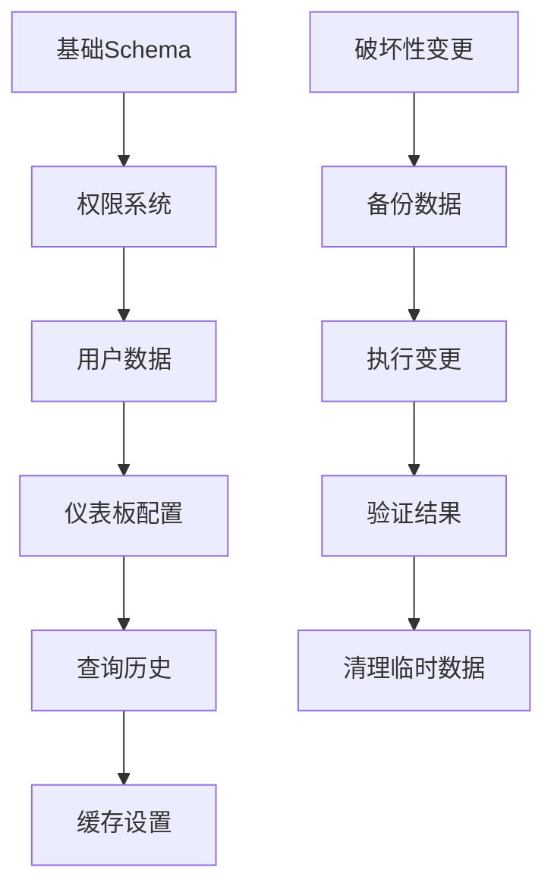

### 分阶段迁移策略

系统采用分阶段的方式管理复杂的迁移流程：

1. **预检查阶段**：验证环境和前置条件
2. **数据准备阶段**：创建备份和临时表
3. **核心迁移阶段**：执行主要的数据变更
4. **验证阶段**：确认迁移结果的正确性
5. **清理阶段**：删除临时数据和清理状态

### 锁定机制

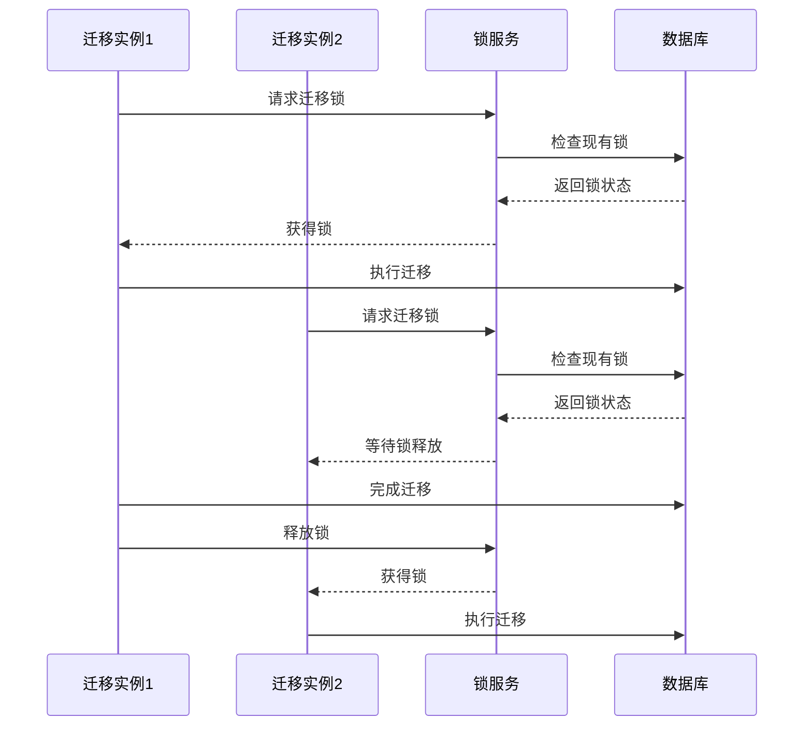

**图表来源**
- [liquibase.clj](file://src/metabase/app_db/liquibase.clj#L350-L400)

**章节来源**
- [liquibase.clj](file://src/metabase/app_db/liquibase.clj#L350-L450)
- [setup.clj](file://src/metabase/app_db/setup.clj#L100-L150)

## 回滚策略

### 可逆迁移设计

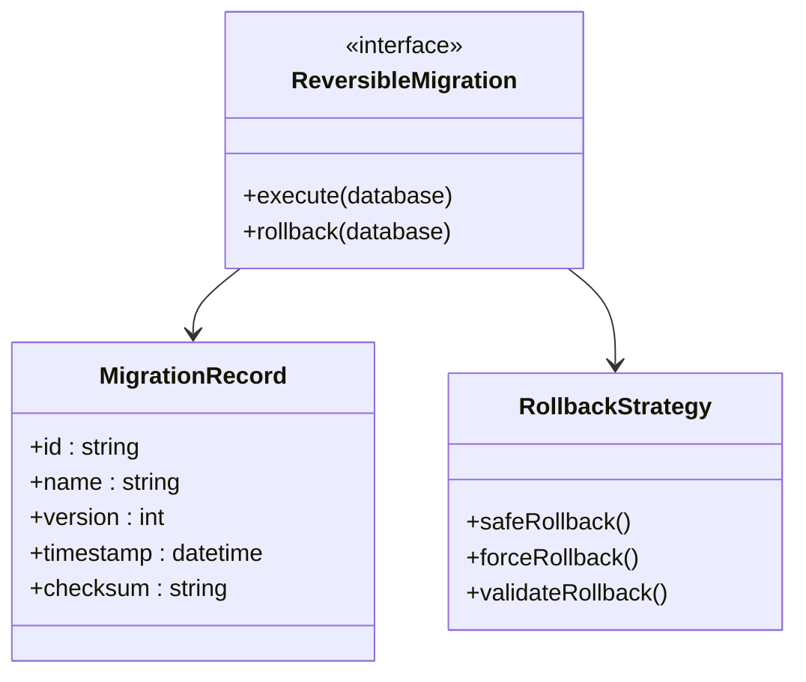

### 回滚触发条件

系统在以下情况下自动触发回滚：

1. **迁移失败**：执行过程中发生异常
2. **验证失败**：迁移结果不符合预期
3. **时间超时**：迁移执行时间超过限制
4. **手动干预**：管理员主动要求回滚

### 渐进式回滚

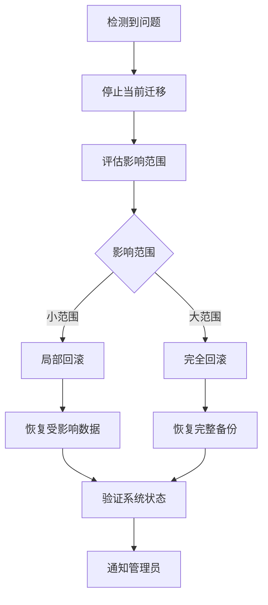

### 回滚验证机制

```clojure
(defn rollback-validation
  [migration-id original-state]
  (let [current-state (capture-current-state)]
    (if (compare-states original-state current-state)
      (log/info "回滚验证成功")
      (log/error "回滚验证失败，需要人工干预"))))
```

**章节来源**
- [custom_migrations.clj](file://src/metabase/app_db/custom_migrations.clj#L61-L99)
- [liquibase.clj](file://src/metabase/app_db/liquibase.clj#L550-L600)

## 错误处理和状态追踪

### 异常处理层次

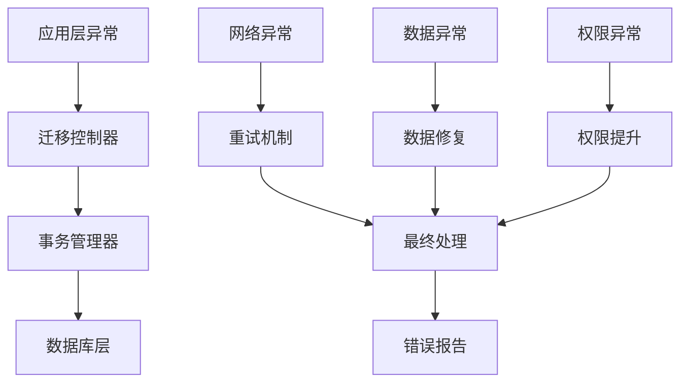

### 状态追踪系统

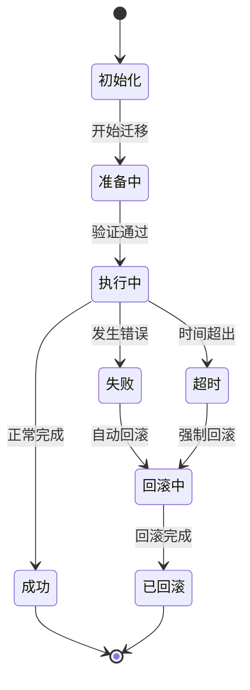

### 日志和监控

系统提供详细的日志记录和实时监控：

```clojure
(defn log-migration-status
  [migration-id status message]
  (log/infof "迁移 %s 状态: %s - %s"
             migration-id
             status
             message))
```

### 错误恢复机制

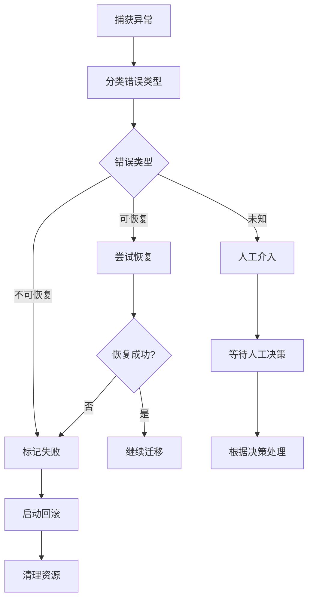

**章节来源**
- [setup.clj](file://src/metabase/app_db/setup.clj#L50-L150)
- [custom_migrations.clj](file://src/metabase/app_db/custom_migrations.clj#L50-L100)

## 自定义迁移示例

### 示例1：权限系统迁移

```clojure
(define-reversible-migration SplitDataPermissions
  (let [current-perms-set (t2/select-fn-set
                           (juxt :object :group_id)
                           :permissions
                           {:where [:or
                                    [:like :object (h2x/literal "/db/%")]
                                    [:like :object (h2x/literal "/data/db/%")]
                                    [:like :object (h2x/literal "/query/db/%")]]})
        v2-perms-set      (into #{} (mapcat
                                     (fn [[v1-path group-id]]
                                       (for [v2-path (->v2-paths v1-path)]
                                         [v2-path group-id]))
                                     current-perms-set))
        new-v2-perms      (into [] (set/difference v2-perms-set current-perms-set))]
    (when (seq new-v2-perms)
      (t2.execute/query-one {:insert-into :permissions
                             :columns     [:object :group_id]
                             :values      new-v2-perms})))
  (t2.execute/query-one {:delete-from :permissions
                         :where [:or [:like :object (h2x/literal "/data/db/%")]
                                 [:like :object (h2x/literal "/query/db/%")]]}))
```

### 示例2：JSON字段升级

```clojure
(def-json-migration migrate-login-settings*)

(defmethod migrate-login-settings* [1 2] [login-settings _version]
  (assoc login-settings :remember_me_days (if (:remember_me login-settings) 30 0)))

(defn migrate-login-settings
  [login-settings]
  (-> login-settings
      (migrate-login-settings* login-settings-version)
      (update-version login-settings-version)))
```

### 示例3：破坏性变更处理

```clojure
(define-reversible-migration UnifyTimeColumnsType
  (unify-time-column-type! :up)
  (unify-time-column-type! :down))

(defn unify-time-column-type!
  [direction]
  (let [db-type (mdb.connection/db-type)
        columns (db-type->to-unified-columns db-type)
        target-type (case direction :up "TIMESTAMP WITH TIME ZONE" "TIMESTAMP WITHOUT TIME ZONE")]
    (doseq [[table column nullable?] columns]
      (t2/query [(alter-table-column-type-sql db-type table column target-type nullable?)]))))
```

**章节来源**
- [custom_migrations.clj](file://src/metabase/app_db/custom_migrations.clj#L168-L200)
- [custom_migrations.clj](file://src/metabase/app_db/custom_migrations.clj#L1002-L1020)
- [json_migration.clj](file://src/metabase/models/json_migration.clj#L20-L50)

## 最佳实践

### 1. 迁移设计原则

- **最小化停机时间**：优先考虑在线迁移
- **数据一致性**：确保迁移过程中的数据完整性
- **可回滚性**：每个迁移都应有对应的回滚方案
- **测试覆盖**：充分的单元测试和集成测试

### 2. 性能优化策略

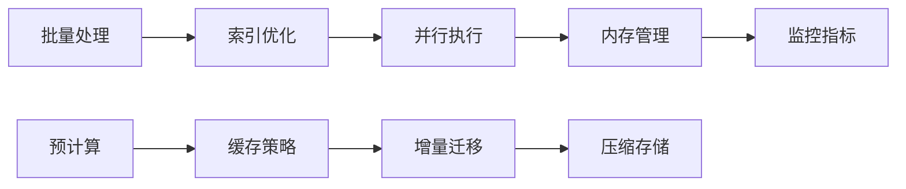

### 3. 安全考虑

- **权限控制**：严格的访问控制和审计
- **数据加密**：敏感数据的加密传输和存储
- **备份策略**：迁移前的完整备份
- **监控告警**：实时监控和异常告警

### 4. 运维建议

- **渐进式部署**：小规模试点后逐步推广
- **回滚计划**：制定详细的回滚预案
- **文档维护**：保持迁移文档的及时更新
- **团队培训**：定期进行迁移操作培训

### 5. 监控和维护

```clojure
(defn monitor-migration-health
  []
  (let [metrics (collect-migration-metrics)
        thresholds {:duration 3600 :errors 5 :warnings 10}]
    (when (> (:duration metrics) (:duration thresholds))
      (log/warn "迁移耗时过长"))
    (when (> (:errors metrics) (:errors thresholds))
      (log/error "迁移错误过多"))
    (when (> (:warnings metrics) (:warnings thresholds))
      (log/warn "迁移警告过多"))))
```

通过遵循这些最佳实践，可以确保Metabase迁移系统的稳定性和可靠性，为用户提供无缝的数据升级体验。