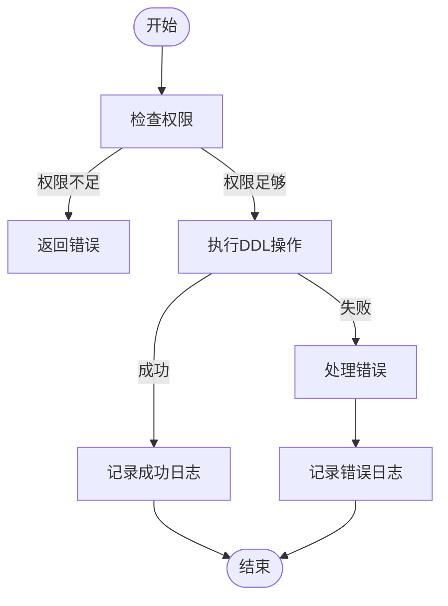

# DDL操作支持

<cite>
**本文档中引用的文件**  
- [interface.clj](file://src/metabase/driver/ddl/interface.clj)
- [mysql.clj](file://src/metabase/driver/mysql/ddl.clj)
- [postgres.clj](file://src/metabase/driver/postgres/ddl.clj)
- [ddl.clj](file://src/metabase/driver/sql/ddl.clj)
- [audit_log.clj](file://src/metabase/audit_app/models/audit_log.clj)
- [audit_log.clj](file://src/metabase/audit_app/events/audit_log.clj)
- [h2.clj](file://src/metabase/driver/h2.clj)
</cite>

## 目录
1. [引言](#引言)
2. [DDL接口设计与实现](#ddl接口设计与实现)
3. [SQL生成器在不同数据库方言下的实现差异](#sql生成器在不同数据库方言下的实现差异)
4. [DDL执行的安全控制和权限验证机制](#ddl执行的安全控制和权限验证机制)
5. [DDL操作的审计日志记录](#ddl操作的审计日志记录)
6. [错误处理策略](#错误处理策略)
7. [DDL操作流程图](#ddl操作流程图)
8. [典型使用场景示例](#典型使用场景示例)
9. [结论](#结论)

## 引言
Metabase是一个开源的数据分析平台，支持多种数据库的连接和操作。本文档旨在全面介绍Metabase中数据定义语言（DDL）操作的支持，包括create-table、drop-table、add-column等操作的协议定义。我们将深入分析SQL生成器在不同数据库方言下的实现差异，解释DDL执行的安全控制和权限验证机制，提供DDL操作的审计日志记录和错误处理策略，并包含DDL操作流程图和典型使用场景示例。

## DDL接口设计与实现
Metabase中的DDL操作通过`metabase.driver.ddl.interface`命名空间中的接口进行定义和实现。该接口提供了创建、删除和修改表的基本方法，确保了跨不同数据库的一致性。

### 核心方法
- `schema-name`: 返回用于持久化模型的模式名称。
- `format-name`: 转换表或字段名称以适应特定数据集。
- `check-can-persist`: 验证源数据库是否可以持久化。
- `refresh!`: 刷新数据存储中的模型。
- `unpersist!`: 取消持久化模型。

### 实现细节
- **create-table!**: 创建新表。
- **drop-table!**: 删除现有表。
- **add-columns!**: 向现有表添加列。

**Section sources**
- [interface.clj](file://src/metabase/driver/ddl/interface.clj#L1-L104)

## SQL生成器在不同数据库方言下的实现差异
Metabase使用HoneySQL库来生成SQL语句，但针对不同的数据库方言进行了定制化处理，以确保生成的SQL语句符合目标数据库的语法要求。

### MySQL
- 使用`current_timestamp(6)`作为当前日期时间函数。
- 在`CREATE TABLE`语句末尾添加`CHARACTER SET`和`COLLATE`信息以强制UTF-8编码。

### PostgreSQL
- 设置事务级别的`statement_timeout`以防止长时间运行的查询。
- 使用`SET LOCAL statement_timeout TO 'timeout_value'`命令。

### H2
- 不支持同时更改多个列，因此将多列更改分解为单个`ALTER TABLE`语句。

**Section sources**
- [mysql.clj](file://src/metabase/driver/mysql/ddl.clj#L1-L181)
- [postgres.clj](file://src/metabase/driver/postgres/ddl.clj#L1-L125)
- [ddl.clj](file://src/metabase/driver/sql/ddl.clj#L1-L64)

## DDL执行的安全控制和权限验证机制
Metabase通过一系列安全控制和权限验证机制来确保DDL操作的安全性。

### 权限验证
- **check-can-persist**: 验证用户是否有权限创建模式、表、读取表和删除表。
- **execute-with-timeout!**: 在执行DDL操作时设置超时，防止长时间运行的查询。

### 安全控制
- **do-with-connection-with-options**: 确保在执行DDL操作时使用正确的连接选项。
- **kill!**: 如果连接因超时而被终止，则发送kill命令以停止执行。

**Section sources**
- [mysql.clj](file://src/metabase/driver/mysql/ddl.clj#L1-L181)
- [postgres.clj](file://src/metabase/driver/postgres/ddl.clj#L1-L125)
- [h2.clj](file://src/metabase/driver/h2.clj#L1-L675)

## DDL操作的审计日志记录
Metabase通过`metabase.audit-app.models.audit-log`命名空间中的模型来记录所有DDL操作的审计日志。

### 审计日志记录
- **record-event!**: 记录事件到审计日志。
- **construct-event**: 生成要记录在审计日志中的数据。

### 事件类型
- `:card-create`, `:card-update`, `:card-delete`
- `:dashboard-create`, `:dashboard-delete`
- `:table-manual-scan`, `:table-manual-sync`
- `:pulse-create`, `:pulse-delete`, `:subscription-unsubscribe`, `:subscription-unsubscribe-undo`, `:alert-unsubscribe`, `:subscription-create`, `:subscription-update`, `:subscription-send`, `:alert-send`

**Section sources**
- [audit_log.clj](file://src/metabase/audit_app/models/audit_log.clj#L1-L251)
- [audit_log.clj](file://src/metabase/audit_app/events/audit_log.clj#L1-L332)

## 错误处理策略
Metabase通过多种错误处理策略来确保DDL操作的健壮性和可靠性。

### 错误类型
- `violate-not-null-constraint`: 违反非空约束。
- `violate-unique-constraint`: 违反唯一性约束。
- `violate-foreign-key-constraint`: 违反外键约束。
- `incorrect-value-type`: 值类型不正确。
- `violate-permission-constraint`: 违反权限约束。
- `violate-check-constraint`: 违反检查约束。

### 错误处理
- **maybe-parse-sql-error**: 解析SQL错误并返回适当的错误消息。
- **throw-invalid-param-exception**: 抛出包含无效API参数信息的异常。

**Section sources**
- [h2.clj](file://src/metabase/driver/h2/actions.clj#L1-L139)
- [api\common.clj](file://src/metabase/api/common.clj#L188-L218)

## DDL操作流程图


**Diagram sources**
- [interface.clj](file://src/metabase/driver/ddl/interface.clj#L1-L104)
- [mysql.clj](file://src/metabase/driver/mysql/ddl.clj#L1-L181)
- [postgres.clj](file://src/metabase/driver/postgres/ddl.clj#L1-L125)

## 典型使用场景示例
### 创建表
```clojure
(driver/create-table! :mysql 1 "new_table" {"id" :type/Integer "name" :type/Text})
```

### 删除表
```clojure
(driver/drop-table! :mysql 1 "old_table")
```

### 添加列
```clojure
(driver/add-columns! :mysql 1 "existing_table" {"age" :type/Integer})
```

### 更新表
```clojure
(driver/alter-table-columns! :mysql 1 "existing_table" {"age" :type/Integer})
```

**Section sources**
- [interface.clj](file://src/metabase/driver/ddl/interface.clj#L1-L104)
- [mysql.clj](file://src/metabase/driver/mysql/ddl.clj#L1-L181)
- [postgres.clj](file://src/metabase/driver/postgres/ddl.clj#L1-L125)

## 结论
Metabase通过精心设计的DDL接口和实现，确保了跨不同数据库的一致性和安全性。通过详细的SQL生成器定制、严格的安全控制和权限验证机制、全面的审计日志记录以及健壮的错误处理策略，Metabase为用户提供了一个强大且可靠的DDL操作支持系统。这些功能不仅提高了系统的稳定性和安全性，还为用户提供了丰富的使用场景和灵活的操作方式。