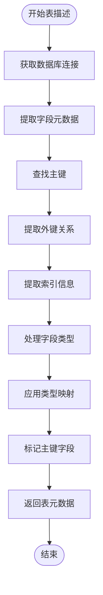

# JDBC元数据提取

<cite>
**本文档中引用的文件**
- [metadata.clj](file://src/metabase/driver/sql_jdbc/metadata.clj)
- [sync.clj](file://src/metabase/driver/sql_jdbc/sync.clj)
- [describe_database.clj](file://src/metabase/driver/sql_jdbc/sync/describe_database.clj)
- [describe_table.clj](file://src/metabase/driver/sql_jdbc/sync/describe_table.clj)
- [common.clj](file://src/metabase/driver/sql_jdbc/sync/common.clj)
- [interface.clj](file://src/metabase/driver/sql_jdbc/sync/interface.clj)
- [fetch_metadata.clj](file://src/metabase/sync/fetch_metadata.clj)
- [sync_metadata.clj](file://src/metabase/sync/sync_metadata.clj)
- [schedules.clj](file://src/metabase/sync/schedules.clj)
- [sync_databases.clj](file://src/metabase/sync/task/sync_databases.clj)
</cite>

## 目录
1. [简介](#简介)
2. [项目结构概览](#项目结构概览)
3. [核心组件分析](#核心组件分析)
4. [架构概览](#架构概览)
5. [详细组件分析](#详细组件分析)
6. [元数据缓存策略](#元数据缓存策略)
7. [同步任务调度机制](#同步任务调度机制)
8. [性能优化建议](#性能优化建议)
9. [特殊数据库方言处理](#特殊数据库方言处理)
10. [故障排除指南](#故障排除指南)
11. [结论](#结论)

## 简介

Metabase的JDBC元数据提取系统是一个复杂而精密的架构，负责从各种关系型数据库中提取表结构、字段类型、约束信息等元数据，并将其映射为Metabase内部的数据模型。该系统通过JDBC DatabaseMetaData API与底层数据库交互，实现了跨数据库的元数据标准化处理。

本文档深入分析了`metadata.clj`和`sync`命名空间中的核心实现，详细说明了元数据提取的完整流程，包括描述表（describe-table）和描述数据库（describe-database）函数的工作原理，以及元数据缓存和同步任务的调度机制。

## 项目结构概览

Metabase的JDBC元数据提取功能主要分布在以下关键目录中：

**图表来源**
- [metadata.clj](file://src/metabase/driver/sql_jdbc/metadata.clj#L1-L42)
- [sync.clj](file://src/metabase/driver/sql_jdbc/sync.clj#L1-L55)
- [fetch_metadata.clj](file://src/metabase/sync/fetch_metadata.clj#L1-L127)

## 核心组件分析

### 元数据查询处理器

`metadata.clj`模块提供了JDBC结果集元数据的标准实现，它使用JDBC DatabaseMetaData API来获取查询结果的列信息。

### 描述数据库实现

`describe_database.clj`模块实现了数据库级别的元数据提取，包括：
- 架构过滤和权限检查
- 表格发现和权限验证
- 快速和后过滤两种表格获取策略

### 描述表实现

`describe_table.clj`模块负责单个表的详细元数据提取，包括：
- 字段类型映射
- 主键识别
- 外键关系
- JSON嵌套字段处理

**章节来源**
- [metadata.clj](file://src/metabase/driver/sql_jdbc/metadata.clj#L15-L42)
- [describe_database.clj](file://src/metabase/driver/sql_jdbc/sync/describe_database.clj#L1-L291)
- [describe_table.clj](file://src/metabase/driver/sql_jdbc/sync/describe_table.clj#L1-L772)

## 架构概览

Metabase的JDBC元数据提取系统采用分层架构设计，确保了良好的可扩展性和维护性：

**图表来源**
- [sync_metadata.clj](file://src/metabase/sync/sync_metadata.clj#L1-L79)
- [fetch_metadata.clj](file://src/metabase/sync/fetch_metadata.clj#L1-L127)

## 详细组件分析

### describe-database函数实现

`describe-database`函数是数据库级别元数据提取的核心入口点，它通过以下步骤工作：

**图表来源**
- [describe_database.clj](file://src/metabase/driver/sql_jdbc/sync/describe_database.clj#L280-L291)

### describe-table函数实现

`describe-table`函数负责提取单个表的详细元数据：

**图表来源**
- [describe_table.clj](file://src/metabase/driver/sql_jdbc/sync/describe_table.clj#L333-L345)

### 字段类型映射机制

字段类型映射是元数据提取的关键环节，涉及将数据库原生类型转换为Metabase内部类型：

| 数据库类型 | Metabase基础类型 | 语义类型 | 备注 |
|------------|------------------|----------|------|
| VARCHAR | :type/Text | :type/* | 文本字段 |
| INTEGER | :type/Integer | :type/* | 整数字段 |
| DECIMAL | :type/Decimal | :type/* | 小数字段 |
| BOOLEAN | :type/Boolean | :type/* | 布尔字段 |
| TIMESTAMP | :type/DateTime | :type/* | 时间戳字段 |
| JSON | :type/JSON | :type/* | JSON字段 |

**章节来源**
- [describe_table.clj](file://src/metabase/driver/sql_jdbc/sync/describe_table.clj#L40-L80)

## 元数据缓存策略

### 缓存层次结构

Metabase采用多层缓存策略来优化元数据提取性能：

**图表来源**
- [validator_cache.clj](file://src/metabase/util/malli/registry/validator_cache.clj#L1-L40)
- [null_cache.clj](file://src/metabase/util/methodical/null_cache.clj#L1-L23)

### 缓存失效策略

缓存系统采用基于时间的失效策略，确保数据的一致性：

- **TTL缓存**：基于查询执行时间的动态过期
- **LRU淘汰**：当缓存容量超过限制时，移除最久未使用的条目
- **手动刷新**：在数据库结构变更时主动清理相关缓存

**章节来源**
- [cache_backend.clj](file://src/metabase/query_processor/middleware/cache_backend/db.clj#L40-L71)

## 同步任务调度机制

### 调度配置系统

Metabase使用灵活的调度配置系统来管理元数据同步任务：

**图表来源**
- [schedules.clj](file://src/metabase/sync/schedules.clj#L55-L74)
- [sync_databases.clj](file://src/metabase/sync/task/sync_databases.clj#L1-L368)

### 任务生命周期管理

同步任务具有完整的生命周期管理机制：

1. **初始化阶段**：注册Quartz作业和触发器
2. **调度阶段**：根据配置设置执行计划
3. **执行阶段**：并发安全地执行同步操作
4. **监控阶段**：跟踪任务状态和性能指标
5. **清理阶段**：移除不再需要的任务

**章节来源**
- [sync_databases.clj](file://src/metabase/sync/task/sync_databases.clj#L200-L367)

## 性能优化建议

### 连接池优化

为了提高元数据提取性能，建议采用以下连接池配置：

- **最小连接数**：设置为数据库最大并发用户的10%
- **最大连接数**：根据数据库的最大并发连接限制确定
- **连接超时**：设置合理的连接获取超时时间
- **空闲超时**：及时回收长时间未使用的连接

### 查询优化策略

1. **批量查询**：尽可能使用批量查询减少网络往返
2. **索引利用**：确保数据库元数据查询能够利用适当索引
3. **结果集限制**：对大型结果集进行适当的大小限制
4. **异步处理**：对于非关键路径的操作采用异步处理

### 内存使用优化

- **流式处理**：使用reducible sequences避免一次性加载大量数据
- **对象复用**：重用ResultSet和Statement对象
- **垃圾回收**：及时关闭资源防止内存泄漏

## 特殊数据库方言处理

### PostgreSQL特定处理

PostgreSQL具有丰富的数据类型系统，需要特殊的处理逻辑：

- **JSON/JSONB类型**：支持嵌套字段自动展开
- **数组类型**：识别和处理数组字段
- **自定义类型**：支持用户定义的数据类型映射

### MySQL特定处理

MySQL的元数据提取需要考虑其独特的特性：

- **存储引擎差异**：不同存储引擎的表属性差异
- **字符集处理**：正确处理字符集和排序规则
- **视图限制**：处理视图元数据提取的限制

### Oracle特定处理

Oracle数据库的复杂性要求专门的处理方案：

- **架构过滤**：Oracle特有的架构概念处理
- **系统表排除**：智能排除系统表和临时表
- **权限检查**：严格的权限验证机制

**章节来源**
- [interface.clj](file://src/metabase/driver/sql_jdbc/sync/interface.clj#L1-L176)

## 故障排除指南

### 常见问题诊断

#### 权限不足错误

当遇到权限不足时，系统会：
1. 记录详细的权限检查日志
2. 尝试降级查询以获取更多信息
3. 提供清晰的错误消息指导用户

#### 连接超时问题

连接超时通常由以下原因引起：
- 网络延迟过高
- 数据库负载过大
- 连接池配置不当

解决方案包括调整超时参数和优化连接池配置。

#### 类型映射失败

类型映射失败时，系统会：
1. 记录未知类型的详细信息
2. 使用回退类型`:type/*`
3. 在日志中记录警告信息

**章节来源**
- [describe_database.clj](file://src/metabase/driver/sql_jdbc/sync/describe_database.clj#L100-L150)

### 调试工具和技巧

1. **启用详细日志**：设置适当的日志级别获取详细信息
2. **使用调试模式**：在开发环境中启用额外的调试信息
3. **监控性能指标**：跟踪查询执行时间和资源使用情况
4. **测试连接**：定期测试数据库连接的可用性

## 结论

Metabase的JDBC元数据提取系统是一个高度优化和可扩展的架构，通过精心设计的分层结构和缓存策略，实现了高效的跨数据库元数据处理能力。该系统不仅支持主流的关系型数据库，还具备良好的扩展性来适应新的数据库类型。

关键优势包括：
- **高性能**：通过连接池、缓存和批量处理优化性能
- **高可靠性**：完善的错误处理和恢复机制
- **高可扩展性**：模块化设计支持新数据库类型的快速集成
- **高可用性**：分布式调度和故障转移机制

未来的改进方向可能包括：
- 更智能的缓存策略
- 实时元数据变更检测
- 更好的并发控制机制
- 增强的诊断和监控功能