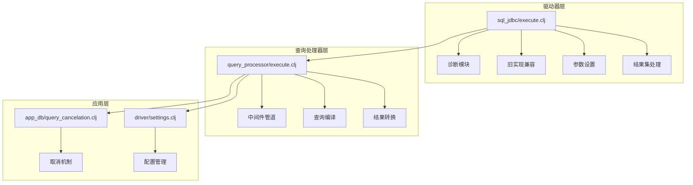
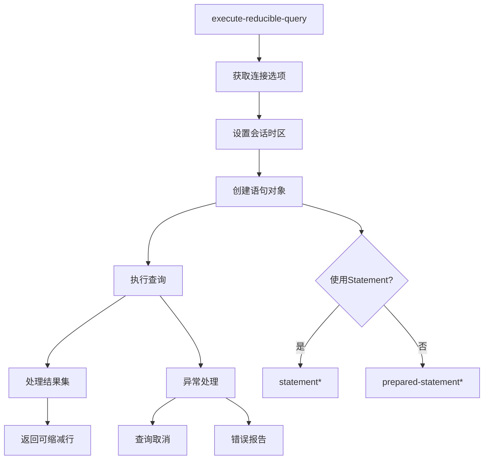
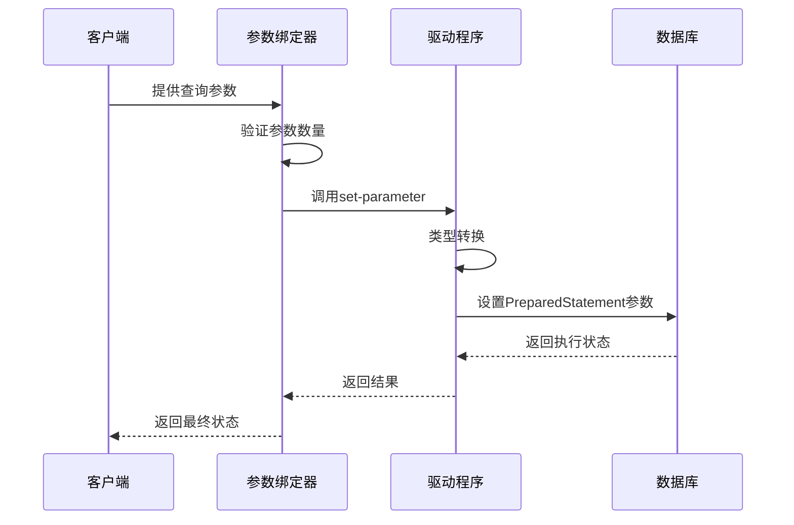
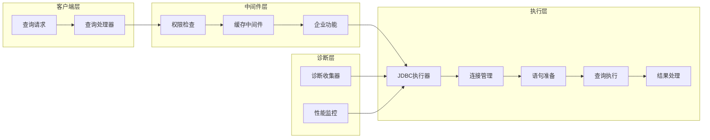
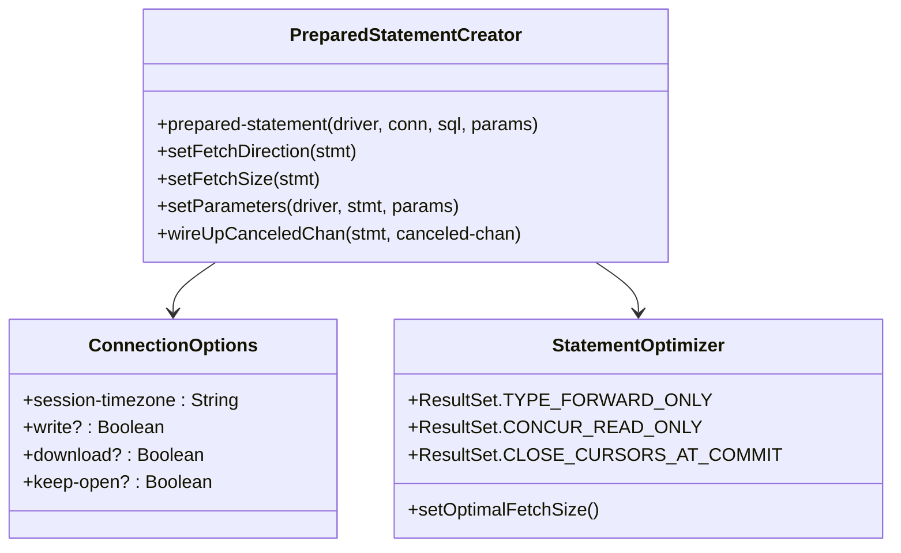
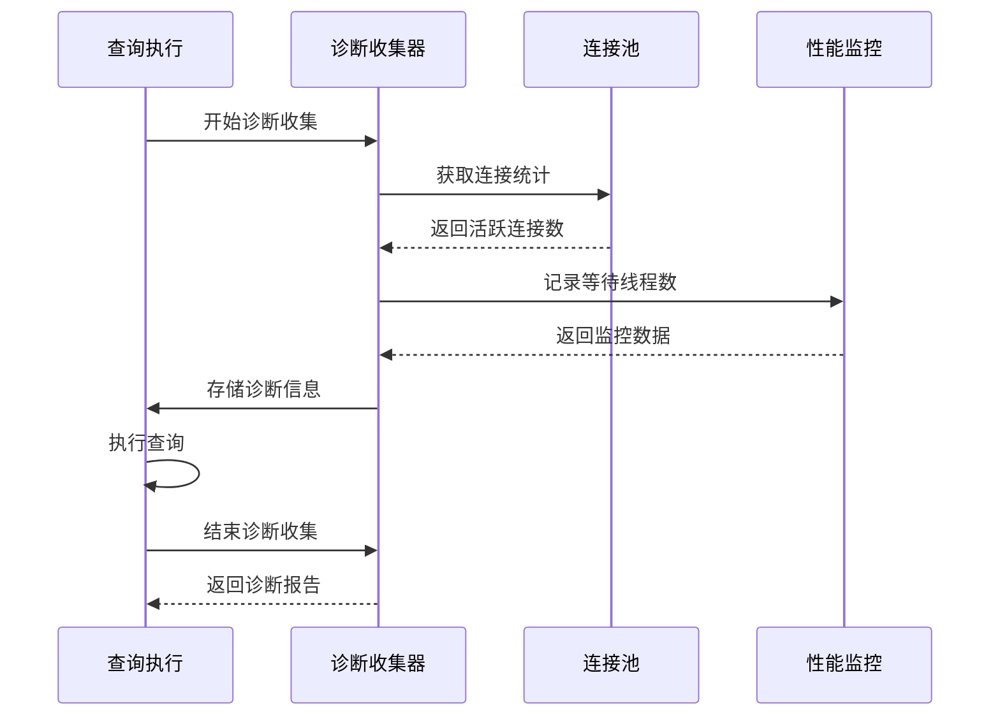
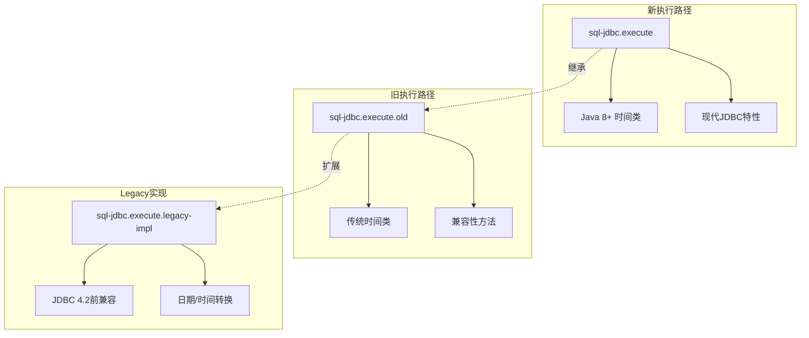
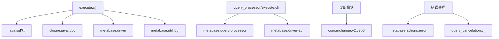
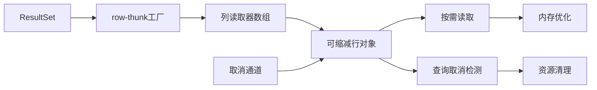
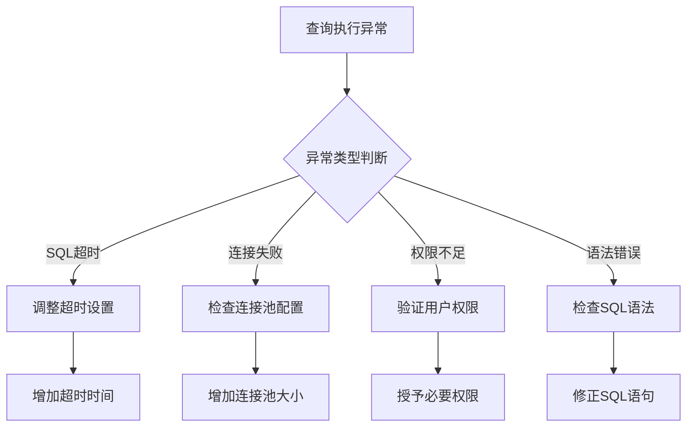

# Metabase JDBC查询执行机制详细文档

<cite>
**本文档中引用的文件**
- [execute.clj](file://src/metabase/driver/sql_jdbc/execute.clj)
- [diagnostic.clj](file://src/metabase/driver/sql_jdbc/execute/diagnostic.clj)
- [old_impl.clj](file://src/metabase/driver/sql_jdbc/execute/old_impl.clj)
- [execute.clj](file://src/metabase/query_processor/execute.clj)
- [query_cancelation.clj](file://src/metabase/app_db/query_cancelation.clj)
- [settings.clj](file://src/metabase/driver/settings.clj)
- [actions.clj](file://src/metabase/driver/sql_jdbc/actions.clj)
- [catch_exceptions.clj](file://src/metabase/query_processor/middleware/catch_exceptions.clj)
</cite>

## 目录
1. [简介](#简介)
2. [项目结构概览](#项目结构概览)
3. [核心组件分析](#核心组件分析)
4. [架构概览](#架构概览)
5. [详细组件分析](#详细组件分析)
6. [依赖关系分析](#依赖关系分析)
7. [性能考虑](#性能考虑)
8. [故障排除指南](#故障排除指南)
9. [结论](#结论)

## 简介

Metabase的JDBC查询执行机制是一个复杂而精密的系统，负责安全、高效地执行数据库查询。该系统通过多层次的抽象和优化策略，确保查询的安全性、性能和可靠性。本文档深入分析了`execute.clj`中的核心实现，包括参数绑定、SQL注入防护、结果集处理、诊断模式、兼容性处理等关键功能。

## 项目结构概览

Metabase的JDBC查询执行机制主要分布在以下目录结构中：



**图表来源**
- [execute.clj](file://src/metabase/driver/sql_jdbc/execute.clj#L1-L50)
- [execute.clj](file://src/metabase/query_processor/execute.clj#L1-L30)

## 核心组件分析

### 查询执行入口点

JDBC查询执行的核心入口是`execute-reducible-query`函数，它协调整个查询执行流程：



**图表来源**
- [execute.clj](file://src/metabase/driver/sql_jdbc/execute.clj#L750-L820)

### 参数绑定机制

参数绑定是防止SQL注入的关键安全措施：



**图表来源**
- [execute.clj](file://src/metabase/driver/sql_jdbc/execute.clj#L480-L500)

**节来源**
- [execute.clj](file://src/metabase/driver/sql_jdbc/execute.clj#L480-L500)

## 架构概览

### 整体执行架构



**图表来源**
- [execute.clj](file://src/metabase/query_processor/execute.clj#L40-L60)
- [execute.clj](file://src/metabase/driver/sql_jdbc/execute.clj#L750-L820)

## 详细组件分析

### prepare-statement实现

`prepare-statement`函数负责创建预编译语句并设置必要的性能优化参数：



**图表来源**
- [execute.clj](file://src/metabase/driver/sql_jdbc/execute.clj#L480-L530)

### execute-query实现

查询执行的核心逻辑通过多方法分发实现：

```mermaid
flowchart TD
A[execute-query] --> B{查询类型判断}
B --> |使用Statement| C[execute-statement!]
B --> |使用PreparedStatement| D[execute-prepared-statement!]
C --> E[.execute(sql)]
D --> F[.executeQuery()]
E --> G{返回ResultSet?}
G --> |是| H[返回结果集]
G --> |否| I[抛出异常]
F --> H
H --> J[结果集元数据处理]
I --> K[异常处理]
```

**图表来源**
- [execute.clj](file://src/metabase/driver/sql_jdbc/execute.clj#L580-L600)

### 诊断模式实现

诊断模式提供了实时的连接池和查询性能监控：



**图表来源**
- [diagnostic.clj](file://src/metabase/driver/sql_jdbc/execute/diagnostic.clj#L30-L50)

**节来源**
- [diagnostic.clj](file://src/metabase/driver/sql_jdbc/execute/diagnostic.clj#L1-L50)

### 兼容性处理策略

系统通过多方法分发支持不同版本的JDBC驱动：



**图表来源**
- [execute.clj](file://src/metabase/driver/sql_jdbc/execute.clj#L1-L20)
- [old_impl.clj](file://src/metabase/driver/sql_jdbc/execute/old_impl.clj#L1-L30)

**节来源**
- [execute.clj](file://src/metabase/driver/sql_jdbc/execute.clj#L1-L20)
- [old_impl.clj](file://src/metabase/driver/sql_jdbc/execute/old_impl.clj#L1-L31)

## 依赖关系分析

### 核心依赖关系图



**图表来源**
- [execute.clj](file://src/metabase/driver/sql_jdbc/execute.clj#L10-L30)
- [execute.clj](file://src/metabase/query_processor/execute.clj#L1-L15)

**节来源**
- [execute.clj](file://src/metabase/driver/sql_jdbc/execute.clj#L10-L30)
- [execute.clj](file://src/metabase/query_processor/execute.clj#L1-L15)

## 性能考虑

### 查询超时配置

系统提供了多层次的超时控制机制：

| 配置项 | 默认值 | 描述 | 影响范围 |
|--------|--------|------|----------|
| `db-query-timeout-minutes` | 20分钟(生产)/3分钟(测试) | 数据库查询超时 | 单个查询执行 |
| `jdbc-data-warehouse-unreturned-connection-timeout-seconds` | 动态计算 | 连接池超时 | 连接生命周期 |
| `sql-jdbc-fetch-size` | 驱动特定 | 结果集获取大小 | 内存使用效率 |

### 大结果集流式处理

系统采用可缩减行(Reducible Rows)模式处理大数据集：



**图表来源**
- [execute.clj](file://src/metabase/driver/sql_jdbc/execute.clj#L650-L700)

## 故障排除指南

### 常见异常及解决方案

#### SQL注入防护相关异常

| 异常类型 | 错误消息 | 解决方案 |
|----------|----------|----------|
| 参数数量不匹配 | "It looks like we got more parameters than we can handle" | 检查SQL语句中的参数占位符数量 |
| 类型转换失败 | "无法转换参数类型" | 使用正确的Java类型进行参数绑定 |
| 语法错误 | "Error preparing statement" | 验证SQL语法和标识符 |

#### 查询执行异常



**图表来源**
- [query_cancelation.clj](file://src/metabase/app_db/query_cancelation.clj#L30-L55)
- [catch_exceptions.clj](file://src/metabase/query_processor/middleware/catch_exceptions.clj#L65-L95)

#### 错误代码映射表

| 数据库类型 | 错误代码 | 含义 | 处理方式 |
|------------|----------|------|----------|
| MySQL/MariaDB | 1317 | 查询被取消 | 检查查询复杂度和超时设置 |
| MySQL/MariaDB | 3024 | 语句超时 | 优化查询或增加超时时间 |
| PostgreSQL | 57014 | 查询被取消 | 检查查询执行计划 |
| H2 | 特定错误码 | H2特定错误 | 查阅H2文档 |

**节来源**
- [query_cancelation.clj](file://src/metabase/app_db/query_cancelation.clj#L1-L55)
- [actions.clj](file://src/metabase/driver/sql_jdbc/actions.clj#L30-L60)

### 最佳实践建议

1. **查询优化**
   - 使用PreparedStatement而非Statement
   - 设置合适的fetch size
   - 实现查询超时机制

2. **安全性**
   - 始终使用参数化查询
   - 验证所有输入参数
   - 实施适当的权限控制

3. **性能监控**
   - 启用诊断模式收集性能数据
   - 监控连接池使用情况
   - 分析查询执行计划

4. **错误处理**
   - 实现优雅的异常恢复
   - 提供有意义的错误信息
   - 记录详细的错误日志

## 结论

Metabase的JDBC查询执行机制展现了现代数据库应用程序设计的最佳实践。通过多层次的抽象、完善的错误处理、灵活的配置选项和强大的诊断功能，该系统能够安全、高效地处理各种复杂的查询场景。

系统的设计充分考虑了向后兼容性，通过多方法分发支持不同版本的JDBC驱动，同时为未来的功能扩展预留了空间。诊断模式的引入使得运维人员能够深入了解查询性能瓶颈，为系统优化提供了有力支持。

对于开发者而言，理解这些底层机制有助于编写更高效的查询代码，更好地处理异常情况，并充分利用系统的各项功能特性。随着数据库技术的不断发展，这套查询执行机制也将持续演进，以适应新的需求和挑战。