# Metabase JDBC连接管理详细文档

<cite>
**本文档中引用的文件**
- [connection.clj](file://src/metabase/app_db/connection.clj)
- [connection_pool_setup.clj](file://src/metabase/app_db/connection_pool_setup.clj)
- [data_source.clj](file://src/metabase/app_db/data_source.clj)
- [spec.clj](file://src/metabase/app_db/spec.clj)
- [ssh_tunnel.clj](file://src/metabase/driver/sql_jdbc/connection/ssh_tunnel.clj)
- [connection.clj](file://src/metabase/driver/sql_jdbc/connection.clj)
- [util/connection.clj](file://src/metabase/util/connection.clj)
</cite>

## 目录
1. [简介](#简介)
2. [项目结构概览](#项目结构概览)
3. [核心组件分析](#核心组件分析)
4. [架构概览](#架构概览)
5. [详细组件分析](#详细组件分析)
6. [SSH隧道支持实现](#ssh隧道支持实现)
7. [连接生命周期管理](#连接生命周期管理)
8. [性能调优与监控](#性能调优与监控)
9. [故障排除指南](#故障排除指南)
10. [总结](#总结)

## 简介

Metabase的JDBC连接管理系统是一个复杂而精密的架构，负责管理应用程序数据库和数据仓库数据库的连接池、SSH隧道支持以及连接生命周期。该系统采用C3P0连接池作为主要连接池实现，提供了强大的连接管理功能，包括连接泄漏检测、性能监控和自动恢复机制。

本文档深入分析了连接管理的核心组件，包括连接池初始化、数据源配置、连接字符串生成、SSH隧道支持以及连接生命周期管理等关键功能。

## 项目结构概览

Metabase的JDBC连接管理主要分布在以下关键模块中：

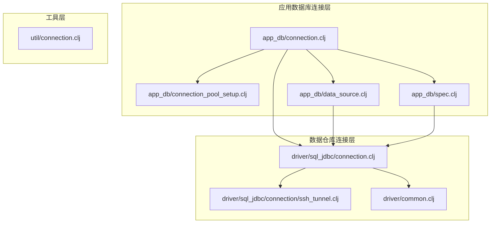

**图表来源**
- [connection.clj](file://src/metabase/app_db/connection.clj#L1-L211)
- [connection_pool_setup.clj](file://src/metabase/app_db/connection_pool_setup.clj#L1-L152)
- [data_source.clj](file://src/metabase/app_db/data_source.clj#L1-L174)

## 核心组件分析

### 应用程序数据库连接管理

应用程序数据库连接管理是Metabase的核心组件，负责管理Metabase自身的数据库连接。

#### ApplicationDB记录类型

ApplicationDB是连接管理的核心数据结构，封装了数据库类型、数据源、状态标识符和读写锁：

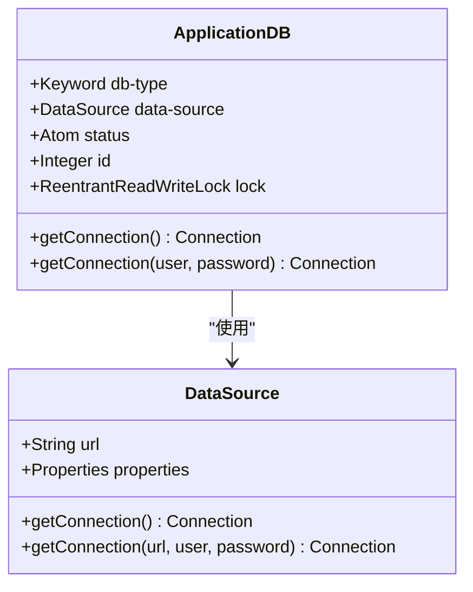

**图表来源**
- [connection.clj](file://src/metabase/app_db/connection.clj#L25-L65)
- [data_source.clj](file://src/metabase/app_db/data_source.clj#L50-L90)

#### 连接池初始化机制

连接池初始化通过`application-db`函数完成，该函数创建ApplicationDB实例并根据配置决定是否创建连接池：

**节来源**
- [connection.clj](file://src/metabase/app_db/connection.clj#L75-L95)

### 数据源配置与连接字符串生成

数据源配置是连接管理的基础，负责将用户输入转换为JDBC连接规范。

#### 规范生成函数

不同数据库类型的规范生成遵循统一的模式：

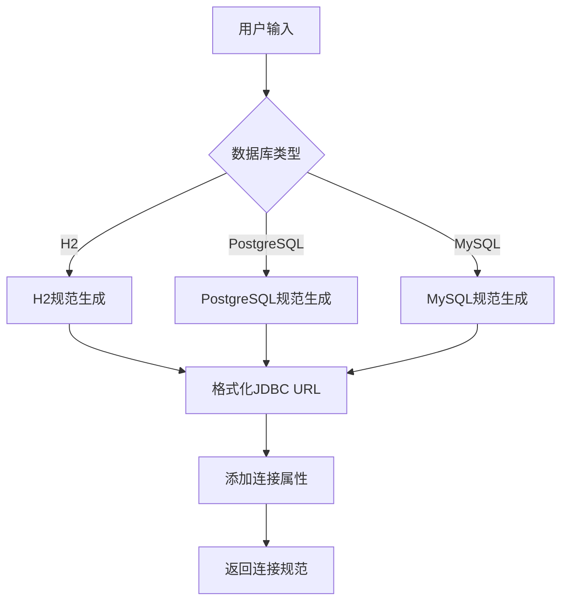

**图表来源**
- [spec.clj](file://src/metabase/app_db/spec.clj#L15-L80)

**节来源**
- [spec.clj](file://src/metabase/app_db/spec.clj#L15-L80)

## 架构概览

Metabase的JDBC连接管理架构采用分层设计，从底层的数据源到上层的应用接口：

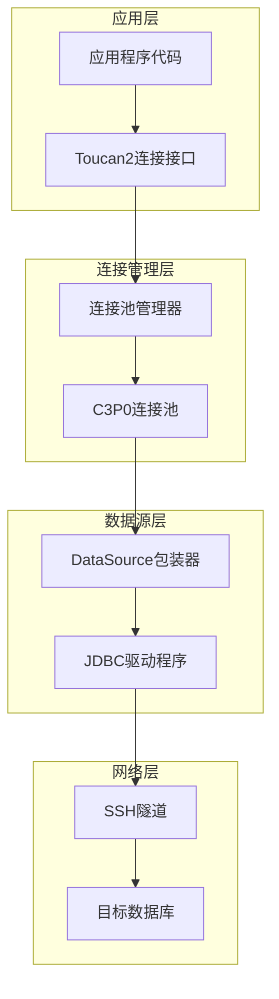

**图表来源**
- [connection.clj](file://src/metabase/app_db/connection.clj#L1-L50)
- [connection_pool_setup.clj](file://src/metabase/app_db/connection_pool_setup.clj#L1-L50)

## 详细组件分析

### 连接详情到规范转换

`connection-details->spec`函数是连接管理的核心转换器，负责将用户提供的连接详情转换为HikariCP兼容的连接参数。

#### 转换流程

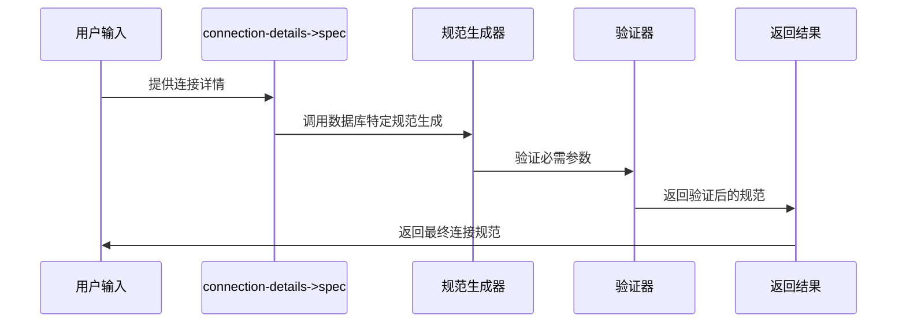

**图表来源**
- [connection.clj](file://src/metabase/driver/sql_jdbc/connection.clj#L35-L45)

**节来源**
- [connection.clj](file://src/metabase/driver/sql_jdbc/connection.clj#L35-L45)

### 连接池配置管理

连接池配置通过C3P0实现，提供了丰富的配置选项来优化连接性能和可靠性。

#### 关键配置参数

| 参数名称 | 默认值 | 描述 | 性能影响 |
|---------|--------|------|----------|
| maxPoolSize | 15 | 最大连接数 | 影响并发能力 |
| minPoolSize | 0 | 最小连接数 | 影响启动时间 |
| maxIdleTime | 3小时 | 空闲连接超时 | 影响资源利用率 |
| maxConnectionAge | 1小时 | 连接最大生命周期 | 影响稳定性 |
| testConnectionOnCheckout | true | 检出时测试连接 | 影响延迟 |
| unreturnedConnectionTimeout | 查询超时 | 未返回连接超时 | 影响泄漏检测 |

**节来源**
- [connection_pool_setup.clj](file://src/metabase/app_db/connection_pool_setup.clj#L85-L150)

### 连接自定义器实现

连接自定义器提供了连接生命周期事件的钩子函数，用于监控和维护连接状态：

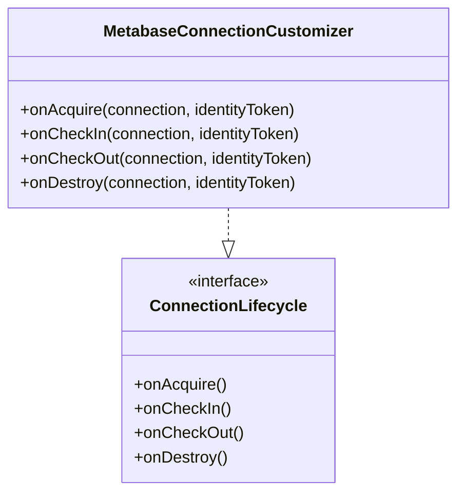

**图表来源**
- [connection_pool_setup.clj](file://src/metabase/app_db/connection_pool_setup.clj#L55-L85)

**节来源**
- [connection_pool_setup.clj](file://src/metabase/app_db/connection_pool_setup.clj#L55-L85)

## SSH隧道支持实现

SSH隧道支持为远程数据库连接提供了安全的访问通道，通过Apache SSHD库实现。

### SSH隧道建立流程

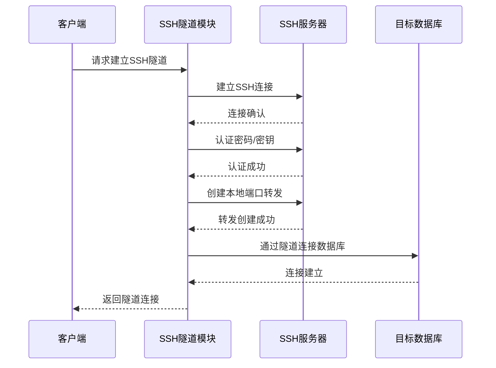

**图表来源**
- [ssh_tunnel.clj](file://src/metabase/driver/sql_jdbc/connection/ssh_tunnel.clj#L60-L90)

### SSH配置映射

SSH隧道配置支持多种认证方式：

| 配置项 | 类型 | 必需 | 描述 |
|--------|------|------|------|
| tunnel-enabled | boolean | 否 | 是否启用SSH隧道 |
| tunnel-host | string | 是 | SSH服务器主机名 |
| tunnel-port | integer | 否 | SSH服务器端口（默认22） |
| tunnel-user | string | 是 | SSH用户名 |
| tunnel-auth-option | select | 否 | 认证方式（密码/密钥） |
| tunnel-pass | password | 条件 | SSH密码 |
| tunnel-private-key | string | 条件 | SSH私钥内容 |
| tunnel-private-key-passphrase | password | 条件 | 私钥密码短语 |

**节来源**
- [ssh_tunnel.clj](file://src/metabase/driver/sql_jdbc/connection/ssh_tunnel.clj#L1-L162)

### 异常处理机制

SSH隧道实现了完善的异常处理和重连机制：

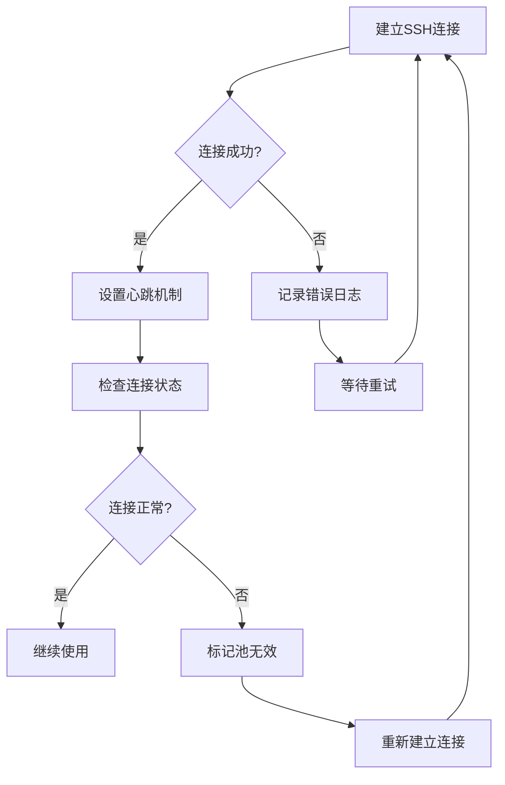

**图表来源**
- [ssh_tunnel.clj](file://src/metabase/driver/sql_jdbc/connection/ssh_tunnel.clj#L120-L162)

**节来源**
- [ssh_tunnel.clj](file://src/metabase/driver/sql_jdbc/connection/ssh_tunnel.clj#L120-L162)

## 连接生命周期管理

### 空闲超时配置

连接池实现了多层次的超时控制机制：

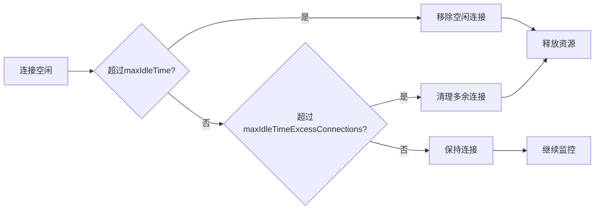

**图表来源**
- [connection_pool_setup.clj](file://src/metabase/app_db/connection_pool_setup.clj#L108-L134)

### 最大生命周期管理

连接的最大生命周期通过`maxConnectionAge`参数控制，防止连接因长时间运行而导致的问题：

**节来源**
- [connection_pool_setup.clj](file://src/metabase/app_db/connection_pool_setup.clj#L120-L134)

### 连接测试机制

连接测试通过`testConnectionOnCheckout`参数启用，在连接检出时进行有效性检查：

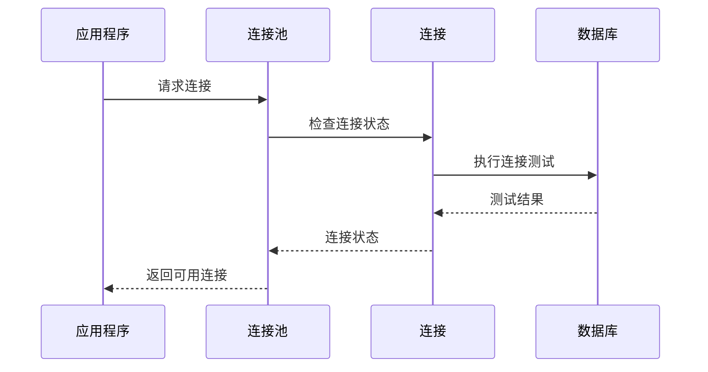

**图表来源**
- [connection.clj](file://src/metabase/driver/sql_jdbc/connection.clj#L85-L115)

**节来源**
- [connection.clj](file://src/metabase/driver/sql_jdbc/connection.clj#L85-L115)

## 性能调优与监控

### 连接泄漏检测

连接池提供了完整的连接泄漏检测机制：

| 配置参数 | 功能 | 默认值 | 监控指标 |
|----------|------|--------|----------|
| unreturnedConnectionTimeout | 未返回连接超时 | 查询超时 | 连接使用时间 |
| debugUnreturnedConnectionStackTraces | 泄漏堆栈跟踪 | false | 异常堆栈信息 |
| testConnectionOnCheckout | 检出时测试 | true | 连接有效性 |

**节来源**
- [connection.clj](file://src/metabase/driver/sql_jdbc/connection.clj#L120-L155)

### 性能监控指标

连接池提供了丰富的监控指标：

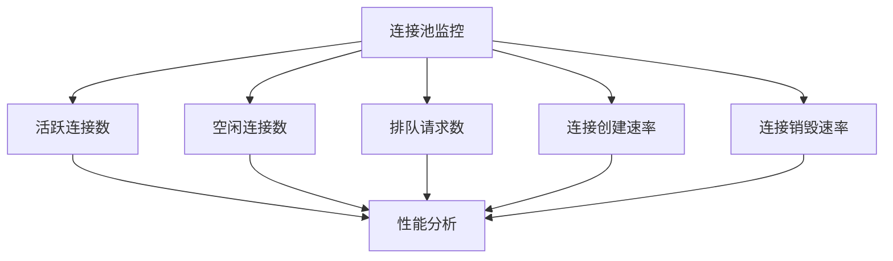

### 内存优化策略

针对PostgreSQL连接实现了特殊的内存清理机制：

**节来源**
- [connection_pool_setup.clj](file://src/metabase/app_db/connection_pool_setup.clj#L40-L50)

## 故障排除指南

### 常见问题诊断

#### 连接池耗尽

当连接池达到最大容量时，新请求会被阻塞或失败：

**诊断步骤：**
1. 检查`maxPoolSize`配置
2. 监控连接使用情况
3. 分析连接泄漏
4. 优化查询性能

#### SSH隧道连接失败

SSH隧道连接失败通常由以下原因引起：

**常见原因及解决方案：**
- 网络连接问题：检查网络连通性
- 认证失败：验证SSH凭据
- 端口冲突：检查端口占用
- 防火墙阻止：配置防火墙规则

**节来源**
- [ssh_tunnel.clj](file://src/metabase/driver/sql_jdbc/connection/ssh_tunnel.clj#L60-L90)

### 连接建立时序图

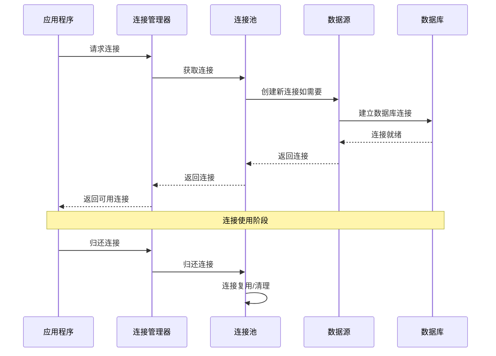

**图表来源**
- [connection.clj](file://src/metabase/app_db/connection.clj#L40-L65)
- [connection_pool_setup.clj](file://src/metabase/app_db/connection_pool_setup.clj#L140-L152)

## 总结

Metabase的JDBC连接管理系统是一个高度优化和可靠的架构，具有以下特点：

1. **模块化设计**：清晰的分层架构便于维护和扩展
2. **高性能**：基于C3P0的连接池提供优秀的性能表现
3. **安全性**：SSH隧道支持确保远程连接的安全性
4. **可监控性**：完善的监控和调试机制
5. **容错性**：健壮的异常处理和自动恢复机制

该系统通过精心设计的连接生命周期管理和性能调优策略，为Metabase提供了稳定可靠的数据连接服务，支撑着整个平台的正常运行。