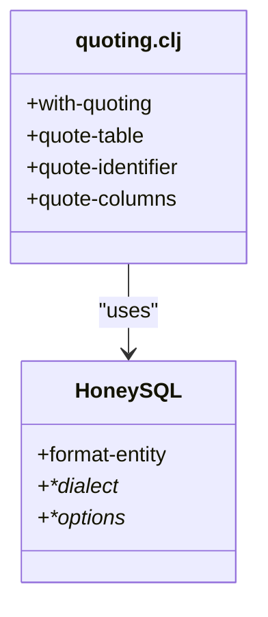

# JDBC驱动兼容性

<cite>
**本文档引用的文件**   
- [quoting.clj](file://src/metabase/driver/sql_jdbc/quoting.clj)
- [mysql.clj](file://src/metabase/driver/mysql.clj)
- [postgres.clj](file://src/metabase/driver/postgres.clj)
- [h2.clj](file://src/metabase/driver/h2.clj)
- [connection.clj](file://src/metabase/driver/sql_jdbc/connection.clj)
- [common.clj](file://src/metabase/driver/sql_jdbc/common.clj)
- [query_processor.clj](file://src/metabase/driver/sql/query_processor.clj)
- [init.clj](file://src/metabase/driver/init.clj)
- [driver.clj](file://src/metabase/driver/driver.clj)
</cite>

## 目录
1. [引言](#引言)
2. [支持的数据库类型与JDBC驱动版本](#支持的数据库类型与jdbc驱动版本)
3. [方言差异处理机制](#方言差异处理机制)
4. [引号处理的多态实现](#引号处理的多态实现)
5. [连接字符串模板与驱动下载](#连接字符串模板与驱动下载)
6. [常见兼容性问题与解决方案](#常见兼容性问题与解决方案)
7. [版本兼容性对照表与升级注意事项](#版本兼容性对照表与升级注意事项)

## 引言
本文档系统整理了Metabase对各类数据库的JDBC驱动兼容性要求，详细说明了H2、MySQL、PostgreSQL等数据库的驱动版本、连接配置、方言差异处理机制以及引号处理的多态实现。文档旨在为用户提供完整的驱动配置指南和常见问题解决方案，确保Metabase能够稳定、高效地连接和查询各类数据源。

## 支持的数据库类型与JDBC驱动版本
Metabase通过其SQL-JDBC驱动框架支持多种关系型数据库。核心支持的数据库包括H2、MySQL和PostgreSQL，每种数据库都有特定的驱动实现和版本要求。

### H2数据库
H2是一个嵌入式Java数据库，常用于开发和测试环境。Metabase通过`h2.clj`文件中的实现来支持H2数据库。H2驱动的连接细节主要通过文件路径或TCP连接字符串指定，并支持安全选项如`IFEXISTS=TRUE`来防止意外的数据库创建。

**Section sources**
- [h2.clj](file://src/metabase/driver/h2.clj#L1-L100)

### MySQL数据库
MySQL是广泛使用的关系型数据库。Metabase的MySQL驱动在`mysql.clj`中实现，支持MySQL 5.7及以上版本和MariaDB 10.2及以上版本。驱动通过`connection-details->spec`方法构建JDBC连接规范，支持SSL连接和SSH隧道。

**Section sources**
- [mysql.clj](file://src/metabase/driver/mysql.clj#L1-L100)

### PostgreSQL数据库
PostgreSQL是一个功能强大的开源关系型数据库。Metabase的PostgreSQL驱动在`postgres.clj`中实现，支持标准的PostgreSQL功能，包括复杂的查询、JSON字段处理和时区转换。驱动通过`connection-details->spec`方法构建连接规范，并支持SSL和SSH隧道。

**Section sources**
- [postgres.clj](file://src/metabase/driver/postgres.clj#L1-L100)

## 方言差异处理机制
Metabase通过多态方法和方言特定的实现来处理不同数据库的SQL方言差异，包括标识符转义、类型映射和SQL函数适配。

### 标识符转义
不同数据库对标识符的转义规则不同。Metabase使用`quote-style`多态方法来确定每个驱动的引号风格。例如，MySQL使用反引号（`），而PostgreSQL使用双引号（"）。`quoting.clj`文件中的`with-quoting`宏确保在生成SQL时使用正确的引号风格。

```mermaid
classDiagram
class quote-style {
+ : ansi
+ : mysql
+ : h2
}
class with-quoting {
+binding[sql/*dialect*]
+binding[sql/*options*]
}
quote-style <|-- with-quoting : "uses"
```

**Diagram sources **
- [quoting.clj](file://src/metabase/driver/sql_jdbc/quoting.clj#L1-L10)

### 类型映射
Metabase通过`database-type->base-type`多态方法将数据库特定的类型映射到通用的Metabase类型。例如，MySQL的`TINYINT`映射到`type/Integer`，而PostgreSQL的`TIMESTAMP WITH TIME ZONE`映射到`type/DateTimeWithLocalTZ`。

```mermaid
classDiagram
class database-type->base-type {
+ : mysql
+ : postgres
+ : h2
}
class base-type {
+ : type/Integer
+ : type/Float
+ : type/Text
+ : type/DateTime
}
database-type->base-type --> base-type : "maps to"
```

**Diagram sources **
- [mysql.clj](file://src/metabase/driver/mysql.clj#L1000-L1050)
- [postgres.clj](file://src/metabase/driver/postgres.clj#L1000-L1050)
- [h2.clj](file://src/metabase/driver/h2.clj#L500-L550)

### SQL函数适配
Metabase通过`->honeysql`多态方法将MBQL（Metabase Query Language）函数适配到特定数据库的SQL函数。例如，`unix-timestamp->honeysql`方法将Unix时间戳转换为数据库特定的时间戳格式。

```mermaid
classDiagram
class ->honeysql {
+ : mysql
+ : postgres
+ : h2
}
class unix-timestamp->honeysql {
+ : seconds
+ : milliseconds
}
->honeysql --> unix-timestamp->honeysql : "implements"
```

**Diagram sources **
- [query_processor.clj](file://src/metabase/driver/sql/query_processor.clj#L460-L500)

## 引号处理的多态实现
Metabase的引号处理通过`quoting.clj`文件中的多态实现来确保SQL语句的正确性。`with-quoting`宏绑定HoneySQL的方言和选项，确保在生成SQL时使用正确的引号风格。

### 多态方法
`quote-table`和`quote-identifier`函数用于保护表名和标识符，防止它们被解释为函数调用。`quote-columns`函数用于在构建HoneySQL查询时引用列名。



**Diagram sources **
- [quoting.clj](file://src/metabase/driver/sql_jdbc/quoting.clj#L1-L27)

## 连接字符串模板与驱动下载
### 连接字符串模板
- **H2**: `jdbc:h2:file:/path/to/db;IFEXISTS=TRUE`
- **MySQL**: `jdbc:mysql://host:port/dbname?useSSL=true&useUnicode=true&characterEncoding=UTF8`
- **PostgreSQL**: `jdbc:postgresql://host:port/dbname?ssl=true&sslmode=require`

### 驱动下载链接
- **H2**: [H2官方网站](https://www.h2database.com)
- **MySQL**: [MySQL Connector/J](https://dev.mysql.com/downloads/connector/j/)
- **PostgreSQL**: [PostgreSQL JDBC Driver](https://jdbc.postgresql.org/download.html)

**Section sources**
- [connection.clj](file://src/metabase/driver/sql_jdbc/connection.clj#L1-L50)
- [common.clj](file://src/metabase/driver/sql_jdbc/common.clj#L1-L50)

## 常见兼容性问题与解决方案
### SSL连接问题
当使用SSL连接时，确保在连接字符串中添加`useSSL=true`（MySQL）或`ssl=true`（PostgreSQL）。对于自签名证书，可能需要添加`trustServerCertificate=true`。

### 时区问题
确保数据库和Metabase服务器的时区设置一致。使用`SET @@session.time_zone`（MySQL）或`SET TIME ZONE`（PostgreSQL）来设置会话时区。

### 字符编码问题
确保连接字符串中指定正确的字符编码，如`characterEncoding=UTF8`（MySQL）或`charset=UTF8`（PostgreSQL）。

**Section sources**
- [mysql.clj](file://src/metabase/driver/mysql.clj#L500-L600)
- [postgres.clj](file://src/metabase/driver/postgres.clj#L500-L600)

## 版本兼容性对照表与升级注意事项
| 数据库 | 最低支持版本 | 注意事项 |
| --- | --- | --- |
| H2 | 2.0 | 确保使用最新的H2驱动以避免安全漏洞 |
| MySQL | 5.7 | 建议使用8.0及以上版本以获得更好的性能和安全性 |
| PostgreSQL | 9.6 | 建议使用12及以上版本以获得更好的性能和新特性 |

### 升级注意事项
- **备份数据**: 在升级数据库或驱动之前，务必备份所有数据。
- **测试环境**: 在生产环境升级前，先在测试环境中验证兼容性。
- **驱动更新**: 确保使用与数据库版本兼容的最新JDBC驱动。

**Section sources**
- [init.clj](file://src/metabase/driver/init.clj#L1-L20)
- [driver.clj](file://src/metabase/driver/driver.clj#L1-L50)