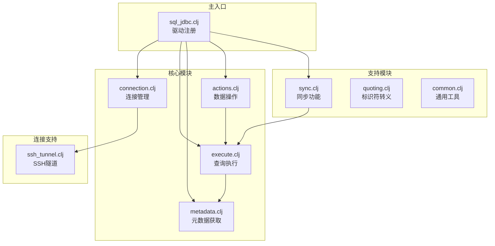
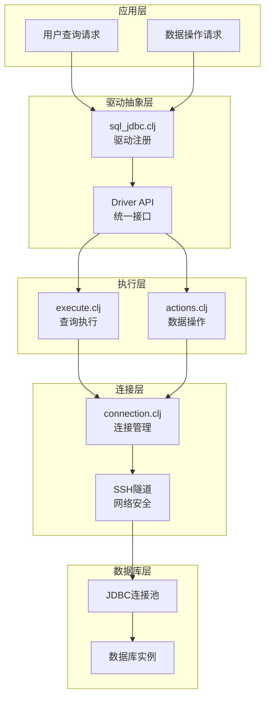
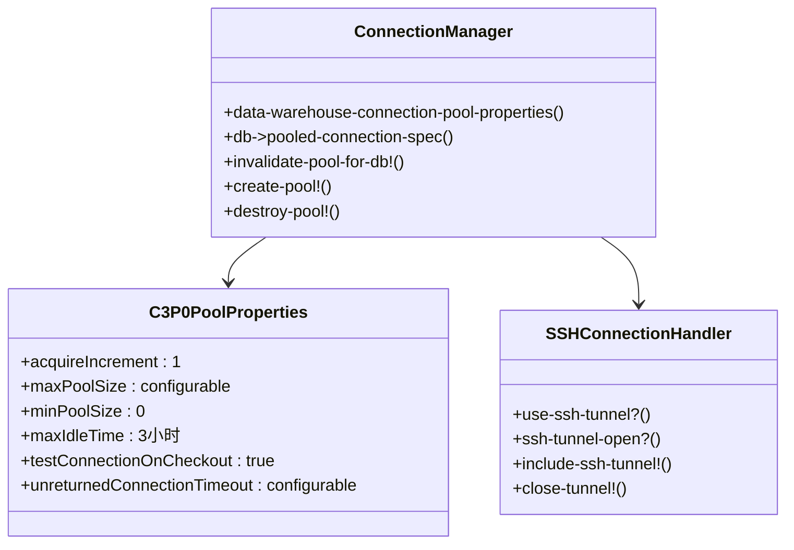
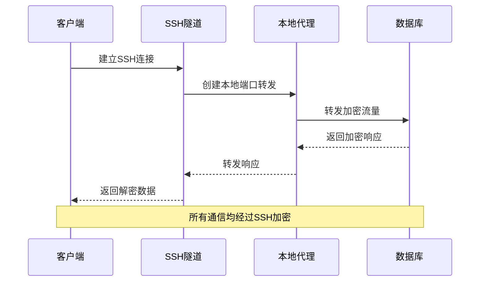
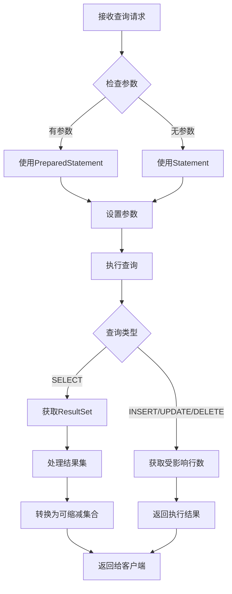
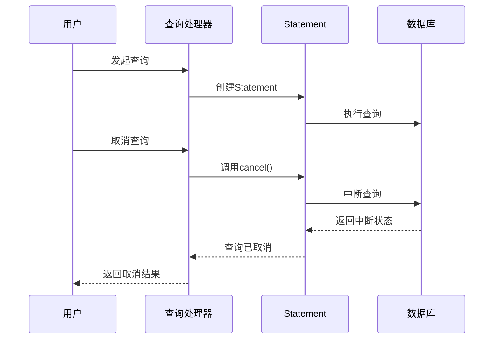
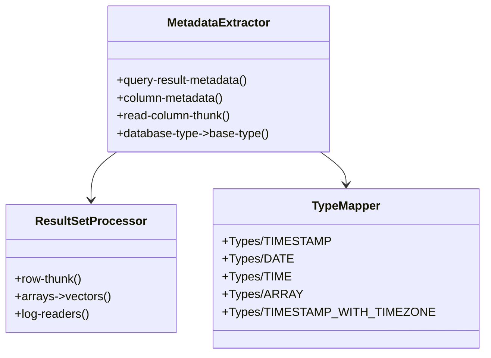
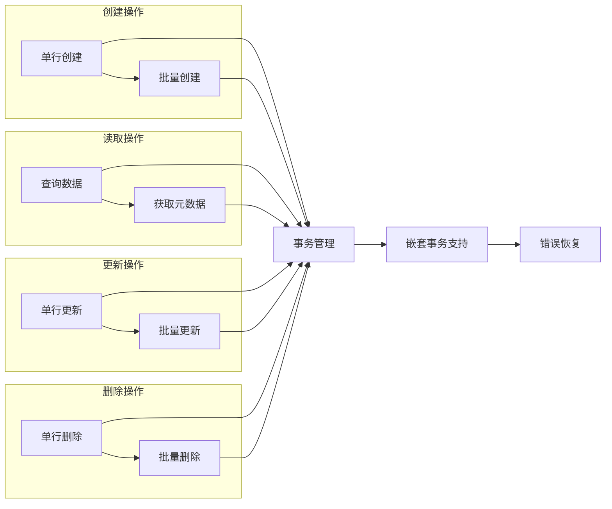
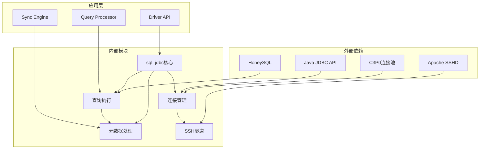

# JDBC驱动集成

<cite>
**本文档中引用的文件**
- [connection.clj](file://src/metabase/driver/sql_jdbc/connection.clj)
- [execute.clj](file://src/metabase/driver/sql_jdbc/execute.clj)
- [metadata.clj](file://src/metabase/driver/sql_jdbc/metadata.clj)
- [actions.clj](file://src/metabase/driver/sql_jdbc/actions.clj)
- [common.clj](file://src/metabase/driver/sql_jdbc/common.clj)
- [sync.clj](file://src/metabase/driver/sql_jdbc/sync.clj)
- [quoting.clj](file://src/metabase/driver/sql_jdbc/quoting.clj)
- [ssh_tunnel.clj](file://src/metabase/driver/sql_jdbc/connection/ssh_tunnel.clj)
- [sql_jdbc.clj](file://src/metabase/driver/sql_jdbc.clj)
</cite>

## 目录
1. [简介](#简介)
2. [项目结构](#项目结构)
3. [核心组件](#核心组件)
4. [架构概览](#架构概览)
5. [详细组件分析](#详细组件分析)
6. [依赖关系分析](#依赖关系分析)
7. [性能考虑](#性能考虑)
8. [故障排除指南](#故障排除指南)
9. [结论](#结论)

## 简介

Metabase的JDBC驱动集成系统是一个高度模块化的架构，为各种SQL数据库提供统一的访问接口。该系统基于Clojure的多方法（multimethod）机制，通过sql-jdbc命名空间实现了连接管理、查询执行、元数据获取和SSH隧道支持等核心功能。

该系统的主要特点包括：
- 基于C3P0连接池的高效连接管理
- 支持SSH隧道的安全连接
- 统一的查询执行接口
- 完整的元数据提取机制
- 可扩展的错误处理和SQL解析

## 项目结构

JDBC驱动集成的核心文件组织在`src/metabase/driver/sql_jdbc/`目录下，采用功能导向的模块化设计：

**图表来源**
- [connection.clj](file://src/metabase/driver/sql_jdbc/connection.clj#L1-L50)
- [execute.clj](file://src/metabase/driver/sql_jdbc/execute.clj#L1-L50)
- [metadata.clj](file://src/metabase/driver/sql_jdbc/metadata.clj#L1-L20)

**章节来源**
- [connection.clj](file://src/metabase/driver/sql_jdbc/connection.clj#L1-L383)
- [execute.clj](file://src/metabase/driver/sql_jdbc/execute.clj#L1-L970)

## 核心组件

### 连接管理器（Connection Manager）

连接管理系统是整个JDBC驱动集成的核心，负责建立和维护与数据库的连接池。主要功能包括：

- **连接池配置**：基于C3P0的高性能连接池
- **SSH隧道支持**：安全的网络连接通道
- **连接生命周期管理**：自动连接回收和重用
- **密码过期检测**：动态连接验证

### 查询执行引擎（Query Execution Engine）

查询执行系统提供了统一的SQL查询接口，支持多种执行模式：

- **可缩减查询**：流式结果处理
- **预编译语句**：参数化查询优化
- **原生查询**：直接SQL执行
- **事务管理**：ACID事务保证

### 元数据提取器（Metadata Extractor）

元数据系统负责从数据库中提取表结构、字段类型和约束信息：

- **数据库元数据**：Schema和表信息
- **字段描述**：类型映射和约束
- **索引信息**：索引结构和统计
- **外键关系**：参照完整性

**章节来源**
- [connection.clj](file://src/metabase/driver/sql_jdbc/connection.clj#L50-L180)
- [execute.clj](file://src/metabase/driver/sql_jdbc/execute.clj#L100-L200)
- [metadata.clj](file://src/metabase/driver/sql_jdbc/metadata.clj#L10-L42)

## 架构概览

JDBC驱动集成采用分层架构设计，确保了良好的可扩展性和维护性：

**图表来源**
- [sql_jdbc.clj](file://src/metabase/driver/sql_jdbc.clj#L1-L50)
- [execute.clj](file://src/metabase/driver/sql_jdbc/execute.clj#L1-L50)
- [connection.clj](file://src/metabase/driver/sql_jdbc/connection.clj#L1-L50)

## 详细组件分析

### 连接池配置与管理

连接池是JDBC驱动集成的基础设施，采用C3P0作为底层实现：

**图表来源**
- [connection.clj](file://src/metabase/driver/sql_jdbc/connection.clj#L50-L180)
- [ssh_tunnel.clj](file://src/metabase/driver/sql_jdbc/connection/ssh_tunnel.clj#L1-L50)

#### 连接池属性配置

连接池的关键配置参数包括：

| 配置项 | 默认值 | 描述 | 性能影响 |
|--------|--------|------|----------|
| `acquireIncrement` | 1 | 每次获取连接的数量 | 内存使用量 |
| `maxPoolSize` | 动态配置 | 最大连接数 | 并发能力 |
| `minPoolSize` | 0 | 最小空闲连接数 | 启动时间 |
| `maxIdleTime` | 3小时 | 连接最大空闲时间 | 资源回收 |
| `testConnectionOnCheckout` | true | 检出时测试连接 | 连接可靠性 |

#### SSH隧道支持

SSH隧道为远程数据库连接提供了安全通道：

**图表来源**
- [ssh_tunnel.clj](file://src/metabase/driver/sql_jdbc/connection/ssh_tunnel.clj#L56-L100)

**章节来源**
- [connection.clj](file://src/metabase/driver/sql_jdbc/connection.clj#L50-L200)
- [ssh_tunnel.clj](file://src/metabase/driver/sql_jdbc/connection/ssh_tunnel.clj#L1-L163)

### 查询执行流程

查询执行系统提供了灵活的SQL执行机制，支持多种查询模式：

**图表来源**
- [execute.clj](file://src/metabase/driver/sql_jdbc/execute.clj#L745-L800)

#### PreparedStatement vs Statement

系统根据查询参数自动选择最优的执行方式：

| 特性 | PreparedStatement | Statement |
|------|------------------|-----------|
| 参数化 | ✓ | ✗ |
| 预编译 | ✓ | ✗ |
| 性能 | 更高 | 较低 |
| 安全性 | 高 | 较低 |
| 使用场景 | 复杂查询 | 简单原生查询 |

#### 查询取消机制

系统实现了完善的查询取消功能：

**图表来源**
- [execute.clj](file://src/metabase/driver/sql_jdbc/execute.clj#L530-L560)

**章节来源**
- [execute.clj](file://src/metabase/driver/sql_jdbc/execute.clj#L100-L400)
- [execute.clj](file://src/metabase/driver/sql_jdbc/execute.clj#L745-L876)

### 元数据提取机制

元数据系统负责从数据库中提取结构化信息，支持智能的数据类型映射：

**图表来源**
- [metadata.clj](file://src/metabase/driver/sql_jdbc/metadata.clj#L10-L42)
- [execute.clj](file://src/metabase/driver/sql_jdbc/execute.clj#L600-L700)

#### 数据类型映射

系统提供了完整的JDBC类型到Metabase基础类型的映射：

| JDBC类型 | 基础类型 | 处理方式 |
|----------|----------|----------|
| TIMESTAMP | :type/DateTime | java.time.LocalDateTime |
| DATE | :type/Date | java.time.LocalDate |
| TIME | :type/Time | java.time.LocalTime |
| ARRAY | :type/Set | 嵌套向量转换 |
| TIMESTAMP_WITH_TIMEZONE | :type/DateTime | java.time.OffsetDateTime |

**章节来源**
- [metadata.clj](file://src/metabase/driver/sql_jdbc/metadata.clj#L10-L42)
- [execute.clj](file://src/metabase/driver/sql_jdbc/execute.clj#L600-L750)

### 数据操作功能

数据操作模块提供了完整的CRUD操作支持：

**图表来源**
- [actions.clj](file://src/metabase/driver/sql_jdbc/actions.clj#L1-L50)

#### 事务管理策略

系统采用了灵活的事务管理策略：

- **自动事务**：默认启用自动提交
- **手动事务**：支持显式事务控制
- **嵌套事务**：支持事务内嵌套操作
- **错误恢复**：自动回滚失败操作

**章节来源**
- [actions.clj](file://src/metabase/driver/sql_jdbc/actions.clj#L1-L200)
- [actions.clj](file://src/metabase/driver/sql_jdbc/actions.clj#L400-L600)

## 依赖关系分析

JDBC驱动集成系统的依赖关系体现了清晰的分层架构：

**图表来源**
- [connection.clj](file://src/metabase/driver/sql_jdbc/connection.clj#L1-L30)
- [execute.clj](file://src/metabase/driver/sql_jdbc/execute.clj#L1-L30)

### 关键依赖说明

| 依赖项 | 版本要求 | 用途 | 替代方案 |
|--------|----------|------|----------|
| C3P0 | 最新稳定版 | 连接池管理 | HikariCP |
| Apache SSHD | 2.x | SSH隧道支持 | JSch |
| HoneySQL | 最新版本 | SQL构建 | 自定义SQL生成 |
| Java JDBC API | JDBC 4.2+ | 数据库访问 | R2DBC |

**章节来源**
- [connection.clj](file://src/metabase/driver/sql_jdbc/connection.clj#L1-L50)
- [ssh_tunnel.clj](file://src/metabase/driver/sql_jdbc/connection/ssh_tunnel.clj#L1-L30)

## 性能考虑

### 连接池优化

连接池配置对整体性能有重大影响：

- **预热策略**：启动时预创建少量连接
- **动态调整**：根据负载动态调整池大小
- **连接验证**：定期验证连接有效性
- **超时设置**：合理设置连接超时时间

### 查询性能优化

- **参数化查询**：优先使用PreparedStatement
- **批量操作**：支持批量插入和更新
- **结果集处理**：流式处理大型结果集
- **索引利用**：智能提示数据库使用索引

### 内存管理

- **对象复用**：重用Statement和ResultSet对象
- **垃圾回收**：及时释放不再使用的资源
- **缓存策略**：缓存频繁访问的元数据

## 故障排除指南

### 常见连接问题

| 问题症状 | 可能原因 | 解决方案 |
|----------|----------|----------|
| 连接超时 | 网络延迟或服务器负载过高 | 增加超时时间，检查网络 |
| 认证失败 | 凭据错误或权限不足 | 验证用户名密码，检查权限 |
| SSL握手失败 | 证书问题或协议不匹配 | 更新证书，检查SSL配置 |
| SSH连接失败 | 隧道配置错误 | 检查SSH凭据和网络连通性 |

### 查询执行问题

- **语法错误**：检查SQL语法和数据库兼容性
- **性能问题**：分析查询计划，优化索引
- **内存溢出**：减少结果集大小，启用流式处理
- **死锁**：检查事务隔离级别和锁定策略

### 元数据提取问题

- **类型映射错误**：检查数据库特定的类型映射
- **权限不足**：确保有足够的元数据访问权限
- **缓存问题**：清除元数据缓存重新加载

**章节来源**
- [actions.clj](file://src/metabase/driver/sql_jdbc/actions.clj#L30-L80)
- [execute.clj](file://src/metabase/driver/sql_jdbc/execute.clj#L800-L970)

## 结论

Metabase的JDBC驱动集成系统展现了优秀的软件架构设计，通过模块化和分层的方式实现了高度的可扩展性和维护性。系统的核心优势包括：

1. **统一的接口设计**：通过多方法机制支持多种数据库
2. **高效的连接管理**：基于C3P0的连接池优化
3. **安全的网络通信**：SSH隧道支持企业级安全需求
4. **灵活的查询执行**：支持多种查询模式和优化策略
5. **完整的元数据处理**：智能的类型映射和结构提取

该系统为Metabase提供了坚实的数据库访问基础，支持各种复杂的分析查询需求，同时保持了良好的性能和稳定性。随着数据库技术的发展，该架构也具备了良好的扩展性，能够适应新的数据库特性和优化需求。