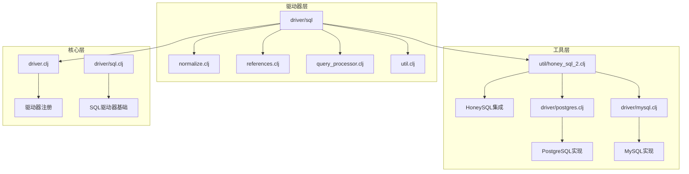
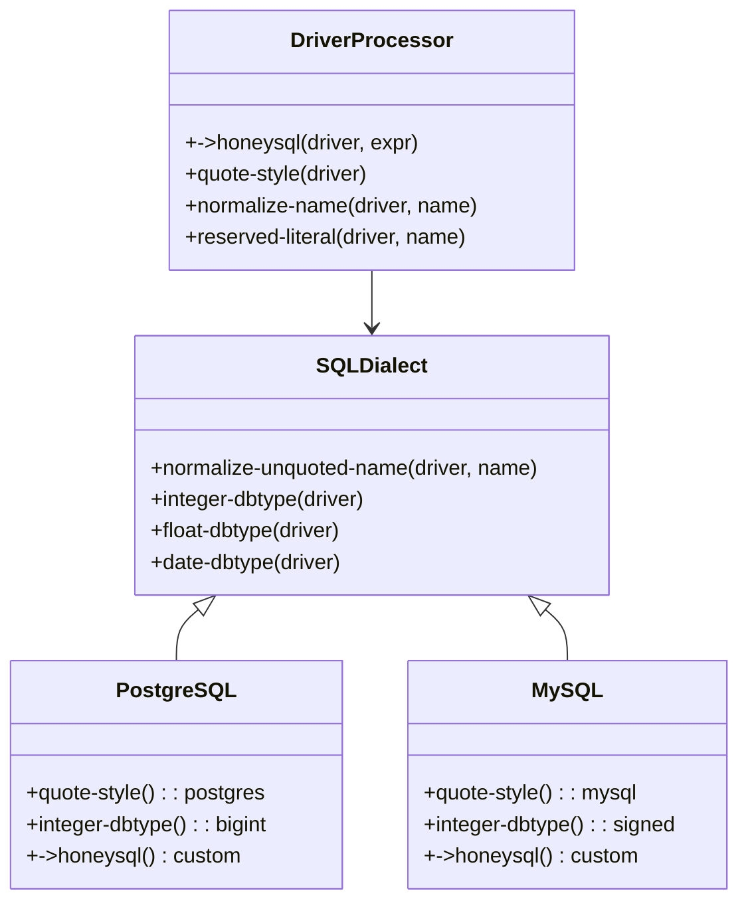
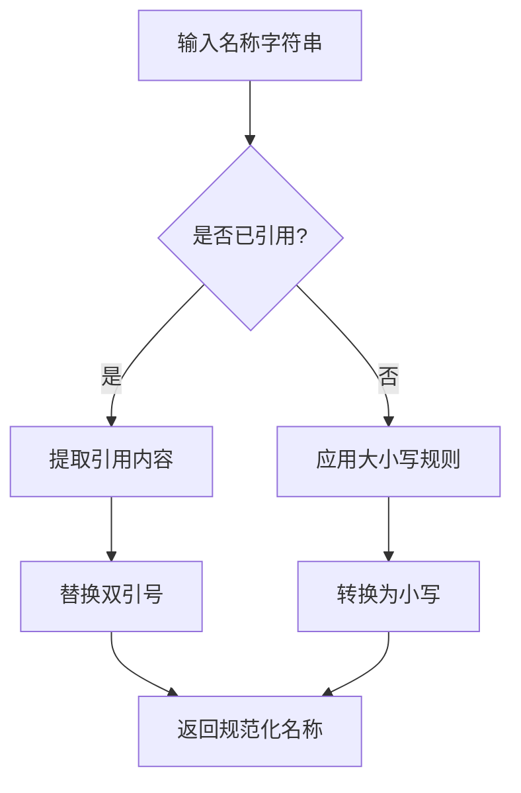
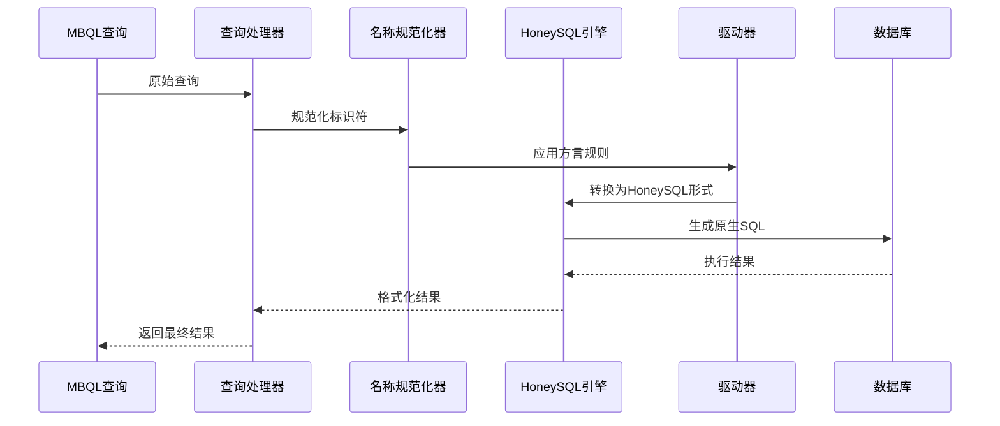
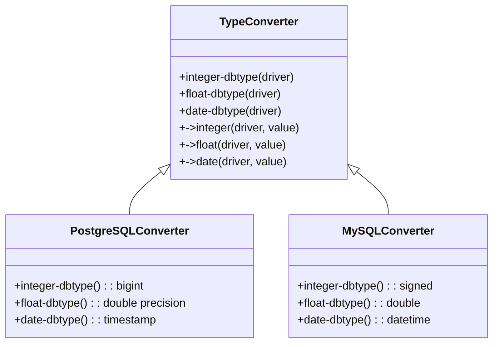
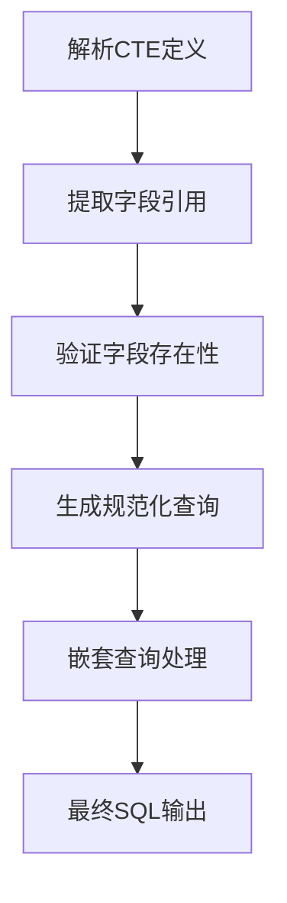
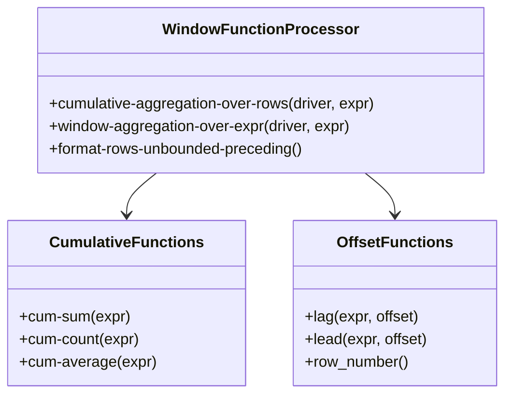
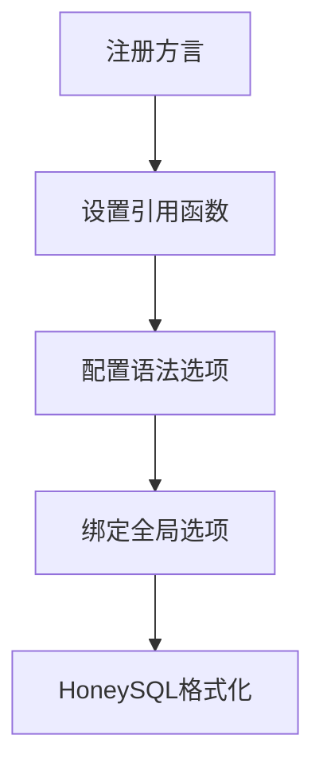
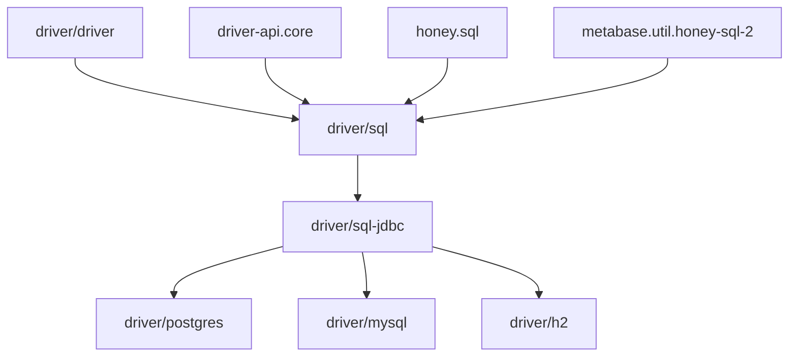

# SQL方言处理

<cite>
**本文档中引用的文件**
- [normalize.clj](file://src/metabase/driver/sql/normalize.clj)
- [references.clj](file://src/metabase/driver/sql/references.clj)
- [query_processor.clj](file://src/metabase/driver/sql/query_processor.clj)
- [util.clj](file://src/metabase/driver/sql/util.clj)
- [honey_sql_2.clj](file://src/metabase/util/honey_sql_2.clj)
- [postgres.clj](file://src/metabase/driver/postgres.clj)
- [mysql.clj](file://src/metabase/driver/mysql.clj)
- [driver.clj](file://src/metabase/driver.clj)
- [sql.clj](file://src/metabase/driver/sql.clj)
</cite>

## 目录
1. [简介](#简介)
2. [项目结构概览](#项目结构概览)
3. [核心组件分析](#核心组件分析)
4. [架构概览](#架构概览)
5. [详细组件分析](#详细组件分析)
6. [依赖关系分析](#依赖关系分析)
7. [性能考虑](#性能考虑)
8. [故障排除指南](#故障排除指南)
9. [结论](#结论)

## 简介

Metabase的SQL方言处理系统是一个复杂而精密的抽象层，负责将统一的Metabase查询语言（MBQL）转换为特定数据库系统的原生SQL语句。该系统通过多层抽象实现了对多种数据库系统的无缝支持，包括标识符引用策略、类型映射、函数转换和查询规范化等功能。

本文档深入分析了SQL方言抽象层的设计原理、实现细节以及扩展机制，为开发者提供了全面的技术参考和开发指南。

## 项目结构概览

Metabase的SQL方言处理主要分布在以下关键目录中：



**图表来源**
- [normalize.clj](file://src/metabase/driver/sql/normalize.clj#L1-L53)
- [query_processor.clj](file://src/metabase/driver/sql/query_processor.clj#L1-L50)
- [honey_sql_2.clj](file://src/metabase/util/honey_sql_2.clj#L1-L100)

## 核心组件分析

### SQL方言抽象层设计

SQL方言处理系统的核心是建立在多分派（multimethod）基础上的抽象层，通过驱动器层次结构实现功能的继承和覆盖。

#### 多分派架构

系统采用Clojure的多分派机制，通过`driver/dispatch-on-initialized-driver`实现动态分派：



**图表来源**
- [query_processor.clj](file://src/metabase/driver/sql/query_processor.clj#L468-L495)
- [postgres.clj](file://src/metabase/driver/postgres.clj#L1-L50)
- [mysql.clj](file://src/metabase/driver/mysql.clj#L1-L50)

**章节来源**
- [query_processor.clj](file://src/metabase/driver/sql/query_processor.clj#L1-L100)
- [normalize.clj](file://src/metabase/driver/sql/normalize.clj#L1-L53)

### 标识符引用策略

标识符引用是SQL方言处理中的关键组件，负责处理不同数据库系统中标识符的转义和引用规则。

#### 引用样式系统

系统支持多种引用样式，通过`quote-style`多分派方法实现：

| 数据库类型 | 引用样式 | 示例 |
|------------|----------|------|
| ANSI SQL | `:ansi` | `"identifier"` |
| MySQL | `:mysql` | `` `identifier` `` |
| H2 | `:h2` | `"IDENTIFIER"` |
| PostgreSQL | `:postgres` | `"identifier"` |

#### 名称规范化流程

名称规范化遵循以下步骤：



**图表来源**
- [normalize.clj](file://src/metabase/driver/sql/normalize.clj#L25-L45)

**章节来源**
- [normalize.clj](file://src/metabase/driver/sql/normalize.clj#L1-L53)

## 架构概览

### 查询处理流水线

SQL方言处理系统采用流水线架构，将MBQL查询逐步转换为原生SQL：



**图表来源**
- [query_processor.clj](file://src/metabase/driver/sql/query_processor.clj#L1-L100)
- [honey_sql_2.clj](file://src/metabase/util/honey_sql_2.clj#L37-L69)

## 详细组件分析

### 类型映射系统

类型映射系统负责将Metabase的内部类型系统转换为特定数据库的类型表示。

#### 基础类型映射

| Metabase类型 | PostgreSQL类型 | MySQL类型 | 默认类型 |
|--------------|----------------|-----------|----------|
| `:type/Integer` | `BIGINT` | `BIGINT` | `:BIGINT` |
| `:type/Float` | `DOUBLE PRECISION` | `DOUBLE` | `:double` |
| `:type/Text` | `TEXT` | `VARCHAR` | `:text` |
| `:type/DateTime` | `TIMESTAMP` | `DATETIME` | `:date` |

#### 类型转换实现

类型转换通过多分派方法实现，每个数据库驱动可以自定义其类型转换逻辑：



**图表来源**
- [query_processor.clj](file://src/metabase/driver/sql/query_processor.clj#L150-L250)

**章节来源**
- [query_processor.clj](file://src/metabase/driver/sql/query_processor.clj#L150-L300)

### 函数转换系统

函数转换系统处理MBQL函数到原生SQL函数的映射，包括字符串操作、日期时间处理等。

#### 字符串长度函数

不同数据库对字符串长度函数有不同的实现：

```mermaid
flowchart TD
A[string-length函数] --> B{数据库类型}
B --> |PostgreSQL| C[char_length]
B --> |MySQL| D[length]
B --> |H2| E[length]
C --> F[生成SQL: char_length(expr)]
D --> G[生成SQL: length(expr)]
E --> H[生成SQL: length(expr)]
```

**图表来源**
- [mysql.clj](file://src/metabase/driver/mysql.clj#L389-L421)

#### 当前日期时间函数

当前日期时间函数的处理展示了方言差异的典型例子：

| 数据库 | MBQL函数 | 原生SQL |
|--------|----------|---------|
| PostgreSQL | `:now` | `%now` |
| MySQL | `:now` | `CURRENT_TIMESTAMP` |
| H2 | `:now` | `CURRENT_TIMESTAMP` |

**章节来源**
- [query_processor.clj](file://src/metabase/driver/sql/query_processor.clj#L1300-L1400)

### 查询规范化流程

查询规范化是确保查询在不同数据库间正确执行的关键步骤。

#### CTE（公共表表达式）支持

系统通过`find-used-fields`和`find-returned-fields`多分派方法支持CTE：



**图表来源**
- [references.clj](file://src/metabase/driver/sql/references.clj#L100-L200)

#### 窗口函数支持

窗口函数是现代SQL的重要特性，系统通过专门的多分派方法处理：



**图表来源**
- [query_processor.clj](file://src/metabase/driver/sql/query_processor.clj#L1008-L1111)

**章节来源**
- [references.clj](file://src/metabase/driver/sql/references.clj#L1-L344)
- [query_processor.clj](file://src/metabase/driver/sql/query_processor.clj#L1008-L1111)

### HoneySQL集成

HoneySQL是Metabase的SQL构建库，提供了强大的SQL生成和格式化能力。

#### 自定义方言注册

系统支持注册自定义方言：



**图表来源**
- [honey_sql_2.clj](file://src/metabase/util/honey_sql_2.clj#L37-L69)

**章节来源**
- [honey_sql_2.clj](file://src/metabase/util/honey_sql_2.clj#L1-L142)

## 依赖关系分析

### 驱动器层次结构



**图表来源**
- [driver.clj](file://src/metabase/driver.clj#L112-L169)
- [sql.clj](file://src/metabase/driver/sql.clj#L26-L65)

### 外部依赖

系统依赖以下外部库：

| 依赖库 | 版本 | 用途 |
|--------|------|------|
| HoneySQL | 最新 | SQL构建和格式化 |
| Java-Time | 最新 | 时间处理 |
| Medley | 最新 | 函数式编程工具 |
| Malli | 最新 | 数据验证 |

**章节来源**
- [query_processor.clj](file://src/metabase/driver/sql/query_processor.clj#L1-L30)

## 性能考虑

### 查询编译优化

系统采用多种优化策略提升性能：

1. **延迟编译**：只在需要时编译查询
2. **缓存机制**：缓存编译后的查询形式
3. **内联优化**：对常量值进行内联处理

### 内存管理

- 使用`with-quoting`宏管理HoneySQL上下文
- 及时释放临时资源
- 优化字符串操作减少内存分配

## 故障排除指南

### 常见问题诊断

#### 类型转换错误

当遇到类型转换问题时，检查：
1. 驱动器是否正确实现了类型转换方法
2. 数据库是否支持目标类型
3. 类型映射配置是否正确

#### 标识符引用问题

标识符引用问题通常由以下原因引起：
1. 引用样式不匹配
2. 名称包含特殊字符
3. 大小写敏感性问题

#### 函数映射失败

函数映射失败的排查步骤：
1. 检查驱动器是否实现了相应的多分派方法
2. 验证函数签名是否匹配
3. 确认数据库支持目标函数

**章节来源**
- [query_processor.clj](file://src/metabase/driver/sql/query_processor.clj#L600-L700)

## 结论

Metabase的SQL方言处理系统展现了优秀的软件架构设计，通过多层抽象和多分派机制实现了高度的可扩展性和维护性。系统的主要优势包括：

1. **统一接口**：为所有数据库提供一致的查询接口
2. **灵活扩展**：通过多分派机制轻松添加新数据库支持
3. **类型安全**：强类型系统确保查询的正确性
4. **性能优化**：多层次的优化策略保证高效执行

对于希望为新数据库定制SQL方言的开发者，建议从现有的驱动器开始，理解其架构模式，并遵循既定的开发规范。系统的模块化设计使得添加新功能变得相对简单，同时保持了整体的一致性和稳定性。