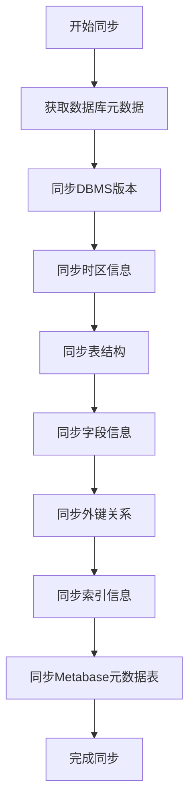
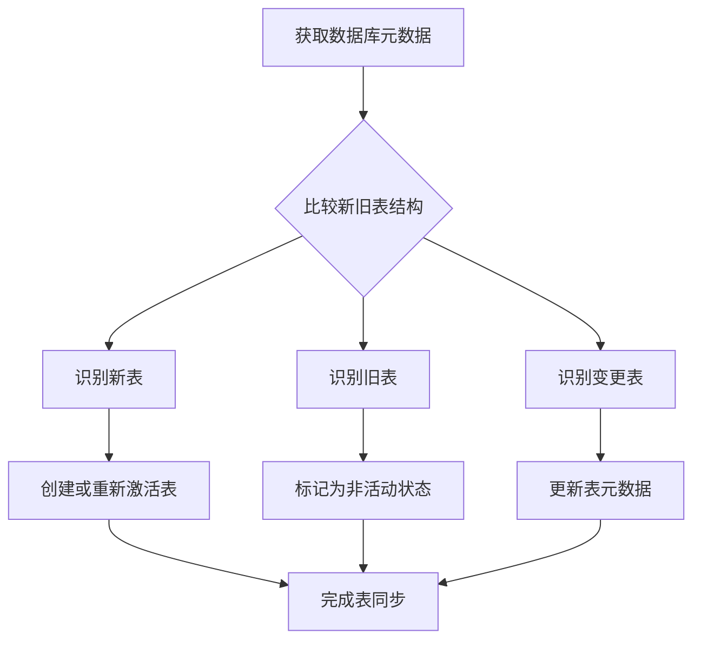
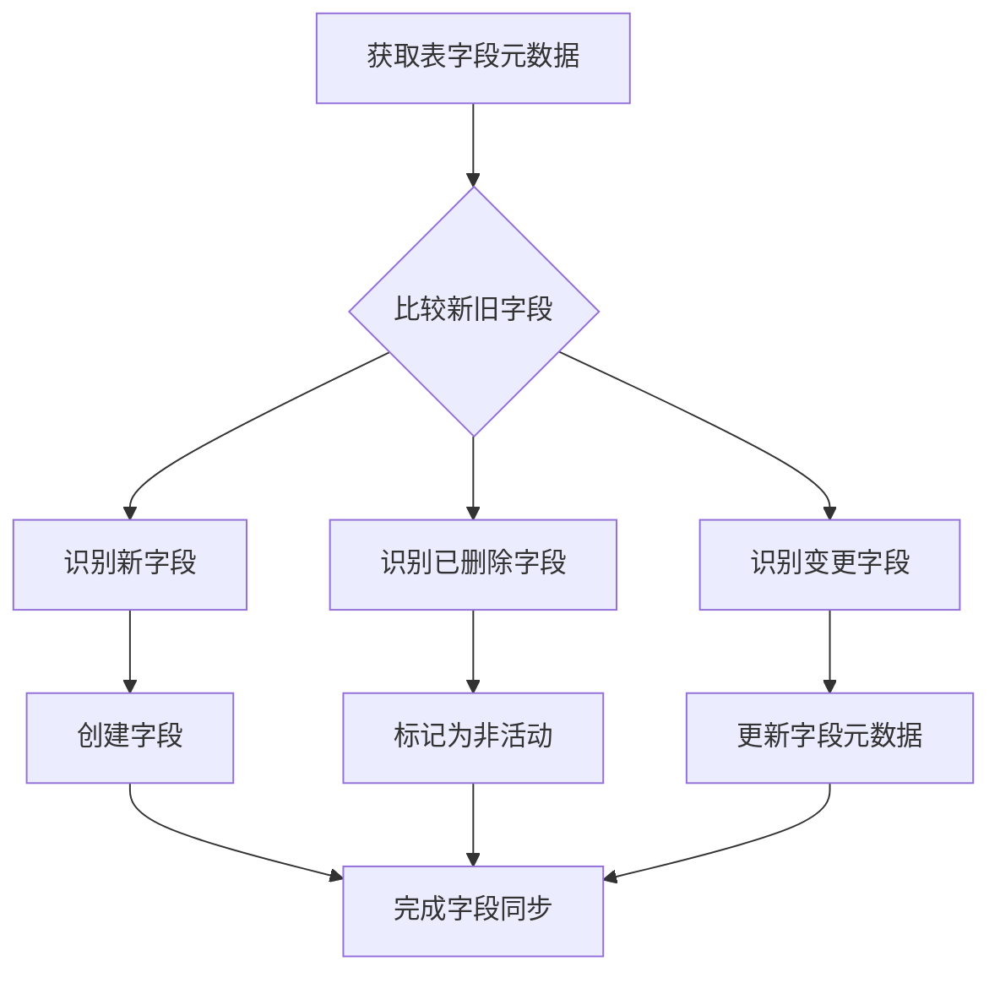
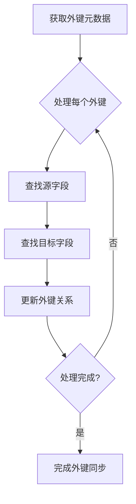
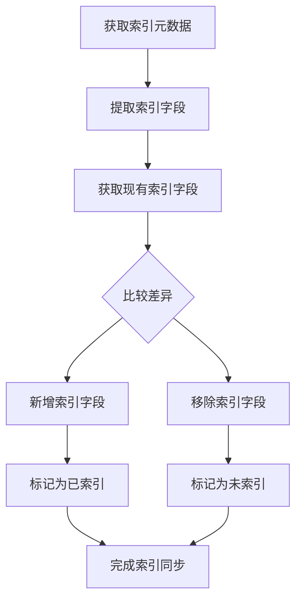
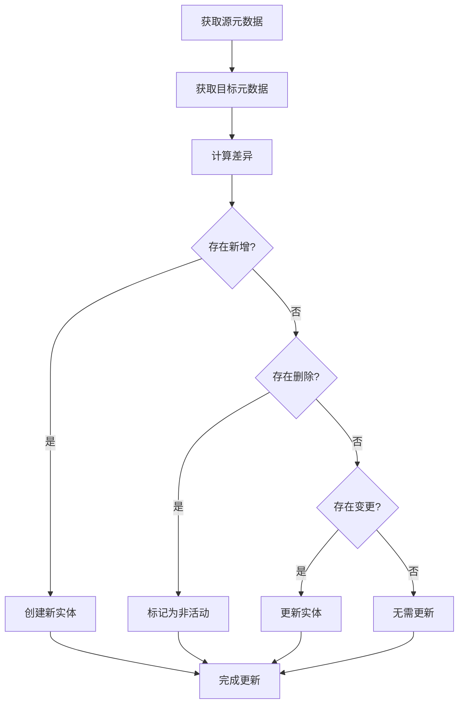
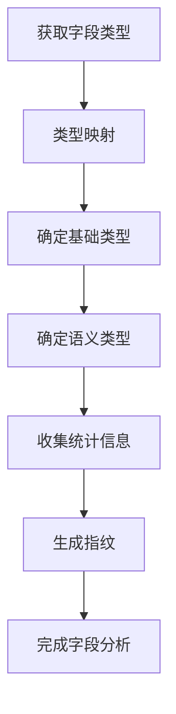
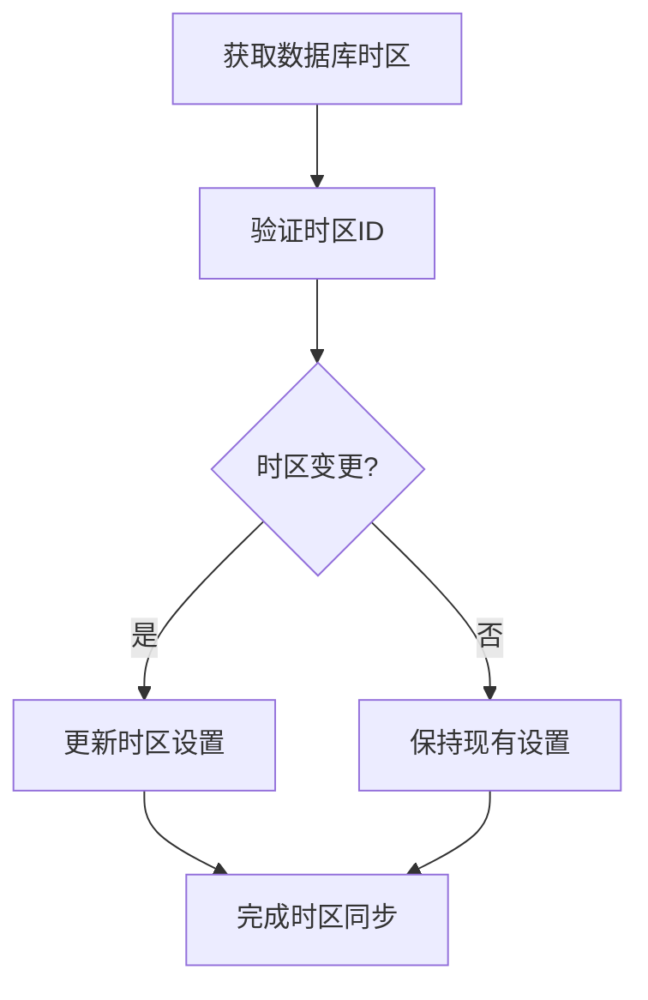
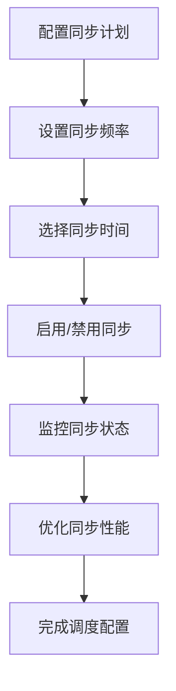
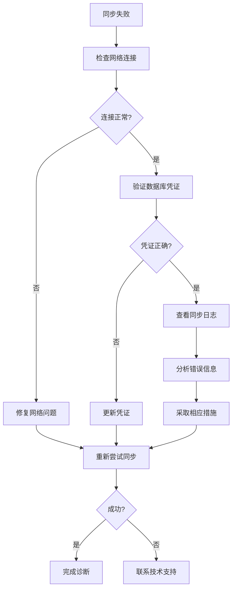

# 元数据同步机制

<cite>
**本文档引用的文件**  
- [sync_metadata.clj](file://src/metabase/sync/sync_metadata.clj)
- [fetch_metadata.clj](file://src/metabase/sync/fetch_metadata.clj)
- [tables.clj](file://src/metabase/sync/sync_metadata/tables.clj)
- [fields.clj](file://src/metabase/sync/sync_metadata/fields.clj)
- [fks.clj](file://src/metabase/sync/sync_metadata/fks.clj)
- [indexes.clj](file://src/metabase/sync/sync_metadata/indexes.clj)
- [interface.clj](file://src/metabase/sync/interface.clj)
- [sync_timezone.clj](file://src/metabase/sync/sync_metadata/sync_timezone.clj)
- [util.clj](file://src/metabase/sync/util.clj)
- [driver.clj](file://src/metabase/driver.clj)
</cite>

## 目录
1. [引言](#引言)
2. [元数据同步流程](#元数据同步流程)
3. [表同步机制](#表同步机制)
4. [字段同步机制](#字段同步机制)
5. [主外键同步机制](#主外键同步机制)
6. [索引同步机制](#索引同步机制)
7. [元数据差异检测与增量更新](#元数据差异检测与增量更新)
8. [字段类型映射与统计信息](#字段类型映射与统计信息)
9. [时区处理机制](#时区处理机制)
10. [同步任务调度与性能优化](#同步任务调度与性能优化)
11. [常见同步失败诊断](#常见同步失败诊断)

## 引言
Metabase的元数据同步机制负责将外部数据库的表结构信息同步到Metabase应用数据库中，确保Metabase中的表、字段、主键、外键和索引等元数据与源数据库保持一致。该机制通过一系列有序的同步步骤实现，包括表同步、字段同步、主外键同步和索引同步等。同步过程采用增量更新策略，仅对发生变化的元数据进行更新，提高了同步效率。系统提供了describe-table和describe-database接口来获取数据库元数据，并通过差异检测算法确定需要更新的内容。本文档将详细阐述这一同步机制的实现原理和工作流程。

## 元数据同步流程
Metabase的元数据同步流程是一个多阶段的有序过程，从数据库级别的元数据获取开始，逐步细化到表、字段、主外键和索引的同步。整个流程由sync-db-metadata!函数驱动，该函数按照预定义的顺序执行多个同步步骤。

**Diagram sources**
- [sync_metadata.clj](file://src/metabase/sync/sync_metadata.clj#L50-L78)

**Section sources**
- [sync_metadata.clj](file://src/metabase/sync/sync_metadata.clj#L50-L78)

## 表同步机制
表同步机制负责将源数据库中的表结构同步到Metabase应用数据库中。该过程首先通过describe-database接口获取源数据库的表元数据，然后与Metabase中已有的表信息进行比较，确定需要创建、更新或停用的表。

**Diagram sources**
- [tables.clj](file://src/metabase/sync/sync_metadata/tables.clj#L170-L199)

**Section sources**
- [tables.clj](file://src/metabase/sync/sync_metadata/tables.clj#L170-L199)

## 字段同步机制
字段同步机制负责同步表中各个字段的元数据信息，包括字段名称、数据类型、位置、语义类型等。该机制通过describe-table或describe-fields接口获取字段元数据，并与Metabase中已有的字段信息进行对比，执行相应的创建、更新或停用操作。

**Diagram sources**
- [fields.clj](file://src/metabase/sync/sync_metadata/fields.clj#L100-L147)

**Section sources**
- [fields.clj](file://src/metabase/sync/sync_metadata/fields.clj#L100-L147)

## 主外键同步机制
主外键同步机制负责同步数据库中的主键和外键关系。该机制通过describe-table-fks或describe-fks接口获取外键元数据，然后更新Metabase中相应字段的外键目标字段ID，建立字段间的关联关系。

**Diagram sources**
- [fks.clj](file://src/metabase/sync/sync_metadata/fks.clj#L50-L100)

**Section sources**
- [fks.clj](file://src/metabase/sync/sync_metadata/fks.clj#L50-L100)

## 索引同步机制
索引同步机制负责同步数据库中的索引信息。该机制通过describe-table-indexes接口获取表的索引元数据，然后更新Metabase中相应字段的database_indexed属性，标记哪些字段被索引。

**Diagram sources**
- [indexes.clj](file://src/metabase/sync/sync_metadata/indexes.clj#L30-L60)

**Section sources**
- [indexes.clj](file://src/metabase/sync/sync_metadata/indexes.clj#L30-L60)

## 元数据差异检测与增量更新
元数据差异检测与增量更新算法是Metabase同步机制的核心，它通过比较源数据库元数据和Metabase应用数据库元数据的差异，仅对发生变化的部分进行更新，避免了全量同步的开销。

**Diagram sources**
- [tables.clj](file://src/metabase/sync/sync_metadata/tables.clj#L170-L199)
- [fields.clj](file://src/metabase/sync/sync_metadata/fields.clj#L100-L147)

**Section sources**
- [tables.clj](file://src/metabase/sync/sync_metadata/tables.clj#L170-L199)
- [fields.clj](file://src/metabase/sync/sync_metadata/fields.clj#L100-L147)

## 字段类型映射与统计信息
字段类型映射机制负责将源数据库的字段类型转换为Metabase的通用类型系统。统计信息收集机制则负责收集字段的统计信息，用于后续的数据分析和可视化。

**Diagram sources**
- [interface.clj](file://src/metabase/sync/interface.clj#L25-L49)
- [analyze/fingerprint.clj](file://src/metabase/analyze/fingerprint.clj#L27-L56)

**Section sources**
- [interface.clj](file://src/metabase/sync/interface.clj#L25-L49)
- [analyze/fingerprint.clj](file://src/metabase/analyze/fingerprint.clj#L27-L56)

## 时区处理机制
时区处理机制负责同步数据库的默认时区信息。该机制通过db-default-timezone接口获取数据库的时区设置，并更新Metabase中数据库记录的时区字段。

**Diagram sources**
- [sync_timezone.clj](file://src/metabase/sync/sync_metadata/sync_timezone.clj#L30-L48)

**Section sources**
- [sync_timezone.clj](file://src/metabase/sync/sync_metadata/sync_timezone.clj#L30-L48)

## 同步任务调度与性能优化
同步任务调度配置允许用户自定义同步频率和时间。性能优化建议包括合理设置同步间隔、避免高峰时段同步、监控同步任务执行情况等。

**Diagram sources**
- [schedules.clj](file://src/metabase/sync/schedules.clj#L1-L50)
- [util.clj](file://src/metabase/sync/util.clj#L500-L600)

**Section sources**
- [schedules.clj](file://src/metabase/sync/schedules.clj#L1-L50)
- [util.clj](file://src/metabase/sync/util.clj#L500-L600)

## 常见同步失败诊断
常见同步失败可能由网络连接问题、数据库权限不足、元数据不一致等原因引起。诊断步骤包括检查网络连接、验证数据库凭证、查看同步日志、检查数据库状态等。

**Diagram sources**
- [util.clj](file://src/metabase/sync/util.clj#L100-L200)
- [error.clj](file://src/metabase/actions/error.clj#L1-L50)

**Section sources**
- [util.clj](file://src/metabase/sync/util.clj#L100-L200)
- [error.clj](file://src/metabase/actions/error.clj#L1-L50)