# Metabase关系结构同步详细文档

<cite>
**本文档中引用的文件**
- [describe_table.clj](file://src/metabase/driver/sql_jdbc/sync/describe_table.clj)
- [fks.clj](file://src/metabase/sync/sync_metadata/fks.clj)
- [indexes.clj](file://src/metabase/sync/sync_metadata/indexes.clj)
- [sync.clj](file://src/metabase/driver/sql_jdbc/sync.clj)
- [fetch_metadata.clj](file://src/metabase/sync/fetch_metadata.clj)
- [postgres.clj](file://src/metabase/driver/postgres.clj)
- [mysql.clj](file://src/metabase/driver/mysql.clj)
- [add_implicit_joins.clj](file://src/metabase/query_processor/middleware/add_implicit_joins.clj)
- [chain_filter.clj](file://src/metabase/parameters/chain_filter.clj)
</cite>

## 目录
1. [简介](#简介)
2. [系统架构概览](#系统架构概览)
3. [外键同步机制](#外键同步机制)
4. [索引同步机制](#索引同步机制)
5. [JDBC DatabaseMetaData接口](#jdbc-databasemetadataview)
6. [主键自动识别逻辑](#主键自动识别逻辑)
7. [复合索引处理策略](#复合索引处理策略)
8. [查询构建器中的应用](#查询构建器中的应用)
9. [性能影响分析](#性能影响分析)
10. [故障排除指南](#故障排除指南)
11. [总结](#总结)

## 简介

Metabase的关系结构同步机制是一个复杂而精密的系统，负责从外部数据库提取、解析和同步表的外键约束、索引信息以及字段元数据。该系统通过JDBC DatabaseMetaData接口与各种数据库进行交互，实现了跨数据库的统一关系结构管理。

本文档深入解析了Metabase中描述外键(`describe-fks`)和描述索引(`describe-indexes`)多态方法的实现细节，阐述了主键自动识别逻辑(`add-table-pks`)的工作原理，并提供了查询构建器中外键关系应用的实际示例。

## 系统架构概览

Metabase的关系结构同步系统采用分层架构设计，主要包含以下核心组件：

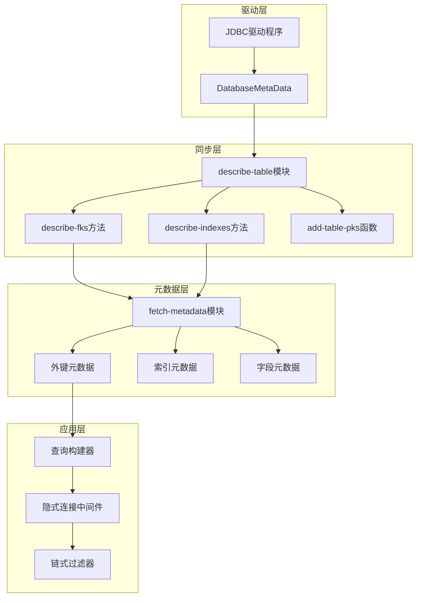

**图表来源**
- [describe_table.clj](file://src/metabase/driver/sql_jdbc/sync/describe_table.clj#L1-L50)
- [sync.clj](file://src/metabase/driver/sql_jdbc/sync.clj#L1-L55)

**章节来源**
- [describe_table.clj](file://src/metabase/driver/sql_jdbc/sync/describe_table.clj#L1-L772)
- [sync.clj](file://src/metabase/driver/sql_jdbc/sync.clj#L1-L55)

## 外键同步机制

### describe-fks多态方法实现

`describe-fks`方法是Metabase外键同步的核心入口点，它使用JDBC DatabaseMetaData来获取数据库中的外键约束信息。

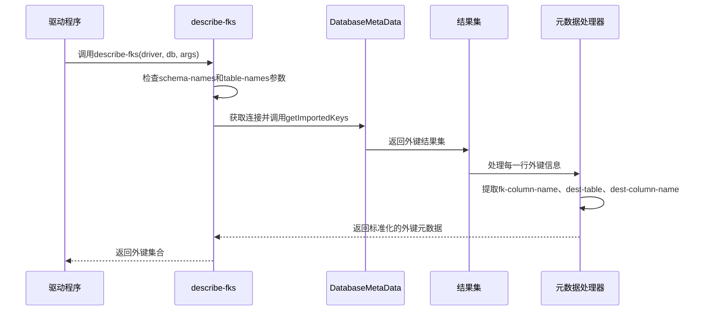

**图表来源**
- [describe_table.clj](file://src/metabase/driver/sql_jdbc/sync/describe_table.clj#L410-L436)
- [fks.clj](file://src/metabase/sync/sync_metadata/fks.clj#L114-L133)

### describe-table-fks函数详解

`describe-table-fks`函数专门处理单个表的外键信息获取：

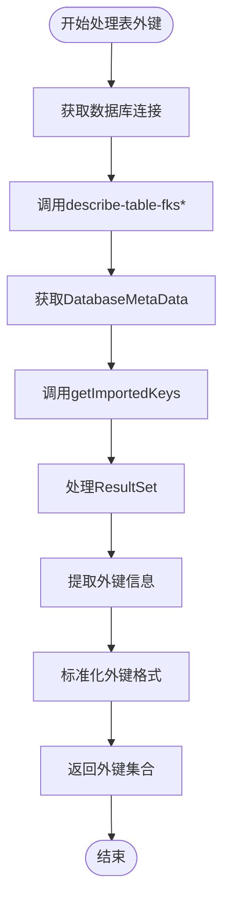

**图表来源**
- [describe_table.clj](file://src/metabase/driver/sql_jdbc/sync/describe_table.clj#L435-L457)

### 外键元数据标准化

外键元数据经过标准化处理后包含以下关键信息：
- `fk-column-name`: 外键列名
- `dest-table`: 目标表信息（包含名称和模式）
- `dest-column-name`: 目标列名

**章节来源**
- [describe_table.clj](file://src/metabase/driver/sql_jdbc/sync/describe_table.clj#L410-L457)
- [fks.clj](file://src/metabase/sync/sync_metadata/fks.clj#L114-L133)

## 索引同步机制

### describe-indexes多态方法实现

`describe-indexes`方法负责获取数据库中的索引信息，支持多种索引类型的识别和处理。

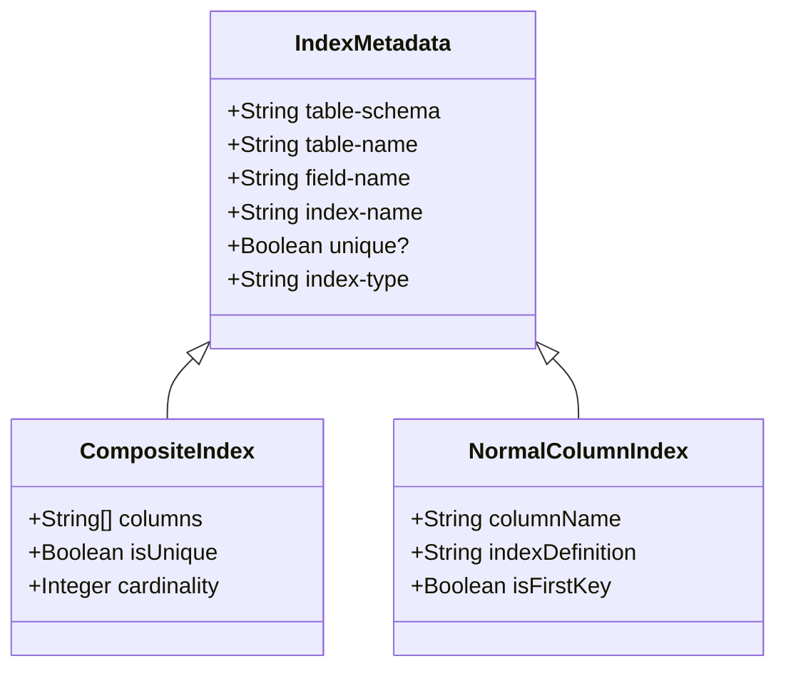

**图表来源**
- [indexes.clj](file://src/metabase/sync/sync_metadata/indexes.clj#L1-L120)

### describe-table-indexes函数处理

`describe-table-indexes`函数通过JDBC DatabaseMetaData的`getIndexInfo`方法获取索引信息：

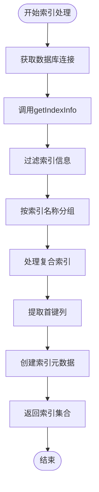

**图表来源**
- [describe_table.clj](file://src/metabase/driver/sql_jdbc/sync/describe_table.clj#L457-L482)

### 索引类型识别

系统能够识别两种主要的索引类型：
1. **普通列索引** (`:normal-column-index`): 单列或复合索引的第一列
2. **嵌套列索引** (`:nested-column-index`): JSON字段的嵌套索引

**章节来源**
- [describe_table.clj](file://src/metabase/driver/sql_jdbc/sync/describe_table.clj#L457-L482)
- [indexes.clj](file://src/metabase/sync/sync_metadata/indexes.clj#L1-L120)

## JDBC DatabaseMetaData接口

### 外键信息获取

JDBC DatabaseMetaData提供了标准的外键信息获取接口：

| 方法 | 描述 | 返回值 |
|------|------|--------|
| `getImportedKeys()` | 获取当前表的导入外键 | ResultSet |
| `getExportedKeys()` | 获取当前表导出的外键 | ResultSet |
| `getCrossReference()` | 获取两个表之间的交叉引用 | ResultSet |

### 索引信息获取

索引信息通过以下方法获取：

| 方法 | 参数 | 描述 |
|------|------|------|
| `getIndexInfo()` | catalog, schemaPattern, tableNamePattern, uniqueOnly, approximate | 获取索引信息 |

**章节来源**
- [describe_table.clj](file://src/metabase/driver/sql_jdbc/sync/describe_table.clj#L410-L482)

## 主键自动识别逻辑

### add-table-pks函数实现

`add-table-pks`函数负责自动识别表的主键并标记相应的字段：

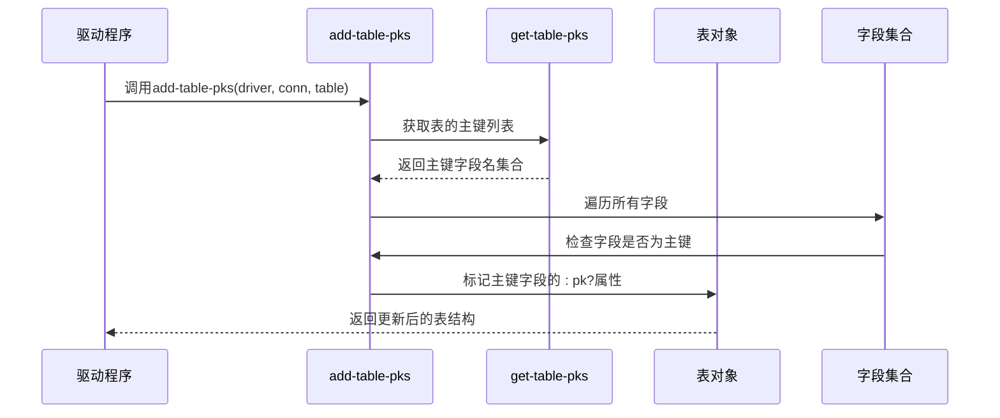

**图表来源**
- [describe_table.clj](file://src/metabase/driver/sql_jdbc/sync/describe_table.clj#L350-L370)

### 主键识别流程

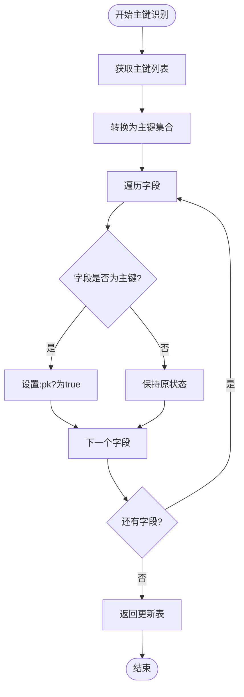

**图表来源**
- [describe_table.clj](file://src/metabase/driver/sql_jdbc/sync/describe_table.clj#L350-L370)

**章节来源**
- [describe_table.clj](file://src/metabase/driver/sql_jdbc/sync/describe_table.clj#L350-L370)

## 复合索引处理策略

### 复合索引识别

系统通过分析索引的`ordinal_position`字段来识别复合索引：

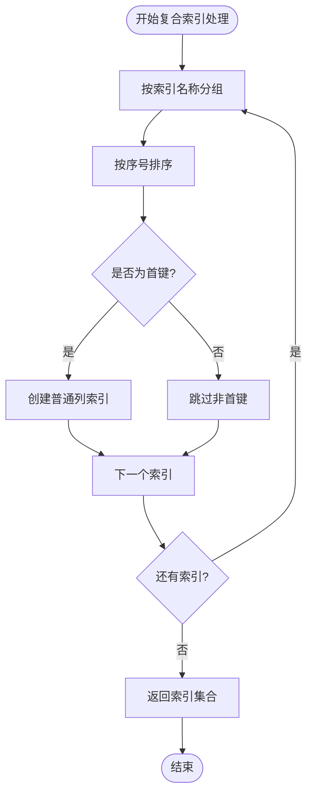

**图表来源**
- [describe_table.clj](file://src/metabase/driver/sql_jdbc/sync/describe_table.clj#L465-L482)

### 复合索引优化策略

系统采用以下策略优化复合索引处理：
1. **首键优先**: 只同步复合索引的第一列
2. **性能优化**: 避免处理非首键列的索引信息
3. **内存控制**: 限制嵌套字段的最大数量

**章节来源**
- [describe_table.clj](file://src/metabase/driver/sql_jdbc/sync/describe_table.clj#L465-L482)

## 查询构建器中的应用

### 隐式连接机制

查询构建器通过`add_implicit_joins`中间件自动添加基于外键关系的连接：

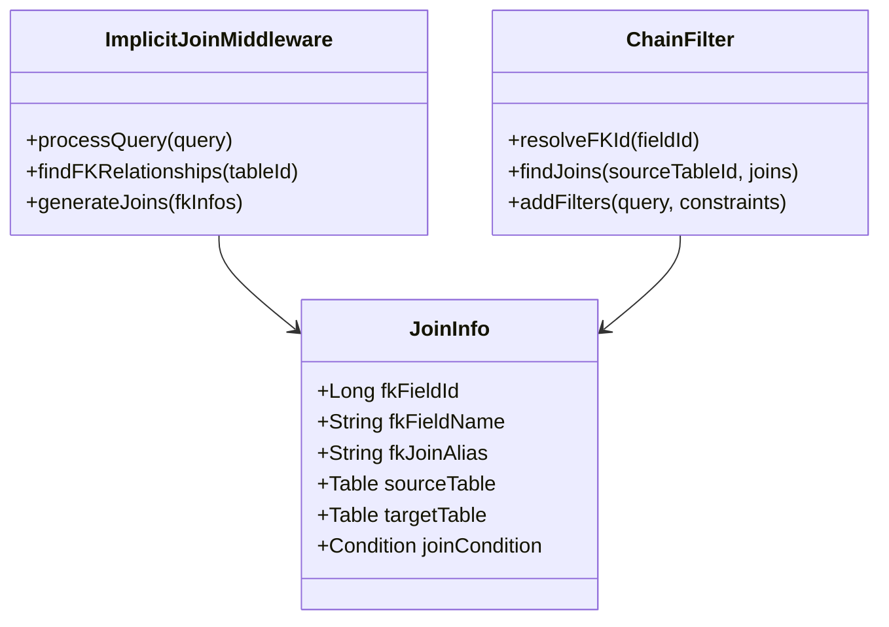

**图表来源**
- [add_implicit_joins.clj](file://src/metabase/query_processor/middleware/add_implicit_joins.clj#L56-L110)
- [chain_filter.clj](file://src/metabase/parameters/chain_filter.clj#L224-L278)

### 外键关系查找

系统维护外键关系图来支持复杂的连接查找：

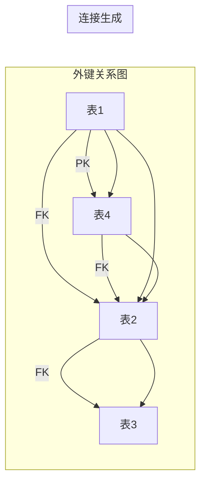

**图表来源**
- [chain_filter.clj](file://src/metabase/parameters/chain_filter.clj#L224-L278)

### 查询优化示例

以下是外键关系在查询构建中的实际应用示例：

| 场景 | 原始查询 | 优化后查询 |
|------|----------|------------|
| 简单外键连接 | `SELECT * FROM orders WHERE customer_id = ?` | `SELECT o.*, c.* FROM orders o JOIN customers c ON o.customer_id = c.id` |
| 多级外键导航 | `SELECT * FROM orders WHERE customer_id = ? AND order_id = ?` | 自动添加中间连接层 |
| 嵌套字段访问 | `SELECT customer.address.city FROM orders` | 自动连接相关表并提取嵌套字段 |

**章节来源**
- [add_implicit_joins.clj](file://src/metabase/query_processor/middleware/add_implicit_joins.clj#L76-L110)
- [chain_filter.clj](file://src/metabase/parameters/chain_filter.clj#L365-L388)

## 性能影响分析

### 同步性能考量

关系结构同步对系统性能的影响主要体现在以下几个方面：

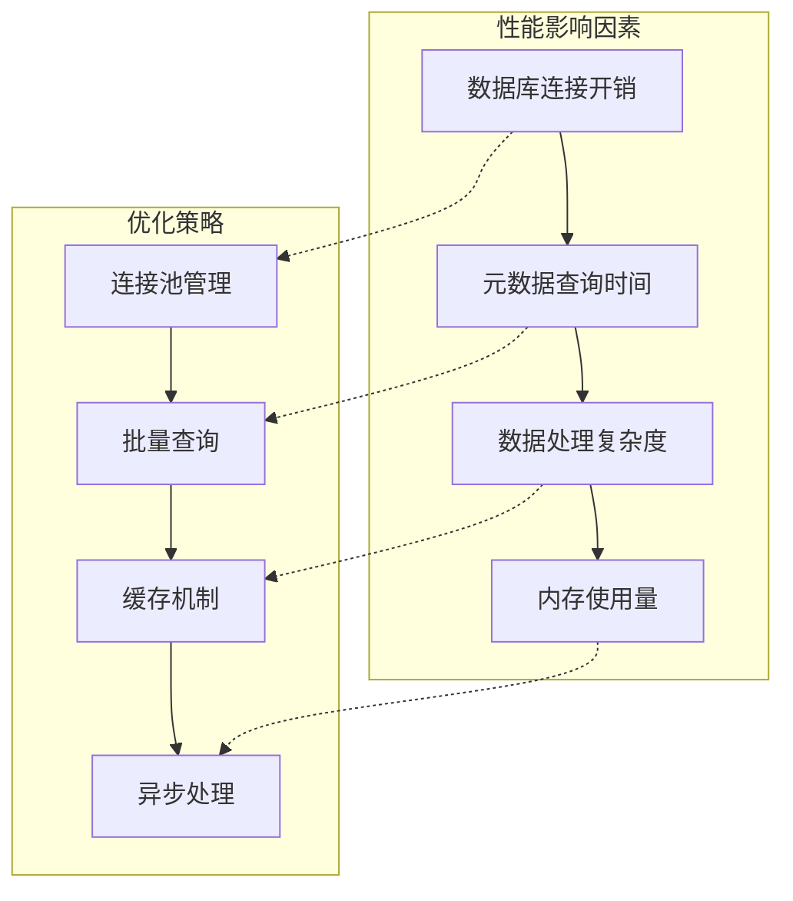

### 性能优化措施

1. **连接池管理**: 使用连接池减少数据库连接开销
2. **批量查询**: 将多个小查询合并为批量查询
3. **缓存机制**: 缓存频繁访问的元数据信息
4. **异步处理**: 在后台异步执行耗时的同步操作

### 内存使用优化

系统采用流式处理和分批处理来控制内存使用：

| 处理阶段 | 内存策略 | 优化技术 |
|----------|----------|----------|
| 元数据获取 | 流式处理 | reducible-query |
| 数据转换 | 分批处理 | partition-all |
| 结果聚合 | 延迟计算 | eduction |
| 缓存存储 | 智能清理 | TTL缓存 |

**章节来源**
- [indexes.clj](file://src/metabase/sync/sync_metadata/indexes.clj#L48-L77)

## 故障排除指南

### 常见问题诊断

| 问题类型 | 症状 | 解决方案 |
|----------|------|----------|
| 外键同步失败 | 外键关系未正确识别 | 检查数据库权限和约束定义 |
| 索引信息缺失 | 索引标记不准确 | 验证JDBC驱动版本兼容性 |
| 性能问题 | 同步过程缓慢 | 优化查询条件和增加缓存 |
| 连接超时 | 数据库连接失败 | 调整连接池配置和超时设置 |

### 调试工具和日志

系统提供了丰富的调试信息和日志记录：

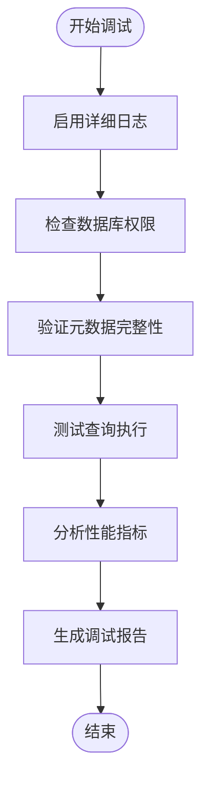

**章节来源**
- [fks.clj](file://src/metabase/sync/sync_metadata/fks.clj#L114-L133)
- [indexes.clj](file://src/metabase/sync/sync_metadata/indexes.clj#L28-L53)

## 总结

Metabase的关系结构同步机制是一个高度优化的系统，通过以下关键特性实现了高效的数据库关系管理：

1. **统一的JDBC接口**: 通过DatabaseMetaData提供跨数据库的一致性访问
2. **智能的元数据处理**: 自动识别主键、外键和索引关系
3. **优化的查询构建**: 在查询过程中自动添加必要的连接
4. **性能友好的设计**: 采用流式处理和缓存机制控制资源使用

该系统不仅确保了数据完整性和一致性，还为用户提供了直观的关系导航体验，是Metabase数据分析功能的重要基础设施。

通过深入理解这些机制的工作原理，开发者可以更好地优化查询性能，解决集成问题，并扩展系统的功能边界。