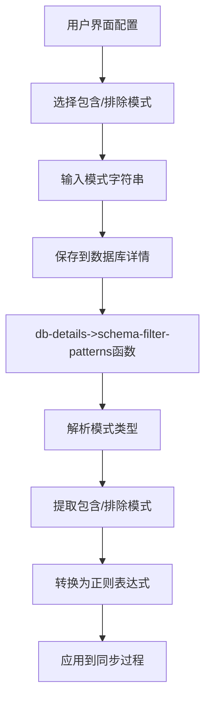
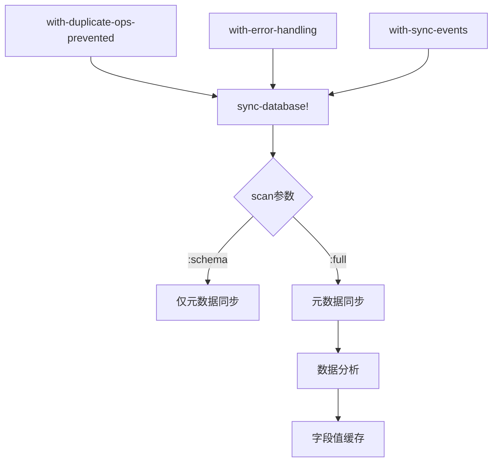
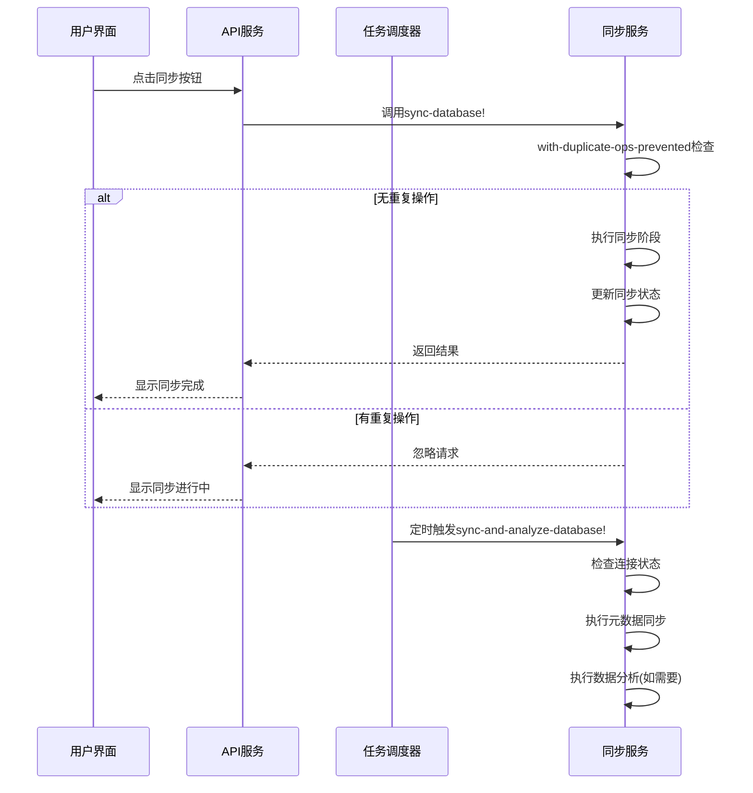

# 同步策略与配置

<cite>
**本文档中引用的文件**  
- [sync.clj](file://src/metabase/sync/sync.clj)
- [sync.clj](file://src/metabase/driver/sync.clj)
- [util.clj](file://src/metabase/sync/util.clj)
- [schedules.clj](file://src/metabase/sync/schedules.clj)
- [sync_databases.clj](file://src/metabase/sync/task/sync_databases.clj)
- [describe_database.clj](file://src/metabase/driver/sql_jdbc/sync/describe_database.clj)
- [interface.clj](file://src/metabase/driver/sql_jdbc/sync/interface.clj)
- [util.clj](file://src/metabase/driver/util.clj)
</cite>

## 目录
1. [引言](#引言)
2. [Schema过滤模式配置](#schema过滤模式配置)
3. [元数据同步机制](#元数据同步机制)
4. [同步任务调度](#同步任务调度)
5. [不同数据库规模下的同步策略建议](#不同数据库规模下的同步策略建议)
6. [性能特征分析](#性能特征分析)
7. [结论](#结论)

## 引言
Metabase的元数据同步策略是确保数据源与Metabase应用保持一致的关键机制。该策略通过定期扫描数据库结构变化，自动更新表、字段等元数据信息。同步过程包含三个主要阶段：元数据同步、数据分析和字段值缓存。系统支持全量同步和增量同步两种模式，可根据数据库规模和业务需求进行配置。同步任务可通过自动调度或手动触发执行，为用户提供灵活的管理方式。

## Schema过滤模式配置

Metabase提供了灵活的Schema过滤模式配置，允许用户通过包含模式和排除模式来精确控制需要同步的数据库对象。在用户界面中，用户可以选择"仅包含这些..."或"除这些之外的所有..."模式，并输入以逗号分隔的模式列表，支持使用通配符`*`进行模糊匹配。

底层实现中，`db-details->schema-filter-patterns`函数负责解析数据库连接属性中的过滤配置。该函数首先通过`find-schema-filters-prop`查找驱动程序的schema-filters类型属性，然后根据`schema-filter-type`的值（"inclusion"或"exclusion"）从数据库详情中提取相应的模式字符串。这些模式字符串最终被转换为正则表达式，用于在同步过程中过滤Schema。

**Diagram sources**
- [util.clj](file://src/metabase/driver/util.clj#L418-L444)
- [sync.clj](file://src/metabase/driver/sync.clj#L57-L81)

**Section sources**
- [sync.clj](file://src/metabase/driver/sync.clj#L0-L82)
- [util.clj](file://src/metabase/driver/util.clj#L386-L444)

## 元数据同步机制

Metabase的元数据同步机制通过`sync-database!`函数协调执行三个主要阶段：元数据同步、数据分析和字段值缓存。同步过程由`sync-operation`宏包装，该宏提供了错误处理、日志记录、重复操作预防和事件发布等通用功能。

增量同步与全量同步的触发条件由`scan`参数决定。当`scan`为`:schema`时，执行增量同步，仅同步元数据；当`scan`为`:full`时，执行全量同步，包含所有三个阶段。初始数据库添加时默认执行全量同步，后续的定期同步通常为增量同步。

同步过程首先检查数据库是否应该同步（`should-sync?`），然后通过`with-duplicate-ops-prevented`确保同一数据库的同步操作不会并发执行。每个同步阶段（元数据、分析、字段值）都有独立的函数实现，允许独立调度和执行。

**Diagram sources**
- [sync.clj](file://src/metabase/sync/sync.clj#L28-L62)
- [util.clj](file://src/metabase/sync/util.clj#L64-L91)

**Section sources**
- [sync.clj](file://src/metabase/sync/sync.clj#L0-L99)
- [util.clj](file://src/metabase/sync/util.clj#L208-L242)

## 同步任务调度

Metabase使用Quartz调度器管理同步任务，支持自动同步间隔配置和手动触发机制。调度配置存储在数据库记录的`metadata_sync_schedule`和`cache_field_values_schedule`字段中，采用Cron表达式格式。

自动同步间隔通过`check-and-schedule-tasks-for-db!`函数配置，该函数为每个数据库创建两个主要任务：`SyncAndAnalyzeDatabase`和`UpdateFieldValues`。任务调度器使用`cron-schedule`函数从数据库配置中获取Cron表达式，并创建相应的触发器。系统支持默认的随机化调度策略，避免所有数据库在同一时间同步造成系统负载高峰。

手动触发机制通过管理界面的"同步"按钮实现，调用`sync-database!`函数立即执行同步操作。系统通过`operation->db-ids`原子变量跟踪正在进行的同步操作，防止同一数据库的重复同步。

**Diagram sources**
- [sync_databases.clj](file://src/metabase/sync/task/sync_databases.clj#L241-L265)
- [schedules.clj](file://src/metabase/sync/schedules.clj#L0-L74)

**Section sources**
- [sync_databases.clj](file://src/metabase/sync/task/sync_databases.clj#L0-L367)
- [schedules.clj](file://src/metabase/sync/schedules.clj#L0-L74)

## 不同数据库规模下的同步策略建议

对于不同规模的数据库，应采用差异化的同步策略以优化性能和资源利用。小型数据库（表数量<100）可以采用较频繁的全量同步策略，如每小时一次，确保数据的实时性。中型数据库（表数量100-1000）建议采用增量同步为主，全量同步为辅的策略，每日执行一次全量同步，每小时执行增量同步。

大型数据库（表数量>1000）需要更加精细的策略。建议将元数据同步和字段值缓存分开调度，元数据同步可设置为每小时一次，而字段值缓存可设置为每日一次。对于超大型数据库，可以考虑分片同步策略，将表按Schema或业务模块分组，在不同时间段分别同步。

所有规模的数据库都应合理配置Schema过滤模式，排除系统表、临时表和不需要分析的Schema，减少同步负载。对于包含大量表的数据库，建议启用`let-user-control-scheduling`选项，允许用户手动控制同步时间，避免在业务高峰期执行同步操作。

## 性能特征分析

Metabase同步机制的性能特征受多个因素影响。全量同步的性能开销主要来自三个阶段：元数据同步涉及数据库元数据查询，数据分析涉及统计计算，字段值缓存涉及数据采样。增量同步主要开销在元数据同步阶段。

性能优化的关键在于合理配置同步频率和范围。频繁的全量同步会增加数据库负载，可能导致查询性能下降。通过Schema过滤模式限制同步范围可以显著减少同步时间。对于大型数据库，建议监控同步任务的执行时间，如果单次同步超过15分钟，应考虑调整同步策略。

系统提供了多种性能监控机制，包括同步事件日志、任务历史记录和性能指标收集。通过分析这些数据，可以识别性能瓶颈并优化配置。例如，如果发现字段值缓存阶段耗时过长，可以考虑减少缓存的字段数量或降低采样率。

## 结论
Metabase的元数据同步策略提供了灵活而强大的机制，确保数据源与应用的一致性。通过合理的Schema过滤模式配置、适当的同步频率设置和优化的调度策略，可以在保证数据实时性的同时，最大限度地减少对系统性能的影响。对于不同规模的数据库，应采用差异化的同步策略，结合自动调度和手动触发机制，实现高效的数据管理。