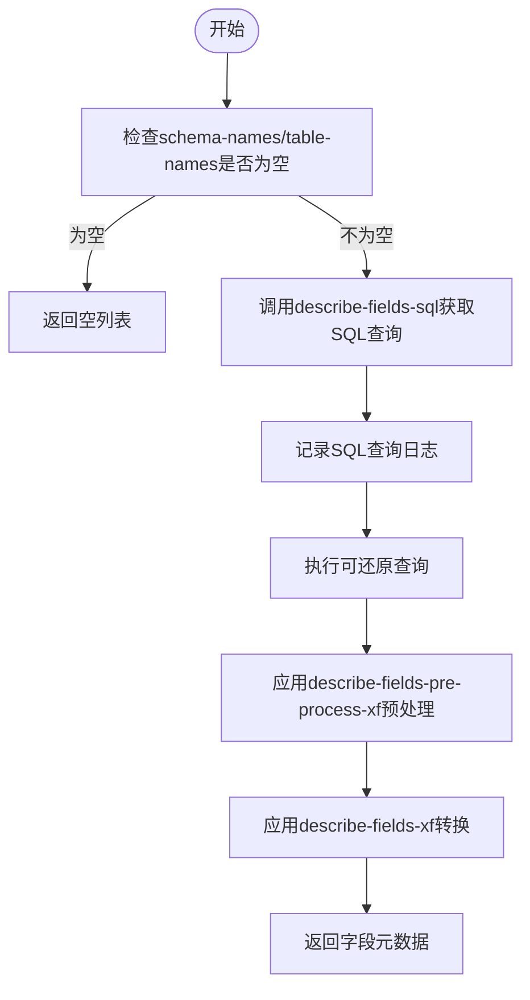
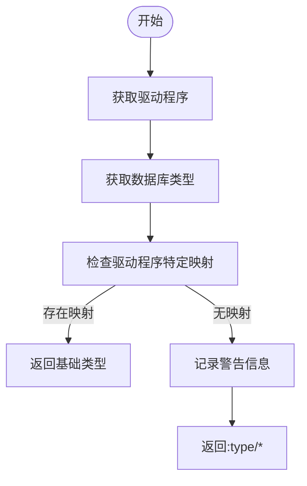
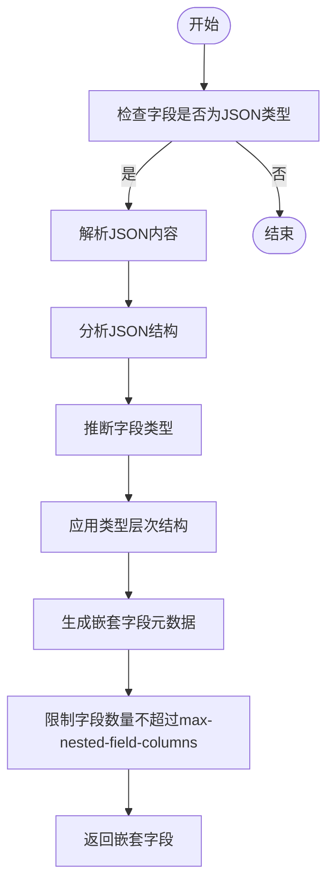
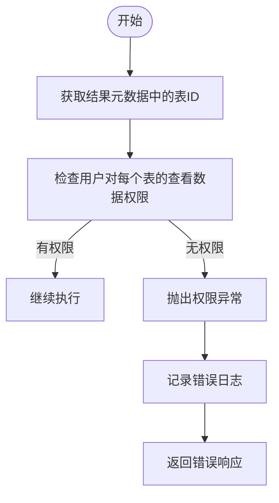

# 字段元数据同步

<cite>
**本文档中引用的文件**  
- [describe_table.clj](file://src/metabase/driver/sql_jdbc/sync/describe_table.clj)
- [fields.clj](file://src/metabase/sync/sync_metadata/fields.clj)
- [common.clj](file://src/metabase/driver/sql_jdbc/sync/common.clj)
- [fields\common.clj](file://src/metabase/sync/sync_metadata/fields/common.clj)
- [fetch_metadata.clj](file://src/metabase/sync/fetch_metadata.clj)
- [warehouse_schema\models\field.clj](file://src/metabase/warehouse_schema/models/field.clj)
- [query_permissions\impl.clj](file://src/metabase/query_permissions/impl.clj)
</cite>

## 目录
1. [字段元数据同步概述](#字段元数据同步概述)
2. [describe-fields多态方法执行流程](#describe-fields多态方法执行流程)
3. [列类型映射机制](#列类型映射机制)
4. [字段语义类型推断逻辑](#字段语义类型推断逻辑)
5. [字段权限检查实现](#字段权限检查实现)

## 字段元数据同步概述

Metabase字段元数据同步是确保数据库字段信息在Metabase应用数据库中准确反映物理数据库状态的核心机制。该过程通过比较从物理数据库获取的元数据（db-metadata）与Metabase应用数据库中重建的元数据（our-metadata），执行必要的同步操作。同步过程主要分为三个阶段：获取元数据、同步字段实例和更新实例元数据。

**Section sources**
- [fields.clj](file://src/metabase/sync/sync_metadata/fields.clj#L0-L147)

## describe-fields多态方法执行流程

`describe-fields`多态方法是字段元数据同步的核心，其执行流程包括查询构造和结果预处理转换两个关键阶段。该方法首先通过`describe-fields-sql`多态方法构造SQL查询，然后执行查询并处理结果。

**Diagram sources**
- [describe_table.clj](file://src/metabase/driver/sql_jdbc/sync/describe_table.clj#L580-L618)

`describe-fields-sql`多态方法返回用于获取字段元数据的SQL查询，而`describe-fields-pre-process-xf`多态方法提供了一个可选的预处理转换器，用于在结果处理前对数据进行转换。默认的`describe-fields-xf`转换器负责将原始字段信息转换为包含基础类型、语义类型等完整元数据的结构。

**Section sources**
- [describe_table.clj](file://src/metabase/driver/sql_jdbc/sync/describe_table.clj#L580-L618)

## 列类型映射机制

列类型映射机制通过`database-type->base-type`多态方法将数据库原生类型转换为Metabase基础类型。该机制首先尝试通过驱动程序特定的映射规则进行转换，如果找不到匹配项，则回退到警告并使用`:type/*`作为默认类型。

**Diagram sources**
- [describe_table.clj](file://src/metabase/driver/sql_jdbc/sync/describe_table.clj#L100-L118)

类型映射的具体实现依赖于驱动程序，例如H2数据库驱动程序定义了从`VARCHAR`到`:type/Text`、从`INTEGER`到`:type/Integer`的映射规则。这种多态设计允许不同数据库驱动程序根据其特定的数据类型系统提供定制化的映射逻辑。

**Section sources**
- [describe_table.clj](file://src/metabase/driver/sql_jdbc/sync/describe_table.clj#L100-L118)

## 字段语义类型推断逻辑

字段语义类型推断逻辑包括JSON字段的自动识别和基于名称的语义类型分类。对于JSON字段，系统通过分析JSON内容的结构和数据类型来推断嵌套字段的语义。

**Diagram sources**
- [describe_table.clj](file://src/metabase/driver/sql_jdbc/sync/describe_table.clj#L700-L770)

JSON字段的识别基于基础类型是否为`:type/JSON`，然后通过`describe-json-fields`方法分析JSON内容。该方法使用Jackson流式API解析JSON，避免分配不必要的数据结构，并通过`lowest-common-denominator-type`函数确定多个JSON样本之间的最低公共分母类型。

**Section sources**
- [describe_table.clj](file://src/metabase/driver/sql_jdbc/sync/describe_table.clj#L700-L770)

## 字段权限检查实现

字段权限检查通过`have-select-privilege?`机制实现，该机制验证当前用户是否有权访问特定字段的数据。权限检查主要在查询执行前进行，确保用户只能访问其有权限查看的数据。

**Diagram sources**
- [query_permissions\impl.clj](file://src/metabase/query_permissions/impl.clj#L332-L355)

权限检查的实现依赖于`perms/user-has-permission-for-table?`函数，该函数验证用户是否具有对特定表的`:perms/view-data`权限。如果用户尝试访问其无权查看的表中的字段，系统将抛出相应的权限异常。

**Section sources**
- [query_permissions\impl.clj](file://src/metabase/query_permissions/impl.clj#L332-L355)