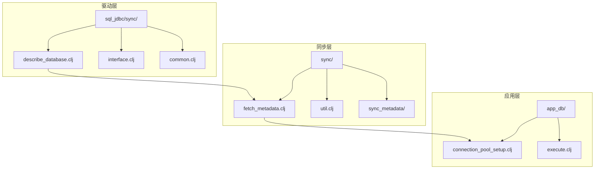
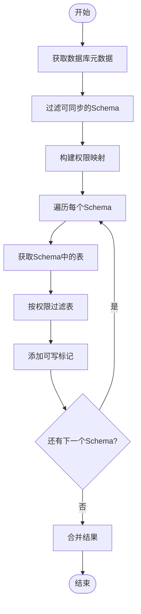
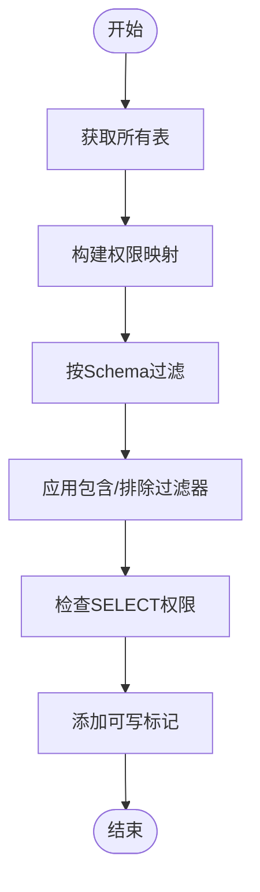
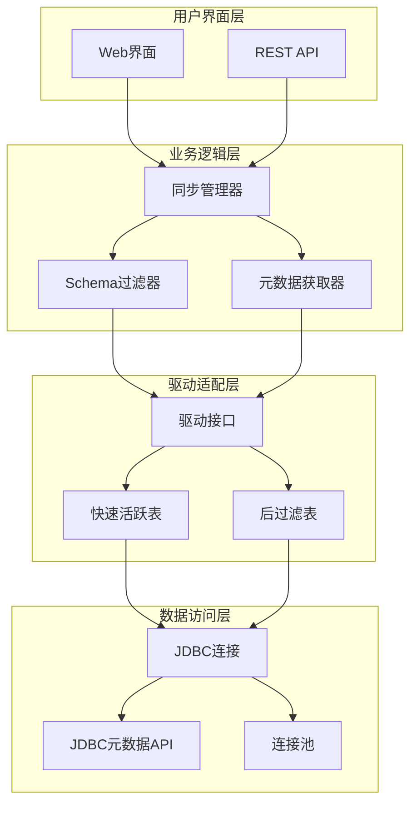
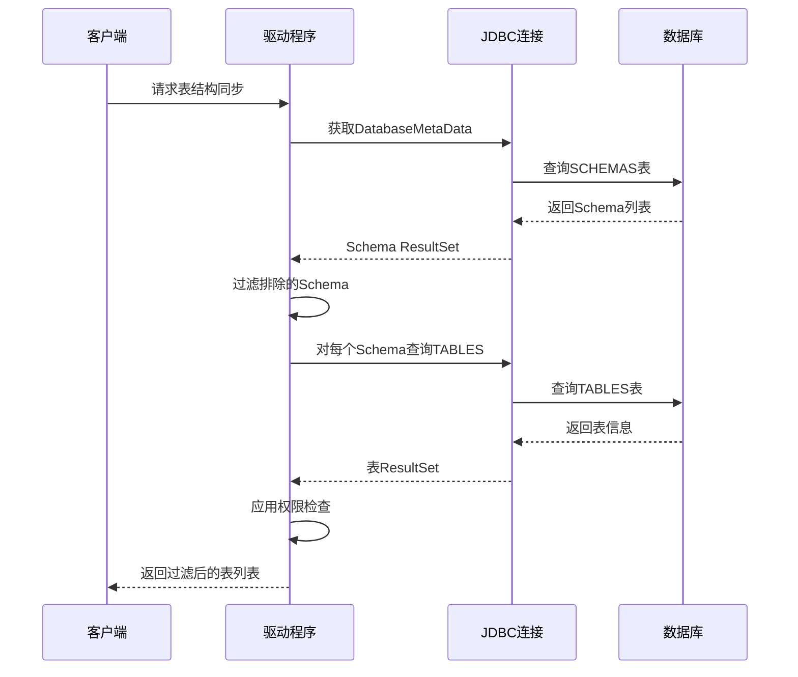
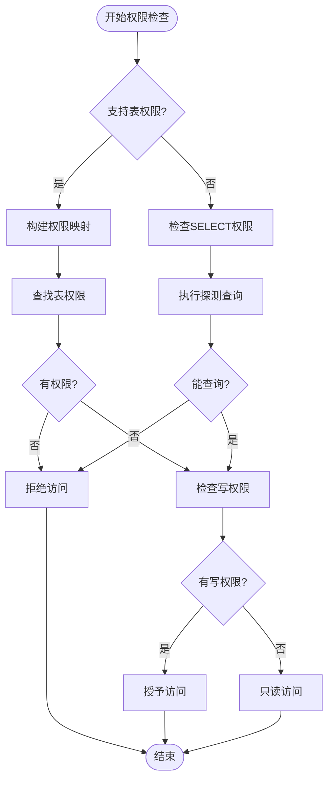
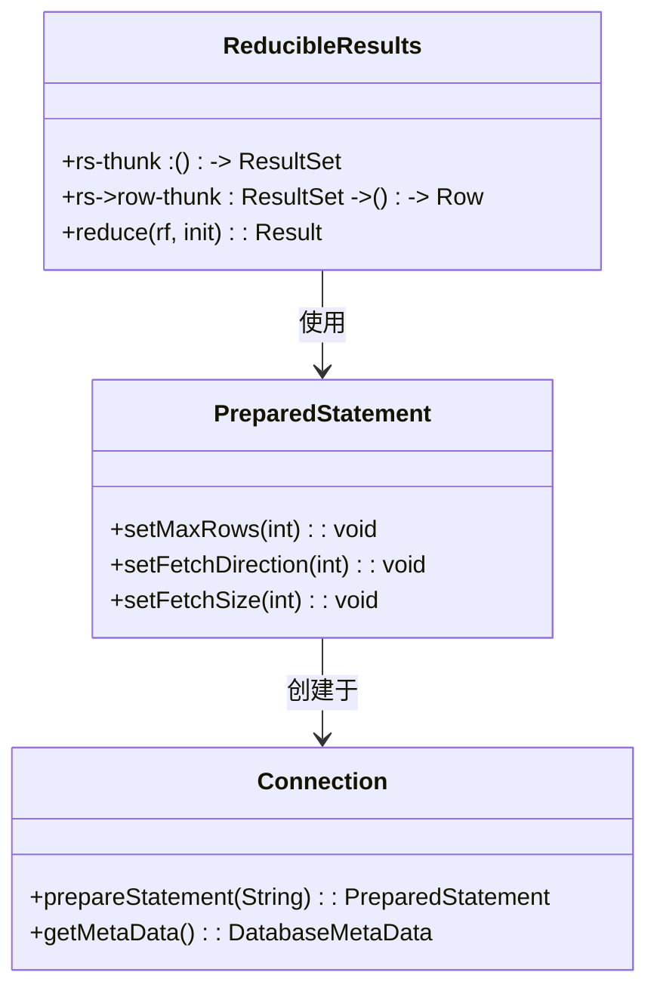
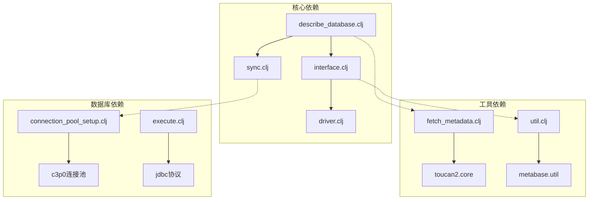

# 表结构同步

<cite>
**本文档中引用的文件**
- [describe_database.clj](file://src/metabase/driver/sql_jdbc/sync/describe_database.clj)
- [interface.clj](file://src/metabase/driver/sql_jdbc/sync/interface.clj)
- [common.clj](file://src/metabase/driver/sql_jdbc/sync/common.clj)
- [sync.clj](file://src/metabase/driver/sync.clj)
- [fetch_metadata.clj](file://src/metabase/sync/fetch_metadata.clj)
- [tables.clj](file://src/metabase/sync/sync_metadata/tables.clj)
- [fields.clj](file://src/metabase/sync/sync_metadata/fields.clj)
- [connection_pool_setup.clj](file://src/metabase/app_db/connection_pool_setup.clj)
- [execute.clj](file://src/metabase/driver/sql_jdbc/execute.clj)
</cite>

## 目录
1. [简介](#简介)
2. [项目结构概述](#项目结构概述)
3. [核心组件分析](#核心组件分析)
4. [架构概览](#架构概览)
5. [详细组件分析](#详细组件分析)
6. [依赖关系分析](#依赖关系分析)
7. [性能考虑](#性能考虑)
8. [故障排除指南](#故障排除指南)
9. [结论](#结论)

## 简介

Metabase的表结构同步功能是一个复杂而精密的系统，负责从各种数据库管理系统（DBMS）中提取和同步表结构信息。该系统采用多态方法设计，支持多种数据库驱动程序，并提供了灵活的schema过滤机制和高性能的元数据获取策略。

本文档深入探讨了active-tables多态方法的实现机制，包括fast-active-tables和post-filtered-active-tables两种策略的区别与适用场景。同时详细解释了schema过滤模式的正则转换算法和包含/排除逻辑，以及数据库元数据获取流程中的catalog和schema遍历方式。

## 项目结构概述

Metabase的表结构同步功能主要分布在以下关键目录中：

**图表来源**
- [describe_database.clj](file://src/metabase/driver/sql_jdbc/sync/describe_database.clj#L1-L50)
- [fetch_metadata.clj](file://src/metabase/sync/fetch_metadata.clj#L1-L30)

**章节来源**
- [describe_database.clj](file://src/metabase/driver/sql_jdbc/sync/describe_database.clj#L1-L291)
- [interface.clj](file://src/metabase/driver/sql_jdbc/sync/interface.clj#L1-L176)

## 核心组件分析

### active-tables多态方法

Metabase的核心同步机制基于`active-tables`多态方法，该方法有两个主要实现策略：

#### fast-active-tables策略

fast-active-tables是默认的、高效的实现方式，特别适用于具有大量系统表的数据库（如Oracle）。其工作原理如下：

**图表来源**
- [describe_database.clj](file://src/metabase/driver/sql_jdbc/sync/describe_database.clj#L214-L245)

#### post-filtered-active-tables策略

post-filtered-active-tables适用于几乎没有或不支持schema的数据库。其处理流程为：

**图表来源**
- [describe_database.clj](file://src/metabase/driver/sql_jdbc/sync/describe_database.clj#L247-L275)

**章节来源**
- [describe_database.clj](file://src/metabase/driver/sql_jdbc/sync/describe_database.clj#L214-L275)
- [interface.clj](file://src/metabase/driver/sql_jdbc/sync/interface.clj#L10-L25)

## 架构概览

Metabase表结构同步系统采用分层架构设计，确保了良好的可扩展性和维护性：

**图表来源**
- [describe_database.clj](file://src/metabase/driver/sql_jdbc/sync/describe_database.clj#L247-L275)
- [interface.clj](file://src/metabase/driver/sql_jdbc/sync/interface.clj#L10-L25)

## 详细组件分析

### Schema过滤模式实现

Metabase实现了强大的schema过滤机制，支持通配符匹配和正则表达式转换：

#### 正则转换算法

schema过滤模式的正则转换遵循以下规则：

**图表来源**
- [sync.clj](file://src/metabase/driver/sync.clj#L12-L30)

#### 包含/排除逻辑

过滤逻辑支持两种模式：

| 模式类型 | 描述 | 示例 |
|---------|------|------|
| 包含模式 | 只显示匹配的schema | `auth*,public*` |
| 排除模式 | 显示除指定外的所有schema | `temp*,backup*` |
| 空模式 | 显示所有schema | 无限制 |

**章节来源**
- [sync.clj](file://src/metabase/driver/sync.clj#L12-L82)

### 数据库元数据获取流程

#### Catalog和Schema遍历

Metabase通过JDBC DatabaseMetaData API获取数据库元数据：

**图表来源**
- [describe_database.clj](file://src/metabase/driver/sql_jdbc/sync/describe_database.clj#L100-L130)
- [common.clj](file://src/metabase/driver/sql_jdbc/sync/common.clj#L25-L44)

#### 权限检查机制

系统实现了多层次的权限检查：

**图表来源**
- [describe_database.clj](file://src/metabase/driver/sql_jdbc/sync/describe_database.clj#L180-L213)

**章节来源**
- [describe_database.clj](file://src/metabase/driver/sql_jdbc/sync/describe_database.clj#L100-L213)
- [common.clj](file://src/metabase/driver/sql_jdbc/sync/common.clj#L25-L44)

### 元数据获取优化

#### Reducible序列处理

Metabase使用reducible序列来高效处理大量元数据：

**图表来源**
- [common.clj](file://src/metabase/driver/sql_jdbc/sync/common.clj#L25-L44)
- [execute.clj](file://src/metabase/driver/sql_jdbc/execute.clj#L100-L130)

**章节来源**
- [common.clj](file://src/metabase/driver/sql_jdbc/sync/common.clj#L25-L44)
- [execute.clj](file://src/metabase/driver/sql_jdbc/execute.clj#L100-L130)

## 依赖关系分析

### 组件耦合度分析

**图表来源**
- [describe_database.clj](file://src/metabase/driver/sql_jdbc/sync/describe_database.clj#L1-L15)
- [fetch_metadata.clj](file://src/metabase/sync/fetch_metadata.clj#L1-L15)

**章节来源**
- [describe_database.clj](file://src/metabase/driver/sql_jdbc/sync/describe_database.clj#L1-L15)
- [fetch_metadata.clj](file://src/metabase/sync/fetch_metadata.clj#L1-L15)

## 性能考虑

### 大型数据库下的分页查询配置

对于大型数据库，Metabase采用了多种性能优化策略：

#### 连接池配置优化

| 参数 | 默认值 | 说明 |
|------|--------|------|
| maxPoolSize | 15 | 最大连接数 |
| idleConnectionTestPeriod | 60秒 | 空闲连接测试间隔 |
| maxIdleTimeExcessConnections | 10分钟 | 多余连接最大空闲时间 |
| maxConnectionAge | 1小时 | 连接最大生存时间 |

#### 查询优化策略

1. **并行Schema处理**：对多个schema并行获取表信息
2. **权限缓存**：缓存用户权限信息避免重复查询
3. **增量同步**：只同步发生变化的表结构
4. **连接复用**：在单个同步操作中复用数据库连接

**章节来源**
- [connection_pool_setup.clj](file://src/metabase/app_db/connection_pool_setup.clj#L90-L151)

### 同步性能基准

不同策略的性能对比：

| 策略 | 适用场景 | 性能优势 | 时间复杂度 |
|------|----------|----------|------------|
| fast-active-tables | 大量系统表 | 15倍更快 | O(n×m) |
| post-filtered-active-tables | 少量schema | 简单直接 | O(n×m×k) |

其中n为表数量，m为schema数量，k为过滤条件复杂度。

## 故障排除指南

### 常见问题及解决方案

#### 权限相关问题

1. **问题**：无法获取某些schema的表信息
   - **原因**：用户缺少相应的SELECT权限
   - **解决**：检查并授予必要的权限

2. **问题**：同步速度过慢
   - **原因**：使用了post-filtered策略处理大量schema
   - **解决**：切换到fast-active-tables策略

#### 连接池问题

1. **问题**：连接超时
   - **原因**：连接池配置不当
   - **解决**：调整maxConnectionAge和maxIdleTime参数

2. **问题**：内存泄漏
   - **原因**：连接未正确关闭
   - **解决**：启用ConnectionCustomizer进行资源清理

**章节来源**
- [connection_pool_setup.clj](file://src/metabase/app_db/connection_pool_setup.clj#L40-L80)

## 结论

Metabase的表结构同步系统展现了优秀的软件架构设计，通过多态方法、灵活的过滤机制和高效的元数据获取策略，成功解决了跨数据库平台的表结构同步挑战。

### 主要优势

1. **灵活性**：支持多种数据库驱动和同步策略
2. **性能**：针对不同场景优化的执行策略
3. **可扩展性**：模块化设计便于添加新功能
4. **可靠性**：完善的错误处理和恢复机制

### 最佳实践建议

1. **选择合适的同步策略**：根据数据库特点选择fast-active-tables或post-filtered-active-tables
2. **合理配置连接池**：根据数据库规模调整连接池参数
3. **实施适当的过滤**：使用schema过滤减少不必要的同步开销
4. **监控同步性能**：定期检查同步时间和资源使用情况

通过深入理解这些机制，开发者可以更好地利用Metabase的功能，并在遇到问题时快速定位和解决。