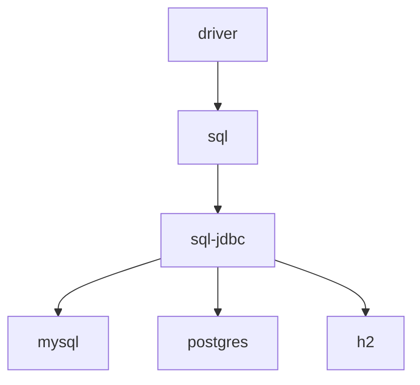
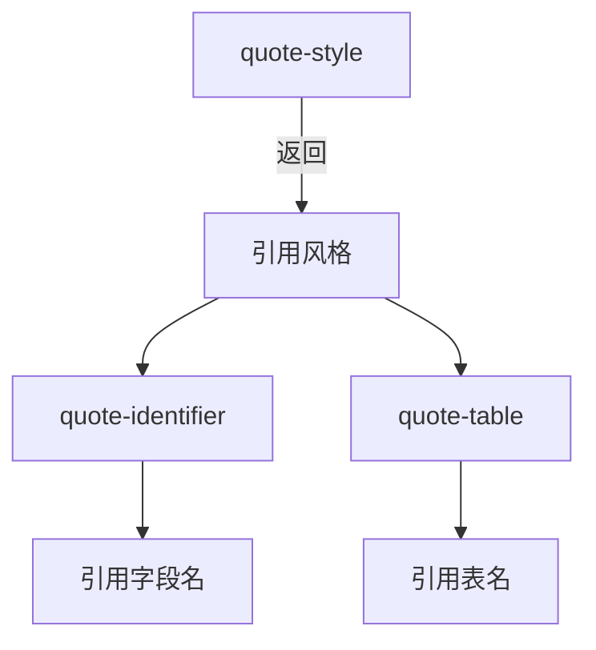
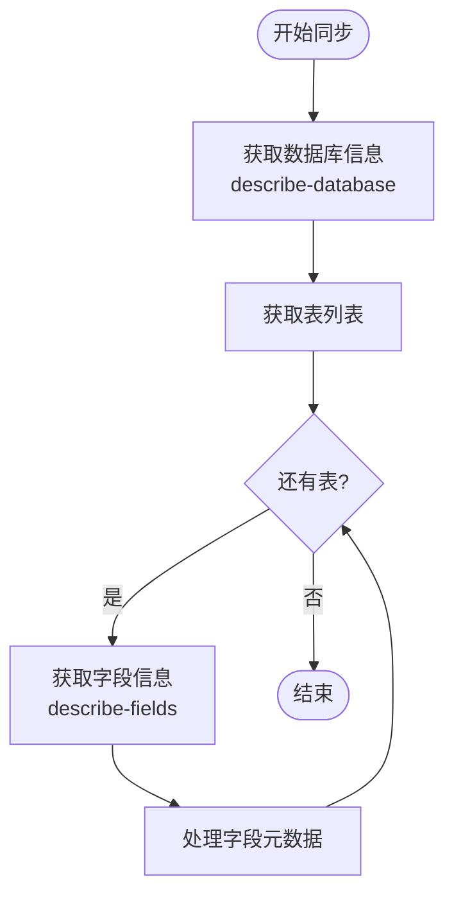
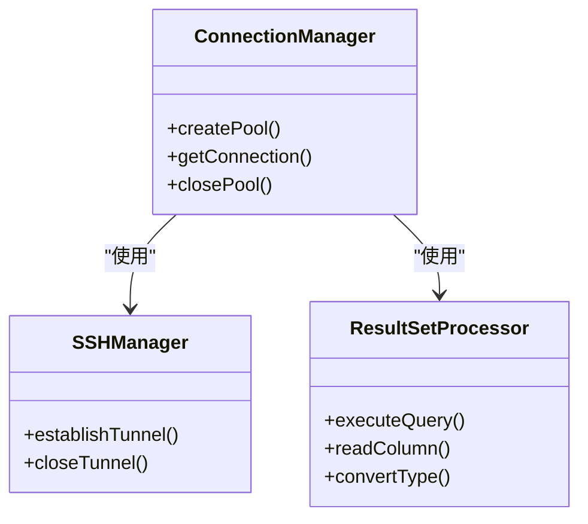

# 数据库驱动架构

<cite>
**本文档引用的文件**   
- [driver.clj](file://src/metabase/driver.clj)
- [sql_jdbc.clj](file://src/metabase/driver/sql_jdbc.clj)
- [sql.clj](file://src/metabase/driver/sql.clj)
- [common.clj](file://src/metabase/driver/common.clj)
- [connection.clj](file://src/metabase/driver/sql_jdbc/connection.clj)
- [metadata.clj](file://src/metabase/driver/sql_jdbc/metadata.clj)
- [sync.clj](file://src/metabase/driver/sql_jdbc/sync.clj)
- [execute.clj](file://src/metabase/driver/sql_jdbc/execute.clj)
- [quoting.clj](file://src/metabase/driver/sql_jdbc/quoting.clj)
- [query_processor.clj](file://src/metabase/driver/sql/query_processor.clj)
- [ddl/interface.clj](file://src/metabase/driver/ddl/interface.clj)
- [mysql.clj](file://src/metabase/driver/mysql.clj)
- [postgres.clj](file://src/metabase/driver/postgres.clj)
- [init.clj](file://src/metabase/driver/init.clj)
</cite>

## 目录
1. [引言](#引言)
2. [驱动注册与多态分发机制](#驱动注册与多态分发机制)
3. [驱动接口协议](#驱动接口协议)
4. [SQL方言处理策略](#sql方言处理策略)
5. [元数据同步流程](#元数据同步流程)
6. [JDBC驱动包装层设计](#jdbc驱动包装层设计)
7. [驱动扩展指南](#驱动扩展指南)
8. [结论](#结论)

## 引言
Metabase数据库驱动架构基于Clojure的多态分发（multimethod）机制，为连接和查询各种数据库提供了统一的接口。该架构通过分层设计，从抽象的`driver`基类到具体的数据库实现，构建了一个灵活且可扩展的系统。核心组件包括驱动注册、连接管理、SQL查询处理、元数据同步和结果集处理等。驱动通过实现一系列协议（protocols）来支持不同的数据库功能，如连接、执行、元数据同步和DDL操作。

## 驱动注册与多态分发机制

Metabase使用Clojure的多态分发机制来管理数据库驱动。驱动通过`register!`函数注册到系统中，并可以指定父驱动以继承功能。多态分发基于驱动关键字进行，允许系统根据不同的驱动类型调用相应的方法实现。

驱动注册的核心是`hierarchy`变量，它维护了一个驱动继承关系的层次结构。当一个驱动被注册时，它会通过`derive`函数被添加到这个层次结构中，从而获得父驱动的功能。例如，`:sql-jdbc`驱动是`:sql`驱动的子类，而具体的数据库驱动如`mysql`和`postgres`又是`sql-jdbc`的子类。



**Diagram sources**
- [driver.clj](file://src/metabase/driver.clj#L63-L88)
- [impl.clj](file://src/metabase/driver/impl.clj#L27-L28)

多态分发的关键在于`dispatch-on-initialized-driver`和`dispatch-on-uninitialized-driver`两个分发函数。前者确保驱动在调用方法前已被初始化，后者则用于不需要初始化的轻量级操作。驱动方法的实现通过`defmulti`和`defmethod`宏定义，系统会根据当前驱动的类型自动选择最合适的方法实现。

**Section sources**
- [driver.clj](file://src/metabase/driver.clj#L119-L168)
- [impl.clj](file://src/metabase/driver/impl.clj#L141-L169)

## 驱动接口协议

Metabase定义了一系列驱动接口协议，这些协议通过多态方法（multimethods）实现，涵盖了数据库操作的各个方面。

### 连接协议
连接协议负责建立和管理与数据库的连接。核心方法包括：
- `can-connect?`：检查是否能成功连接到数据库。
- `connection-properties`：返回连接所需的属性信息，如主机、端口、用户名等。
- `db-default-timezone`：获取数据库的默认时区。

### 执行协议
执行协议处理SQL查询的执行和结果处理。
- `execute-reducible-query`：执行原生查询并返回可约简的结果集。
- `query-result-metadata`：获取查询结果的元数据，如列名和数据类型。
- `database-supports?`：检查驱动是否支持特定功能，如聚合、连接等。

### 元数据同步协议
元数据同步协议用于从数据库获取表结构信息。
- `describe-database`：描述数据库中所有表的信息。
- `describe-table`：描述单个表的字段信息。
- `describe-fields`：批量描述多个表的字段信息。

### DDL操作协议
DDL操作协议支持数据库的模式变更。
- `create-table!`：创建新表。
- `drop-table!`：删除表。
- `truncate!`：清空表数据。
- `insert-into!`：向表中插入数据。

**Section sources**
- [driver.clj](file://src/metabase/driver.clj#L210-L350)
- [sql.clj](file://src/metabase/driver/sql.clj#L100-L150)

## SQL方言处理策略

Metabase通过SQL方言处理策略来适应不同数据库的SQL语法差异。核心策略包括标识符引用、类型映射和函数转换。

### 标识符引用
不同数据库对标识符（如表名、字段名）的引用方式不同。Metabase使用`quote-style`方法来确定引用风格，并通过`quote-identifier`和`quote-table`函数进行实际引用。



**Diagram sources**
- [quoting.clj](file://src/metabase/driver/sql_jdbc/quoting.clj#L20-L27)
- [query_processor.clj](file://src/metabase/driver/sql/query_processor.clj#L300-L310)

### 类型映射
类型映射将数据库的原生类型转换为Metabase内部的类型系统。`database-type->base-type`方法是类型映射的核心，它根据数据库类型返回相应的`Field.base_type`。

### 函数转换
函数转换将通用的MBQL操作符转换为特定数据库的SQL函数。例如，`date`方法根据不同的时间单位（如`minute`、`hour`）生成相应的SQL表达式。

**Section sources**
- [query_processor.clj](file://src/metabase/driver/sql/query_processor.clj#L300-L500)
- [sync.clj](file://src/metabase/driver/sql_jdbc/sync.clj#L20-L30)

## 元数据同步流程

元数据同步是Metabase连接数据库后的重要步骤，它负责获取数据库的表结构信息。

### 同步流程
1. **获取数据库信息**：调用`describe-database`方法获取所有表的基本信息。
2. **获取表字段信息**：对每个表调用`describe-table`或`describe-fields`方法获取字段详情。
3. **获取主键信息**：通过`describe-table-fks`或`describe-fks`方法获取主键和外键约束。
4. **获取索引信息**：通过`describe-table-indexes`或`describe-indexes`方法获取索引信息。

### 同步机制
Metabase支持两种同步模式：`describe-table`和`describe-fields`。前者逐表同步，后者批量同步，性能更优。驱动通过实现`database-supports?`方法来声明支持的同步模式。



**Diagram sources**
- [sync.clj](file://src/metabase/driver/sql_jdbc/sync.clj#L40-L50)
- [driver.clj](file://src/metabase/driver.clj#L300-L330)

**Section sources**
- [sync.clj](file://src/metabase/driver/sql_jdbc/sync.clj#L40-L50)
- [driver.clj](file://src/metabase/driver.clj#L300-L330)

## JDBC驱动包装层设计

JDBC驱动包装层为基于JDBC的数据库提供了统一的连接和执行接口。

### 连接管理
连接管理通过`db->pooled-connection-spec`函数实现，它创建并管理一个连接池。连接池使用c3p0库，配置了合理的超时和重试策略，以确保连接的可靠性和性能。

### SSH隧道支持
对于需要通过SSH隧道连接的数据库，Metabase提供了`incorporate-ssh-tunnel-details`方法。该方法在建立连接前，先建立SSH隧道，然后通过隧道连接数据库。

### 结果集处理
结果集处理是JDBC驱动包装层的核心。`execute-reducible-query`方法执行查询并返回一个可约简的结果集。`read-column-thunk`方法根据列的数据类型，生成相应的读取函数，确保数据类型的正确转换。



**Diagram sources**
- [connection.clj](file://src/metabase/driver/sql_jdbc/connection.clj#L100-L200)
- [execute.clj](file://src/metabase/driver/sql_jdbc/execute.clj#L500-L600)

**Section sources**
- [connection.clj](file://src/metabase/driver/sql_jdbc/connection.clj#L100-L200)
- [execute.clj](file://src/metabase/driver/sql_jdbc/execute.clj#L500-L600)

## 驱动扩展指南

为新数据库类型开发插件需要遵循以下步骤：

1. **注册驱动**：使用`register!`函数注册新驱动，并指定父驱动。
2. **实现连接属性**：重写`connection-properties`方法，定义连接所需的参数。
3. **实现核心协议**：根据数据库特性，实现`can-connect?`、`describe-database`、`execute-reducible-query`等核心方法。
4. **处理SQL方言**：重写`quote-style`、`add-interval-honeysql-form`等方法，以适配数据库的SQL语法。
5. **测试驱动**：编写测试用例，确保驱动的正确性和稳定性。

示例代码：
```clojure
(driver/register! :my-driver, :parent :sql-jdbc)

(defmethod driver/connection-properties :my-driver [_]
  [default-host-details
   default-port-details
   default-dbname-details])

(defmethod driver/can-connect? :my-driver [driver details]
  ;; 实现连接检查逻辑
  )
```

**Section sources**
- [driver.clj](file://src/metabase/driver.clj#L100-L150)
- [sql_jdbc.clj](file://src/metabase/driver/sql_jdbc.clj#L50-L100)

## 结论
Metabase的数据库驱动架构通过多态分发机制和分层设计，实现了对多种数据库的灵活支持。驱动接口协议定义了清晰的功能边界，SQL方言处理策略确保了跨数据库的兼容性，而JDBC驱动包装层则为基于JDBC的数据库提供了高效的连接和执行能力。通过遵循驱动扩展指南，开发者可以轻松地为新的数据库类型开发插件，进一步扩展Metabase的功能。