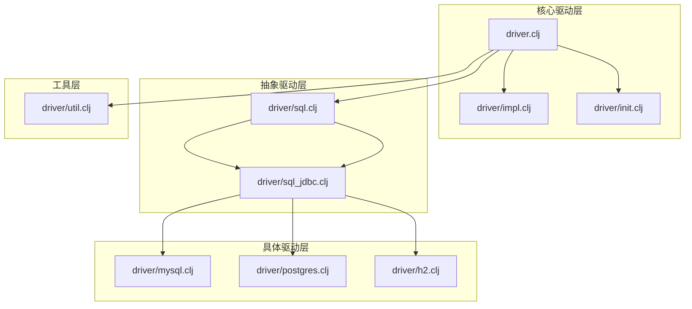
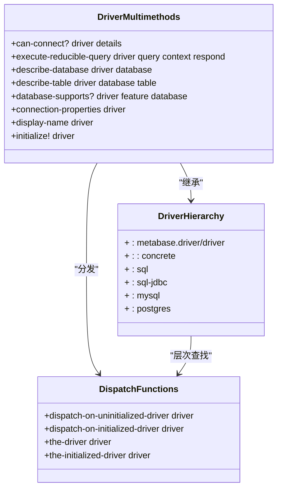
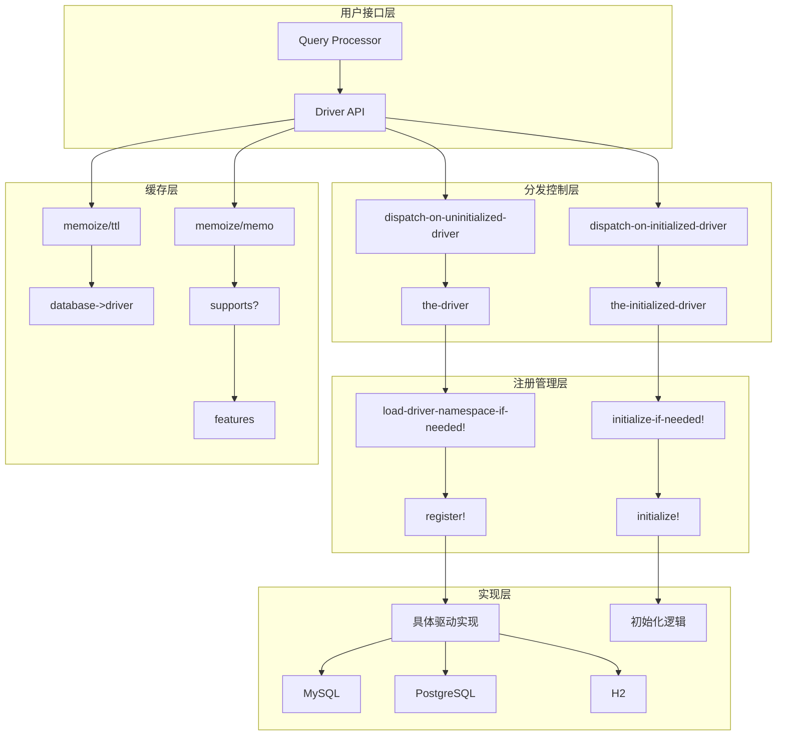
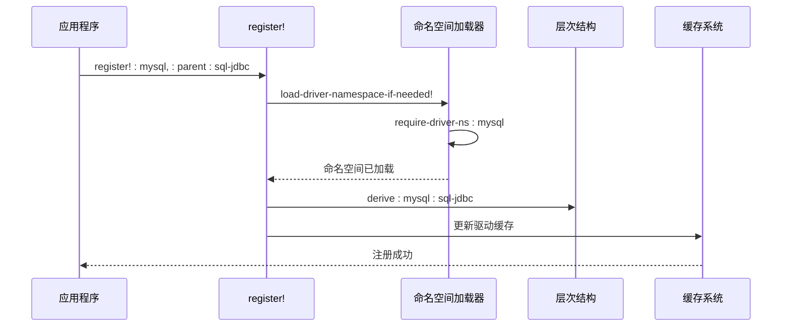
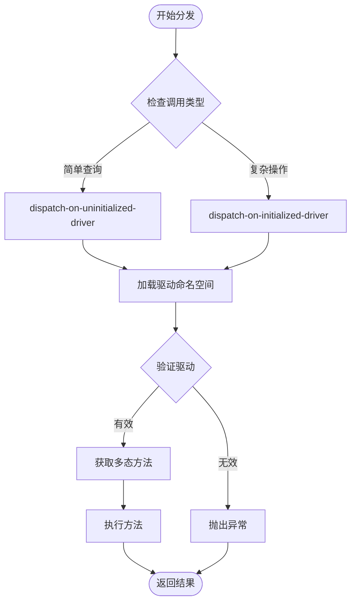
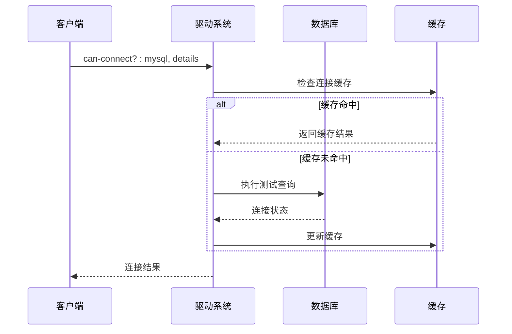
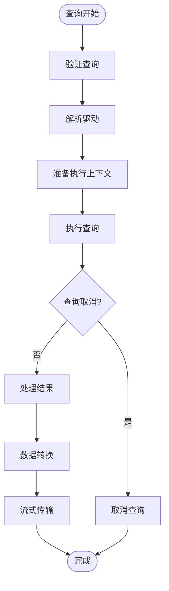
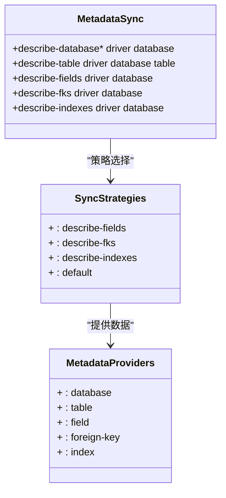
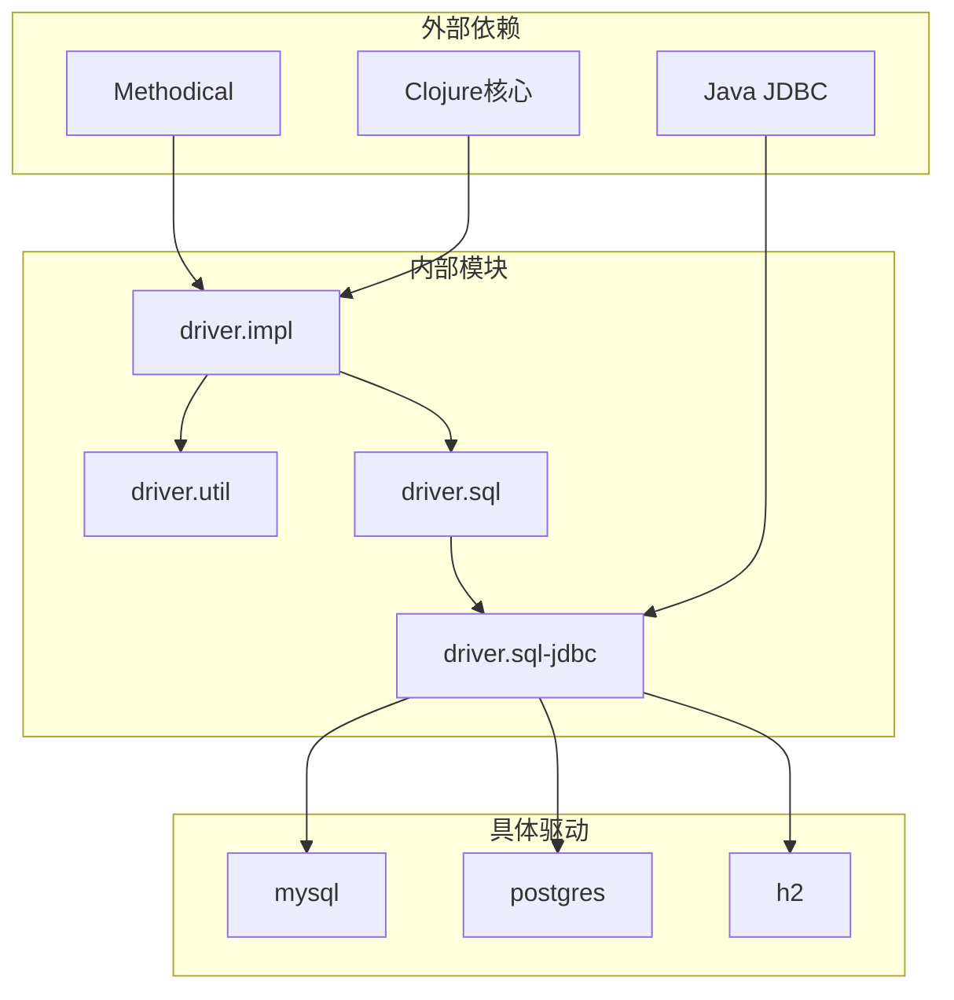
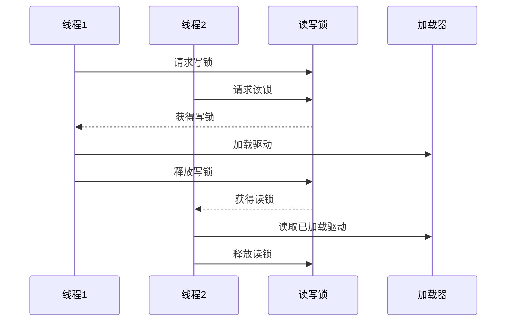

# 驱动多态分发机制

<cite>
**本文档中引用的文件**
- [driver.clj](file://src/metabase/driver.clj)
- [driver/impl.clj](file://src/metabase/driver/impl.clj)
- [driver/init.clj](file://src/metabase/driver/init.clj)
- [driver/sql.clj](file://src/metabase/driver/sql.clj)
- [driver/sql_jdbc.clj](file://src/metabase/driver/sql_jdbc.clj)
- [driver/mysql.clj](file://src/metabase/driver/mysql.clj)
- [driver/postgres.clj](file://src/metabase/driver/postgres.clj)
- [driver/util.clj](file://src/metabase/driver/util.clj)
</cite>

## 目录
1. [简介](#简介)
2. [项目结构概览](#项目结构概览)
3. [核心组件分析](#核心组件分析)
4. [架构概览](#架构概览)
5. [详细组件分析](#详细组件分析)
6. [依赖关系分析](#依赖关系分析)
7. [性能考虑](#性能考虑)
8. [故障排除指南](#故障排除指南)
9. [结论](#结论)

## 简介

Metabase的驱动多态分发机制是一个基于Clojure多态函数（multimethod）的复杂系统，用于管理不同数据库驱动程序的行为。该机制通过多层次的抽象和继承体系，实现了统一的接口来处理各种数据库操作，包括连接验证、查询执行、元数据同步等功能。

该系统的核心优势在于：
- **类型安全**：使用Clojure的多态函数确保类型匹配
- **可扩展性**：支持动态添加新的数据库驱动
- **性能优化**：内置缓存机制减少重复计算
- **模块化设计**：清晰的层次结构便于维护

## 项目结构概览

Metabase驱动系统的文件组织遵循清晰的层次结构：



**图表来源**
- [driver.clj](file://src/metabase/driver.clj#L1-L50)
- [driver/impl.clj](file://src/metabase/driver/impl.clj#L1-L30)

**章节来源**
- [driver.clj](file://src/metabase/driver.clj#L1-L100)
- [driver/init.clj](file://src/metabase/driver/init.clj#L1-L17)

## 核心组件分析

### 多态函数定义

Metabase驱动系统定义了一系列核心多态函数，每个函数都对应特定的数据库操作：



**图表来源**
- [driver.clj](file://src/metabase/driver.clj#L145-L200)
- [driver/impl.clj](file://src/metabase/driver/impl.clj#L20-L30)

**章节来源**
- [driver.clj](file://src/metabase/driver.clj#L145-L450)

## 架构概览

驱动多态分发机制采用分层架构设计，从底层的具体驱动实现到顶层的通用接口：



**图表来源**
- [driver.clj](file://src/metabase/driver.clj#L119-L168)
- [driver/impl.clj](file://src/metabase/driver/impl.clj#L169-L236)

## 详细组件分析

### 驱动注册系统

驱动注册是整个多态分发机制的基础，通过`register!`函数实现：



**图表来源**
- [driver/impl.clj](file://src/metabase/driver/impl.clj#L141-L194)

#### 注册流程详解

1. **参数验证**：检查驱动名称和配置选项
2. **父类加载**：确保所有父驱动已加载
3. **抽象性检查**：验证抽象属性设置
4. **层次构建**：建立驱动间的继承关系
5. **缓存更新**：刷新相关缓存

**章节来源**
- [driver/impl.clj](file://src/metabase/driver/impl.clj#L141-L194)

### 多态分发机制

多态分发是驱动系统的核心，通过不同的分发函数处理不同场景：



**图表来源**
- [driver.clj](file://src/metabase/driver.clj#L119-L168)

#### 分发函数对比

| 分发函数 | 使用场景 | 特点 | 性能影响 |
|---------|---------|------|----------|
| `dispatch-on-uninitialized-driver` | 简单查询、元数据获取 | 不初始化驱动，快速分发 | 最快 |
| `dispatch-on-initialized-driver` | 复杂操作、数据库连接 | 确保驱动已初始化 | 中等 |
| `the-driver` | 驱动验证、类型转换 | 加载并注册驱动 | 较慢 |
| `the-initialized-driver` | 完整功能调用 | 初始化后调用 | 慢 |

**章节来源**
- [driver.clj](file://src/metabase/driver.clj#L119-L168)

### 连接验证机制

`can-connect?`多态函数负责验证数据库连接：



**图表来源**
- [driver/util.clj](file://src/metabase/driver/util.clj#L120-L193)

**章节来源**
- [driver/util.clj](file://src/metabase/driver/util.clj#L120-L193)

### 查询执行流程

查询执行是驱动系统最复杂的部分，涉及多个阶段：



**图表来源**
- [driver.clj](file://src/metabase/driver.clj#L446-L490)

**章节来源**
- [driver.clj](file://src/metabase/driver.clj#L446-L490)

### 元数据同步机制

元数据同步涉及表结构、字段信息、索引等多个方面的数据获取：



**图表来源**
- [driver.clj](file://src/metabase/driver.clj#L300-L400)

**章节来源**
- [driver.clj](file://src/metabase/driver.clj#L300-L400)

## 依赖关系分析

驱动系统的依赖关系呈现清晰的层次结构：



**图表来源**
- [driver.clj](file://src/metabase/driver.clj#L1-L30)
- [driver/impl.clj](file://src/metabase/driver/impl.clj#L1-L20)

**章节来源**
- [driver.clj](file://src/metabase/driver.clj#L1-L50)
- [driver/impl.clj](file://src/metabase/driver/impl.clj#L1-L30)

## 性能考虑

### 缓存机制

驱动系统实现了多层缓存来提升性能：

1. **驱动解析缓存**：`database->driver`使用TTL缓存
2. **特性支持缓存**：`supports?`使用记忆化缓存
3. **功能特性缓存**：`features`使用长期缓存

### 并发控制

系统使用读写锁来确保驱动加载的线程安全：



**图表来源**
- [driver/impl.clj](file://src/metabase/driver/impl.clj#L30-L65)

### 内存管理

- **延迟加载**：驱动仅在需要时加载
- **命名空间隔离**：避免内存泄漏
- **垃圾回收友好**：合理使用Clojure的数据结构

**章节来源**
- [driver/impl.clj](file://src/metabase/driver/impl.clj#L30-L92)
- [driver/util.clj](file://src/metabase/driver/util.clj#L165-L193)

## 故障排除指南

### 常见问题及解决方案

#### 1. 驱动未注册错误

**症状**：`Driver not registered after loading`异常

**原因**：
- 驱动命名空间加载失败
- 注册参数错误
- 父驱动不存在

**解决方案**：
```clojure
;; 检查驱动是否正确注册
(driver/available? :mysql) ; 应返回true

;; 手动加载驱动命名空间
(require 'metabase.driver.mysql)

;; 验证驱动层次结构
(isa? driver/hierarchy :mysql :sql-jdbc)
```

#### 2. 多态分发失败

**症状**：找不到对应的多态方法实现

**原因**：
- 方法未在目标驱动中实现
- 分发函数使用错误
- 驱动初始化失败

**解决方案**：
```clojure
;; 检查方法是否存在
(get-method driver/can-connect? :mysql)

;; 强制初始化驱动
(driver/the-initialized-driver :mysql)

;; 检查驱动层次结构
(descendants driver/hierarchy :metabase.driver/driver)
```

#### 3. 连接超时问题

**症状**：`can-connect-with-details?`返回false或超时

**原因**：
- 网络连接问题
- 数据库配置错误
- 防火墙阻拦

**解决方案**：
```clojure
;; 增加连接超时时间
(driver/settings/db-connection-timeout-ms 30000)

;; 启用详细日志
(log/set-level! :debug)

;; 测试基本连接
(driver/can-connect? :mysql {:host "localhost" :port 3306})
```

#### 4. 缓存一致性问题

**症状**：驱动行为不一致或过期

**原因**：
- 缓存未正确失效
- 多线程竞争条件
- 驱动状态变更

**解决方案**：
```clojure
;; 清除驱动缓存
(memoize/memo-clear! driver-api/secret-value-as-file!)

;; 禁用特性支持缓存（开发环境）
(binding [driver.util/*memoize-supports?* false]
  ;; 执行测试
  )
```

### 调试技巧

1. **启用调试日志**：
```clojure
(log/set-level! :debug)
```

2. **检查驱动状态**：
```clojure
(driver/available? :mysql)
(driver/initialized? :mysql)
(driver/abstract? :sql-jdbc)
```

3. **验证方法实现**：
```clojure
(methods driver/can-connect?)
```

**章节来源**
- [driver/impl.clj](file://src/metabase/driver/impl.clj#L89-L144)
- [driver/util.clj](file://src/metabase/driver/util.clj#L120-L193)

## 结论

Metabase的驱动多态分发机制是一个精心设计的系统，它成功地解决了以下关键挑战：

### 主要优势

1. **类型安全**：通过Clojure多态函数确保方法调用的类型正确性
2. **可扩展性**：清晰的层次结构支持轻松添加新驱动
3. **性能优化**：多层缓存机制显著提升系统响应速度
4. **模块化设计**：各层职责明确，便于维护和测试

### 设计亮点

- **分层架构**：从抽象驱动到具体实现的清晰层次
- **延迟加载**：按需加载驱动，减少启动时间和内存占用
- **并发安全**：使用读写锁确保多线程环境下的数据一致性
- **错误处理**：完善的异常处理和恢复机制

### 最佳实践建议

1. **驱动开发**：遵循现有的层次结构和接口规范
2. **性能优化**：合理使用缓存，避免不必要的重复计算
3. **错误处理**：实现适当的异常处理和用户友好的错误消息
4. **测试覆盖**：确保新驱动有充分的单元测试和集成测试

这个驱动多态分发机制不仅为Metabase提供了强大的数据库支持能力，也为其他需要处理多种异构系统的项目提供了优秀的架构参考。