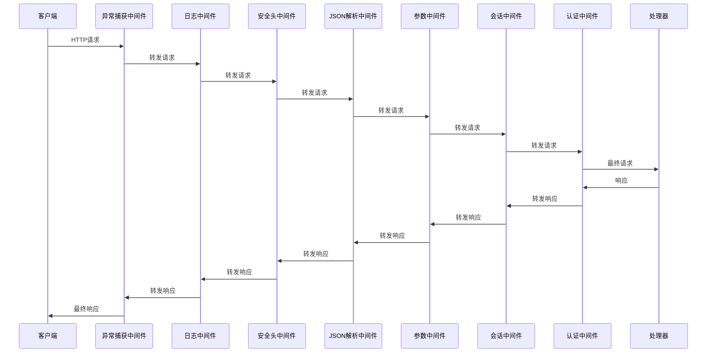
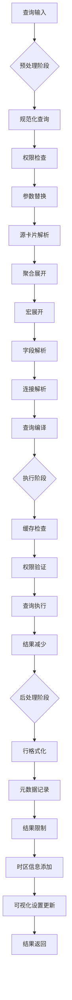
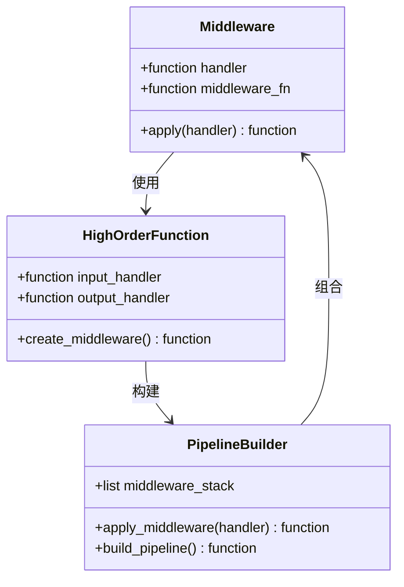
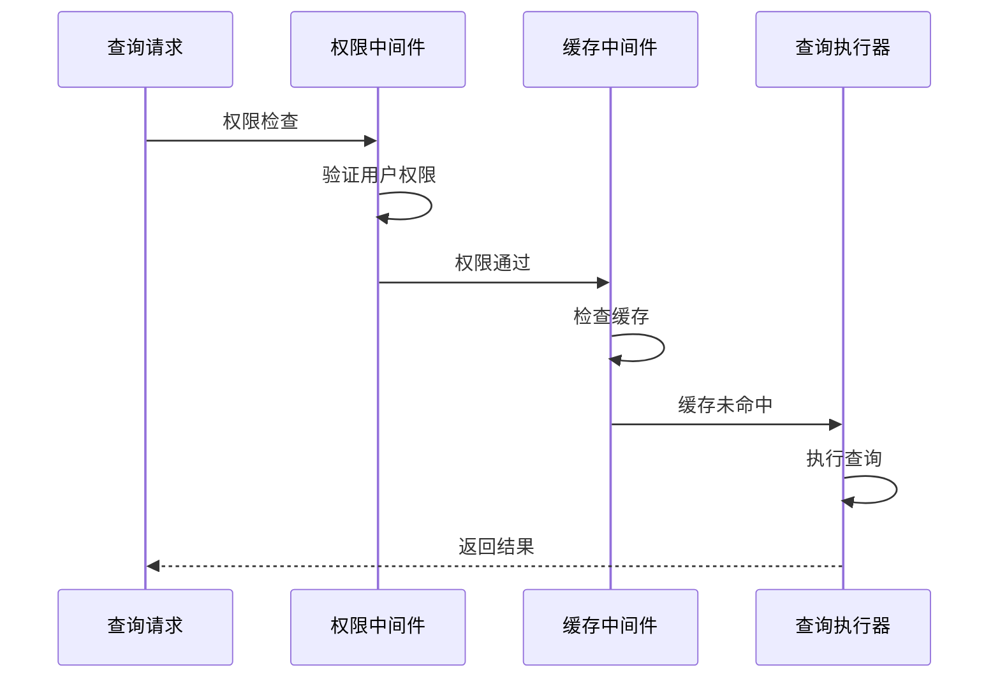
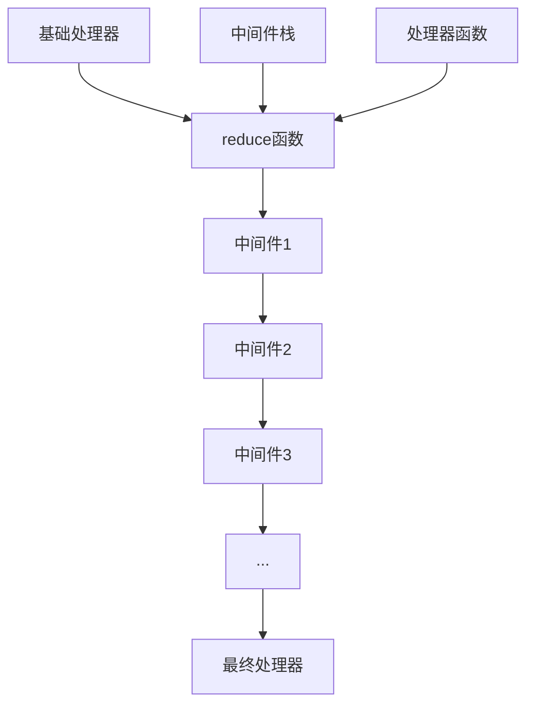
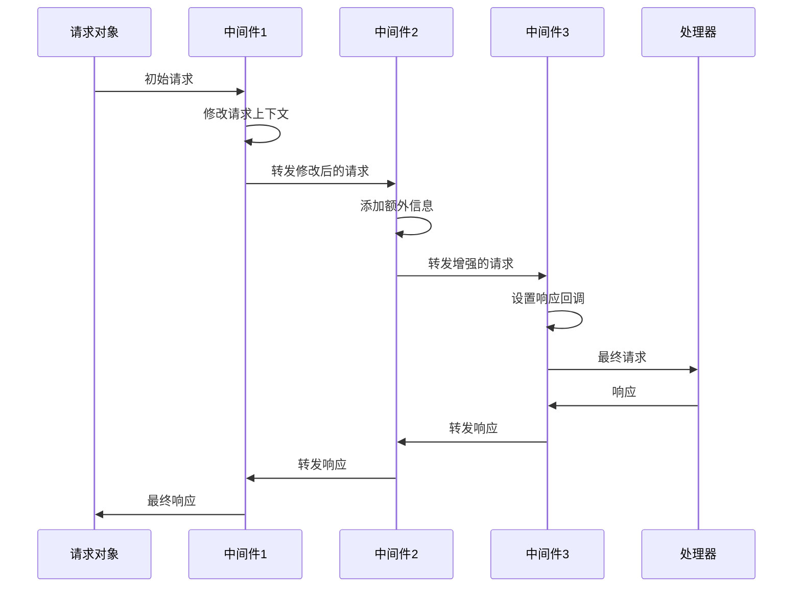

# 中间件管道机制

<cite>
**本文档中引用的文件**
- [handler.clj](file://src/metabase/server/handler.clj)
- [macros.clj](file://src/metabase/api/macros.clj)
- [log.clj](file://src/metabase/server/middleware/log.clj)
- [exceptions.clj](file://src/metabase/server/middleware/exceptions.clj)
- [auth.clj](file://src/metabase/server/middleware/auth.clj)
- [json.clj](file://src/metabase/server/middleware/json.clj)
- [security.clj](file://src/metabase/server/middleware/security.clj)
- [pipeline.clj](file://src/metabase/query_processor/pipeline.clj)
- [preprocess.clj](file://src/metabase/query_processor/preprocess.clj)
- [execute.clj](file://src/metabase/query_processor/execute.clj)
- [postprocess.clj](file://src/metabase/query_processor/postprocess.clj)
- [cache.clj](file://src/metabase/query_processor/middleware/cache.clj)
- [permissions.clj](file://src/metabase/query_processor/middleware/permissions.clj)
- [parameters.clj](file://src/metabase/query_processor/middleware/parameters.clj)
</cite>

## 目录
1. [引言](#引言)
2. [中间件管道架构概览](#中间件管道架构概览)
3. [HTTP请求处理管道](#http请求处理管道)
4. [查询处理器管道](#查询处理器管道)
5. [中间件组合模式](#中间件组合模式)
6. [执行顺序设计原则](#执行顺序设计原则)
7. [高阶函数与管道构建](#高阶函数与管道构建)
8. [数据流与上下文传递](#数据流与上下文传递)
9. [自定义中间件开发](#自定义中间件开发)
10. [最佳实践与常见陷阱](#最佳实践与常见陷阱)
11. [总结](#总结)

## 引言

Metabase采用了一套高度模块化的中间件管道机制，该机制通过组合模式将不同的处理逻辑串联起来，形成一个可扩展、可维护的请求处理流水线。这种设计不仅支持HTTP API请求的处理，还涵盖了查询处理器的完整生命周期管理。

中间件管道的核心思想是将复杂的业务逻辑分解为一系列独立的、可组合的处理单元，每个中间件专注于完成特定的功能，通过标准化的接口与其他中间件协作。

## 中间件管道架构概览

Metabase的中间件管道分为两个主要层次：HTTP请求处理管道和查询处理器管道。


**图表来源**
- [handler.clj](file://src/metabase/server/handler.clj#L56-L125)
- [preprocess.clj](file://src/metabase/query_processor/preprocess.clj#L37-L92)
- [execute.clj](file://src/metabase/query_processor/execute.clj#L30-L98)
- [postprocess.clj](file://src/metabase/query_processor/postprocess.clj#L21-L57)

## HTTP请求处理管道

### 管道组成与执行顺序

HTTP请求处理管道按照特定的顺序应用中间件，确保每个处理步骤都能正确地访问前序中间件的结果。



**图表来源**
- [handler.clj](file://src/metabase/server/handler.clj#L56-L125)

### 核心中间件功能

| 中间件名称 | 功能描述 | 执行位置 | 关键特性 |
|-----------|----------|----------|----------|
| `catch-uncaught-exceptions` | 捕获未处理的异常 | 管道顶部 | 防止系统崩溃，提供统一错误处理 |
| `log-api-call` | 记录API调用信息 | 第二层 | 性能监控，调试支持 |
| `add-security-headers` | 添加安全相关HTTP头 | 第三层 | 防止XSS攻击，缓存控制 |
| `wrap-json-body` | 解析JSON请求体 | 第四层 | 自动类型转换，错误处理 |
| `wrap-keyword-params` | 参数键名转换 | 第六层 | 统一参数格式 |
| `wrap-session-key` | 会话密钥处理 | 第十层 | 用户身份验证 |
| `wrap-static-api-key` | API密钥验证 | 第十二层 | 静态API访问控制 |

**节段来源**
- [handler.clj](file://src/metabase/server/handler.clj#L56-L125)
- [log.clj](file://src/metabase/server/middleware/log.clj#L170-L224)
- [exceptions.clj](file://src/metabase/server/middleware/exceptions.clj#L79-L93)

## 查询处理器管道

### 查询处理生命周期

查询处理器管道包含三个主要阶段：预处理、执行和后处理，每个阶段都有专门的中间件栈。



**图表来源**
- [preprocess.clj](file://src/metabase/query_processor/preprocess.clj#L37-L92)
- [execute.clj](file://src/metabase/query_processor/execute.clj#L30-L98)
- [postprocess.clj](file://src/metabase/query_processor/postprocess.clj#L21-L57)

### 预处理中间件栈

预处理阶段的中间件按以下顺序执行：


**图表来源**
- [preprocess.clj](file://src/metabase/query_processor/preprocess.clj#L37-L92)

### 执行中间件栈

执行阶段的中间件顺序体现了业务逻辑的重要性和依赖关系：


**图表来源**
- [execute.clj](file://src/metabase/query_processor/execute.clj#L30-L98)

## 中间件组合模式

### 高阶函数模式

Metabase中间件系统大量使用高阶函数模式，每个中间件都是接受处理器函数并返回新处理器函数的高阶函数。



**图表来源**
- [macros.clj](file://src/metabase/api/macros.clj#L597-L628)
- [handler.clj](file://src/metabase/server/handler.clj#L96-L125)

### 中间件接口规范

所有中间件都遵循统一的接口规范：

```clojure
;; 中间件函数签名
(fn [handler]
  (fn [request respond raise]
    ;; 处理逻辑
    (handler request respond raise)))
```

这种一致的接口使得中间件可以无缝组合，形成了强大的管道机制。

**节段来源**
- [macros.clj](file://src/metabase/api/macros.clj#L96-L136)

## 执行顺序设计原则

### 权限验证优先原则

权限验证必须在缓存检查之前执行，这是安全设计的基本原则：



**图表来源**
- [permissions.clj](file://src/metabase/query_processor/middleware/permissions.clj#L140-L201)
- [cache.clj](file://src/metabase/query_processor/middleware/cache.clj#L200-L246)

### 安全性考虑

1. **异常捕获优先级**：最外层的异常捕获中间件确保任何中间件的错误都不会导致系统崩溃
2. **日志记录时机**：日志中间件在请求处理的早期阶段就启动，确保能够记录完整的处理流程
3. **安全头注入**：安全头中间件在响应生成之前注入必要的安全头部

**节段来源**
- [exceptions.clj](file://src/metabase/server/middleware/exceptions.clj#L79-L93)
- [log.clj](file://src/metabase/server/middleware/log.clj#L170-L224)
- [security.clj](file://src/metabase/server/middleware/security.clj#L280-L324)

## 高阶函数与管道构建

### 中间件组合算法

中间件管道的构建使用了标准的函数组合算法：



**图表来源**
- [macros.clj](file://src/metabase/api/macros.clj#L597-L628)
- [handler.clj](file://src/metabase/server/handler.clj#L96-L125)

### 动态管道重建

在开发环境中，中间件管道支持动态重建，允许实时修改中间件配置而无需重启服务器：

```clojure
;; 开发环境下的动态管道重建
(defn- dev-handler [server-routes]
  (let [handler (atom (apply-middleware server-routes))]
    (doseq [varr (cons #'middleware middleware)]
      (add-watch varr ::reload
                 (fn [_key _ref _old-state _new-state]
                   (reset! handler (apply-middleware server-routes)))))
    handler))
```

**节段来源**
- [handler.clj](file://src/metabase/server/handler.clj#L105-L125)

## 数据流与上下文传递

### 请求上下文传播

中间件管道中的数据流遵循单向传递原则，每个中间件都可以访问和修改请求上下文：



**图表来源**
- [macros.clj](file://src/metabase/api/macros.clj#L597-L628)

### 上下文状态管理

中间件之间通过共享的请求上下文进行状态传递：

| 上下文键 | 类型 | 描述 | 用途 |
|---------|------|------|------|
| `:browser-id` | 字符串 | 浏览器标识符 | 会话跟踪 |
| `:metabase-user-id` | 整数 | 用户ID | 权限验证 |
| `:metabase-session-key` | 字符串 | 会话密钥 | 会话管理 |
| `:static-metabase-api-key` | 字符串 | API密钥 | 静态认证 |
| `:nonce` | 字符串 | 安全随机数 | CSP策略 |
| `:cache/details` | 映射 | 缓存详情 | 结果缓存 |

**节段来源**
- [auth.clj](file://src/metabase/server/middleware/auth.clj#L10-L17)
- [security.clj](file://src/metabase/server/middleware/security.clj#L20-L32)

## 自定义中间件开发

### 基础中间件模板

开发自定义中间件的标准模板：

```clojure
(defn custom-middleware
  "自定义中间件示例"
  [handler]
  (fn [request respond raise]
    ;; 前置处理逻辑
    (let [modified-request (pre-process request)]
      ;; 调用下一个处理器
      (handler modified-request
               ;; 后置处理响应
               (fn [response]
                 (let [modified-response (post-process response)]
                   (respond modified-response)))
               raise))))
```

### 查询处理器中间件开发

查询处理器中间件的开发模式：

```clojure
(defn query-middleware
  "查询处理器中间件示例"
  [qp]
  (fn [query rff]
    ;; 查询预处理
    (let [processed-query (pre-process-query query)]
      ;; 调用下一个处理器
      (qp processed-query
          ;; 结果后处理
          (fn [metadata]
            (let [processed-rff (post-process-rff metadata)]
              (processed-rff metadata)))))))
```

**节段来源**
- [macros.clj](file://src/metabase/api/macros.clj#L597-L628)
- [pipeline.clj](file://src/metabase/query_processor/pipeline.clj#L60-L129)

### 中间件注册与配置

中间件的注册遵循特定的命名约定和配置模式：

```clojure
;; HTTP中间件注册
(def ^:private middleware
  [#'mw.exceptions/catch-uncaught-exceptions
   #'mw.log/log-api-call
   #'mw.security/add-security-headers
   ;; ... 其他中间件
   ])

;; 查询处理器中间件注册
(def ^:private middleware
  [#'qp.middleware.cache/maybe-return-cached-results
   #'qp.middleware.permissions/check-query-permissions
   ;; ... 其他中间件
   ])
```

**节段来源**
- [handler.clj](file://src/metabase/server/handler.clj#L56-L125)
- [execute.clj](file://src/metabase/query_processor/execute.clj#L30-L98)

## 最佳实践与常见陷阱

### 最佳实践

1. **单一职责原则**：每个中间件应该只负责一个特定的功能
2. **保持无状态**：中间件应该避免维护内部状态，确保可重用性
3. **错误处理**：在中间件中妥善处理异常，避免影响整个管道
4. **性能考虑**：将耗时操作放在管道的适当位置，避免阻塞关键路径

### 常见陷阱

1. **中间件顺序错误**：将依赖于其他中间件结果的中间件放在前面
2. **状态污染**：在中间件中意外修改全局状态或外部变量
3. **异常处理不当**：没有正确捕获和处理中间件中的异常
4. **性能瓶颈**：在管道的关键路径上放置过于复杂的中间件

### 调试与监控

中间件系统提供了丰富的调试和监控功能：

```clojure
;; 性能监控中间件示例
(defn performance-monitoring-middleware
  [handler]
  (fn [request respond raise]
    (let [start-time (u/start-timer)]
      (handler request
               (fn [response]
                 (let [duration-ms (u/since-ms start-time)]
                   (log/debugf "Middleware took %sms" duration-ms)
                   (respond response)))
               raise))))
```

**节段来源**
- [preprocess.clj](file://src/metabase/query_processor/preprocess.clj#L121-L143)

## 总结

Metabase的中间件管道机制是一个精心设计的系统，它通过组合模式实现了高度的模块化和可扩展性。该机制的核心优势包括：

1. **清晰的职责分离**：每个中间件专注于特定的功能领域
2. **灵活的组合能力**：通过高阶函数模式实现中间件的无缝组合
3. **强健的错误处理**：多层次的异常捕获和处理机制
4. **优秀的性能特征**：合理的中间件顺序确保了高效的请求处理
5. **动态的配置能力**：支持运行时的中间件配置调整

这种设计不仅满足了当前的功能需求，还为未来的扩展提供了坚实的基础。通过深入理解中间件管道的工作原理，开发者可以更好地利用这一强大工具来构建可靠、高性能的应用程序。