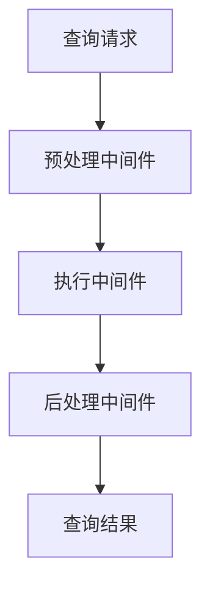
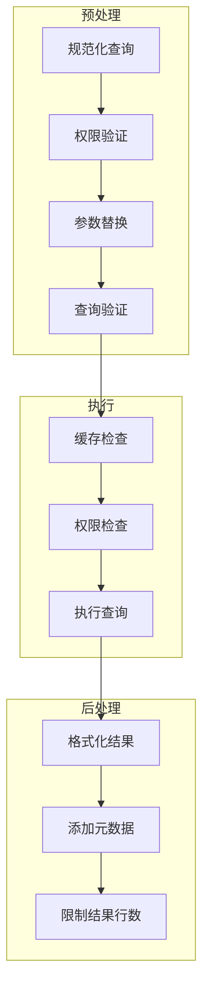
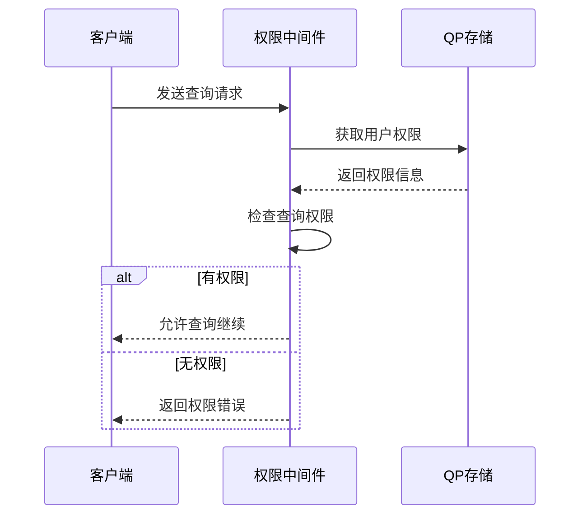
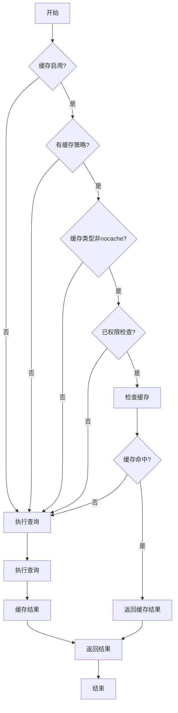
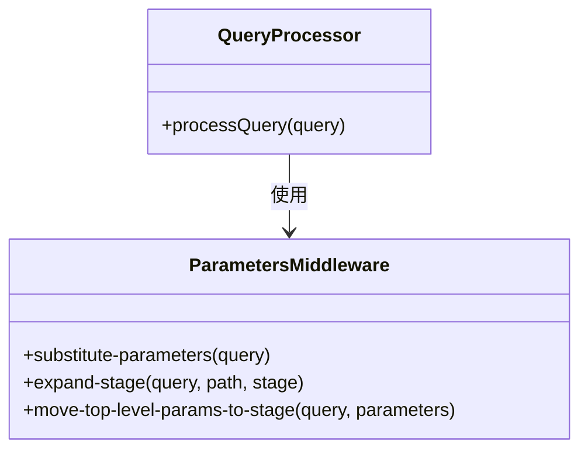
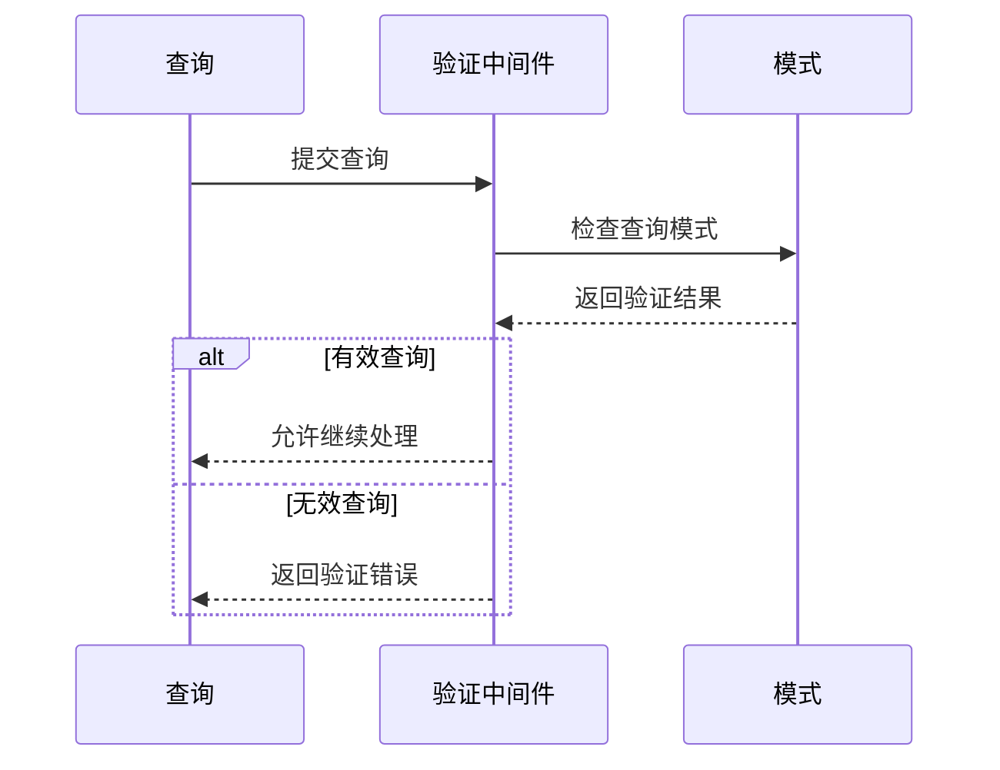
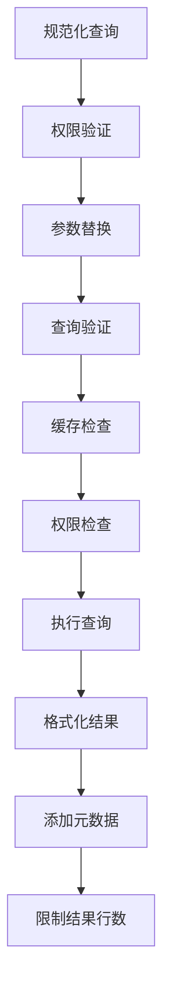

# 中间件系统

<cite>
**本文档中引用的文件**  
- [permissions.clj](file://src/metabase/query_processor/middleware/permissions.clj)
- [cache.clj](file://src/metabase/query_processor/middleware/cache.clj)
- [parameters.clj](file://src/metabase/query_processor/middleware/parameters.clj)
- [validate.clj](file://src/metabase/query_processor/middleware/validate.clj)
- [preprocess.clj](file://src/metabase/query_processor/preprocess.clj)
- [postprocess.clj](file://src/metabase/query_processor/postprocess.clj)
- [execute.clj](file://src/metabase/query_processor/execute.clj)
- [pipeline.clj](file://src/metabase/query_processor/pipeline.clj)
</cite>

## 目录
1. [引言](#引言)
2. [项目结构](#项目结构)
3. [核心组件](#核心组件)
4. [架构概述](#架构概述)
5. [详细组件分析](#详细组件分析)
6. [依赖分析](#依赖分析)
7. [性能考虑](#性能考虑)
8. [故障排除指南](#故障排除指南)
9. [结论](#结论)

## 引言
本文档全面介绍了Metabase查询处理器中间件系统的设计模式和实现机制。文档详细解释了如何通过高阶函数构建可组合的处理管道，深入分析了核心中间件的功能，包括权限验证、缓存策略、参数替换和查询验证等。同时，文档还探讨了中间件的执行顺序依赖关系，并提供了创建自定义中间件的开发指南。

## 项目结构
Metabase查询处理器中间件系统位于`src/metabase/query_processor/middleware`目录下，包含多个专门处理不同功能的中间件文件。这些中间件通过高阶函数的方式组合在一起，形成一个完整的查询处理管道。

**图表来源**  
- [preprocess.clj](file://src/metabase/query_processor/preprocess.clj#L20-L40)
- [execute.clj](file://src/metabase/query_processor/execute.clj#L50-L70)
- [postprocess.clj](file://src/metabase/query_processor/postprocess.clj#L15-L35)

**章节来源**
- [preprocess.clj](file://src/metabase/query_processor/preprocess.clj#L1-L159)
- [execute.clj](file://src/metabase/query_processor/execute.clj#L1-L100)
- [postprocess.clj](file://src/metabase/query_processor/postprocess.clj#L1-L66)

## 核心组件
Metabase查询处理器中间件系统的核心组件包括预处理、执行和后处理三个阶段的中间件。这些组件通过高阶函数的方式组合在一起，形成一个完整的查询处理管道。

**章节来源**
- [preprocess.clj](file://src/metabase/query_processor/preprocess.clj#L20-L40)
- [execute.clj](file://src/metabase/query_processor/execute.clj#L50-L70)
- [postprocess.clj](file://src/metabase/query_processor/postprocess.clj#L15-L35)

## 架构概述
Metabase查询处理器中间件系统采用分层架构，将查询处理过程分为预处理、执行和后处理三个阶段。每个阶段都包含多个中间件，这些中间件通过高阶函数的方式组合在一起。

**图表来源**  
- [preprocess.clj](file://src/metabase/query_processor/preprocess.clj#L20-L40)
- [execute.clj](file://src/metabase/query_processor/execute.clj#L50-L70)
- [postprocess.clj](file://src/metabase/query_processor/postprocess.clj#L15-L35)

## 详细组件分析

### 权限中间件分析
权限中间件负责验证用户是否有权限执行特定查询。它通过检查用户权限集和查询所需的权限来决定是否允许查询执行。

**图表来源**  
- [permissions.clj](file://src/metabase/query_processor/middleware/permissions.clj#L45-L99)

### 缓存中间件分析
缓存中间件负责检查查询结果是否已缓存，如果已缓存则直接返回缓存结果，否则执行查询并将结果缓存。

**图表来源**  
- [cache.clj](file://src/metabase/query_processor/middleware/cache.clj#L229-L245)

### 参数中间件分析
参数中间件负责处理查询中的参数替换，将参数占位符替换为实际值。

**图表来源**  
- [parameters.clj](file://src/metabase/query_processor/middleware/parameters.clj#L1-L147)

### 验证中间件分析
验证中间件负责验证查询的合法性，确保查询符合预定义的模式。

**图表来源**  
- [validate.clj](file://src/metabase/query_processor/middleware/validate.clj#L1-L20)

**章节来源**
- [permissions.clj](file://src/metabase/query_processor/middleware/permissions.clj#L1-L202)
- [cache.clj](file://src/metabase/query_processor/middleware/cache.clj#L1-L247)
- [parameters.clj](file://src/metabase/query_processor/middleware/parameters.clj#L1-L148)
- [validate.clj](file://src/metabase/query_processor/middleware/validate.clj#L1-L20)

## 依赖分析
Metabase查询处理器中间件系统中的各个组件之间存在明确的依赖关系。预处理中间件依赖于查询规范化和权限验证，执行中间件依赖于缓存检查和权限检查，后处理中间件依赖于结果格式化和元数据添加。

**图表来源**  
- [preprocess.clj](file://src/metabase/query_processor/preprocess.clj#L20-L40)
- [execute.clj](file://src/metabase/query_processor/execute.clj#L50-L70)
- [postprocess.clj](file://src/metabase/query_processor/postprocess.clj#L15-L35)

**章节来源**
- [preprocess.clj](file://src/metabase/query_processor/preprocess.clj#L1-L159)
- [execute.clj](file://src/metabase/query_processor/execute.clj#L1-L100)
- [postprocess.clj](file://src/metabase/query_processor/postprocess.clj#L1-L66)

## 性能考虑
在设计和实现中间件系统时，需要考虑性能因素。缓存中间件可以显著提高查询性能，但需要权衡缓存大小和更新频率。权限验证和查询验证等中间件虽然增加了处理开销，但确保了系统的安全性和稳定性。

## 故障排除指南
当遇到中间件相关问题时，可以检查以下方面：
- 确认中间件的执行顺序是否正确
- 检查权限验证是否正常工作
- 验证缓存策略是否按预期工作
- 确认参数替换是否正确执行

**章节来源**
- [permissions.clj](file://src/metabase/query_processor/middleware/permissions.clj#L45-L99)
- [cache.clj](file://src/metabase/query_processor/middleware/cache.clj#L229-L245)
- [parameters.clj](file://src/metabase/query_processor/middleware/parameters.clj#L1-L147)
- [validate.clj](file://src/metabase/query_processor/middleware/validate.clj#L1-L20)

## 结论
Metabase查询处理器中间件系统通过高阶函数的方式构建了一个可组合的处理管道。系统中的各个中间件各司其职，共同完成查询处理任务。权限验证、缓存、参数替换和查询验证等核心中间件的设计和实现体现了系统的灵活性和可扩展性。通过正确配置和使用这些中间件，可以构建高效、安全的查询处理系统。