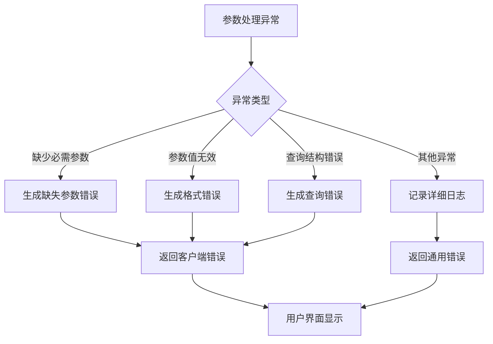

# 参数处理中间件技术文档

<cite>
**本文档中引用的文件**
- [parameters.clj](file://src/metabase/query_processor/middleware/parameters.clj)
- [native.clj](file://src/metabase/query_processor/middleware/parameters/native.clj)
- [mbql.clj](file://src/metabase/query_processor/middleware/parameters/mbql.clj)
- [params.clj](file://src/metabase/parameters/params.clj)
- [values.clj](file://src/metabase/driver/common/parameters/values.clj)
- [error_type.clj](file://src/metabase/query_processor/error_type.clj)
- [store.clj](file://src/metabase/query_processor/store.clj)
- [cache.clj](file://src/metabase/query_processor/middleware/cache.clj)
</cite>

## 目录
1. [简介](#简介)
2. [系统架构概览](#系统架构概览)
3. [核心组件分析](#核心组件分析)
4. [参数解析机制](#参数解析机制)
5. [类型检查与安全验证](#类型检查与安全验证)
6. [MBQL查询参数处理](#mbql查询参数处理)
7. [原生查询参数处理](#原生查询参数处理)
8. [参数替换算法](#参数替换算法)
9. [错误处理与异常管理](#错误处理与异常管理)
10. [性能优化策略](#性能优化策略)
11. [安全最佳实践](#安全最佳实践)
12. [故障排除指南](#故障排除指南)
13. [总结](#总结)

## 简介

Metabase的参数处理中间件是一个复杂而精密的系统，负责在MBQL（Metabase Query Language）和原生SQL查询中实现参数的解析、验证、类型转换和安全替换。该中间件确保用户提供的参数能够正确地注入到查询中，同时防止SQL注入攻击和其他安全威胁。

参数处理中间件的核心职责包括：
- 解析查询中的参数占位符（如`{{param}}`）
- 验证参数值的类型和格式
- 执行类型转换以适应不同的数据库要求
- 安全地将参数值插入到生成的查询中
- 处理可选参数和默认值逻辑
- 提供详细的错误报告和调试信息

## 系统架构概览

参数处理中间件采用分层架构设计，支持多种查询语言和数据库驱动程序。

**图表来源**
- [parameters.clj](file://src/metabase/query_processor/middleware/parameters.clj#L1-L148)
- [native.clj](file://src/metabase/query_processor/middleware/parameters/native.clj#L1-L67)

## 核心组件分析

### 参数中间件主控制器

参数中间件的主控制器负责协调整个参数处理流程，它根据查询类型选择合适的处理器。

**图表来源**
- [parameters.clj](file://src/metabase/query_processor/middleware/parameters.clj#L20-L40)
- [mbql.clj](file://src/metabase/query_processor/middleware/parameters/mbql.clj#L1-L50)

**章节来源**
- [parameters.clj](file://src/metabase/query_processor/middleware/parameters.clj#L1-L148)

### 参数值解析器

参数值解析器负责将用户输入转换为适当的内部表示形式，支持多种数据类型和特殊格式。

**图表来源**
- [values.clj](file://src/metabase/driver/common/parameters/values.clj#L408-L441)

**章节来源**
- [values.clj](file://src/metabase/driver/common/parameters/values.clj#L1-L491)

## 参数解析机制

### 参数占位符识别

参数处理中间件支持两种主要的参数占位符格式：

1. **必需参数**：`{{parameter_name}}`
2. **可选参数**：`[[AND {{parameter_name}}]]`

### 参数提取算法

**图表来源**
- [values.clj](file://src/metabase/driver/common/parameters/values.clj#L150-L200)

**章节来源**
- [values.clj](file://src/metabase/driver/common/parameters/values.clj#L150-L300)

## 类型检查与安全验证

### 类型验证体系

参数处理中间件实现了严格的类型验证体系，确保参数值符合预期的数据类型。

| 参数类型 | 验证规则 | 转换逻辑 | 安全措施 |
|---------|---------|---------|---------|
| 字符串 | 非空且不超过最大长度 | 自动转义特殊字符 | XSS防护 |
| 数字 | 在指定范围内 | 类型转换和精度检查 | SQL注入防护 |
| 日期 | 有效日期格式 | ISO 8601格式化 | 时间戳验证 |
| 布尔值 | true/false或1/0 | 标准化表示 | 类型强制转换 |
| 字段过滤器 | 字段存在且类型匹配 | 元数据验证 | 权限检查 |

### 安全验证流程

**图表来源**
- [error_type.clj](file://src/metabase/query_processor/error_type.clj#L40-L70)

**章节来源**
- [error_type.clj](file://src/metabase/query_processor/error_type.clj#L1-L100)

## MBQL查询参数处理

### MBQL参数展开机制

MBQL参数处理涉及将参数值转换为相应的MBQL过滤器子句。

**图表来源**
- [mbql.clj](file://src/metabase/query_processor/middleware/parameters/mbql.clj#L60-L120)

### MBQL参数类型处理

不同类型的MBQL参数需要特殊的处理逻辑：

1. **操作符参数**：转换为MBQL操作符表达式
2. **日期参数**：解析日期范围并生成时间过滤器
3. **字段参数**：验证字段存在性和类型兼容性
4. **临时单位参数**：更新时间聚合级别

**章节来源**
- [mbql.clj](file://src/metabase/query_processor/middleware/parameters/mbql.clj#L1-L183)

## 原生查询参数处理

### 原生参数替换算法

原生查询参数处理使用驱动程序特定的替换逻辑，支持复杂的SQL语法结构。

**图表来源**
- [native.clj](file://src/metabase/query_processor/middleware/parameters/native.clj#L30-L67)

### 可选参数处理

原生查询支持可选参数语法，当参数未提供时自动移除整个条件块。

**章节来源**
- [native.clj](file://src/metabase/query_processor/middleware/parameters/native.clj#L1-L67)

## 参数替换算法

### 参数替换策略

参数替换算法采用递归遍历的方式，在查询的不同层级执行参数替换。

**图表来源**
- [parameters.clj](file://src/metabase/query_processor/middleware/parameters.clj#L40-L80)

**章节来源**
- [parameters.clj](file://src/metabase/query_processor/middleware/parameters.clj#L40-L148)

## 错误处理与异常管理

### 错误类型分类

参数处理中间件定义了详细的错误类型层次结构，便于精确的错误处理和用户反馈。

| 错误类型 | 描述 | 处理策略 | 用户可见性 |
|---------|------|---------|-----------|
| `missing-required-parameter` | 缺少必需参数 | 抛出异常，显示具体参数名 | 是 |
| `invalid-parameter` | 参数值无效 | 记录日志，返回默认值或抛出异常 | 是 |
| `invalid-query` | 查询结构错误 | 拒绝执行，提供修复建议 | 是 |
| `unsupported-feature` | 不支持的功能 | 降级处理或提示用户 | 否 |

### 异常处理流程

**图表来源**
- [error_type.clj](file://src/metabase/query_processor/error_type.clj#L50-L80)

**章节来源**
- [error_type.clj](file://src/metabase/query_processor/error_type.clj#L1-L100)

## 性能优化策略

### 缓存机制

参数处理中间件集成了多层缓存机制，显著提升重复查询的性能。

**图表来源**
- [cache.clj](file://src/metabase/query_processor/middleware/cache.clj#L26-L124)

### 性能监控指标

关键性能指标包括：
- 参数解析时间
- 类型转换耗时
- SQL生成延迟
- 缓存命中率
- 内存使用量

**章节来源**
- [cache.clj](file://src/metabase/query_processor/middleware/cache.clj#L1-L234)

## 安全最佳实践

### 输入验证原则

1. **白名单验证**：只接受已知安全的参数类型和值
2. **最小权限原则**：参数只能访问必要的数据库资源
3. **输入规范化**：统一参数值的格式和编码
4. **输出转义**：防止XSS和其他注入攻击

### 安全检查清单

- [ ] 参数名称必须符合命名规范
- [ ] 参数值必须通过类型验证
- [ ] 特殊字符必须正确转义
- [ ] SQL关键字不能被绕过
- [ ] 数据库权限得到适当限制

### 安全配置建议

## 故障排除指南

### 常见问题诊断

#### 参数绑定错误

**症状**：查询执行时出现参数相关错误
**原因**：参数类型不匹配或值超出范围
**解决方案**：
1. 检查参数定义的类型声明
2. 验证参数值是否符合约束条件
3. 查看详细的错误日志

#### 类型不匹配

**症状**：参数值无法正确转换为目标类型
**原因**：输入格式不符合预期
**解决方案**：
1. 使用正确的数据格式
2. 检查参数的默认值设置
3. 验证字段的元数据定义

#### 性能问题

**症状**：参数处理导致查询响应缓慢
**原因**：缺乏缓存或参数解析复杂度高
**解决方案**：
1. 启用参数值缓存
2. 简化复杂的参数逻辑
3. 优化数据库索引

### 调试工具和技术

1. **参数跟踪**：启用详细的参数处理日志
2. **查询计划分析**：检查生成的SQL语句
3. **性能剖析**：识别瓶颈环节
4. **单元测试**：验证参数处理逻辑

**章节来源**
- [params.clj](file://src/metabase/parameters/params.clj#L30-L52)

## 总结

Metabase的参数处理中间件是一个功能强大且设计精良的系统，它成功地解决了复杂查询中参数处理的各种挑战。通过分层架构、严格的安全验证、灵活的类型系统和高效的缓存机制，该中间件为用户提供了一个既安全又高性能的参数化查询体验。

### 主要优势

1. **安全性**：多层次的安全检查和防护机制
2. **灵活性**：支持多种查询语言和参数类型
3. **性能**：智能缓存和优化策略
4. **可维护性**：清晰的模块化设计和详细的错误处理

### 发展方向

随着数据分析需求的不断演进，参数处理中间件将继续发展，重点关注：
- 更智能的参数推荐和自动补全
- 更强大的类型推断和验证
- 更高效的缓存策略
- 更完善的性能监控和优化

这个中间件不仅展示了现代数据平台在参数处理方面的最佳实践，也为其他类似系统提供了宝贵的参考和借鉴价值。