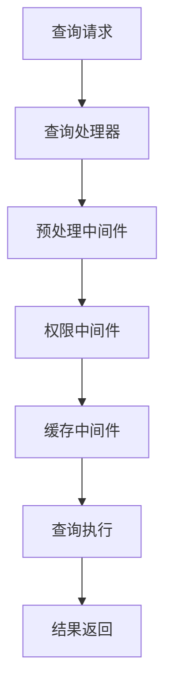
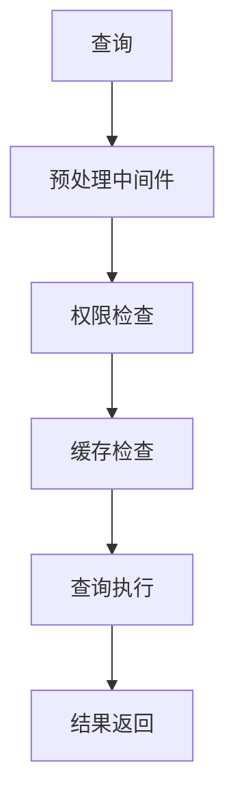
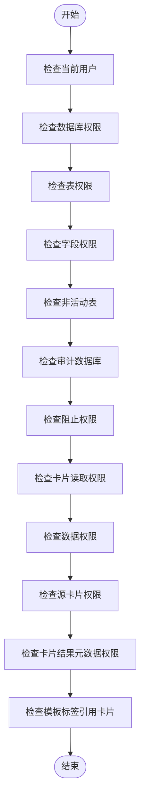
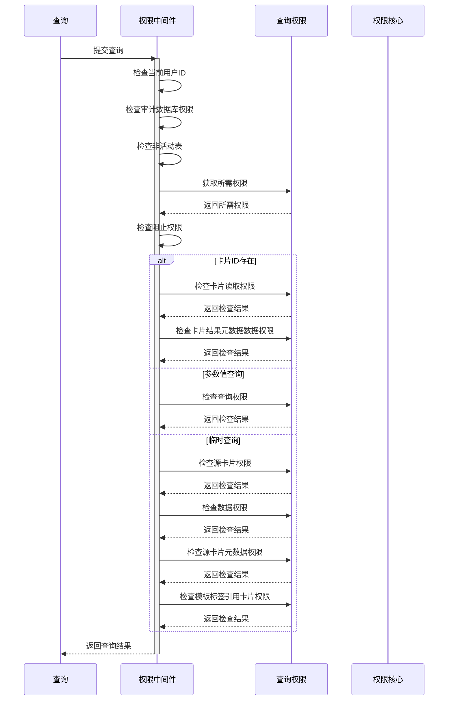
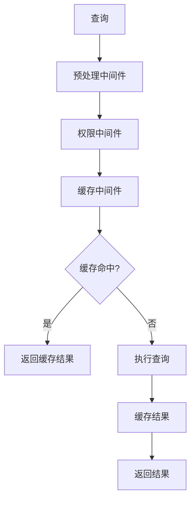
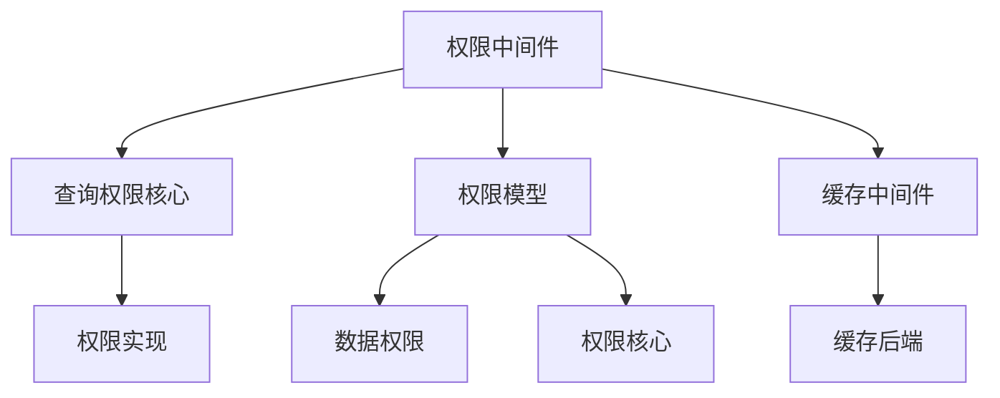

# 权限中间件

<cite>
**本文档中引用的文件**  
- [permissions.clj](file://src/metabase/query_processor/middleware/permissions.clj)
- [preprocess.clj](file://src/metabase/query_processor/preprocess.clj)
- [execute.clj](file://src/metabase/query_processor/execute.clj)
- [cache.clj](file://src/metabase/query_processor/middleware/cache.clj)
- [core.clj](file://src/metabase/query_permissions/core.clj)
- [impl.clj](file://src/metabase/query_permissions/impl.clj)
- [data_permissions.clj](file://src/metabase/permissions/models/data_permissions.clj)
- [permissions.clj](file://src/metabase/permissions/models/permissions.clj)
- [settings.clj](file://src/metabase/permissions/settings.clj)
</cite>

## 目录
1. [介绍](#介绍)
2. [项目结构](#项目结构)
3. [核心组件](#核心组件)
4. [架构概述](#架构概述)
5. [详细组件分析](#详细组件分析)
6. [依赖分析](#依赖分析)
7. [性能考虑](#性能考虑)
8. [故障排除指南](#故障排除指南)
9. [结论](#结论)

## 介绍
本文档详细介绍了Metabase中的权限中间件，重点说明其在查询处理管道中的作用和实现机制。文档详细解释了权限验证的执行流程，包括如何检查用户对数据库、表和字段的访问权限，以及如何处理权限不足的情况。结合代码示例展示了权限中间件如何与其他中间件（如缓存中间件）协同工作，确保权限检查在缓存验证之前执行。文档还包含了权限中间件的配置选项、性能考虑以及常见问题的排查方法。

## 项目结构
权限中间件主要位于`src/metabase/query_processor/middleware`目录下，是查询处理器管道的重要组成部分。该中间件与其他查询处理中间件协同工作，确保在执行查询之前进行适当的权限检查。

**Diagram sources**
- [permissions.clj](file://src/metabase/query_processor/middleware/permissions.clj)
- [preprocess.clj](file://src/metabase/query_processor/preprocess.clj)
- [execute.clj](file://src/metabase/query_processor/execute.clj)

**Section sources**
- [permissions.clj](file://src/metabase/query_processor/middleware/permissions.clj)
- [preprocess.clj](file://src/metabase/query_processor/preprocess.clj)

## 核心组件
权限中间件的核心功能是确保当前用户具有执行查询的必要权限。它通过检查用户对数据库、表和字段的访问权限来实现这一目标。中间件在查询处理管道中扮演着关键角色，确保只有经过授权的用户才能访问敏感数据。

**Section sources**
- [permissions.clj](file://src/metabase/query_processor/middleware/permissions.clj)
- [core.clj](file://src/metabase/query_permissions/core.clj)

## 架构概述
权限中间件是Metabase查询处理器管道的一部分，位于预处理和执行阶段之间。它与其他中间件协同工作，确保在查询执行前进行必要的权限检查。

**Diagram sources**
- [permissions.clj](file://src/metabase/query_processor/middleware/permissions.clj)
- [execute.clj](file://src/metabase/query_processor/execute.clj)

## 详细组件分析

### 权限中间件分析
权限中间件负责检查当前用户是否有权限运行当前查询。它通过一系列检查来确保数据安全，包括检查用户对数据库、表和字段的访问权限。

#### 权限检查流程

**Diagram sources**
- [permissions.clj](file://src/metabase/query_processor/middleware/permissions.clj)
- [impl.clj](file://src/metabase/query_permissions/impl.clj)

**Section sources**
- [permissions.clj](file://src/metabase/query_processor/middleware/permissions.clj)
- [impl.clj](file://src/metabase/query_permissions/impl.clj)

### 权限验证执行流程
权限中间件通过`check-query-permissions*`函数实现权限验证。该函数检查用户是否有权限运行查询，如果用户没有权限，则抛出异常。

**Diagram sources**
- [permissions.clj](file://src/metabase/query_processor/middleware/permissions.clj)
- [core.clj](file://src/metabase/query_permissions/core.clj)

**Section sources**
- [permissions.clj](file://src/metabase/query_processor/middleware/permissions.clj)
- [core.clj](file://src/metabase/query_permissions/core.clj)

### 与其他中间件的协同工作
权限中间件需要与缓存中间件等其他中间件协同工作，确保权限检查在缓存验证之前执行。

**Diagram sources**
- [permissions.clj](file://src/metabase/query_processor/middleware/permissions.clj)
- [cache.clj](file://src/metabase/query_processor/middleware/cache.clj)

**Section sources**
- [permissions.clj](file://src/metabase/query_processor/middleware/permissions.clj)
- [cache.clj](file://src/metabase/query_processor/middleware/cache.clj)

## 依赖分析
权限中间件依赖于多个其他组件和模块，包括查询权限核心、权限模型和缓存中间件。

**Diagram sources**
- [permissions.clj](file://src/metabase/query_processor/middleware/permissions.clj)
- [core.clj](file://src/metabase/query_permissions/core.clj)
- [data_permissions.clj](file://src/metabase/permissions/models/data_permissions.clj)
- [permissions.clj](file://src/metabase/permissions/models/permissions.clj)
- [cache.clj](file://src/metabase/query_processor/middleware/cache.clj)

**Section sources**
- [permissions.clj](file://src/metabase/query_processor/middleware/permissions.clj)
- [core.clj](file://src/metabase/query_permissions/core.clj)
- [data_permissions.clj](file://src/metabase/permissions/models/data_permissions.clj)

## 性能考虑
权限中间件在查询处理管道中引入了额外的检查，可能会影响查询性能。为了优化性能，系统采用了权限缓存机制，避免重复查询数据库。

**Section sources**
- [data_permissions.clj](file://src/metabase/permissions/models/data_permissions.clj)
- [permissions.clj](file://src/metabase/permissions/models/permissions.clj)

## 故障排除指南
当遇到权限相关问题时，可以检查以下方面：

1. 确认用户是否具有必要的权限
2. 检查权限缓存是否正常工作
3. 验证查询是否涉及非活动表
4. 确认是否尝试访问审计数据库

**Section sources**
- [permissions.clj](file://src/metabase/query_processor/middleware/permissions.clj)
- [impl.clj](file://src/metabase/query_permissions/impl.clj)

## 结论
权限中间件是Metabase查询处理器管道中的关键组件，负责确保数据安全和访问控制。通过与其他中间件的协同工作，它在查询执行前进行必要的权限检查，防止未经授权的访问。了解其工作原理和配置选项对于维护系统的安全性和性能至关重要。