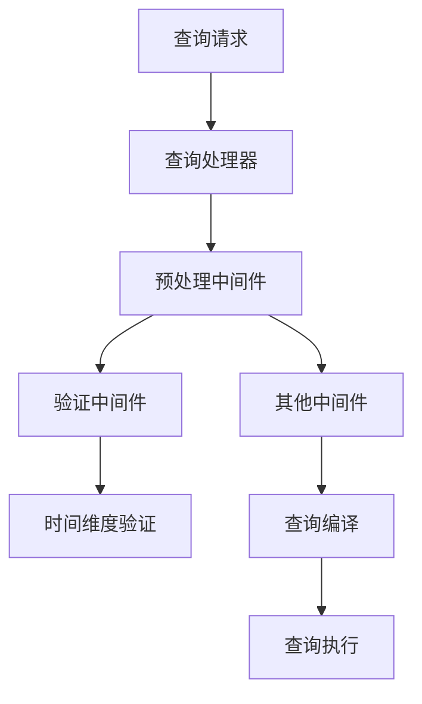
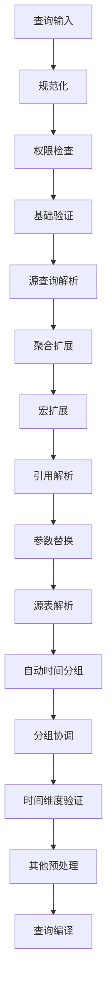
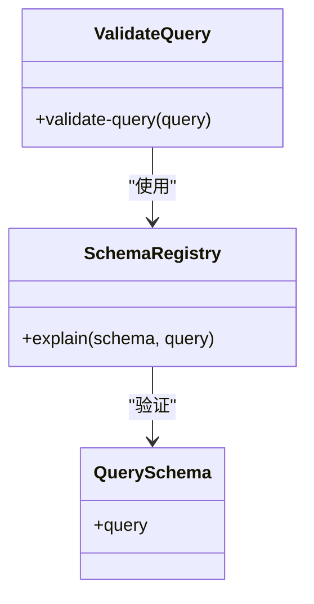
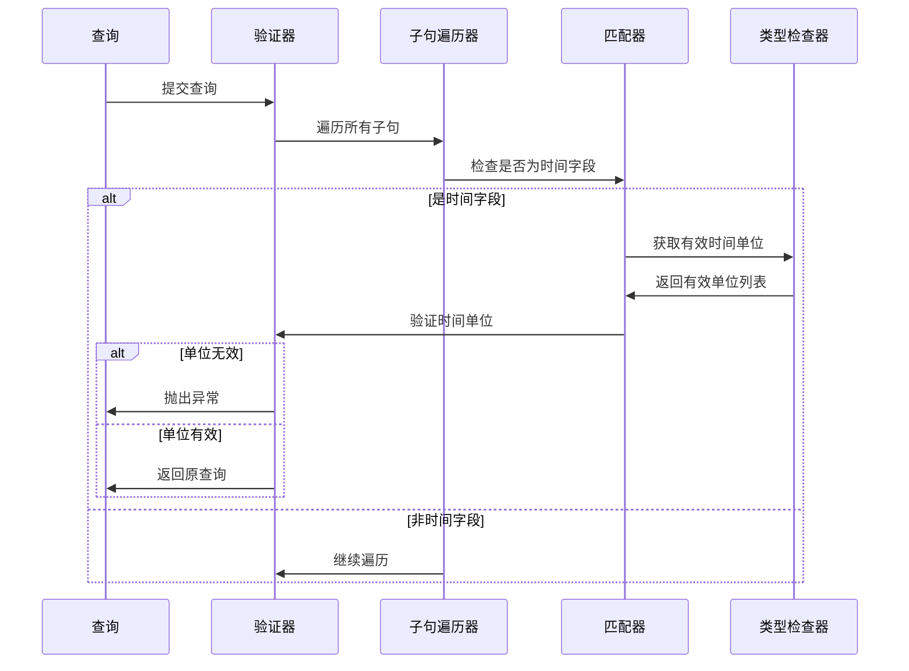
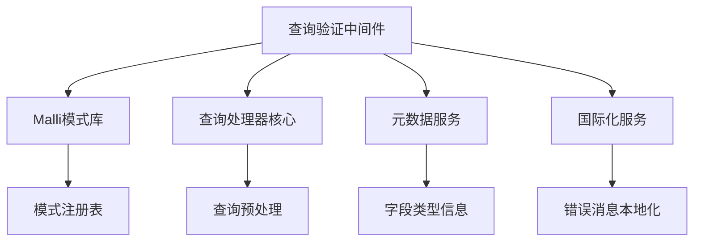

# 查询验证中间件

<cite>
**本文档中引用的文件**  
- [validate.clj](file://src/metabase/query_processor/middleware/validate.clj)
- [validate_temporal_bucketing.clj](file://src/metabase/query_processor/middleware/validate_temporal_bucketing.clj)
- [preprocess.clj](file://src/metabase/query_processor/preprocess.clj)
- [common.cljc](file://src/metabase/lib/schema/common.cljc)
- [query_processor.clj](file://src/metabase/query_processor.clj)
</cite>

## 目录
1. [简介](#简介)
2. [项目结构](#项目结构)
3. [核心组件](#核心组件)
4. [架构概述](#架构概述)
5. [详细组件分析](#详细组件分析)
6. [依赖分析](#依赖分析)
7. [性能考虑](#性能考虑)
8. [故障排除指南](#故障排除指南)
9. [结论](#结论)

## 简介
本文档全面介绍了Metabase中的查询验证中间件，重点阐述其查询验证规则和执行流程。文档详细说明了如何验证查询的结构完整性、时间维度分组的正确性以及各种约束条件的满足情况。同时，解释了验证中间件在查询处理管道中的位置及其与其他中间件的依赖关系。通过实际代码示例展示常见的验证错误及其解决方案，并提供性能优化建议，如减少不必要的验证开销。

## 项目结构
查询验证中间件主要位于`src/metabase/query_processor/middleware/`目录下，是Metabase查询处理器的重要组成部分。该中间件在查询预处理阶段执行，确保查询在进入执行阶段前符合所有结构和语义规则。

**Diagram sources**
- [preprocess.clj](file://src/metabase/query_processor/preprocess.clj#L37-L69)
- [validate.clj](file://src/metabase/query_processor/middleware/validate.clj#L1-L18)

**Section sources**
- [preprocess.clj](file://src/metabase/query_processor/preprocess.clj#L1-L158)
- [query_processor.clj](file://src/metabase/query_processor.clj#L24-L52)

## 核心组件
查询验证中间件由两个主要组件构成：基础查询验证和时间维度分组验证。基础验证确保查询的整体结构符合MBQL（Metabase Query Language）规范，而时间维度验证则专门检查时间字段的分组操作是否合理。

**Section sources**
- [validate.clj](file://src/metabase/query_processor/middleware/validate.clj#L1-L18)
- [validate_temporal_bucketing.clj](file://src/metabase/query_processor/middleware/validate_temporal_bucketing.clj#L1-L33)

## 架构概述
查询验证中间件是Metabase查询处理管道中的关键环节，位于预处理阶段的早期位置。它与其他中间件协同工作，共同确保查询的正确性和安全性。

**Diagram sources**
- [preprocess.clj](file://src/metabase/query_processor/preprocess.clj#L37-L92)
- [validate_temporal_bucketing.clj](file://src/metabase/query_processor/middleware/validate_temporal_bucketing.clj#L1-L33)

## 详细组件分析

### 基础查询验证分析
基础查询验证中间件负责检查查询的整体结构完整性，确保其符合预定义的模式规范。

**Diagram sources**
- [validate.clj](file://src/metabase/query_processor/middleware/validate.clj#L1-L18)
- [common.cljc](file://src/metabase/lib/schema/common.cljc#L1-L199)

#### 时间维度分组验证
时间维度分组验证中间件专门检查时间字段的分组操作是否合理，防止不兼容的时间单位与字段类型组合。

**Diagram sources**
- [validate_temporal_bucketing.clj](file://src/metabase/query_processor/middleware/validate_temporal_bucketing.clj#L1-L33)
- [common.cljc](file://src/metabase/lib/schema/common.cljc#L1-L199)

**Section sources**
- [validate_temporal_bucketing.clj](file://src/metabase/query_processor/middleware/validate_temporal_bucketing.clj#L1-L33)
- [preprocess.clj](file://src/metabase/query_processor/preprocess.clj#L1-L158)

## 依赖分析
查询验证中间件依赖于多个核心组件和库，包括Malli模式验证库、查询处理器核心模块和元数据服务。

**Diagram sources**
- [validate.clj](file://src/metabase/query_processor/middleware/validate.clj#L1-L18)
- [validate_temporal_bucketing.clj](file://src/metabase/query_processor/middleware/validate_temporal_bucketing.clj#L1-L33)

**Section sources**
- [validate.clj](file://src/metabase/query_processor/middleware/validate.clj#L1-L18)
- [validate_temporal_bucketing.clj](file://src/metabase/query_processor/middleware/validate_temporal_bucketing.clj#L1-L33)

## 性能考虑
虽然查询验证是必要的安全措施，但过度的验证可能影响系统性能。建议在生产环境中监控验证中间件的执行时间，并根据需要调整验证级别。

- 验证中间件的执行时间应保持在合理范围内
- 在开发环境中可以启用更严格的验证
- 生产环境中应避免重复验证相同查询
- 考虑缓存已验证查询的结果

## 故障排除指南
当遇到查询验证错误时，可以按照以下步骤进行排查：

1. 检查错误消息中的具体验证失败原因
2. 确认查询结构是否符合MBQL规范
3. 验证时间字段的分组单位是否与字段类型兼容
4. 检查是否有缺失的必要字段或参数
5. 确认权限设置是否正确

**Section sources**
- [validate.clj](file://src/metabase/query_processor/middleware/validate.clj#L1-L18)
- [validate_temporal_bucketing.clj](file://src/metabase/query_processor/middleware/validate_temporal_bucketing.clj#L1-L33)

## 结论
查询验证中间件是Metabase查询处理管道中不可或缺的组成部分，它通过多层次的验证确保查询的正确性和安全性。通过理解其工作原理和配置选项，可以更好地利用这一功能，同时避免常见的验证错误。