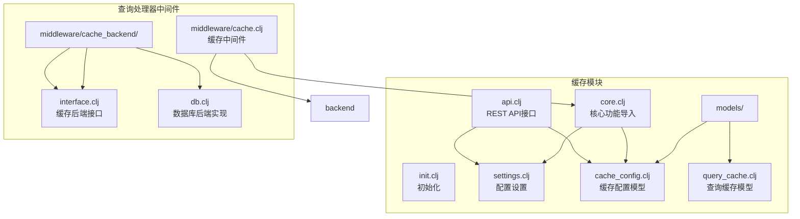
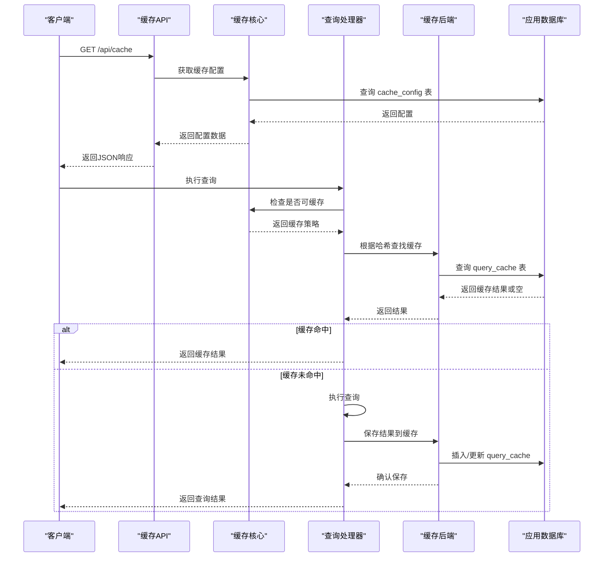
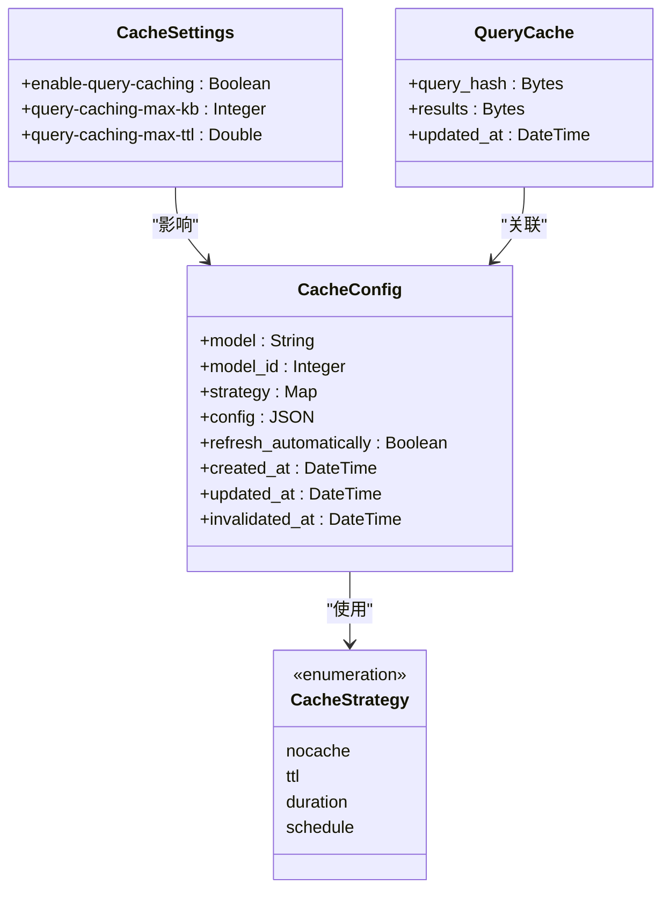
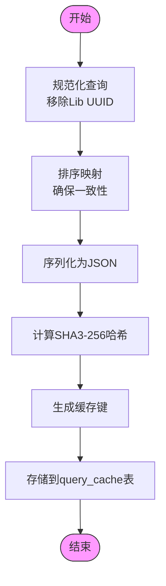
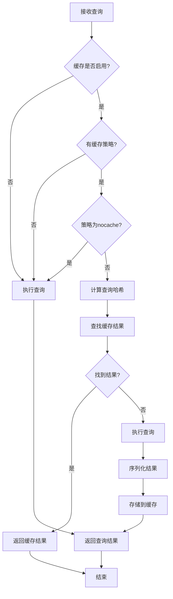
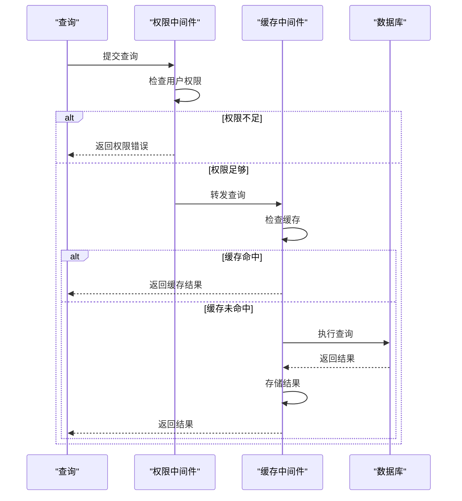
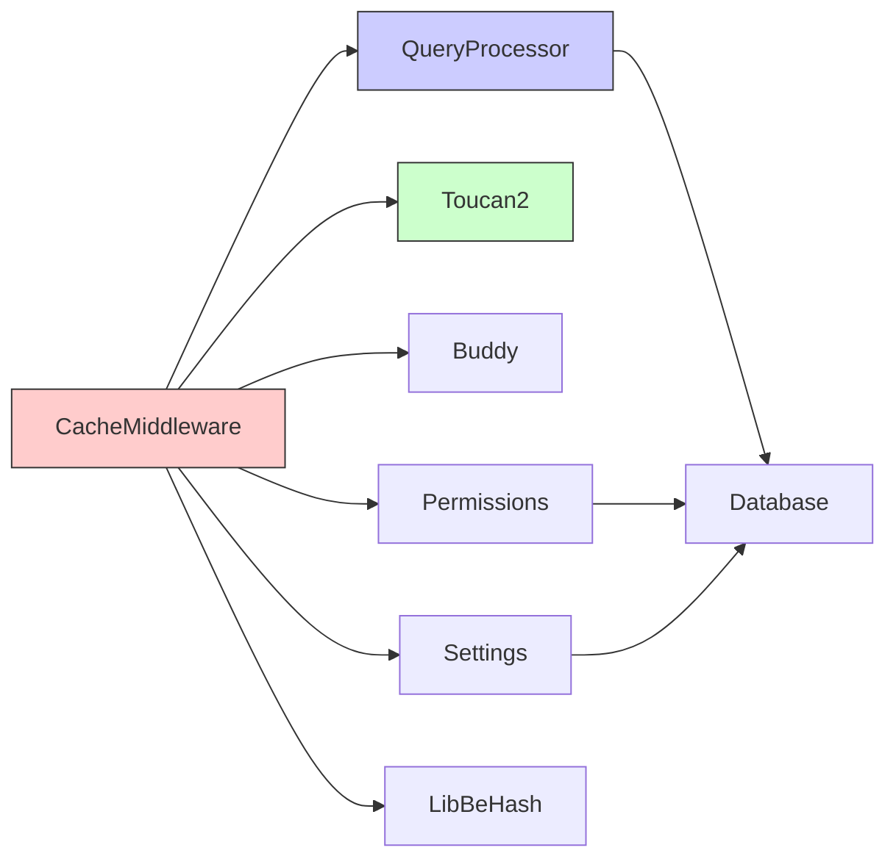

# 缓存中间件

<cite>
**本文档中引用的文件**  
- [core.clj](file://src/metabase/cache/core.clj)
- [api.clj](file://src/metabase/cache/api.clj)
- [init.clj](file://src/metabase/cache/init.clj)
- [settings.clj](file://src/metabase/cache/settings.clj)
- [cache_config.clj](file://src/metabase/cache/models/cache_config.clj)
- [query_cache.clj](file://src/metabase/cache/models/query_cache.clj)
- [cache.clj](file://src/metabase/query_processor/middleware/cache.clj)
- [db.clj](file://src/metabase/query_processor/middleware/cache_backend/db.clj)
- [interface.clj](file://src/metabase/query_processor/middleware/cache_backend/interface.clj)
- [permissions.clj](file://src/metabase/query_processor/middleware/permissions.clj)
- [hash.clj](file://src/metabase/lib_be/hash.clj)
</cite>

## 目录
1. [简介](#简介)
2. [项目结构](#项目结构)
3. [核心组件](#核心组件)
4. [架构概述](#架构概述)
5. [详细组件分析](#详细组件分析)
6. [依赖分析](#依赖分析)
7. [性能考虑](#性能考虑)
8. [故障排除指南](#故障排除指南)
9. [结论](#结论)

## 简介
缓存中间件是Metabase系统中的关键组件，负责优化查询性能并减少数据库负载。该中间件通过存储和重用先前执行的查询结果来实现性能提升。它支持多种缓存策略，允许对不同级别的数据模型（如根级别、数据库、仪表板和问题）进行细粒度控制。缓存中间件与权限系统紧密集成，确保在提供性能优势的同时维护数据安全。该系统还提供了灵活的配置选项，包括缓存大小限制、过期策略和存储后端选择，使其能够适应各种部署场景和性能需求。

## 项目结构
缓存中间件的代码组织遵循Metabase项目的模块化结构，主要位于`src/metabase/cache/`目录下。该结构将缓存功能划分为核心逻辑、API接口、模型定义和配置设置等独立但相互关联的组件。这种分层设计促进了代码的可维护性和可扩展性，同时允许在不同层次上进行独立开发和测试。

**Diagram sources**
- [core.clj](file://src/metabase/cache/core.clj)
- [api.clj](file://src/metabase/cache/api.clj)
- [settings.clj](file://src/metabase/cache/settings.clj)
- [cache_config.clj](file://src/metabase/cache/models/cache_config.clj)
- [query_cache.clj](file://src/metabase/cache/models/query_cache.clj)
- [cache.clj](file://src/metabase/query_processor/middleware/cache.clj)
- [db.clj](file://src/metabase/query_processor/middleware/cache_backend/db.clj)
- [interface.clj](file://src/metabase/query_processor/middleware/cache_backend/interface.clj)

**Section sources**
- [src/metabase/cache/](file://src/metabase/cache/)
- [src/metabase/query_processor/middleware/cache.clj](file://src/metabase/query_processor/middleware/cache.clj)

## 核心组件
缓存中间件的核心组件包括缓存策略管理、配置模型、存储后端和API接口。这些组件协同工作，提供一个完整的缓存解决方案。核心功能通过`core.clj`文件暴露，该文件导入并重新导出其他模块的关键函数，如`enable-query-caching`、`query-caching-max-kb`和`invalidate!`。缓存配置由`cache_config.clj`中的模型管理，该模型定义了不同数据实体（根、数据库、仪表板、问题）的缓存策略。`settings.clj`文件定义了全局缓存设置，包括是否启用查询缓存、最大缓存大小和最大TTL（生存时间）。查询处理器中的`cache.clj`中间件是缓存逻辑的执行点，它在查询处理管道中检查缓存可用性，并决定是返回缓存结果还是执行新查询。

**Section sources**
- [core.clj](file://src/metabase/cache/core.clj)
- [settings.clj](file://src/metabase/cache/settings.clj)
- [cache_config.clj](file://src/metabase/cache/models/cache_config.clj)
- [cache.clj](file://src/metabase/query_processor/middleware/cache.clj)

## 架构概述
缓存中间件的架构设计为一个分层系统，从API接口到存储后端，每一层都有明确的职责。API层处理来自前端的缓存配置请求，将其转换为内部数据结构并存储在数据库中。核心逻辑层根据这些配置决定查询的缓存行为。查询处理器中间件在查询执行前拦截请求，计算查询哈希，并检查缓存中是否存在有效结果。如果存在，则返回缓存结果；否则，执行查询并将结果存储在缓存中以供将来使用。存储后端通过一个可扩展的接口实现，当前默认使用应用程序数据库作为存储，但设计上支持其他后端。

**Diagram sources**
- [api.clj](file://src/metabase/cache/api.clj)
- [core.clj](file://src/metabase/cache/core.clj)
- [cache.clj](file://src/metabase/query_processor/middleware/cache.clj)
- [db.clj](file://src/metabase/query_processor/middleware/cache_backend/db.clj)
- [query_cache.clj](file://src/metabase/cache/models/query_cache.clj)
- [cache_config.clj](file://src/metabase/cache/models/cache_config.clj)

## 详细组件分析

### 缓存策略与配置分析
缓存策略是缓存中间件的核心，决定了查询结果的缓存方式和有效期。系统支持多种缓存策略，包括不缓存（nocache）、基于TTL的缓存（ttl）、基于持续时间的缓存（duration）和基于计划的缓存（schedule）。这些策略通过Malli模式在`api.clj`中定义，确保了配置数据的类型安全和有效性。根级别的缓存策略作为默认策略，可以被更具体的数据库、仪表板或问题级别的策略覆盖。这种层次化的配置系统允许管理员在全局和局部级别上精细控制缓存行为。

**Diagram sources**
- [api.clj](file://src/metabase/cache/api.clj#L41-L73)
- [cache_config.clj](file://src/metabase/cache/models/cache_config.clj)
- [query_cache.clj](file://src/metabase/cache/models/query_cache.clj)
- [settings.clj](file://src/metabase/cache/settings.clj)

**Section sources**
- [api.clj](file://src/metabase/cache/api.clj)
- [cache_config.clj](file://src/metabase/cache/models/cache_config.clj)

### 缓存键生成与存储机制
缓存键的生成是缓存系统的关键环节，确保了查询结果的唯一性和可检索性。系统使用`lib-be.hash/query-hash`函数生成查询的SHA3-256哈希值作为缓存键。该函数首先对查询进行规范化处理，去除Lib UUID等不影响查询结果的元素，然后将查询序列化为JSON字符串，最后计算其SHA3-256哈希值。这种基于内容的寻址方式确保了相同的查询总是产生相同的缓存键，无论其执行环境如何。缓存存储使用应用程序数据库中的`query_cache`表，该表以`query_hash`作为主键，存储压缩后的查询结果和更新时间戳。

**Diagram sources**
- [hash.clj](file://src/metabase/lib_be/hash.clj)
- [query_cache.clj](file://src/metabase/cache/models/query_cache.clj)
- [db.clj](file://src/metabase/query_processor/middleware/cache_backend/db.clj)

**Section sources**
- [hash.clj](file://src/metabase/lib_be/hash.clj)
- [db.clj](file://src/metabase/query_processor/middleware/cache_backend/db.clj)

### 缓存命中与未命中处理流程
缓存中间件的处理流程在查询处理器的执行管道中实现。当查询到达时，`maybe-return-cached-results`中间件首先检查查询是否可缓存：缓存功能必须启用，查询必须包含缓存策略，且策略类型不能为`nocache`。如果查询可缓存，系统会计算查询哈希并在缓存后端中查找匹配的结果。如果找到有效结果（缓存命中），则直接返回缓存数据；否则（缓存未命中），执行查询并将结果通过`save-results-xform`转换函数存储到缓存中。这个过程通过动态绑定`*in-fn*`和`*result-fn*`来实现序列化和反序列化，确保了缓存数据的正确性和完整性。

**Diagram sources**
- [cache.clj](file://src/metabase/query_processor/middleware/cache.clj#L199-L231)
- [impl.clj](file://src/metabase/query_processor/middleware/cache/impl.clj)

**Section sources**
- [cache.clj](file://src/metabase/query_processor/middleware/cache.clj)

### 与权限中间件的协作与安全性
缓存中间件与权限系统紧密协作，确保缓存机制不会绕过安全检查。在查询处理器的执行管道中，`check-query-permissions`中间件在`maybe-return-cached-results`之前执行，确保查询在访问缓存前已经通过了权限验证。这意味着缓存结果只对有权限查看原始数据的用户可用。此外，缓存键的生成考虑了查询的规范化形式，包括任何行级或列级的安全限制，确保了沙盒用户看到的缓存结果与其权限相匹配。这种设计防止了通过缓存机制进行权限提升或数据泄露。

**Diagram sources**
- [permissions.clj](file://src/metabase/query_processor/middleware/permissions.clj)
- [cache.clj](file://src/metabase/query_processor/middleware/cache.clj)

**Section sources**
- [permissions.clj](file://src/metabase/query_processor/middleware/permissions.clj)

## 依赖分析
缓存中间件依赖于多个核心系统组件，形成了一个复杂的依赖网络。它直接依赖于查询处理器（query-processor）来拦截和处理查询，依赖于Toucan2 ORM框架来访问和操作数据库中的缓存配置和结果，依赖于Buddy加密库来保护存储在缓存中的敏感数据。此外，它还依赖于权限系统来确保安全，依赖于设置系统来获取全局配置。这些依赖关系通过命名空间的`require`语句明确声明，确保了代码的模块化和可测试性。

**Diagram sources**
- [cache.clj](file://src/metabase/query_processor/middleware/cache.clj)
- [db.clj](file://src/metabase/query_processor/middleware/cache_backend/db.clj)
- [permissions.clj](file://src/metabase/query_processor/middleware/permissions.clj)
- [settings.clj](file://src/metabase/cache/settings.clj)

**Section sources**
- [cache.clj](file://src/metabase/query_processor/middleware/cache.clj)
- [db.clj](file://src/metabase/query_processor/middleware/cache_backend/db.clj)

## 性能考虑
缓存中间件在设计时充分考虑了性能因素。系统通过`query-caching-max-kb`设置限制单个查询结果的缓存大小，防止内存耗尽。默认的35天最大TTL（`query-caching-max-ttl`）确保了缓存不会无限期地占用存储空间。后台任务定期清理过期的缓存条目，保持数据库的健康状态。为了优化查询性能，缓存键使用哈希值作为主键，实现了O(1)的查找时间。此外，结果在存储前被压缩，减少了I/O开销和存储需求。这些性能优化措施共同确保了缓存系统在提高查询响应速度的同时，不会对系统资源造成过度负担。

**Section sources**
- [settings.clj](file://src/metabase/cache/settings.clj)
- [db.clj](file://src/metabase/query_processor/middleware/cache_backend/db.clj)

## 故障排除指南
在使用缓存中间件时可能遇到的常见问题包括缓存未命中率过高、缓存结果过期或权限错误。对于缓存未命中问题，应检查查询是否包含有效的缓存策略，以及查询结果是否超过了`query-caching-max-kb`的限制。如果缓存结果似乎没有更新，应验证缓存策略的TTL设置和`invalidated_at`时间戳。权限相关的问题通常源于权限中间件和缓存中间件的交互，应确保`check-query-permissions`中间件在缓存检查之前执行。监控日志中的`Looking for cached results`和`Caching results`消息可以帮助诊断缓存行为。

**Section sources**
- [cache.clj](file://src/metabase/query_processor/middleware/cache.clj)
- [permissions.clj](file://src/metabase/query_processor/middleware/permissions.clj)

## 结论
Metabase的缓存中间件是一个功能强大且设计精良的系统，它通过智能地存储和重用查询结果显著提升了应用性能。其模块化架构、灵活的缓存策略和与权限系统的紧密集成，使其成为一个既高效又安全的解决方案。通过理解其内部工作原理和配置选项，管理员可以有效地优化系统性能，为用户提供更快的查询响应时间，同时确保数据安全和系统稳定性。未来的工作可以包括支持更多的缓存后端（如Redis或Memcached）和更复杂的缓存失效策略，以进一步增强其功能和性能。