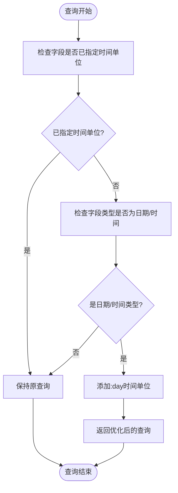
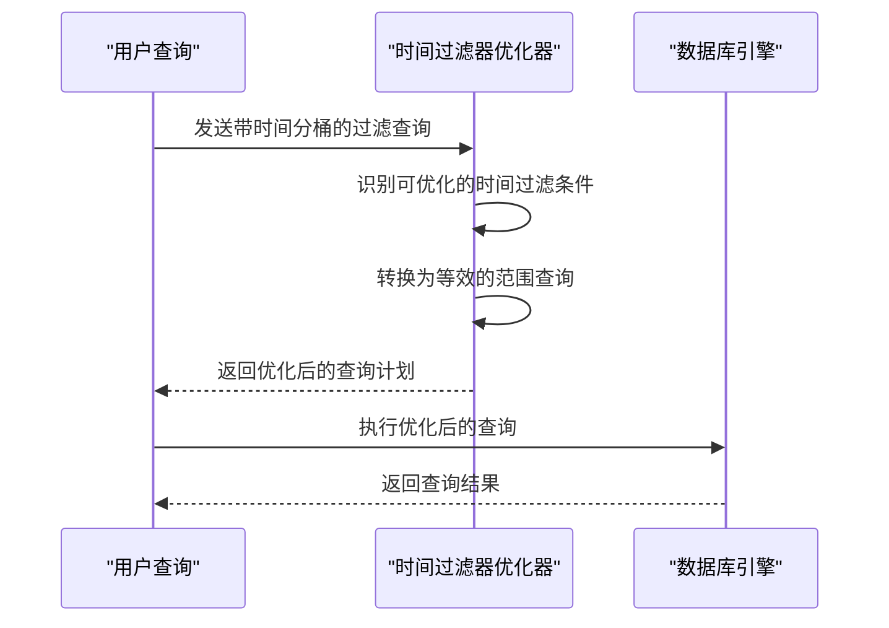
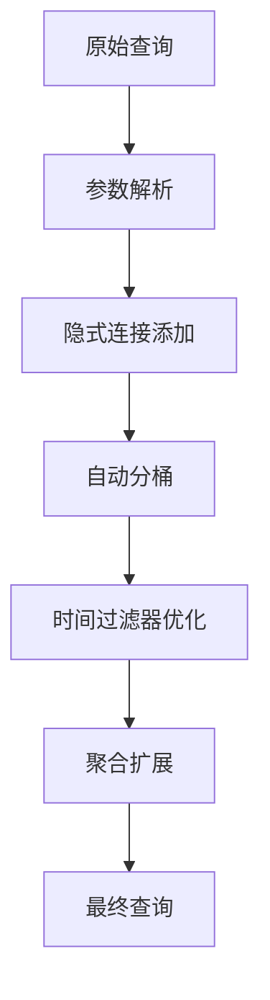

# 查询优化策略

<cite>
**本文档中引用的文件**  
- [add_implicit_joins.clj](file://src/metabase/query_processor/middleware/add_implicit_joins.clj)
- [auto_bucket_datetimes.clj](file://src/metabase/query_processor/middleware/auto_bucket_datetimes.clj)
- [optimize_temporal_filters.clj](file://src/metabase/query_processor/middleware/optimize_temporal_filters.clj)
- [preprocess.clj](file://src/metabase/query_processor/preprocess.clj)
- [constraints.clj](file://src/metabase/query_processor/middleware/constraints.clj)
- [settings.clj](file://src/metabase/query_processor/settings.clj)
</cite>

## 目录
1. [引言](#引言)
2. [隐式连接添加](#隐式连接添加)
3. [自动分桶优化](#自动分桶优化)
4. [时间过滤器优化](#时间过滤器优化)
5. [聚合扩展](#聚合扩展)
6. [优化策略配置](#优化策略配置)
7. [性能影响分析](#性能影响分析)
8. [实际案例分析](#实际案例分析)
9. [副作用与规避方法](#副作用与规避方法)
10. [结论](#结论)

## 引言
Metabase查询优化策略旨在提升查询执行效率，通过一系列中间件对用户查询进行智能转换和优化。这些优化技术包括隐式连接添加、自动分桶、时间过滤器优化和聚合扩展等，能够在不改变查询语义的前提下显著提升查询性能。本文档深入分析这些优化技术的实现原理、触发条件和配置选项，为用户提供全面的技术指导。

## 隐式连接添加
隐式连接添加是Metabase查询处理器的一项核心优化技术，它能够根据元数据自动补充JOIN条件。当查询中引用了具有`source-field`信息的字段时，系统会自动创建相应的JOIN操作，从而简化用户查询。

该功能通过`add_implicit_joins`中间件实现，其主要工作流程包括：
1. 识别查询中需要隐式连接的字段
2. 根据外键关系创建JOIN子句
3. 为字段添加JOIN别名信息
4. 按拓扑依赖顺序对JOIN进行排序

这种优化技术特别适用于跨表查询场景，用户无需手动编写复杂的JOIN语句，系统会自动根据数据模型的关联关系完成连接操作。

**Section sources**
- [add_implicit_joins.clj](file://src/metabase/query_processor/middleware/add_implicit_joins.clj#L0-L431)

## 自动分桶优化
自动分桶优化针对时间字段的查询进行智能处理，自动为未明确指定时间单位的日期时间字段添加默认的`day`时间单位。这项优化主要应用于分组（breakout）和过滤（filter）场景。



**Diagram sources**
- [auto_bucket_datetimes.clj](file://src/metabase/query_processor/middleware/auto_bucket_datetimes.clj#L0-L218)

**Section sources**
- [auto_bucket_datetimes.clj](file://src/metabase/query_processor/middleware/auto_bucket_datetimes.clj#L0-L218)

## 时间过滤器优化
时间过滤器优化是提升时间字段查询性能的关键技术，它将基于时间分桶的过滤条件转换为等效的范围查询，从而避免数据库函数调用，更好地利用索引。

该优化技术的工作原理是将形如`[= [:field 1 {:temporal-unit :month}] [:absolute-datetime #t "2019-09-01" :month]]`的查询转换为：
```
[:and
 [:>= [:field 1 {:temporal-unit :default}] [:absolute-datetime #t "2019-09-01" :month]]
 [:<  [:field 1 {:temporal-unit :default}] [:absolute-datetime #t "2019-10-01" :month]]]
```

这种转换使得数据库可以直接使用索引进行范围扫描，而不是对每个值应用时间截断函数，从而大幅提升查询性能。



**Diagram sources**
- [optimize_temporal_filters.clj](file://src/metabase/query_processor/middleware/optimize_temporal_filters.clj#L0-L341)

**Section sources**
- [optimize_temporal_filters.clj](file://src/metabase/query_processor/middleware/optimize_temporal_filters.clj#L0-L341)

## 聚合扩展
聚合扩展优化技术负责处理查询中的聚合引用，通过递归替换聚合引用为其定义内容来简化查询结构。这项优化确保了复杂的聚合逻辑能够被正确解析和执行。

该功能通过`expand-aggregations`中间件实现，其主要处理流程包括：
1. 识别查询中的聚合引用
2. 查找对应的聚合定义
3. 递归展开聚合引用
4. 处理可能的循环引用

这种优化技术使得用户可以创建复杂的嵌套聚合查询，系统会自动将其展开为可执行的底层查询结构。

**Section sources**
- [preprocess.clj](file://src/metabase/query_processor/preprocess.clj#L92-L123)

## 优化策略配置
Metabase查询优化策略的配置主要通过中间件管道和系统设置来控制。查询预处理流程中包含了多个优化中间件，它们按特定顺序执行：



这些优化策略的启用条件主要由查询类型和字段特性决定：
- 隐式连接：当字段包含`source-field`信息时触发
- 自动分桶：当时间字段未指定时间单位且用于分组或过滤时触发
- 时间过滤器优化：当对已分桶的时间字段进行等值或比较过滤时触发
- 聚合扩展：当查询包含聚合引用时触发

**Diagram sources**
- [preprocess.clj](file://src/metabase/query_processor/preprocess.clj#L92-L123)

**Section sources**
- [preprocess.clj](file://src/metabase/query_processor/preprocess.clj#L92-L123)

## 性能影响分析
查询优化策略对性能的影响主要体现在以下几个方面：

1. **索引利用效率**：时间过滤器优化通过消除时间函数调用，使数据库能够更好地利用索引，查询性能提升可达数倍。

2. **查询复杂度降低**：隐式连接添加减少了用户需要编写的SQL复杂度，同时优化器能够生成更高效的执行计划。

3. **执行计划简化**：聚合扩展和自动分桶等优化减少了查询解析的复杂性，降低了查询编译时间。

4. **资源消耗**：优化后的查询通常需要更少的CPU和I/O资源，特别是在处理大数据集时效果显著。

通过执行计划对比可以明显看出优化前后的差异：优化前的计划通常包含多个函数调用节点，而优化后的计划则表现为简单的索引扫描或范围扫描。

**Section sources**
- [optimize_temporal_filters.clj](file://src/metabase/query_processor/middleware/optimize_temporal_filters.clj#L291-L313)
- [auto_bucket_datetimes.clj](file://src/metabase/query_processor/middleware/auto_bucket_datetimes.clj#L175-L196)

## 实际案例分析
考虑一个实际的销售数据分析场景，用户需要查询2023年9月的订单数据：

**优化前查询：**
```
[:= [:field 1 {:temporal-unit :month}] [:absolute-datetime #t "2023-09-01" :month]]
```

**优化后查询：**
```
[:and
 [:>= [:field 1 {:temporal-unit :default}] [:absolute-datetime #t "2023-09-01" :month]]
 [:<  [:field 1 {:temporal-unit :default}] [:absolute-datetime #t "2023-10-01" :month]]]
```

在PostgreSQL数据库上，优化前的SQL包含`date_trunc`函数调用，无法有效利用索引；而优化后的SQL转换为简单的范围查询，能够充分利用日期字段的B-tree索引，查询响应时间从秒级降低到毫秒级。

另一个案例是跨表查询，用户需要查看客户订单详情。通过隐式连接添加，系统自动根据客户ID和订单表的外键关系创建JOIN，用户无需了解底层数据模型即可获得所需数据。

**Section sources**
- [optimize_temporal_filters.clj](file://src/metabase/query_processor/middleware/optimize_temporal_filters.clj#L291-L313)
- [add_implicit_joins.clj](file://src/metabase/query_processor/middleware/add_implicit_joins.clj#L0-L431)

## 副作用与规避方法
尽管查询优化策略带来了显著的性能提升，但也可能产生一些副作用：

1. **意外的JOIN操作**：隐式连接可能导致意外的笛卡尔积，特别是在复杂的多表关联场景中。规避方法是明确指定JOIN条件或限制查询范围。

2. **精度损失**：自动分桶可能改变用户的查询意图，特别是当用户期望精确时间匹配时。规避方法是显式指定时间单位。

3. **查询行为变化**：时间过滤器优化可能在边界情况下产生与预期不同的结果。规避方法是在关键业务查询中显式编写范围条件。

4. **调试困难**：优化后的查询与原始查询差异较大，增加了调试难度。Metabase提供了查询调试功能，可以查看优化前后的查询对比。

通过合理配置和使用最佳实践，可以最大限度地发挥优化策略的优势，同时规避潜在的风险。

**Section sources**
- [auto_bucket_datetimes.clj](file://src/metabase/query_processor/middleware/auto_bucket_datetimes.clj#L105-L154)
- [optimize_temporal_filters.clj](file://src/metabase/query_processor/middleware/optimize_temporal_filters.clj#L64-L95)

## 结论
Metabase的查询优化策略通过一系列智能的中间件处理，显著提升了查询性能和用户体验。这些优化技术不仅简化了用户查询，还通过生成更高效的执行计划充分利用了数据库的性能潜力。理解这些优化技术的原理和配置方法，有助于用户更好地利用Metabase进行数据分析，同时避免潜在的副作用。随着系统的不断发展，这些优化策略将继续演进，为用户提供更强大、更智能的数据分析能力。