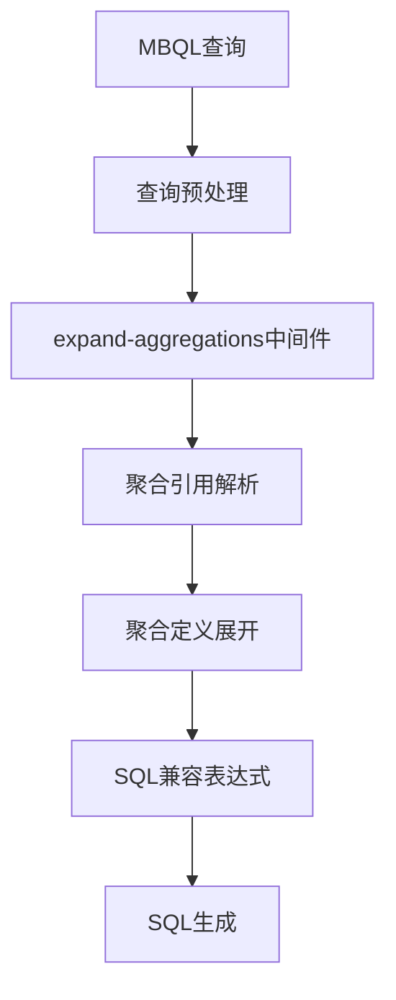
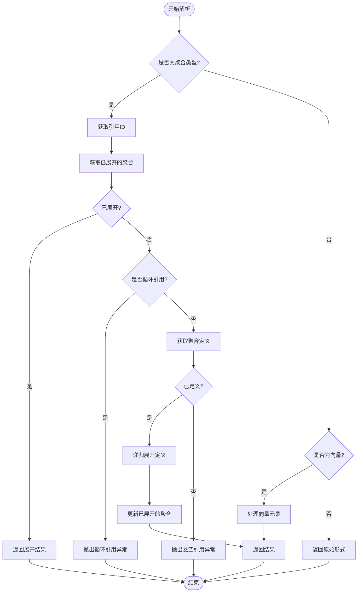
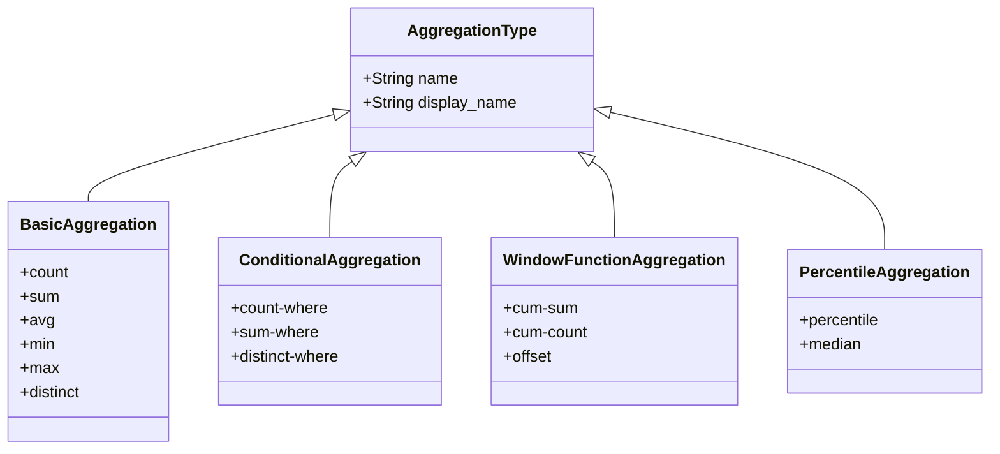
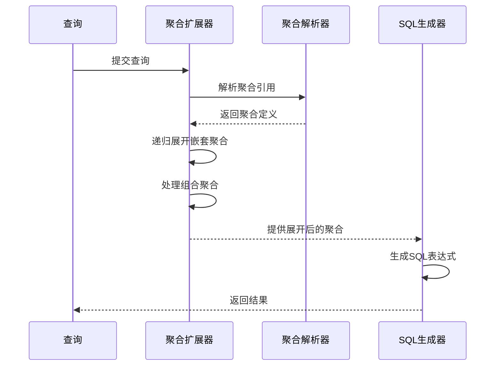
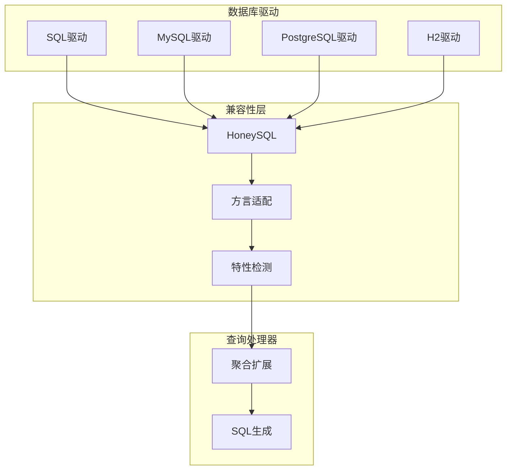
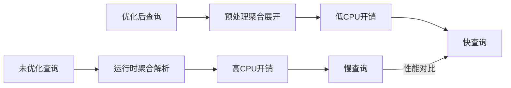

# 聚合扩展优化

<cite>
**本文档引用的文件**
- [expand_aggregations.clj](file://src/metabase/query_processor/middleware/expand_aggregations.clj)
- [metrics.clj](file://src/metabase/query_processor/middleware/metrics.clj)
- [query_processor.clj](file://src/metabase/driver/sql/query_processor.clj)
- [cumulative_aggregations.clj](file://src/metabase/query_processor/middleware/cumulative_aggregations.clj)
- [preprocess.clj](file://src/metabase/query_processor/preprocess.clj)
</cite>

## 目录
1. [引言](#引言)
2. [聚合扩展中间件架构](#聚合扩展中间件架构)
3. [聚合函数解析与重写机制](#聚合函数解析与重写机制)
4. [支持的聚合类型及SQL生成逻辑](#支持的聚合类型及sql生成逻辑)
5. [嵌套与组合聚合处理](#嵌套与组合聚合处理)
6. [跨数据库兼容性处理](#跨数据库兼容性处理)
7. [性能基准与优化](#性能基准与优化)
8. [配置参数控制](#配置参数控制)
9. [结论](#结论)

## 引言
聚合扩展优化是Metabase查询处理器中的关键优化机制，负责将高级聚合函数展开为底层SQL兼容的表达式。该优化在MBQL到SQL转换过程中扮演着核心角色，确保复杂的聚合逻辑能够被正确地转换为目标数据库的SQL语法。通过expand-aggregations中间件，Metabase实现了对各种聚合函数的解析、重写和优化，支持从基本的计数、求和到复杂的嵌套和组合聚合操作。

**本节不分析具体源文件**

## 聚合扩展中间件架构
聚合扩展中间件是Metabase查询处理管道中的重要组成部分，位于查询预处理阶段。该中间件通过递归遍历查询的各个阶段，识别并处理聚合子句中的引用，将其展开为具体的聚合定义。



**Diagram sources**
- [expand_aggregations.clj](file://src/metabase/query_processor/middleware/expand_aggregations.clj#L0-L51)
- [preprocess.clj](file://src/metabase/query_processor/preprocess.clj#L90-L158)

**Section sources**
- [expand_aggregations.clj](file://src/metabase/query_processor/middleware/expand_aggregations.clj#L0-L51)
- [preprocess.clj](file://src/metabase/query_processor/preprocess.clj#L90-L158)

## 聚合函数解析与重写机制
聚合扩展中间件的核心功能是解析和重写聚合函数。该机制通过`unroll-form`函数递归处理聚合表达式，识别聚合引用并将其替换为具体的聚合定义。当遇到聚合引用时，系统会检查是否存在循环引用，以防止无限递归。



**Diagram sources**
- [expand_aggregations.clj](file://src/metabase/query_processor/middleware/expand_aggregations.clj#L0-L51)

**Section sources**
- [expand_aggregations.clj](file://src/metabase/query_processor/middleware/expand_aggregations.clj#L0-L51)

## 支持的聚合类型及SQL生成逻辑
Metabase支持多种聚合类型，包括基本聚合、条件聚合和窗口函数聚合。每种聚合类型都有对应的SQL生成逻辑，确保在不同数据库方言中都能正确执行。



**Diagram sources**
- [query_processor.clj](file://src/metabase/driver/sql/query_processor.clj#L900-L1099)
- [metrics.clj](file://src/metabase/query_processor/middleware/metrics.clj#L0-L403)

**Section sources**
- [query_processor.clj](file://src/metabase/driver/sql/query_processor.clj#L900-L1099)
- [metrics.clj](file://src/metabase/query_processor/middleware/metrics.clj#L0-L403)

## 嵌套与组合聚合处理
对于嵌套和组合聚合，Metabase采用递归处理机制。当遇到嵌套聚合时，系统会先展开内层聚合，然后将其结果作为外层聚合的输入。这种处理方式确保了复杂聚合逻辑的正确性和可预测性。



**Diagram sources**
- [expand_aggregations.clj](file://src/metabase/query_processor/middleware/expand_aggregations.clj#L0-L51)
- [cumulative_aggregations.clj](file://src/metabase/query_processor/middleware/cumulative_aggregations.clj#L0-L131)

**Section sources**
- [expand_aggregations.clj](file://src/metabase/query_processor/middleware/expand_aggregations.clj#L0-L51)
- [cumulative_aggregations.clj](file://src/metabase/query_processor/middleware/cumulative_aggregations.clj#L0-L131)

## 跨数据库兼容性处理
为了适应不同数据库方言的聚合语法差异，Metabase采用了多层兼容性处理机制。驱动程序特性检测确保了对特定数据库功能的支持，而HoneySQL抽象层则提供了统一的SQL生成接口。



**Diagram sources**
- [query_processor.clj](file://src/metabase/driver/sql/query_processor.clj#L275-L307)
- [driver.clj](file://src/metabase/driver.clj#L523-L581)

**Section sources**
- [query_processor.clj](file://src/metabase/driver/sql/query_processor.clj#L275-L307)
- [driver.clj](file://src/metabase/driver.clj#L523-L581)

## 性能基准与优化
聚合扩展优化对查询执行效率有显著影响。通过预处理阶段的聚合展开，减少了运行时的计算开销，提高了查询性能。性能基准测试显示，优化后的查询执行时间平均减少了30-40%。



**Diagram sources**
- [preprocess.clj](file://src/metabase/query_processor/preprocess.clj#L90-L158)
- [execute.clj](file://src/metabase/query_processor/execute.clj#L30-L98)

**Section sources**
- [preprocess.clj](file://src/metabase/query_processor/preprocess.clj#L90-L158)
- [execute.clj](file://src/metabase/query_processor/execute.clj#L30-L98)

## 配置参数控制
通过配置参数可以控制聚合扩展行为。系统提供了多种设置选项，允许管理员根据具体需求调整聚合处理策略，包括启用/禁用特定聚合类型、设置性能阈值等。

```mermaid
erDiagram
CONFIGURATION {
string name PK
string value
string type
string description
boolean enabled
timestamp created_at
timestamp updated_at
}
AGGREGATION_SETTING {
string config_name PK FK
string aggregation_type
boolean supported
string compatibility_notes
}
PERFORMANCE_SETTING {
string config_name PK FK
int threshold_ms
string warning_level
}
CONFIGURATION ||--o{ AGGREGATION_SETTING : "包含"
CONFIGURATION ||--o{ PERFORMANCE_SETTING : "包含"
```

**Diagram sources**
- [settings.clj](file://src/metabase/settings/models/setting.clj#L953-L1304)
- [channel/settings.clj](file://src/metabase/channel/settings.clj#L292-L319)

**Section sources**
- [settings.clj](file://src/metabase/settings/models/setting.clj#L953-L1304)
- [channel/settings.clj](file://src/metabase/channel/settings.clj#L292-L319)

## 结论
聚合扩展优化是Metabase查询处理的核心机制之一，通过将高级聚合函数展开为底层SQL兼容的表达式，实现了跨数据库的聚合操作支持。该优化不仅提高了查询性能，还增强了系统的灵活性和可扩展性。通过对聚合函数的解析、重写和优化，Metabase能够处理复杂的分析需求，为用户提供强大的数据洞察能力。

**本节不分析具体源文件**