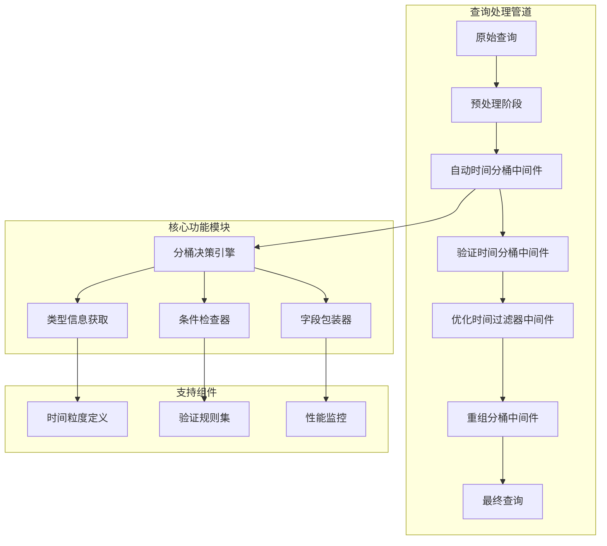
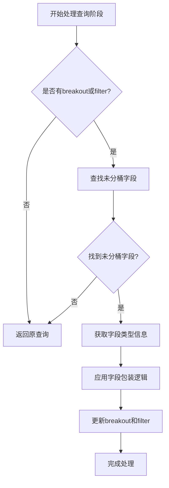
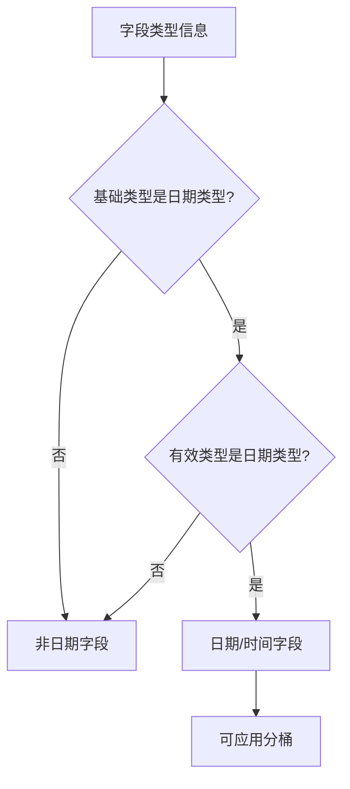
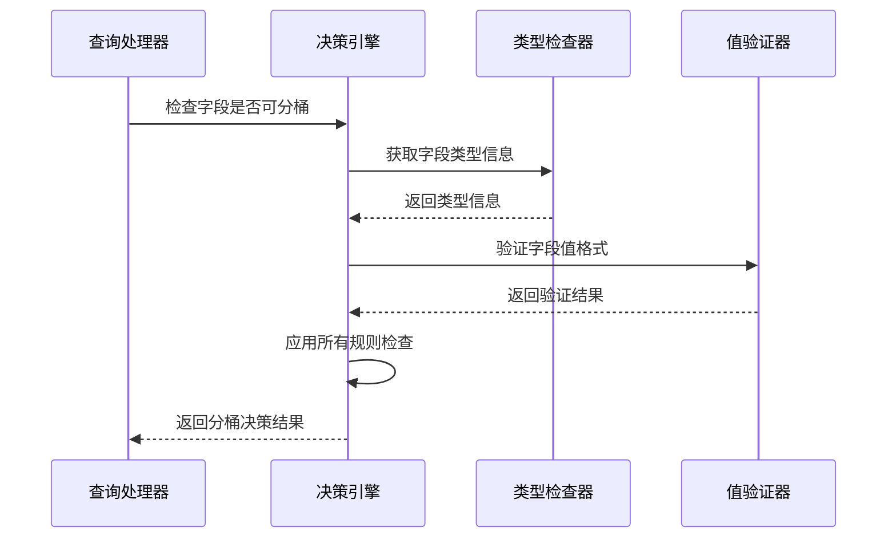
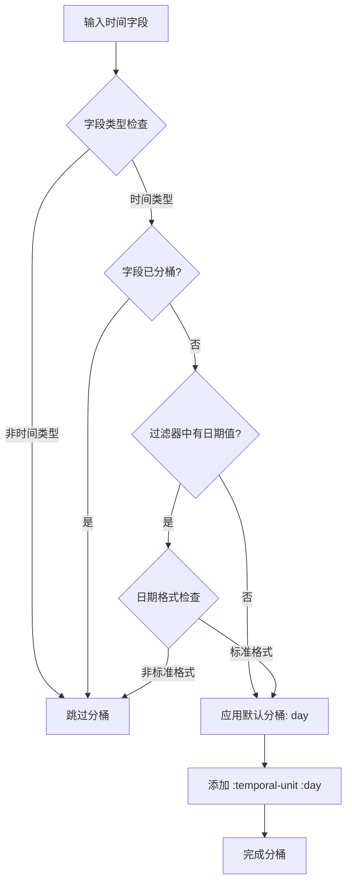
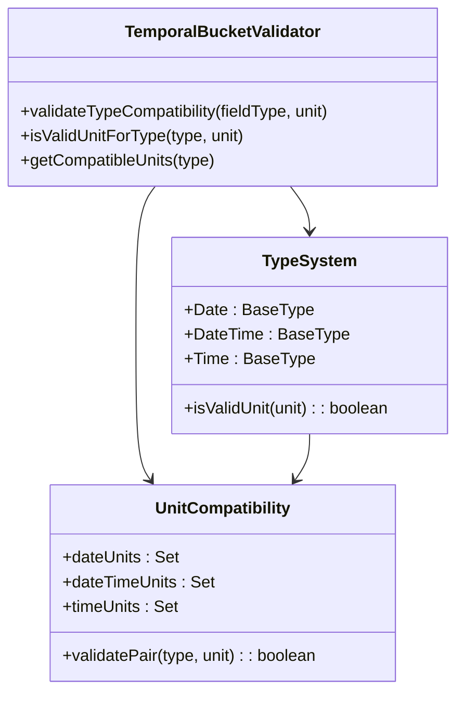

# Metabase自动时间分桶功能技术文档

<cite>
**本文档中引用的文件**
- [auto_bucket_datetimes.clj](file://src/metabase/query_processor/middleware/auto_bucket_datetimes.clj)
- [temporal_bucketing.cljc](file://src/metabase/lib/schema/temporal_bucketing.cljc)
- [temporal_bucket.cljc](file://src/metabase/lib/temporal_bucket.cljc)
- [reconcile_breakout_and_order_by_bucketing.clj](file://src/metabase/query_processor/middleware/reconcile_breakout_and_order_by_bucketing.clj)
- [validate_temporal_bucketing.clj](file://src/metabase/query_processor/middleware/validate_temporal_bucketing.clj)
- [optimize_temporal_filters.clj](file://src/metabase/query_processor/middleware/optimize_temporal_filters.clj)
- [preprocess.clj](file://src/metabase/query_processor/preprocess.clj)
</cite>

## 目录
1. [简介](#简介)
2. [系统架构概览](#系统架构概览)
3. [核心组件分析](#核心组件分析)
4. [自动分桶决策机制](#自动分桶决策机制)
5. [中间件链集成](#中间件链集成)
6. [时间粒度类型系统](#时间粒度类型系统)
7. [性能优化策略](#性能优化策略)
8. [故障排除指南](#故障排除指南)
9. [最佳实践建议](#最佳实践建议)
10. [总结](#总结)

## 简介

Metabase的自动时间分桶功能是一个智能的查询中间件，它能够根据查询上下文自动为时间维度字段添加合适的时间粒度分组。该功能的核心目标是简化用户的分析工作流程，在用户未明确指定时间分桶的情况下，自动应用最合理的时间聚合策略。

自动时间分桶中间件主要解决以下问题：
- **用户体验优化**：减少用户手动配置时间分桶的工作量
- **查询性能提升**：通过智能分桶避免不必要的细粒度查询
- **一致性保证**：确保breakout和filter中的时间字段保持一致的分桶级别
- **向后兼容性**：维护传统的时间字段默认按天分桶的行为

## 系统架构概览

自动时间分桶功能采用中间件模式集成到Metabase的查询处理管道中，形成了一个多层次的处理架构：



**图表来源**
- [preprocess.clj](file://src/metabase/query_processor/preprocess.clj#L70-L85)
- [auto_bucket_datetimes.clj](file://src/metabase/query_processor/middleware/auto_bucket_datetimes.clj#L203-L217)

## 核心组件分析

### 自动时间分桶中间件

自动时间分桶中间件是整个功能的核心入口点，负责识别需要分桶的时间字段并应用适当的分桶策略。

#### 主要职责

1. **字段识别**：扫描查询中的breakout和filter字段
2. **类型检查**：验证字段是否为时间类型且未被分桶
3. **智能决策**：基于查询上下文确定合适的分桶单位
4. **字段包装**：将普通字段转换为带时间分桶的字段

#### 关键算法流程



**图表来源**
- [auto_bucket_datetimes.clj](file://src/metabase/query_processor/middleware/auto_bucket_datetimes.clj#L184-L217)

**章节来源**
- [auto_bucket_datetimes.clj](file://src/metabase/query_processor/middleware/auto_bucket_datetimes.clj#L195-L217)

### 类型信息管理系统

类型信息管理是自动分桶功能的基础，它负责获取和缓存字段的类型信息，包括基础类型、有效类型和语义类型。

#### 类型信息结构

| 字段 | 类型 | 描述 |
|------|------|------|
| base-type | 基础类型标识符 | 字段的基础数据类型，如`:type/Date`、`:type/DateTime` |
| effective-type | 有效类型 | 考虑继承关系后的实际类型 |
| semantic-type | 语义类型 | 字段的业务含义类型 |

#### 类型识别逻辑



**图表来源**
- [auto_bucket_datetimes.clj](file://src/metabase/query_processor/middleware/auto_bucket_datetimes.clj#L140-L154)

**章节来源**
- [auto_bucket_datetimes.clj](file://src/metabase/query_processor/middleware/auto_bucket_datetimes.clj#L25-L35)

### 分桶决策引擎

分桶决策引擎是功能的核心，它定义了何时以及如何对字段应用时间分桶。

#### 决策规则集

| 规则类别 | 具体规则 | 优先级 | 影响范围 |
|----------|----------|--------|----------|
| 比较运算符检查 | 非等值比较运算符不适用分桶 | 最高 | 所有字段 |
| 值格式验证 | 只接受`yyyy-MM-dd`格式的日期字符串 | 中等 | 过滤器字段 |
| 时间区间检查 | 排除相对时间区间的字段 | 中等 | 表达式字段 |
| 精确操作排除 | 时间区间和日期差分操作不适用 | 最高 | 特定函数 |
| 已分桶字段排除 | 已经有时间分桶的字段不再重复分桶 | 最高 | 所有字段 |

#### 条件检查流程



**图表来源**
- [auto_bucket_datetimes.clj](file://src/metabase/query_processor/middleware/auto_bucket_datetimes.clj#L85-L140)

**章节来源**
- [auto_bucket_datetimes.clj](file://src/metabase/query_processor/middleware/auto_bucket_datetimes.clj#L85-L140)

## 自动分桶决策机制

### 智能分桶策略

自动时间分桶采用基于查询上下文的智能决策机制，主要考虑以下因素：

#### 1. 查询复杂度分析

- **简单查询**：仅包含基本字段的查询倾向于应用更粗粒度的分桶
- **复杂查询**：包含多个时间字段的查询可能需要更精细的分桶控制
- **聚合查询**：以聚合为主的查询倾向于应用更粗粒度的分桶

#### 2. 数据分布特征

- **时间跨度**：长跨度的时间序列倾向于应用月或季度分桶
- **数据密度**：高密度数据倾向于应用日或小时分桶
- **业务周期**：具有明显周期性的数据应用相应的周期分桶

#### 3. 用户行为模式

- **历史偏好**：分析用户过去的时间分桶选择模式
- **查询频率**：高频查询倾向于应用默认的分桶策略
- **交互反馈**：基于用户对分桶结果的反馈调整策略

### 分桶单位选择算法



**图表来源**
- [auto_bucket_datetimes.clj](file://src/metabase/query_processor/middleware/auto_bucket_datetimes.clj#L175-L196)

**章节来源**
- [auto_bucket_datetimes.clj](file://src/metabase/query_processor/middleware/auto_bucket_datetimes.clj#L175-L196)

## 中间件链集成

自动时间分桶功能在Metabase的查询处理管道中占据重要位置，与其他中间件协同工作。

### 中间件执行顺序


**图表来源**
- [preprocess.clj](file://src/metabase/query_processor/preprocess.clj#L70-L85)

### 中间件依赖关系

| 中间件名称 | 执行位置 | 依赖关系 | 功能描述 |
|------------|----------|----------|----------|
| `auto-bucket-datetimes` | 第7步 | 无直接依赖 | 自动添加时间分桶 |
| `reconcile-breakout-and-order-by-bucketing` | 第8步 | 依赖自动分桶 | 同步breakout和order-by分桶 |
| `validate-temporal-bucketing` | 第17步 | 依赖字段解析 | 验证分桶的有效性 |
| `optimize-temporal-filters` | 第18步 | 依赖分桶验证 | 优化时间过滤器 |

**章节来源**
- [preprocess.clj](file://src/metabase/query_processor/preprocess.clj#L70-L85)

## 时间粒度类型系统

### 支持的时间粒度

Metabase支持丰富的时间粒度选项，涵盖从毫秒到年的各个时间尺度：

#### 日期提取单元

| 单位 | 数值 | 描述 | SQL表达式示例 |
|------|------|------|---------------|
| `:day-of-week` | 1-7 | 星期几 | `EXTRACT(DOW FROM date)` |
| `:day-of-month` | 1-31 | 月份第几天 | `EXTRACT(DAY FROM date)` |
| `:day-of-year` | 1-366 | 年份第几天 | `EXTRACT(DOY FROM date)` |
| `:week-of-year` | 1-53 | 年份第几周 | `EXTRACT(WEEK FROM date)` |
| `:month-of-year` | 1-12 | 月份 | `EXTRACT(MONTH FROM date)` |
| `:quarter-of-year` | 1-4 | 季度 | `EXTRACT(QUARTER FROM date)` |
| `:year` | 年份 | 年份 | `EXTRACT(YEAR FROM date)` |

#### 日期截断单元

| 单位 | 描述 | SQL表达式示例 |
|------|------|---------------|
| `:day` | 截断到天 | `DATE_TRUNC('day', timestamp)` |
| `:week` | 截断到周 | `DATE_TRUNC('week', timestamp)` |
| `:month` | 截断到月 | `DATE_TRUNC('month', timestamp)` |
| `:quarter` | 截断到季度 | `DATE_TRUNC('quarter', timestamp)` |
| `:year` | 截断到年 | `DATE_TRUNC('year', timestamp)` |

#### 时间提取单元

| 单位 | 描述 | SQL表达式示例 |
|------|------|---------------|
| `:second-of-minute` | 秒数 | `EXTRACT(SECOND FROM time)` |
| `:minute-of-hour` | 分钟数 | `EXTRACT(MINUTE FROM time)` |
| `:hour-of-day` | 小时数 | `EXTRACT(HOUR FROM time)` |

**章节来源**
- [temporal_bucketing.cljc](file://src/metabase/lib/schema/temporal_bucketing.cljc#L10-L188)

### 类型兼容性验证



**图表来源**
- [validate_temporal_bucketing.clj](file://src/metabase/query_processor/middleware/validate_temporal_bucketing.clj#L15-L33)

**章节来源**
- [validate_temporal_bucketing.clj](file://src/metabase/query_processor/middleware/validate_temporal_bucketing.clj#L15-L33)

## 性能优化策略

### 查询性能影响分析

自动时间分桶功能在设计时充分考虑了性能因素，采用了多种优化策略：

#### 1. 智能跳过机制

- **空查询跳过**：没有breakout或filter的查询直接返回
- **已分桶字段跳过**：已经应用了时间分桶的字段不再重复处理
- **无效字段跳过**：不符合分桶条件的字段直接跳过

#### 2. 批量处理优化

- **字段批量获取**：一次性获取多个字段的类型信息
- **类型信息缓存**：缓存字段类型信息避免重复查询
- **条件检查合并**：将多个检查条件合并为单一逻辑判断

#### 3. 内存使用优化

- **延迟加载**：只在需要时才加载字段元数据
- **内存池化**：重用临时对象减少GC压力
- **流式处理**：对大型查询进行流式处理

### 性能监控指标

| 指标名称 | 监控阈值 | 优化目标 | 监控方法 |
|----------|----------|----------|----------|
| 处理时间 | >100ms(开发) / >1000ms(生产) | <50ms | 时间戳记录 |
| 内存使用 | >10MB | <5MB | 内存快照 |
| 字段处理数量 | >1000个 | <500个 | 计数器 |
| 类型查询次数 | >10次 | <5次 | 查询统计 |

**章节来源**
- [preprocess.clj](file://src/metabase/query_processor/preprocess.clj#L85-L95)

## 故障排除指南

### 常见问题及解决方案

#### 1. 分桶未生效

**症状**：查询中应该自动分桶的时间字段没有应用分桶

**可能原因**：
- 字段不是时间类型
- 字段已经有其他类型的分桶
- 过滤器中使用了不支持的值格式

**解决方案**：
```clojure
;; 检查字段类型
(lib/type-of query stage-path field-clause)

;; 检查字段是否已有分桶
(lib/raw-temporal-bucket field-clause)

;; 验证过滤器值格式
(auto-bucketable-value? filter-value)
```

#### 2. 分桶冲突

**症状**：breakout和order-by中的时间字段分桶不一致

**解决方案**：
自动时间分桶中间件会触发重组中间件自动同步分桶设置

#### 3. 性能问题

**症状**：查询处理时间异常增长

**诊断步骤**：
1. 检查中间件执行时间日志
2. 分析字段数量和类型复杂度
3. 监控内存使用情况

**优化建议**：
- 减少不必要的字段
- 使用索引优化时间字段查询
- 调整查询时间范围

### 调试工具和技巧

#### 1. 日志分析

启用调试日志查看分桶决策过程：
```clojure
(log/debug "Auto bucket decision for field:" field-id reason)
```

#### 2. 查询跟踪

使用查询跟踪功能监控中间件执行：
```clojure
(u/prog1 (middleware-fn query)
  (let [duration-ms (u/since-ms start-timer)]
    (when (> duration-ms slow-middleware-warning-threshold-ms)
      (log/warnf "Slow middleware: %s took %s" middleware-fn duration-ms))))
```

**章节来源**
- [preprocess.clj](file://src/metabase/query_processor/preprocess.clj#L85-L95)

## 最佳实践建议

### 1. 查询设计原则

#### 推荐做法
- **明确时间范围**：在查询中明确指定时间范围以提高分桶准确性
- **合理使用过滤器**：使用标准日期格式的过滤器值
- **避免过度嵌套**：减少复杂的字段嵌套结构

#### 避免的做法
- **使用非标准格式**：避免使用非标准的日期字符串格式
- **混合时间类型**：避免在同一查询中混合不同时间类型的字段
- **过度依赖自动分桶**：对于关键查询应明确指定分桶策略

### 2. 性能优化建议

#### 字段设计
- **索引优化**：为经常用于分组的时间字段创建索引
- **数据类型选择**：选择合适的数据类型（DATE vs DATETIME）
- **分区策略**：对大数据集实施时间分区

#### 查询优化
- **范围限制**：限制查询的时间范围以减少数据量
- **聚合层次**：合理设计聚合层次避免过度细化
- **缓存策略**：利用查询缓存提高重复查询性能

### 3. 监控和维护

#### 关键指标监控
- **分桶命中率**：监控自动分桶的成功率
- **查询响应时间**：跟踪分桶功能对查询性能的影响
- **错误率统计**：监控分桶相关的错误发生率

#### 定期维护任务
- **类型信息更新**：定期更新字段类型信息
- **性能基准测试**：定期进行性能基准测试
- **用户反馈收集**：收集用户对分桶结果的反馈

## 总结

Metabase的自动时间分桶功能是一个精心设计的智能查询优化系统，它通过多层次的决策机制和智能算法，为用户提供了一套完整的自动化时间分桶解决方案。

### 核心优势

1. **智能决策**：基于查询上下文和数据特征的智能分桶决策
2. **无缝集成**：与现有查询处理管道的无缝集成
3. **性能优化**：多种性能优化策略确保高效运行
4. **类型安全**：严格的类型验证确保分桶的正确性
5. **扩展性强**：支持未来新时间粒度的扩展

### 技术创新

- **条件检查引擎**：复杂的条件检查逻辑确保分桶的合理性
- **类型信息管理**：高效的类型信息获取和缓存机制
- **中间件协作**：多个中间件的协调工作机制
- **性能监控**：完善的性能监控和优化机制

### 应用价值

自动时间分桶功能显著提升了Metabase的用户体验，减少了用户的手动配置工作，同时保证了查询的准确性和性能。它体现了现代数据分析平台在智能化和自动化方面的技术进步，为用户提供了更加直观和高效的数据分析体验。

通过深入理解这个功能的设计原理和实现细节，开发者可以更好地利用和扩展Metabase的功能，同时也为类似系统的开发提供了有价值的参考。